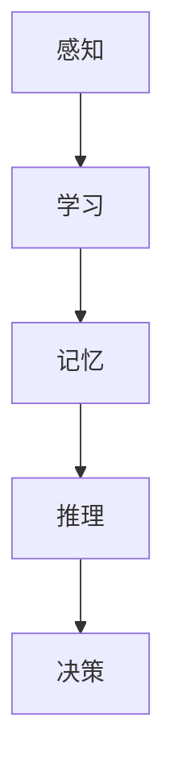
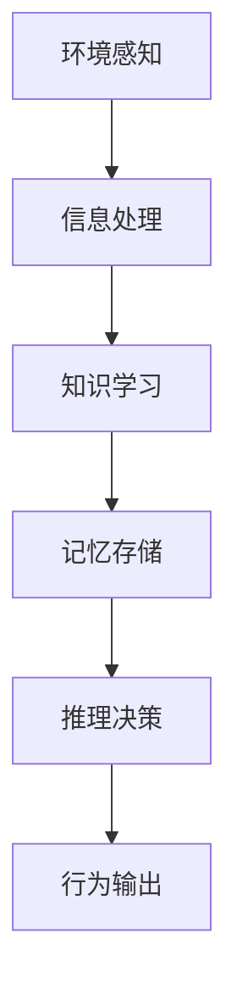
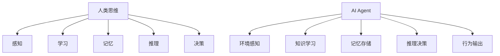
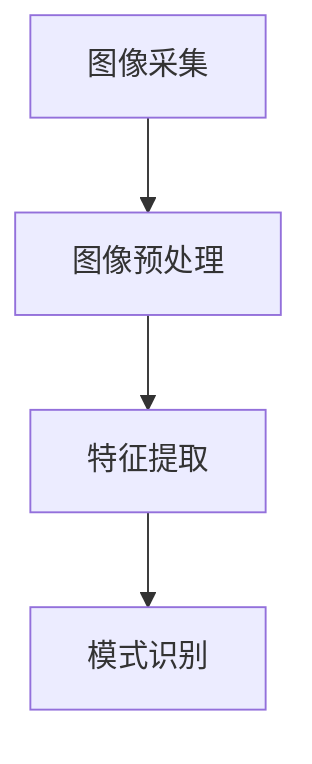
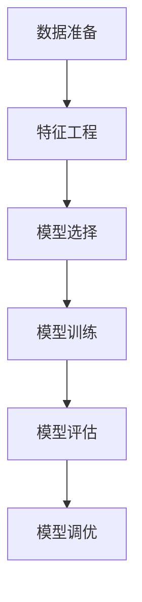
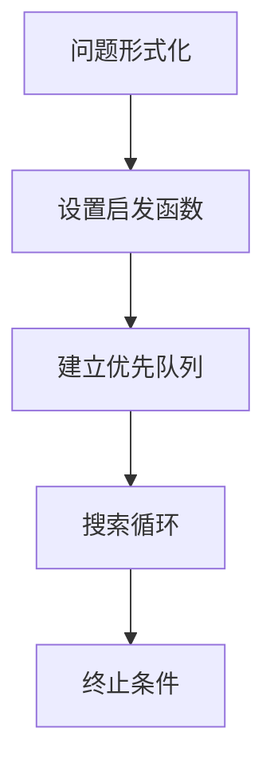

# AI人工智能 Agent：对人类思维方式的影响

## 1. 背景介绍

### 1.1 人工智能的兴起

人工智能(Artificial Intelligence, AI)是当代科技发展的重要领域,近年来取得了长足进步。AI系统通过模拟人类的认知过程,能够执行各种复杂任务,如视觉识别、自然语言处理、决策规划等。随着算力的不断提高和算法的创新,AI已渗透到生活的方方面面,给人类社会带来了深远影响。

### 1.2 AI Agent的概念

在人工智能领域,Agent是一个重要概念。AI Agent指的是感知环境、思考并采取行动的智能体系统。它能够根据感知到的环境状态,运行内部决策算法,选择适当的行为方式。AI Agent具有自主性、反应性、主动性和持续时间概念等特点。

### 1.3 AI Agent与人类思维的关系

AI Agent虽然是机器系统,但其工作原理在很大程度上借鉴了人类大脑的信息处理机制。人工智能研究者试图通过构建AI Agent,来模拟和理解人类的认知过程。同时,AI Agent的发展也必将影响人类的思维方式和认知模式,这种双向影响值得深入探讨。

## 2. 核心概念与联系

### 2.1 人类思维过程

人类思维是一个复杂的认知过程,包括感知、学习、记忆、推理、决策等多个环节。这些环节相互影响、相互作用,构成了人类独特的思维能力。



### 2.2 AI Agent的工作原理

AI Agent的工作原理与人类思维过程有诸多相似之处。它首先通过传感器获取环境信息,对信息进行处理和表示,形成对环境的感知。然后基于先验知识和学习算法,对感知信息进行处理和记忆。在此基础上,AI Agent运行推理和决策算法,输出相应的行为指令。



### 2.3 人类思维与AI Agent的映射

人工智能研究者试图通过构建AI Agent,来模拟和理解人类的认知过程。AI Agent中的感知、学习、记忆、推理、决策等模块,对应了人类思维过程中的同名环节。通过研究AI Agent的工作机制,可以加深对人类思维的认识。



## 3. 核心算法原理具体操作步骤

### 3.1 感知算法

感知是AI Agent获取环境信息的基础。常用的感知算法包括计算机视觉、语音识别等。以计算机视觉为例,它的工作步骤如下:

1. 图像采集:使用摄像头或从文件读取图像数据
2. 图像预处理:降噪、增强对比度等,改善图像质量
3. 特征提取:提取图像的边缘、角点、纹理等特征
4. 模式识别:将提取的特征与已知模式进行匹配,识别目标物体



### 3.2 学习算法

AI Agent需要不断学习,才能适应环境变化。常见的学习算法有监督学习、无监督学习、强化学习等。以监督学习为例,其步骤如下:

1. 数据准备:收集带标签的训练数据集
2. 特征工程:从原始数据中提取有效特征
3. 模型选择:选择合适的机器学习算法,如决策树、支持向量机等
4. 模型训练:使用训练数据,通过优化算法估计最优模型参数
5. 模型评估:在测试数据集上评估模型性能
6. 模型调优:根据评估结果,优化模型超参数,提升性能



### 3.3 推理决策算法

推理决策是AI Agent根据当前状态作出行为选择的关键。常用算法包括搜索算法、规划算法、逻辑推理等。以A*搜索算法为例:

1. 定义状态和行为:将问题形式化为状态和行为集合
2. 设置启发函数:设计一个评估函数,估计离目标状态的距离
3. 建立优先队列:将初始状态加入队列,按评估函数值排序
4. 搜索循环:重复从队列取出最优状态,生成后继状态并加入队列
5. 终止条件:找到目标状态或队列为空时终止



## 4. 数学模型和公式详细讲解举例说明

### 4.1 机器学习中的数学模型

机器学习算法通常基于数学模型,使用优化技术在训练数据上估计最优参数。以线性回归为例,其数学模型为:

$$y = w_0 + w_1x_1 + w_2x_2 + ... + w_nx_n$$

其中$y$为预测值,$x_i$为特征值,$w_i$为模型参数。使用均方误差损失函数:

$$L(w) = \frac{1}{2m}\sum_{i=1}^m(y_i - \hat{y_i})^2$$

目标是最小化损失函数,求解最优参数$w^*$:

$$w^* = \arg\min_w L(w)$$

### 4.2 深度学习中的数学模型

深度学习模型通常由多层神经网络组成,每层对输入进行线性变换和非线性激活。以前馈神经网络为例:

$$z^{(l+1)} = W^{(l)}a^{(l)} + b^{(l)}$$
$$a^{(l+1)} = g(z^{(l+1)})$$

其中$a^{(l)}$为第$l$层输出,$W^{(l)}$为权重矩阵,$b^{(l)}$为偏置向量,$g$为激活函数。通过反向传播算法计算损失函数对参数的梯度,并使用优化算法(如随机梯度下降)更新参数。

### 4.3 强化学习中的数学模型

强化学习算法通过与环境交互,最大化预期累积奖励。核心是估计价值函数或策略函数。以Q-Learning为例,其价值函数更新公式为:

$$Q(s_t,a_t) \leftarrow Q(s_t,a_t) + \alpha[r_t + \gamma\max_aQ(s_{t+1},a) - Q(s_t,a_t)]$$

其中$Q(s,a)$为状态$s$执行动作$a$的价值,$r_t$为即时奖励,$\alpha$为学习率,$\gamma$为折扣因子。通过不断更新,最终收敛到最优价值函数。

## 5. 项目实践:代码实例和详细解释说明

### 5.1 计算机视觉实例:人脸识别

以Python和OpenCV为例,实现一个简单的人脸识别系统:

```python
import cv2

# 加载haar级联分类器
face_cascade = cv2.CascadeClassifier('haarcascade_frontalface_default.xml')

# 打开摄像头
cap = cv2.VideoCapture(0)

while True:
    # 读取一帧图像
    ret, img = cap.read()
    
    # 转为灰度图像
    gray = cv2.cvtColor(img, cv2.COLOR_BGR2GRAY)
    
    # 检测人脸
    faces = face_cascade.detectMultiScale(gray, 1.3, 5)
    
    # 在检测到的人脸周围画矩形框
    for (x,y,w,h) in faces:
        cv2.rectangle(img,(x,y),(x+w,y+h),(255,0,0),2)
    
    # 显示图像
    cv2.imshow('img',img)
    
    # 按q键退出
    if cv2.waitKey(1) & 0xFF == ord('q'):
        break

# 释放资源
cap.release()
cv2.destroyAllWindows()
```

上述代码首先加载OpenCV提供的haar级联分类器,用于人脸检测。然后打开摄像头,循环读取每一帧图像,转为灰度图像后调用分类器的`detectMultiScale`方法检测人脸。对于检测到的人脸,在图像上画出矩形框。最后在窗口显示处理后的图像,按q键退出程序。

### 5.2 机器学习实例:线性回归

使用Python的scikit-learn库,拟合一个线性回归模型:

```python
import numpy as np
from sklearn.linear_model import LinearRegression

# 样本数据
X = np.array([[1], [2], [3], [4], [5]])
y = np.array([3, 5, 7, 9, 11])

# 创建模型并拟合
model = LinearRegression().fit(X, y)

# 打印模型参数
print('coefficients:', model.coef_)
print('intercept:', model.intercept_)

# 预测新数据
new_x = np.array([[6], [7]])
new_y = model.predict(new_x)
print('predictions:', new_y)
```

上述代码首先创建了一个简单的线性数据集,包含自变量`X`和因变量`y`。然后使用scikit-learn的`LinearRegression`类创建一个线性回归模型,并调用`fit`方法在数据集上训练模型。训练完成后,打印出模型的系数`coef_`和截距`intercept_`。最后使用`predict`方法,对新的输入数据进行预测。

## 6. 实际应用场景

### 6.1 智能助手

AI Agent可以作为智能助手,为用户提供各种服务。例如:

- 语音助手:通过语音识别和自然语言处理,理解用户的口头指令,并作出响应。
- 智能客服:基于自然语言处理和知识库系统,回答用户的问题和需求。
- 个人助理:整合各种功能,如日程安排、信息查询、设备控制等,为用户提供全方位服务。

### 6.2 智能系统

AI Agent可以嵌入各种智能系统,提供决策支持和自动化功能,例如:

- 无人驾驶系统:通过计算机视觉、决策规划等技术,实现自动导航和驾驶。
- 智能制造系统:利用机器学习优化生产流程,提高效率和产品质量。
- 智能医疗诊断:基于影像识别和专家系统,辅助医生进行疾病诊断。

### 6.3 游戏AI

AI Agent在电子游戏领域有着广泛应用,可以作为游戏中的虚拟玩家或助手,例如:

- 对战AI:通过搜索算法等技术,实现高水平的对战策略。
- 非玩家角色(NPC):赋予NPC一定的自主性,使游戏场景更加生动逼真。
- 游戏助手:根据用户的操作习惯,提供个性化的建议和帮助。

## 7. 工具和资源推荐

### 7.1 编程语言和框架

- Python: 功能全面,有丰富的AI库,是目前AI开发的主流语言。
- TensorFlow: Google开源的深度学习框架,支持多种平台。
- PyTorch: Facebook开源的深度学习框架,设计灵活、易于扩展。
- Scikit-learn: Python的机器学习工具库,提供了多种经典算法实现。
- OpenCV: 计算机视觉库,提供了图像处理和计算机视觉算法。

### 7.2 开发平台和云服务

- Google AI Platform: 提供端到端的AI开发和部署工具。
- AWS AI Services: 亚马逊提供的AI云服务,包括计算机视觉、自然语言处理等。
- Azure AI: 微软的AI云平台,集成了多种AI服务。
- IBM Watson: IBM的人工智能系统,提供认知计算