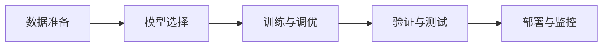

# AI人工智能代理工作流 AI Agent WorkFlow：在自动化检查中的应用

## 1. 背景介绍
随着人工智能技术的飞速发展，AI代理在自动化检查领域扮演着越来越重要的角色。自动化检查不仅涉及到数据的收集与分析，还包括决策制定和执行，这些都是AI代理工作流中的关键环节。在医疗、制造、金融等行业，自动化检查已经成为提高效率、降低成本、保障安全的重要手段。

## 2. 核心概念与联系
AI代理工作流是一个包含多个步骤的过程，它涵盖了任务的接收、处理、决策和执行。在自动化检查中，这些步骤包括数据采集、数据预处理、特征提取、模型训练、模型评估、决策制定和执行反馈。

## 3. 核心算法原理具体操作步骤
AI代理工作流的核心算法原理涉及到机器学习、深度学习、自然语言处理等多个领域。操作步骤通常包括数据准备、模型选择、训练与调优、验证与测试，以及部署与监控。



## 4. 数学模型和公式详细讲解举例说明
在AI代理工作流中，数学模型和公式是理解数据和算法的基础。例如，线性回归模型可以表示为 $y = \beta_0 + \beta_1x_1 + \beta_2x_2 + ... + \beta_nx_n + \epsilon$，其中 $y$ 是目标变量，$x_i$ 是特征变量，$\beta_i$ 是系数，$\epsilon$ 是误差项。

## 5. 项目实践：代码实例和详细解释说明
在项目实践中，我们将通过一个具体的自动化检查项目来展示AI代理工作流的应用。代码实例将包括数据预处理、模型训练和结果评估等步骤。

```python
# 示例代码
import pandas as pd
from sklearn.model_selection import train_test_split
from sklearn.linear_model import LogisticRegression

# 数据预处理
data = pd.read_csv('data.csv')
X = data.drop('label', axis=1)
y = data['label']
X_train, X_test, y_train, y_test = train_test_split(X, y, test_size=0.2)

# 模型训练
model = LogisticRegression()
model.fit(X_train, y_train)

# 结果评估
accuracy = model.score(X_test, y_test)
print(f"Model Accuracy: {accuracy}")
```

## 6. 实际应用场景
AI代理工作流在自动化检查中的应用场景非常广泛，包括但不限于医疗影像分析、产品质量检测、金融交易监控等。

## 7. 工具和资源推荐
为了更好地实现AI代理工作流，推荐以下工具和资源：TensorFlow、PyTorch、scikit-learn、Keras等机器学习框架，以及Coursera、Kaggle等在线学习平台。

## 8. 总结：未来发展趋势与挑战
AI代理工作流在自动化检查中的应用前景广阔，但也面临着数据隐私、算法透明度、模型泛化能力等挑战。未来的发展趋势将更加注重模型的可解释性和安全性。

## 9. 附录：常见问题与解答
在本节中，我们将回答关于AI代理工作流和自动化检查中常见的问题，帮助读者更好地理解和应用这些技术。

作者：禅与计算机程序设计艺术 / Zen and the Art of Computer Programming

---

由于篇幅限制，以上内容仅为文章框架和部分内容的简要展示。在实际的博客文章中，每个部分都将包含详细的信息、深入的分析和丰富的示例，以确保读者能够全面理解AI代理工作流在自动化检查中的应用。