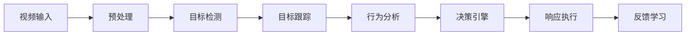

# AI人工智能代理工作流 AI Agent WorkFlow：在视频监控中的应用

## 1.背景介绍

随着人工智能技术的不断发展,视频监控系统正在经历一场革命性的变革。传统的视频监控系统主要依赖人工观察和分析,效率低下且容易出现疏漏。而借助AI人工智能代理工作流程(AI Agent Workflow),视频监控系统可以实现智能化、自动化的运行,大大提高了监控效率和准确性。

### 1.1 视频监控的重要性

视频监控在公共安全、交通管理、商业运营等诸多领域扮演着重要角色。它可以实时监测环境,及时发现异常情况,并为相关人员提供决策依据。然而,传统的视频监控系统存在诸多缺陷,例如:

- 人工观察效率低下且容易疲劳
- 无法及时发现所有异常情况
- 数据存储和管理成本高昂

### 1.2 AI人工智能代理工作流的优势

AI人工智能代理工作流将人工智能技术与视频监控相结合,可以显著提升监控系统的性能和效率。其主要优势包括:

- 自动化的视频分析和异常检测
- 实时响应和警报触发
- 大规模数据处理和模式识别
- 持续学习和自我优化

通过AI人工智能代理工作流,视频监控系统可以自动执行复杂的任务,如目标检测、行为分析、人脸识别等,从而减轻人工工作量,提高监控质量。

## 2.核心概念与联系

### 2.1 AI人工智能代理

AI人工智能代理是指具有一定智能和自主性的软件实体,能够感知环境、分析数据、做出决策并采取行动。在视频监控场景中,AI人工智能代理可以连接到监控摄像头,实时分析视频流数据,并根据预设规则或算法做出相应的响应。

### 2.2 工作流程

工作流程(Workflow)是指一系列有序的任务或活动,用于完成特定的业务目标。在视频监控中,AI人工智能代理工作流将各个AI模块(如目标检测、行为分析等)有序地组合在一起,形成一个完整的视频分析和决策流程。



上图展示了一个典型的AI人工智能代理工作流在视频监控中的应用。各个模块按顺序执行,最终实现智能化的视频分析和决策响应。

## 3.核心算法原理具体操作步骤

AI人工智能代理工作流在视频监控中的应用涉及多种核心算法,包括目标检测、目标跟踪、行为分析等。下面将详细介绍这些算法的原理和具体操作步骤。

### 3.1 目标检测算法

目标检测是AI视频分析的基础,旨在从视频帧中识别出感兴趣的目标(如人、车辆等)。常用的目标检测算法包括:

1. **基于传统机器学习的算法**
   - 步骤1: 提取视频帧的特征(如边缘、纹理等)
   - 步骤2: 使用训练好的分类器(如SVM、AdaBoost等)对特征进行分类
   - 步骤3: 对分类结果进行后处理(如非极大值抑制)

2. **基于深度学习的算法**
   - 步骤1: 构建深度神经网络模型(如YOLO、Faster R-CNN等)
   - 步骤2: 使用大量标注数据对模型进行训练
   - 步骤3: 对新的视频帧输入模型,获取目标检测结果

### 3.2 目标跟踪算法

目标跟踪旨在跟踪检测到的目标在视频序列中的运动轨迹,是实现行为分析的基础。常用的目标跟踪算法包括:

1. **基于滤波的算法**
   - 步骤1: 使用卡尔曼滤波或粒子滤波估计目标的运动状态
   - 步骤2: 根据运动状态预测目标在下一帧的位置
   - 步骤3: 在预测区域内搜索目标,更新运动状态

2. **基于相关滤波的算法**
   - 步骤1: 使用核相关滤波器学习目标的外观模型
   - 步骤2: 在下一帧中搜索与模型最匹配的区域作为目标位置
   - 步骤3: 根据新位置更新外观模型

3. **基于深度学习的算法**
   - 步骤1: 构建深度神经网络模型(如SORT、DeepSORT等)
   - 步骤2: 使用大量视频数据对模型进行训练
   - 步骤3: 对新的视频序列输入模型,获取目标跟踪结果

### 3.3 行为分析算法

行为分析是AI视频分析的核心,旨在从目标的运动轨迹中识别出特定的行为模式。常用的行为分析算法包括:

1. **基于规则的算法**
   - 步骤1: 定义行为规则(如入侵、徘徊等)
   - 步骤2: 对目标的运动轨迹进行分析,匹配预定义的规则
   - 步骤3: 对匹配的行为进行报警或其他响应

2. **基于统计模型的算法**
   - 步骤1: 从大量视频数据中学习正常行为的统计模型
   - 步骤2: 对新的目标运动轨迹计算其与正常模型的偏差
   - 步骤3: 当偏差超过阈值时,判定为异常行为

3. **基于深度学习的算法**
   - 步骤1: 构建深度神经网络模型(如3D卷积网络、RNN等)
   - 步骤2: 使用大量标注数据对模型进行训练
   - 步骤3: 对新的视频序列输入模型,获取行为分析结果

## 4.数学模型和公式详细讲解举例说明

在AI人工智能代理工作流中,许多核心算法都涉及到数学模型和公式。下面将详细讲解其中的几个重要模型和公式。

### 4.1 卡尔曼滤波

卡尔曼滤波是一种常用的目标跟踪算法,它基于线性动态系统的状态空间模型,通过递推方式估计目标的运动状态。其核心公式如下:

$$
\begin{aligned}
\hat{x}_{k|k-1} &= A\hat{x}_{k-1|k-1} + Bu_k\\
P_{k|k-1} &= AP_{k-1|k-1}A^T + Q\\
K_k &= P_{k|k-1}H^T(HP_{k|k-1}H^T + R)^{-1}\\
\hat{x}_{k|k} &= \hat{x}_{k|k-1} + K_k(z_k - H\hat{x}_{k|k-1})\\
P_{k|k} &= (I - K_kH)P_{k|k-1}
\end{aligned}
$$

其中:

- $\hat{x}_{k|k-1}$是时刻k的先验状态估计
- $P_{k|k-1}$是先验估计误差协方差矩阵
- $K_k$是卡尔曼增益
- $\hat{x}_{k|k}$是时刻k的后验状态估计
- $P_{k|k}$是后验估计误差协方差矩阵

通过不断更新状态估计和协方差矩阵,卡尔曼滤波可以有效地跟踪目标的运动轨迹。

### 4.2 核相关滤波器

核相关滤波器(Kernel Correlation Filter, KCF)是一种常用的目标跟踪算法,它通过在傅里叶域中解析求解岭回归问题,实现高效的目标跟踪。其核心公式如下:

$$
\hat{\alpha} = \argmin_{\alpha} \sum_{i=1}^{n} \left\| x_i \circledast \alpha - y_i \right\|^2 + \lambda \left\| \alpha \right\|^2
$$

其中:

- $x_i$是训练样本的特征向量
- $y_i$是训练样本的标签(目标或背景)
- $\alpha$是要求解的滤波器系数
- $\circledast$表示循环卷积操作
- $\lambda$是正则化参数

通过求解上述优化问题,可以得到最优的滤波器系数$\hat{\alpha}$,用于在新的视频帧中搜索目标。

### 4.3 三维卷积神经网络

三维卷积神经网络(3D Convolutional Neural Network, 3D CNN)是一种常用于视频分析任务(如行为识别)的深度学习模型。它在时间维度上对视频进行卷积操作,可以有效地捕获视频中的动态信息。其核心公式如下:

$$
y_{ijk}^{l} = f\left(\sum_{m}\sum_{p=0}^{P-1}\sum_{q=0}^{Q-1}\sum_{r=0}^{R-1}w_{mpqr}^{l}x_{i+p,j+q,k+r,m}^{l-1} + b^{l}\right)
$$

其中:

- $x^{l-1}$是第l-1层的输入特征图
- $y^{l}$是第l层的输出特征图
- $w^{l}$是第l层的卷积核权重
- $b^{l}$是第l层的偏置项
- $f$是非线性激活函数(如ReLU)
- P、Q、R分别表示卷积核在三个维度上的大小

通过堆叠多个三维卷积层和其他层(如池化层、全连接层等),3D CNN可以学习到视频中的复杂模式,实现准确的行为识别。

## 5.项目实践：代码实例和详细解释说明

为了更好地理解AI人工智能代理工作流在视频监控中的应用,下面将提供一个基于Python和OpenCV的实践项目代码示例,并对关键部分进行详细解释。

### 5.1 项目概述

本项目旨在构建一个简单的AI人工智能代理工作流,用于实时监测视频流中的人体运动,并检测出异常行为(如徘徊)。项目的主要模块包括:

1. 视频输入模块
2. 人体检测模块
3. 人体跟踪模块
4. 行为分析模块
5. 异常检测和警报模块

### 5.2 代码实例

```python
import cv2
import numpy as np

# 视频输入模块
cap = cv2.VideoCapture('path/to/video.mp4')

# 人体检测模块
body_detector = cv2.createBackgroundSubtractorMOG2()

# 人体跟踪模块
trackers = cv2.MultiTracker_create()

# 行为分析模块
loitering_threshold = 60  # 徘徊阈值(秒)
loitering_timers = {}

while True:
    ret, frame = cap.read()
    if not ret:
        break

    # 人体检测
    mask = body_detector.apply(frame)
    _, mask = cv2.threshold(mask, 254, 255, cv2.THRESH_BINARY)
    contours, _ = cv2.findContours(mask, cv2.RETR_TREE, cv2.CHAIN_APPROX_SIMPLE)

    # 人体跟踪
    boxes = []
    for cnt in contours:
        area = cv2.contourArea(cnt)
        if area > 500:
            x, y, w, h = cv2.boundingRect(cnt)
            boxes.append((x, y, w, h))

    boxes_ids = []
    for box in boxes:
        x, y, w, h = [int(v) for v in box]
        tracker = cv2.MultiTracker_create()
        tracker.add(cv2.TrackerMOSSE_create(), frame, (x, y, w, h))
        trackers.add(tracker)

    # 行为分析和异常检测
    for tracker in trackers.getTrackers():
        success, box = tracker.update(frame)
        if success:
            x, y, w, h = [int(v) for v in box]
            tracker_id = str(tracker)
            if tracker_id not in loitering_timers:
                loitering_timers[tracker_id] = 0
            else:
                loitering_timers[tracker_id] += 1

            if loitering_timers[tracker_id] > loitering_threshold:
                cv2.putText(frame, 'Loitering Detected', (x, y - 10), cv2.FONT_HERSHEY_SIMPLEX, 0.5, (0, 0, 255), 2)
                # 触发警报或其他响