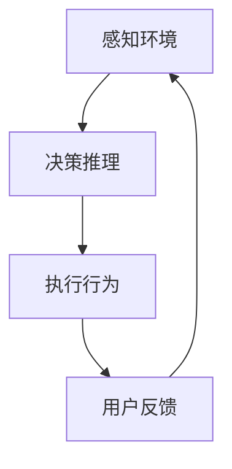

# AI人工智能代理工作流AI Agent WorkFlow：智能代理在内容推荐系统中的运用

## 1.背景介绍

### 1.1 内容推荐系统的重要性

在当今信息时代,海量的数据和内容不断涌现,如何从纷繁复杂的信息中为用户精准推荐个性化的内容,成为了各大平台和企业所面临的巨大挑战。内容推荐系统通过分析用户行为数据、内容元数据等,为用户推荐感兴趣的内容,可以提高用户体验,增强用户粘性,从而为平台带来更多商业价值。因此,构建高效、智能的内容推荐系统对于企业的发展至关重要。

### 1.2 人工智能在内容推荐系统中的作用

传统的内容推荐系统主要依赖于协同过滤、基于内容的推荐等算法,但这些算法存在冷启动问题、数据稀疏性问题等缺陷。人工智能技术的发展为内容推荐系统带来了新的契机。通过深度学习、自然语言处理、知识图谱等技术,可以更好地理解用户需求、挖掘内容语义,从而提供更加个性化、智能化的推荐服务。

### 1.3 AI智能代理的概念

AI智能代理(AI Agent)是一种基于人工智能技术的软件实体,能够感知环境、作出决策并执行相应的行为。在内容推荐系统中,AI智能代理可以作为用户与系统之间的中介,通过与用户交互、学习用户偏好,并根据推荐策略为用户推荐合适的内容。

## 2.核心概念与联系

### 2.1 AI智能代理的工作流程

AI智能代理在内容推荐系统中的工作流程通常包括以下几个主要步骤:

1. **感知环境**:代理从用户行为数据、内容元数据等多个数据源中获取相关信息,构建用户画像和内容知识库。
2. **决策推理**:基于推荐策略和算法模型,代理分析用户需求,匹配合适的内容。
3. **执行行为**:代理将推荐结果呈现给用户,并通过用户反馈进行持续学习和优化。

### 2.2 关键技术

AI智能代理在内容推荐系统中的应用涉及多项关键技术:

1. **用户画像构建**:通过数据挖掘和机器学习技术,从用户行为数据中提取用户兴趣偏好,构建用户画像。
2. **内容理解**:利用自然语言处理、知识图谱等技术,对内容进行语义分析和知识表示,理解内容主题和涵义。
3. **推荐算法**:基于协同过滤、矩阵分解、深度学习等算法,匹配用户画像与内容特征,生成个性化推荐列表。
4. **交互学习**:通过与用户交互,不断优化推荐策略,提高推荐质量。

### 2.3 智能代理与推荐系统的关系

智能代理是内容推荐系统的核心组成部分,承担着感知、决策和执行的职责。推荐系统则是一个更大的框架,包括数据采集、特征工程、模型训练、在线服务等多个环节。智能代理作为推荐系统的"大脑",与其他组件协同工作,共同实现高质量的内容推荐服务。

## 3.核心算法原理具体操作步骤

### 3.1 用户画像构建

#### 3.1.1 数据预处理

1. **数据清洗**:去除无效数据、填充缺失值、处理异常值等。
2. **数据融合**:将用户的多个维度数据(如浏览记录、评分、社交关系等)进行融合。
3. **数据编码**:将离散特征(如地区、职业等)进行one-hot编码,将连续特征进行归一化处理。

#### 3.1.2 特征工程

1. **统计特征**:计算用户对不同内容类型、主题的偏好统计量。
2. **上下文特征**:考虑用户的地理位置、时间等上下文信息。
3. **社交特征**:分析用户的社交关系,挖掘朋友圈的影响。

#### 3.1.3 用户画像表示

1. **基于规则**:根据预定义的规则,将用户划分为不同的人群类型。
2. **基于聚类**:使用K-Means、DBSCAN等无监督聚类算法,将相似用户划分为同一类别。
3. **基于embedding**:通过Word2Vec、Node2Vec等技术,将用户画像表示为低维密集向量。

### 3.2 内容理解

#### 3.2.1 文本内容理解

1. **关键词提取**:使用TF-IDF、TextRank等算法提取内容的核心关键词。
2. **主题模型**:通过LDA、BTM等主题模型,发现内容的隐含主题分布。
3. **情感分析**:利用情感词典、深度学习模型等技术,判断内容的情感倾向性。

#### 3.2.2 多模态内容理解

1. **图像理解**:使用CNN、Transformer等模型,对图像内容进行物体检测、场景识别等分析。
2. **视频理解**:融合图像、语音、文本等模态信息,理解视频的语义内容。
3. **知识图谱**:构建结构化的知识库,表示内容实体之间的关系,支持语义推理。

### 3.3 推荐算法

#### 3.3.1 协同过滤算法

1. **基于用户**:根据用户之间的相似度,推荐相似用户喜欢的内容。
2. **基于物品**:根据物品之间的相似度,推荐与用户喜欢的内容相似的其他内容。

#### 3.3.2 基于内容的推荐

1. **内容相似度**:计算用户历史喜好内容与候选内容的文本相似度,推荐相似内容。
2. **主题模型**:基于用户历史喜好内容的主题分布,推荐具有相似主题的内容。

#### 3.3.3 深度学习推荐算法

1. **矩阵分解**:基于用户-物品交互矩阵,将用户和物品映射到共同的低维空间,计算相似度。
2. **序列推荐**:捕捉用户行为序列模式,预测用户的下一步行为。
3. **注意力机制**:赋予不同特征不同的权重,提高模型的解释性和泛化能力。

### 3.4 交互学习优化

1. **在线学习**:实时收集用户反馈(点击、购买、评分等),持续优化推荐模型。
2. **多Armed-Bandit**:在exploitation(利用当前最优策略)和exploration(尝试新策略)之间寻求平衡。
3. **上下文建模**:考虑用户的时间、地点等上下文信息,动态调整推荐策略。
4. **A/B测试**:对比不同推荐策略的表现,选择最优策略上线。

## 4.数学模型和公式详细讲解举例说明  

### 4.1 相似度计算

相似度计算是协同过滤和基于内容推荐算法的基础。常用的相似度计算方法包括:

1. **欧几里得距离**:

$$\operatorname{dist}(x, y)=\sqrt{\sum_{i=1}^{n}\left(x_{i}-y_{i}\right)^{2}}$$

其中$x$和$y$为两个$n$维向量,距离越小,相似度越高。

2. **余弦相似度**:

$$\operatorname{sim}(x, y)=\frac{x \cdot y}{\|x\|\|y\|}=\frac{\sum_{i=1}^{n} x_{i} y_{i}}{\sqrt{\sum_{i=1}^{n} x_{i}^{2}} \sqrt{\sum_{i=1}^{n} y_{i}^{2}}}$$

余弦值越接近1,相似度越高。

3. **Jaccard相似度**:

$$\operatorname{sim}(A, B)=\frac{|A \cap B|}{|A \cup B|}$$

针对集合数据,交集与并集的比值作为相似度。

4. **编辑距离**:

$$\operatorname{dist}_{e d}(x, y)=\min \left\{\begin{array}{ll}
\operatorname{dist}_{e d}\left(x^{\prime}, y\right)+1 \\
\operatorname{dist}_{e d}\left(x, y^{\prime}\right)+1 \\
\operatorname{dist}_{e d}\left(x^{\prime}, y^{\prime}\right)+\delta\left(x_{i}, y_{i}\right)
\end{array}\right.$$

其中$x'$和$y'$分别表示去掉$x$和$y$的最后一个字符后的子串,$\delta(x_i,y_i)$当$x_i \neq y_i$时为1,否则为0。常用于计算字符串相似度。

### 4.2 主题模型

主题模型是无监督学习的一种重要方法,广泛应用于文本主题发现、特征抽取等场景。常见的主题模型包括:

1. **LDA(Latent Dirichlet Allocation)**

LDA假设每个文档是由若干主题的混合构成,每个主题又是由若干单词的概率分布表示。通过贝叶斯估计,可以求解文档-主题分布$\theta$和主题-单词分布$\phi$:

$$
\begin{aligned}
p(\theta, \phi | w, \alpha, \beta) &=\frac{p(\theta | \alpha) \prod_{n=1}^{N} p\left(z_{n} | \theta\right) p\left(w_{n} | \phi_{z_{n}}, \beta\right)}{p(w | \alpha, \beta)} \\
\theta_{m k} &=p\left(\text { topic }_{k} | \operatorname{doc}_{m}\right) \\
\phi_{k n} &=p\left(\text {word}_{n} | \operatorname{topic}_{k}\right)
\end{aligned}
$$

2. **BTM(Biterm Topic Model)**

BTM直接对双词对建模,能够更好地发现主题相关的模式和短语。BTM的生成过程为:

$$
\begin{aligned}
p(B, z) &=\prod_{i=1}^{M} \sum_{k=1}^{K} \frac{n_{k}^{(i)}}{n^{(i)}} \prod_{j=1}^{n^{(i)}} \frac{n_{k b_{j}^{(i)}}^{(w i)}+\alpha_{k b_{j}^{(i)}}}{\sum_{w=1}^{W} n_{k w}^{(w i)}+\alpha_{k w}} \\
\phi_{k w} &=\frac{n_{k w}+\alpha_{k w}}{\sum_{w^{\prime}=1}^{W} n_{k w^{\prime}}+\alpha_{k w^{\prime}}}
\end{aligned}
$$

其中$B$为文档的双词对集合,$z$为主题分配,$n_k^{(i)}$为文档$i$分配到主题$k$的次数,$n_{kw}^{(wi)}$为主题$k$生成双词$w$的次数。

### 4.3 矩阵分解

矩阵分解是基于深度学习的推荐算法的基础,通过将用户和物品映射到共同的低维空间,计算相似度进行推荐。常见的矩阵分解模型包括:

1. **SVD(Singular Value Decomposition)**

$$
R \approx U \Sigma V^{T}
$$

其中$R$为用户-物品评分矩阵,$U$和$V$分别为用户和物品的低维表示,$\Sigma$为对角矩阵。

2. **PMF(Probabilistic Matrix Factorization)**

PMF在SVD基础上加入了用户和物品的偏置项,并使用高斯分布对观测数据建模:

$$
R_{u i} \sim \mathcal{N}\left(U_{u}^{T} V_{i}+\mu+b_{u}+b_{i}, \sigma^{2}\right)
$$

其中$\mu$为全局偏置,$b_u$和$b_i$分别为用户和物品的偏置项。

3. **NFM(Neural Factorization Machines)**

NFM融合了FM(Factorization Machines)和神经网络,能够自动学习特征之间的高阶组合关系:

$$
\hat{y}_{N F M}=w_{0}+\sum_{i=1}^{n} w_{i} x_{i}+\sum_{i=1}^{n} \sum_{j=i+1}^{n}\left\langle v_{i}, v_{j}\right\rangle x_{i} x_{j}+f\left(x_{1}, x_{2}, \ldots, x_{n}\