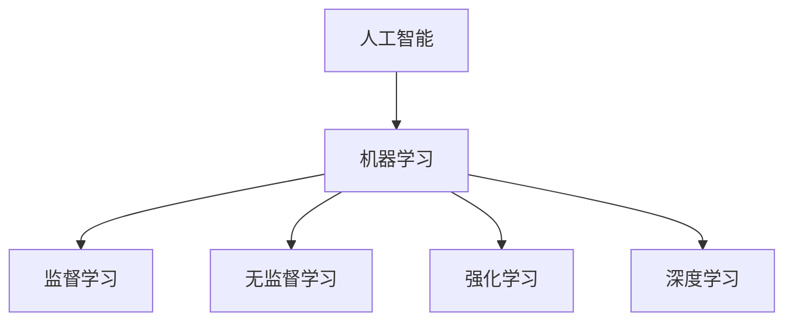

以下是标题为《AI人工智能核心算法原理与代码实例讲解：算法实现》的技术博客文章正文内容：

# AI人工智能核心算法原理与代码实例讲解：算法实现

## 1.背景介绍

### 1.1 人工智能的兴起

人工智能(Artificial Intelligence, AI)是当代科技发展的前沿领域,近年来受到了前所未有的关注和重视。AI技术的快速发展正在深刻影响和改变着各行各业,催生了无数创新应用,为解决人类面临的诸多挑战提供了新的思路和方法。

### 1.2 算法在AI中的核心地位  

算法是AI技术的核心和基础,决定着AI系统的性能表现和智能水平。优秀的算法能够充分挖掘数据中蕴含的规律和知识,高效地解决复杂的问题,从而推动AI技术的发展和应用。

### 1.3 本文内容和目标读者

本文将围绕当前AI领域几种核心算法展开深入探讨,全面解析其原理、实现方法和应用场景,并辅以代码示例,以期为读者提供算法层面的技术视角。文章内容主要面向AI开发者、算法工程师、技术研究人员等对象。

## 2.核心概念与联系

### 2.1 机器学习

机器学习(Machine Learning)是AI的核心分支,旨在使计算机具备从数据中自动分析获得规律,并对未知数据进行预测的能力。常见的机器学习算法包括:

- 监督学习(Supervised Learning)
- 无监督学习(Unsupervised Learning) 
- 强化学习(Reinforcement Learning)

### 2.2 深度学习

深度学习(Deep Learning)是机器学习的一个新的研究热点,它模仿人脑神经网络结构和工作机制,通过构建深层次人工神经网络对大规模数据进行建模,在计算机视觉、自然语言处理等领域表现出卓越性能。

## 3.核心算法原理具体操作步骤  

### 3.1 监督学习算法

#### 3.1.1 线性回归

线性回归是最基础和常用的监督学习算法之一,用于预测连续数值型目标变量。其基本原理是在给定的数据集中,找到一个最佳拟合的线性方程,使预测值与真实值之间的误差最小化。

线性回归算法步骤:

1. 数据预处理(归一化、填充缺失值等)
2. 定义损失函数(如均方误差)
3. 使用优化算法(如梯度下降)估计模型参数
4. 在测试集上评估模型性能

#### 3.1.2 逻辑回归

逻辑回归是监督学习中解决二分类问题的经典算法,将输入映射到0或1的概率输出。其本质是通过对数几率回归模型拟合数据,得到输入与输出之间的对数几率关系。

逻辑回归算法步骤:

1. 数据预处理
2. 定义逻辑损失函数
3. 使用优化算法(如梯度下降)估计模型参数
4. 设置阈值将概率输出转化为0/1类别
5. 在测试集上评估模型性能

#### 3.1.3 决策树

决策树是一种树形结构的监督学习模型,通过对特征的条件判断,将实例数据从根节点分类到叶子节点。决策树具有可解释性强、计算高效等优点,适用于分类和回归任务。

决策树算法构建步骤:

1. 选择最优特征,计算各特征对数据集的信息增益
2. 根据最优特征对数据集进行分裂
3. 对分裂后的子节点递归构建子树
4. 生成决策树模型

#### 3.1.4 支持向量机

支持向量机(Support Vector Machine, SVM)是一种基于核技巧的通用监督学习方法,在分类和回归任务中表现优异。SVM的基本思想是在高维特征空间中构建一个超平面,将不同类别的数据分离,并使正负实例点到超平面的距离最大化。

SVM算法步骤:

1. 将数据映射到高维特征空间
2. 在特征空间中寻找最大间隔超平面
3. 转化为对偶问题求解支持向量
4. 利用核函数计算高维映射的内积
5. 对新实例进行分类预测

### 3.2 无监督学习算法  

#### 3.2.1 K-Means聚类

K-Means是无监督学习中最常用的聚类算法,通过迭代优化将数据划分为K个簇,使簇内数据点相似度高,簇间相似度低。

K-Means算法步骤:

1. 随机初始化K个聚类中心
2. 计算每个数据点到聚类中心的距离,分配到最近的簇
3. 重新计算每个簇的聚类中心
4. 重复步骤2-3,直至聚类中心不再变化

#### 3.2.2 层次聚类

层次聚类是一种基于距离的聚类方法,通过递归的聚合或分裂过程构建层次化的聚类树状结构。常用的层次聚类算法包括AGNES(聚合层次聚类)和DIANA(分裂层次聚类)。

层次聚类算法步骤:

1. 计算所有数据点之间的距离/相似度矩阵
2. 根据距离矩阵,合并/分裂最相似/不相似的簇
3. 更新距离矩阵
4. 重复步骤2-3,直至满足终止条件(所有数据聚为一簇或每个数据为一簇)

### 3.3 深度学习算法

#### 3.3.1 卷积神经网络

卷积神经网络(Convolutional Neural Network, CNN)是一种在计算机视觉和图像识别领域表现出色的深度神经网络结构。CNN引入了卷积层和池化层,能够有效地捕捉图像的局部特征,并对位移、缩放等变换具有一定鲁棒性。

CNN算法训练步骤:

1. 构建CNN网络结构(卷积层、池化层、全连接层)
2. 初始化网络权重参数
3. 前向传播计算输出和损失
4. 反向传播计算梯度
5. 基于梯度更新网络参数
6. 重复步骤3-5,直至收敛

#### 3.3.2 循环神经网络

循环神经网络(Recurrent Neural Network, RNN)是一种适用于处理序列数据(如文本、语音)的深度网络模型。RNN通过内部的循环连接,能够捕捉序列数据中的长期依赖关系,并对任意长度的序列进行预测。

RNN算法训练步骤:

1. 构建RNN网络结构(输入层、隐藏层、输出层)
2. 初始化网络权重参数 
3. 前向计算隐藏状态和输出
4. 计算损失函数
5. 反向传播计算梯度
6. 基于梯度更新网络参数
7. 重复步骤3-6,直至收敛

### 3.4 强化学习算法

#### 3.4.1 Q-Learning

Q-Learning是强化学习中的一种基于价值的无模型算法,旨在通过与环境的交互,学习到一个最优的状态-行为价值函数(Q函数),从而获得最优策略。

Q-Learning算法步骤:

1. 初始化Q函数(所有状态-行为对的初始价值)
2. 观测当前状态s
3. 根据Q函数选择行为a(如ε-贪婪策略)
4. 执行行为a,获得奖励r和新状态s'
5. 更新Q(s,a)值
6. 将s'作为新状态,重复步骤3-5

#### 3.4.2 策略梯度算法

策略梯度(Policy Gradient)是一种直接对策略进行优化的强化学习算法,通过调整策略参数,最大化期望的累积奖励。策略梯度算法常用于解决连续动作空间的问题。

策略梯度算法步骤:  

1. 初始化策略函数参数θ
2. 执行当前策略π(θ),生成一个轨迹
3. 计算轨迹的累积奖励
4. 根据累积奖励计算策略梯度
5. 更新策略参数θ
6. 重复步骤2-5,直至收敛

## 4.数学模型和公式详细讲解举例说明

### 4.1 线性回归

线性回归的目标是找到一个最佳拟合的线性方程:

$$y = w_1x_1 + w_2x_2 + ... + w_nx_n + b$$

其中$y$为预测目标值,$x_i$为特征变量,$w_i$为特征权重系数,$b$为偏置项。

模型训练的目标是最小化损失函数,常用的损失函数是均方误差(Mean Squared Error, MSE):

$$MSE = \frac{1}{N}\sum_{i=1}^{N}(y_i - \hat{y_i})^2$$

其中$y_i$为真实值,$\hat{y_i}$为预测值,$N$为样本数量。

可以使用梯度下降法来优化损失函数,更新权重参数:

$$w_j := w_j - \alpha \frac{\partial MSE}{\partial w_j}$$
$$b := b - \alpha \frac{\partial MSE}{\partial b}$$

其中$\alpha$为学习率,决定了每次更新的步长。

### 4.2 逻辑回归

逻辑回归使用Sigmoid函数将线性回归的输出映射到(0,1)区间,作为二分类问题的概率输出:

$$\sigma(z) = \frac{1}{1 + e^{-z}}$$

其中$z = w_1x_1 + w_2x_2 + ... + w_nx_n + b$为线性组合。

逻辑回归的损失函数通常采用对数损失函数(Log Loss):

$$\begin{aligned}
L(w,b) &= -\frac{1}{N}\sum_{i=1}^N\big[y_i\log(\sigma(z_i)) + (1-y_i)\log(1-\sigma(z_i))\big] \\
       &= -\frac{1}{N}\sum_{i=1}^N\big[y_i\log p_i + (1-y_i)\log(1-p_i)\big]
\end{aligned}$$

其中$y_i$为实际标签(0或1),$p_i = \sigma(z_i)$为预测概率。

同样可以使用梯度下降法优化参数$w$和$b$:

$$w_j := w_j - \alpha \frac{\partial L}{\partial w_j}$$
$$b := b - \alpha \frac{\partial L}{\partial b}$$

### 4.3 支持向量机

支持向量机的基本思想是在高维特征空间中寻找一个最大间隔超平面,将不同类别的数据分离。

对于线性可分的情况,超平面方程为:

$$w^Tx + b = 0$$

其中$w$为法向量,$b$为位移项。

我们需要最大化几何间隔$\gamma$:

$$\gamma = \frac{2}{\|w\|}$$

等价于最小化$\frac{1}{2}\|w\|^2$,转化为约束最优化问题:

$$\begin{aligned}
&\min\limits_{w,b}\frac{1}{2}\|w\|^2\\
&s.t.\quad y_i(w^Tx_i+b)\geq 1,\quad i=1,2,...,N
\end{aligned}$$

引入拉格朗日乘子法,可以转化为对偶问题,求解支持向量。

对于非线性情况,可以通过核函数$K(x_i,x_j)$将数据映射到高维特征空间,在高维空间中构建超平面。

### 4.4 K-Means聚类

K-Means聚类的目标是将$N$个数据点$\{x_1, x_2, ..., x_N\}$划分为$K$个簇$\{C_1, C_2, ..., C_K\}$,使得簇内数据点相似度高,簇间相似度低。

相似度的度量通常采用欧几里得距离:

$$d(x_i, x_j) = \sqrt{\sum_{k=1}^{n}(x_{ik} - x_{jk})^2}$$

其中$n$为数据点的特征维度。

K-Means算法的目标是最小化以下目标函数:

$$J = \sum_{i=1}^{K}\sum_{x\in