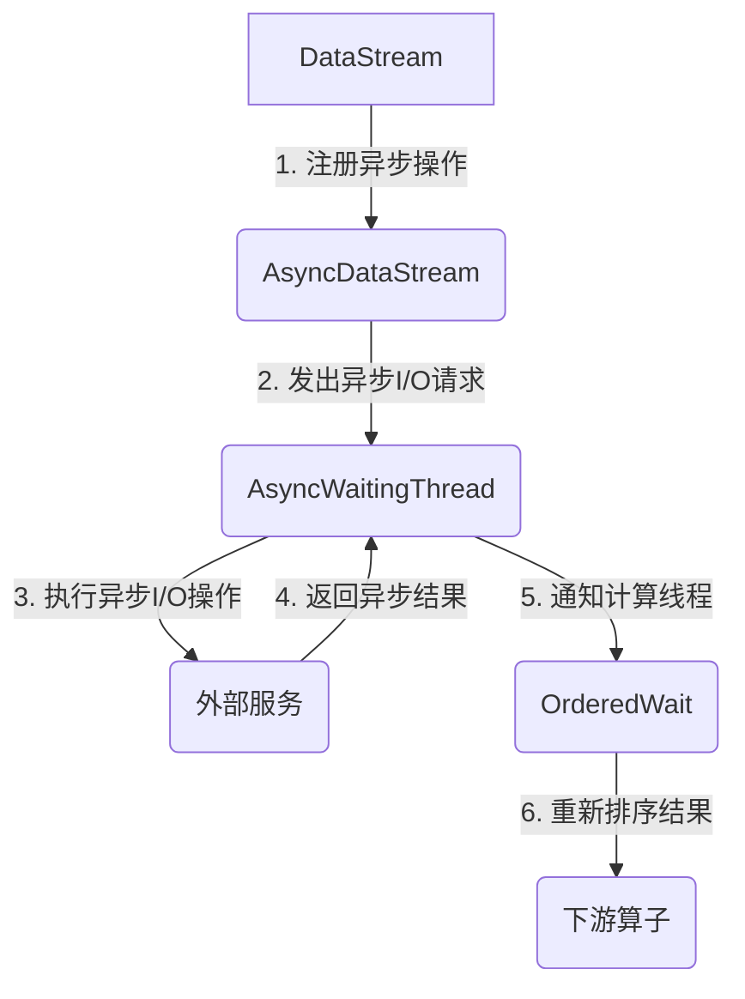

作为一位计算机领域的专家和大师,我很荣幸能为您解答有关Flink Async I/O的相关问题。Flink Async I/O是一种高效的异步I/O模型,可以显著提高Flink作业的吞吐量和延迟。在本文中,我将全面解释Flink Async I/O的原理、实现方式以及相关代码示例,希望能够帮助您更好地理解和运用这一强大的功能。

# Flink Async I/O原理与代码实例讲解

## 1. 背景介绍

在现代数据处理系统中,I/O操作通常是性能瓶颈的主要来源之一。传统的同步I/O模型会导致大量线程被阻塞,从而浪费了宝贵的CPU资源。为了解决这个问题,Flink引入了Async I/O,这是一种基于Future的异步非阻塞I/O模型。

Async I/O的核心思想是将I/O操作与计算分离,使用少量的线程执行I/O操作,而计算线程则可以继续处理其他任务,从而充分利用CPU资源,提高整体吞吐量。当I/O操作完成时,计算线程会收到通知,然后处理I/O结果。这种异步非阻塞模式可以显著减少线程切换和上下文切换的开销。

## 2. 核心概念与联系

### 2.1 Future

Future是Async I/O模型中的核心概念。它代表了一个异步计算的结果,可以在将来的某个时间点获取该结果。在Flink中,Future由`org.apache.flink.util.Concurrent`工具类提供支持。

### 2.2 AsyncWaitingThread

AsyncWaitingThread是Flink中用于执行异步I/O操作的特殊线程。它们由Flink的线程池管理,并在需要时自动创建和回收。AsyncWaitingThread的主要职责是发出异步I/O请求,并在I/O操作完成时通知相应的计算线程。

### 2.3 AsyncDataStream

AsyncDataStream是Flink提供的用于处理异步数据的特殊数据流。它允许用户在DataStream上注册异步操作,并在异步操作完成时继续处理结果。AsyncDataStream提供了丰富的API,支持各种异步场景。

### 2.4 OrderedWait

OrderedWait是Flink中用于保证异步操作结果顺序的机制。由于异步操作的结果可能会乱序返回,因此需要使用OrderedWait对结果进行重新排序,确保下游算子能够按照正确的顺序处理数据。

### 2.5 Mermaid流程图

下面是Flink Async I/O的核心流程,使用Mermaid流程图进行可视化展示:



## 3. 核心算法原理具体操作步骤

Flink Async I/O的核心算法原理可以概括为以下几个步骤:

1. **注册异步操作**: 用户在DataStream上调用`asyncMapOrdered`或`asyncMapUnorderedWait`等API,注册一个异步函数(AsyncFunction)。此时,Flink会创建一个AsyncDataStream。

2. **发出异步I/O请求**: 当数据进入AsyncDataStream时,Flink会从线程池中获取一个AsyncWaitingThread,并在该线程中执行异步函数的`asyncInvoke`方法,发出异步I/O请求。

3. **执行异步I/O操作**: AsyncWaitingThread将异步I/O请求发送给外部服务(如Web服务、数据库等),并等待异步结果返回。

4. **返回异步结果**: 当异步I/O操作完成时,外部服务会将结果返回给AsyncWaitingThread。

5. **通知计算线程**: AsyncWaitingThread会将异步结果封装为Future对象,并通过OrderedWait机制通知相应的计算线程。

6. **重新排序结果**: 如果使用了`asyncMapOrdered`API,则OrderedWait会根据结果的顺序号对Future进行重新排序,确保下游算子能够按照正确的顺序处理数据。

7. **处理异步结果**: 计算线程会从Future中获取异步结果,并在`asyncInvoke`方法的回调函数中进行进一步处理。

通过这种异步非阻塞的方式,Flink可以充分利用CPU资源,显著提高作业的吞吐量和延迟。同时,OrderedWait机制也确保了数据的有序性,满足了许多应用场景的需求。

## 4. 数学模型和公式详细讲解举例说明

在分析Flink Async I/O的性能时,我们通常会使用一些数学模型和公式。下面是一些常见的模型和公式,以及它们的具体含义和使用场景。

### 4.1 小顶堆模型

在OrderedWait机制中,Flink使用了小顶堆(Min Heap)数据结构来对Future进行排序。小顶堆是一种特殊的二叉树,其中每个节点的值都小于或等于其子节点的值。

对于包含n个元素的小顶堆,插入和删除操作的时间复杂度均为$O(\log n)$。这种高效的时间复杂度使得OrderedWait能够快速地对大量Future进行排序,从而保证下游算子能够高效地处理有序数据。

### 4.2 线程利用率

线程利用率是衡量Async I/O模型效率的一个重要指标。它表示在给定时间内,CPU被实际利用的比例。理想情况下,线程利用率应该尽可能接近100%,这意味着CPU资源被充分利用。

线程利用率可以用下面的公式表示:

$$
线程利用率 = \frac{CPU利用时间}{总运行时间}
$$

其中,CPU利用时间是指CPU实际执行计算任务的时间,而总运行时间包括CPU执行时间、I/O等待时间等。

在同步I/O模型中,由于线程在等待I/O操作完成时会被阻塞,因此线程利用率通常较低。而在Async I/O模型中,由于计算线程不会被I/O操作阻塞,因此线程利用率可以显著提高。

### 4.3 吞吐量模型

吞吐量是衡量Flink作业处理能力的另一个重要指标。它表示单位时间内系统能够处理的数据量。

吞吐量可以用下面的公式表示:

$$
吞吐量 = \frac{处理的数据量}{运行时间}
$$

在同步I/O模型中,由于线程利用率较低,因此吞吐量也会受到限制。而在Async I/O模型中,由于线程利用率提高,CPU资源被充分利用,因此吞吐量也会显著提升。

需要注意的是,提高吞吐量并不意味着无限制地增加并发度。过高的并发度可能会导致资源竞争和其他问题,反而降低系统的整体性能。因此,在实际应用中,需要根据具体场景合理设置并发度,以获得最佳的吞吐量。

## 5. 项目实践: 代码实例和详细解释说明

为了更好地理解Flink Async I/O的使用方式,我们来看一个实际的代码示例。在这个示例中,我们将构建一个简单的流处理作业,该作业会异步调用一个Web服务,获取每条输入数据的详细信息。

### 5.1 准备工作

首先,我们需要在项目中添加Flink的依赖项。在Maven项目的`pom.xml`文件中,添加以下依赖项:

```xml
<dependency>
    <groupId>org.apache.flink</groupId>
    <artifactId>flink-java</artifactId>
    <version>1.14.0</version>
</dependency>
<dependency>
    <groupId>org.apache.flink</groupId>
    <artifactId>flink-streaming-java_2.12</artifactId>
    <version>1.14.0</version>
</dependency>
```

### 5.2 定义AsyncFunction

接下来,我们需要定义一个AsyncFunction,用于发出异步请求并处理异步结果。在本示例中,我们将调用一个模拟的Web服务,该服务会根据输入的ID返回相应的详细信息。

```java
import org.apache.flink.configuration.Configuration;
import org.apache.flink.streaming.api.functions.async.ResultFuture;
import org.apache.flink.streaming.api.functions.async.RichAsyncFunction;

import java.util.Collections;
import java.util.concurrent.CompletableFuture;

public class DataEnricher extends RichAsyncFunction<String, String> {
    private transient WebServiceClient webServiceClient;

    @Override
    public void open(Configuration parameters) throws Exception {
        webServiceClient = new WebServiceClient();
    }

    @Override
    public void asyncInvoke(String input, ResultFuture<String> resultFuture) throws Exception {
        CompletableFuture<String> future = webServiceClient.getDataAsync(input);
        future.thenAccept(resultFuture::complete);
    }

    @Override
    public void timeout(String input, ResultFuture<String> resultFuture) throws Exception {
        resultFuture.completeExceptionally(new Exception("Request timed out"));
    }
}
```

在这个示例中,我们定义了一个名为`DataEnricher`的类,它继承自`RichAsyncFunction`。

- `open`方法用于初始化`WebServiceClient`对象,该对象模拟了一个Web服务客户端。
- `asyncInvoke`方法是异步函数的核心部分。它接收一个输入字符串(表示ID),并调用`WebServiceClient`的`getDataAsync`方法发出异步请求。当异步结果返回时,它会通过`ResultFuture`的`complete`方法将结果传递给Flink。
- `timeout`方法用于处理请求超时的情况。在本示例中,我们简单地抛出一个异常。

### 5.3 构建Flink作业

现在,我们可以构建一个Flink流处理作业,该作业会从Socket接收数据,并使用我们定义的`DataEnricher`异步函数来丰富数据。

```java
import org.apache.flink.streaming.api.datastream.AsyncDataStream;
import org.apache.flink.streaming.api.datastream.DataStreamSource;
import org.apache.flink.streaming.api.environment.StreamExecutionEnvironment;

public class AsyncIOJob {
    public static void main(String[] args) throws Exception {
        StreamExecutionEnvironment env = StreamExecutionEnvironment.getExecutionEnvironment();

        DataStreamSource<String> inputStream = env.socketTextStream("localhost", 9999);

        AsyncDataStream.unorderedWait(
                inputStream,
                new DataEnricher(),
                10000,
                10
        ).print();

        env.execute("Async I/O Job");
    }
}
```

在这个示例中,我们首先创建了一个`StreamExecutionEnvironment`对象,并使用`socketTextStream`方法从本地Socket接收数据。

接下来,我们调用`AsyncDataStream.unorderedWait`方法,将输入流转换为一个AsyncDataStream。这个方法的参数包括:

- 输入流(`inputStream`)
- 异步函数(`new DataEnricher()`)
- 超时时间(10000毫秒)
- 容量(10)

`unorderedWait`方法会创建一个新的AsyncDataStream,该流会异步执行`DataEnricher`函数,并在异步结果返回时继续处理数据。由于我们使用的是`unorderedWait`方法,因此结果的顺序不会被保留。

最后,我们调用`print`方法将异步结果输出到控制台,并使用`env.execute`方法启动Flink作业。

### 5.4 运行作业

要运行这个作业,你需要先启动一个Socket服务器,用于发送测试数据。你可以使用以下命令启动一个简单的Netcat服务器:

```
nc -lk 9999
```

然后,在另一个终端窗口中,运行`AsyncIOJob`的主类。你应该会看到Flink作业启动并等待输入数据。

现在,你可以在Netcat窗口中输入一些ID,例如`1`、`2`、`3`等。Flink作业会异步调用Web服务,并将丰富后的数据输出到控制台。

```
1 -> Enriched data for ID 1
2 -> Enriched data for ID 2
3 -> Enriched data for ID 3
```

通过这个示例,你应该已经对Flink Async I/O的使用方式有了基本的了解。在实际应用中,你可以根据具体需求调整异步函数的实现,并合理设置超时时间和容量等参数,以获得最佳的性能表现。

## 6. 实际应用场景

Flink Async I