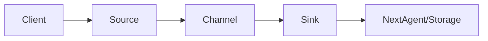
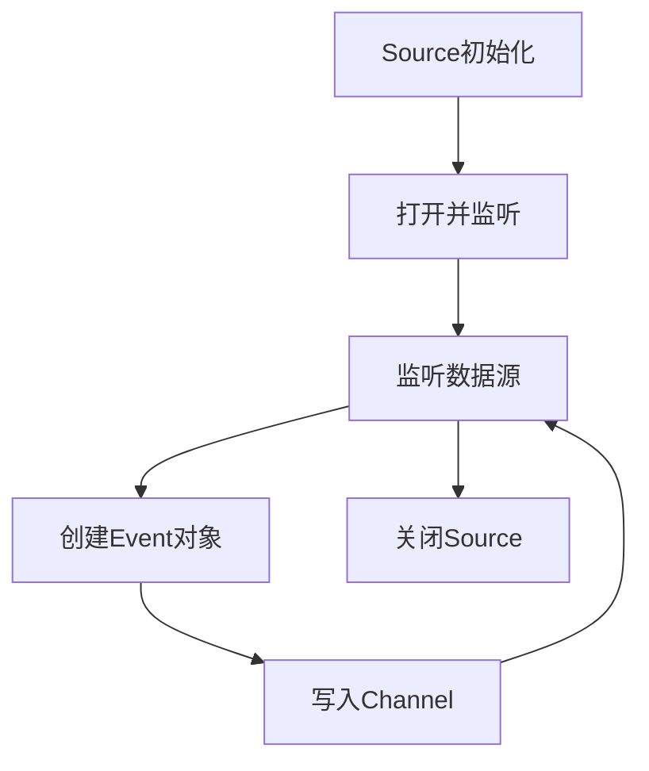

# Flume Source原理与代码实例讲解

## 1.背景介绍

在大数据时代,海量数据的实时采集和传输是一个重要的课题。Apache Flume是一个分布式、可靠、高可用的海量日志采集、聚合和传输的系统,它可以将各种渠道的海量日志数据进行高效采集、聚合、移动,最后存储到一个中心化的数据存储系统中。Flume作为整个大数据平台的数据接入层,在整个系统中起到十分关键的作用。

Flume以agent为最小的独立运行单位。一个agent就是一个JVM。单agent由Source、Sink和Channel三大组件构成,Source负责数据的收集,Sink负责数据的输出,Channel负责Source和Sink之间的数据传输。本文将重点对Flume的Source组件进行深入剖析,探讨其内部工作原理,并结合实际的代码实例进行讲解。

## 2.核心概念与联系

### 2.1 Flume架构概述

在深入探讨Source组件之前,我们有必要对Flume的整体架构有一个宏观的认识。Flume采用了层次化的架构设计,主要分为三层:

- 数据收集层(Source):负责从数据源收集数据
- 数据传输层(Channel):负责在Source和Sink之间临时存储数据,可以看作是一个数据的缓冲区
- 数据输出层(Sink):负责将数据输出到目标存储系统或者下一级Flume

除此之外,Flume还有一些其他的组件:

- Event:是数据传输的基本单位,以事件的形式将数据从源头送至目的地
- Client:操作Flume发送数据的客户端
- Agent:是一个独立的Flume进程,包含Source、Sink和Channel

它们之间的关系可以用下面的Mermaid流程图来表示:



### 2.2 Source组件介绍

Source是直接接触数据源的组件,负责将数据捕获并转换为Flume的Event,然后将Event传递给Channel组件。Flume支持多种类型的Source,可以从不同的数据源收集数据,例如:

- Avro Source:支持Avro协议,接收Avro客户端发送的数据
- Thrift Source:支持Thrift协议,接收Thrift客户端发送的数据 
- Exec Source:通过执行一个Unix命令来获取数据,如tail -F /var/log/xx.log
- Spooling Directory Source:监控指定目录,将目录中的新文件转换成Event
- Kafka Source:从Kafka消息队列中读取数据
- HTTP Source:接收HTTP的POST和GET请求发送的数据

## 3.Source内部工作原理

### 3.1 基本工作流程

尽管不同的Source类型从不同的数据源获取数据,但是它们的内部工作流程大致相同:

1. Source接收配置参数初始化
2. Source打开并开始监听数据源 
3. Source将监听到的数据封装成Event对象
4. Source将Event对象写入Channel
5. 当Source关闭时,停止数据读取并释放资源

用Mermaid流程图表示如下:



### 3.2 Event对象

在上面的流程中可以看到,Source的核心工作就是创建Event对象。Event是Flume数据传输的基本单位,Event实现非常简单,就是一个装有字节数组的容器,并带有可选的消息头信息。

Event接口的定义如下:

```java
public interface Event {
  public Map<String, String> getHeaders();
  public void setHeaders(Map<String, String> headers);
  public byte[] getBody();
  public void setBody(byte[] body);
}
```

- headers:保存Event的可选消息头信息,形式为Key-Value对
- body:保存Event的字节数组形式的数据

Source从数据源捕获到数据后,需要根据具体的数据格式将其封装到一个Event对象的body中。

### 3.3 与Channel交互

当Source创建好一个Event对象后,需要将其传递给Channel组件进行缓存。为了实现Source和Channel的解耦,Flume定义了一个ChannelProcessor接口:

```java
public interface ChannelProcessor extends Configurable, LifecycleAware {
  public void processEvent(Event event) throws ChannelException;
  public void processEventBatch(List<Event> events) throws ChannelException;
}
```

ChannelProcessor接口有两个方法:
- processEvent:处理单个Event对象
- processEventBatch:批量处理Event列表

Source通过调用ChannelProcessor的这两个方法,将Event对象写入Channel中,从而实现了Source到Channel的数据传递。

## 4.Source相关的配置

### 4.1 通用配置

不同的Source类型都有一些通用的配置项:

| 配置项 | 说明 |
|-------|------|
| channels | 指定Source绑定的Channel,多个Channel用空格分隔 |
| type | 指定Source组件的类型,如avro、exec、spooldir等 |
| selector.type | Source Channel选择器的类型,可选值:replicating或multiplexing |
| interceptors | 指定Source拦截器,多个拦截器之间用空格分隔 |
| interceptors.* | 拦截器相关的属性 |

### 4.2 个性化配置

除了通用配置外,每种Source还有一些个性化的配置参数。例如:

- Exec Source的个性化配置:

| 配置项 | 说明 | 默认值 |
|------|------|-------|
| command | 要执行的Unix命令 | 无 |
| shell | 用于执行命令的shell | /bin/sh -c |
| restart | 命令退出后是否重新执行 | false |

- Spooling Directory Source的个性化配置:  

| 配置项 | 说明 | 默认值 |
|------|------|-------|
| spoolDir | 监控的目录 | 无 |
| fileSuffix | 完成文件的后缀名 | .COMPLETED |
| deletePolicy | 处理完的文件的删除策略 | never |

## 5.代码实例讲解

下面我们通过一个实际的代码实例,来演示如何自定义一个基于Flume原生API的Source。

### 5.1 需求分析

我们的需求是实现一个简单的网络Socket Source,它监听一个指定的IP和端口号,将接收到的数据行封装成Event对象,然后写入Channel。

### 5.2 代码实现

```java
public class MySocketSource extends AbstractSource implements Configurable, PollableSource {

  private String host;
  private int port;
  private ServerSocket serverSocket;

  @Override
  public void configure(Context context) {
    host = context.getString("host");
    port = context.getInteger("port");
  }

  @Override
  public void start() {
    try {
      serverSocket = new ServerSocket(port);
      super.start();
    } catch (IOException e) {
      e.printStackTrace();
    }
  }

  @Override
  public void stop() {
    try {
      serverSocket.close();
    } catch (IOException e) {
      e.printStackTrace();
    }
    super.stop();
  }

  @Override
  public Status process() throws EventDeliveryException {
    Status status = null;
    try {
      Socket socket = serverSocket.accept();
      BufferedReader reader = new BufferedReader(new InputStreamReader(socket.getInputStream()));

      String line = reader.readLine();
      while (line != null) {
        SimpleEvent event = new SimpleEvent();
        event.setBody(line.getBytes());
        getChannelProcessor().processEvent(event);
        line = reader.readLine();
      }
      status = Status.READY;
      socket.close();
    } catch (IOException e) {
      status = Status.BACKOFF;
    }
    return status;
  }
}
```

代码说明:

1. 自定义Source需要继承AbstractSource类,同时实现Configurable和PollableSource接口。 
2. configure方法用于初始化配置参数,这里我们配置了监听的IP和端口号。
3. start方法在Source启动时调用,这里启动了一个ServerSocket来监听端口。
4. stop方法在Source停止时调用,关闭ServerSocket连接。
5. process方法是核心,它从Socket连接中读取数据行,将每一行数据封装成一个SimpleEvent对象,然后调用ChannelProcessor的processEvent方法将Event写入Channel。
6. process方法返回一个Status状态,READY表示成功,BACKOFF表示失败。

### 5.3 配置使用

定义好Source后,就可以在Flume的配置文件中使用它了,配置示例如下:

```properties
a1.sources = s1
a1.channels = c1
a1.sources.s1.type = com.example.MySocketSource
a1.sources.s1.host = localhost
a1.sources.s1.port = 44444
a1.sources.s1.channels = c1
```

这个配置创建了一个类型为MySocketSource的Source,监听本机的44444端口,并绑定到了名为c1的Channel上。

## 6.实际应用场景

Flume作为一个通用的数据收集框架,应用场景非常广泛,下面列举几个常见的应用场景:

- 日志收集:Flume可以收集服务器上的日志文件,为海量日志的集中式存储和分析提供支持。
- 数据库变更捕获:通过监听数据库的binlog,可以捕获数据库的变更并形成事件流,用于数据同步、数据备份等。  
- 消息队列对接:Flume可以对接Kafka等消息队列,实现异构系统之间的数据传输。
- 爬虫数据收集:利用Flume可以方便地将爬虫抓取的数据进行收集、过滤并最终入库。

## 7.工具和资源推荐

- [Flume官方文档](https://flume.apache.org/documentation.html):这是Flume的官方文档,覆盖了Flume的方方面面,是学习和使用Flume的权威指南。
- [Flume User Guide](https://flume.apache.org/FlumeUserGuide.html):Flume的用户指南,对Flume的安装、配置、部署做了详尽的讲解,并提供了大量的配置示例。
- [Flume 1.9.0 API](https://flume.apache.org/releases/content/1.9.0/apidocs/index.html):Flume的API文档,对Flume的各个组件的接口和类做了详细的说明,是二次开发的重要参考。
- [Flume Plugins](https://github.com/keedio/flume-plugins):这是一个第三方的Flume插件库,提供了大量实用的Source、Sink和Channel实现,可以直接拿来使用。

## 8.总结

本文深入剖析了Flume Source组件的内部工作原理,从Source的整体架构、Event的数据格式、Source与Channel的交互等方面进行了系统的讲解,并结合实际的代码实例演示了如何自定义Source。

Flume Source作为数据接入的前端,灵活性和可扩展性非常强,可以连接各种异构的数据源。深入理解Source的原理,可以让我们更好地使用Flume,并根据实际需求定制个性化的Source组件。

展望未来,Flume作为一个成熟的数据收集框架,将在大数据领域扮演越来越重要的角色。随着数据源的多样化和数据量的爆发式增长,Flume也必将不断演进,以满足更加苛刻的数据收集需求。作为开发者,我们要在使用Flume的同时,关注其最新的发展动态,并为它的发展贡献自己的力量。

## 9.附录:常见问题与解答

### 9.1 Flume可以用来收集什么样的数据? 

Flume可以收集任何形式的事件数据,常见的数据源包括日志文件、网络数据流、消息队列、数据库变更等。只要数据可以封装成Flume的Event对象,就可以用Flume来收集。

### 9.2 Flume支持多少种类型的Source?

Flume支持非常丰富的Source类型,可以连接到各种不同的数据源。除了文中提到的几种常见Source外,Flume还支持Syslog Source、JMS Source、Netcat Source等。此外,Flume提供了扩展接口,我们可以方便地自定义Source。

### 9.3 除了Source,Flume的其他组件是如何工作的?

Flume的另外两个核心组件是Channel和Sink:
- Channel是Event的缓存区,它接收Source发送来的Event,并暂存以供Sink消费。常见的Channel有Memory Channel和File Channel。
- Sink从Channel读取Event,并将其发送到下一个目的地,可以是HDFS、HBase、Kafka等。Sink是Flume数据流的终点。

Source、Channel、Sink三者协同工作,共同完成了数据的端到端传输。

### 9.4 Flume适合什么样的数据量级?

Flume适合海量数据的收集,单个