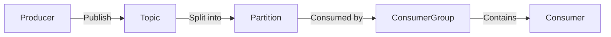

# Kafka原理与代码实例讲解

## 1. 背景介绍
在现代数据驱动的应用场景中，实时数据处理已经成为一项基础且关键的需求。Apache Kafka是一个分布式流处理平台，它被设计用来高效地处理大量数据，并且能够支持高吞吐量的数据流。Kafka最初由LinkedIn开发，并于2011年成为Apache项目的一部分。它广泛应用于日志聚合、消息队列、流数据处理和实时分析等场景。

## 2. 核心概念与联系
Kafka的设计哲学是围绕着几个关键概念：主题（Topics）、分区（Partitions）、生产者（Producers）、消费者（Consumers）和消费者群组（Consumer Groups）。

- **主题（Topics）**: Kafka中的消息是以主题为单位进行分类的，可以理解为消息的类别。
- **分区（Partitions）**: 为了实现可伸缩性和并行处理，每个主题可以分成多个分区，每个分区是一个有序的、不可变的消息序列。
- **生产者（Producers）**: 生产者是消息的发布者，它负责将消息发送到Kafka中的一个或多个主题。
- **消费者（Consumers）**: 消费者从Kafka中订阅主题并处理消息。
- **消费者群组（Consumer Groups）**: 消费者可以组成群组，群组内的消费者共享消息，确保每个消息只被群组内的一个消费者处理。



## 3. 核心算法原理具体操作步骤
Kafka的核心算法包括消息存储、分布式数据同步和消费者偏移管理。

- **消息存储**: Kafka使用顺序写入的方式来存储消息到磁盘，这种方式对于磁盘的读写性能是非常高效的。
- **分布式数据同步**: Kafka通过复制机制保证数据的高可用性和一致性。每个分区都有一个leader和多个follower，所有的读写操作都通过leader来协调。
- **消费者偏移管理**: Kafka通过消费者偏移（Consumer Offset）来记录消费者的读取进度，确保消息能够被正确处理。

## 4. 数学模型和公式详细讲解举例说明
Kafka的性能可以通过以下数学模型来描述：

$$
吞吐量（TPS） = \frac{消息数量}{单位时间}
$$

$$
延迟（Latency） = \frac{总处理时间}{消息数量}
$$

其中，消息数量是指在特定时间内生产者发送和消费者接收的消息总数，单位时间通常是秒。

## 5. 项目实践：代码实例和详细解释说明
以下是一个简单的Kafka生产者和消费者的Java代码示例：

```java
// 生产者示例
public class SimpleProducer {
    public static void main(String[] args) {
        Properties props = new Properties();
        props.put("bootstrap.servers", "localhost:9092");
        props.put("key.serializer", "org.apache.kafka.common.serialization.StringSerializer");
        props.put("value.serializer", "org.apache.kafka.common.serialization.StringSerializer");

        Producer<String, String> producer = new KafkaProducer<>(props);
        for(int i = 0; i < 100; i++)
            producer.send(new ProducerRecord<String, String>("my-topic", Integer.toString(i), Integer.toString(i)));

        producer.close();
    }
}

// 消费者示例
public class SimpleConsumer {
    public static void main(String[] args) {
        Properties props = new Properties();
        props.put("bootstrap.servers", "localhost:9092");
        props.put("group.id", "test");
        props.put("key.deserializer", "org.apache.kafka.common.serialization.StringDeserializer");
        props.put("value.deserializer", "org.apache.kafka.common.serialization.StringDeserializer");

        Consumer<String, String> consumer = new KafkaConsumer<>(props);
        consumer.subscribe(Arrays.asList("my-topic"));
        while (true) {
            ConsumerRecords<String, String> records = consumer.poll(Duration.ofMillis(100));
            for (ConsumerRecord<String, String> record : records)
                System.out.printf("offset = %d, key = %s, value = %s%n", record.offset(), record.key(), record.value());
        }
    }
}
```

在这个例子中，生产者发送了100条消息到`my-topic`主题，而消费者订阅了这个主题并输出每条消息的偏移量、键和值。

## 6. 实际应用场景
Kafka广泛应用于以下场景：

- 日志收集系统
- 消息系统
- 用户活动跟踪
- 实时流处理
- 事件源（Event Sourcing）

## 7. 工具和资源推荐
- **Apache Kafka**: 官方网站提供了Kafka的下载和文档。
- **Confluent Platform**: 提供了Kafka的商业支持和额外的工具集。
- **Kafka Streams**: Kafka的流处理库。
- **Kafka Connect**: 用于连接Kafka和其他系统的框架。

## 8. 总结：未来发展趋势与挑战
Kafka的未来发展趋势包括更强的流处理能力、更好的云服务集成和更高的安全性。同时，随着数据量的增长，如何保持高性能和低延迟是Kafka面临的挑战。

## 9. 附录：常见问题与解答
- **Q: Kafka如何保证消息的顺序？**
- **A**: Kafka通过分区来保证同一个分区内的消息是有序的。

- **Q: Kafka和传统消息队列有什么不同？**
- **A**: Kafka是为流处理设计的，它支持高吞吐量和持久化存储，而传统消息队列更侧重于点对点的消息传递。

- **Q: 如何监控Kafka的性能？**
- **A**: 可以使用JMX工具或Kafka自带的命令行工具来监控性能指标。

作者：禅与计算机程序设计艺术 / Zen and the Art of Computer Programming