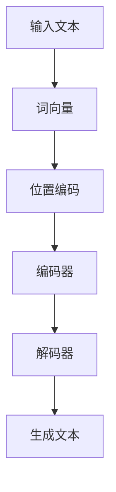

# Language Models 原理与代码实战案例讲解

## 1.背景介绍

语言模型（Language Models, LMs）是自然语言处理（NLP）领域的核心技术之一。它们通过学习大量文本数据，能够生成、理解和处理自然语言。近年来，随着深度学习和大规模数据集的发展，语言模型取得了显著的进步，尤其是像GPT-3这样的预训练模型，已经在多个NLP任务中表现出色。

语言模型的应用范围非常广泛，包括但不限于机器翻译、文本生成、情感分析、问答系统等。本文将深入探讨语言模型的核心概念、算法原理、数学模型，并通过实际代码实例展示其应用。

## 2.核心概念与联系

### 2.1 语言模型的定义

语言模型是一种概率模型，用于预测一个句子或文本序列中下一个词的概率。其目标是通过学习大量的文本数据，捕捉语言的统计特性，从而生成符合语法和语义的文本。

### 2.2 语言模型的分类

语言模型主要分为以下几类：

- **统计语言模型**：基于n-gram的方法，通过统计词与词之间的共现概率来进行预测。
- **神经语言模型**：利用神经网络，特别是循环神经网络（RNN）、长短期记忆网络（LSTM）和变换器（Transformer）等架构来建模语言。

### 2.3 预训练与微调

现代语言模型通常采用预训练和微调的策略。预训练阶段，模型在大规模无监督数据上进行训练，学习通用的语言表示。微调阶段，模型在特定任务的数据上进行有监督训练，以适应具体任务的需求。

### 2.4 语言模型的评估指标

常用的评估指标包括困惑度（Perplexity）、BLEU、ROUGE等。这些指标用于衡量模型生成文本的质量和准确性。

## 3.核心算法原理具体操作步骤

### 3.1 统计语言模型

统计语言模型主要基于n-gram方法。n-gram是指由n个词组成的词序列。通过统计训练语料中各个n-gram的频率，可以计算出下一个词的条件概率。

#### 3.1.1 n-gram模型的步骤

1. **数据预处理**：将文本数据分词，并统计各个n-gram的频率。
2. **概率计算**：根据频率计算条件概率。
3. **文本生成**：根据条件概率生成文本。

### 3.2 神经语言模型

神经语言模型利用神经网络来捕捉语言的复杂特性。常用的架构包括RNN、LSTM和Transformer。

#### 3.2.1 RNN模型的步骤

1. **数据预处理**：将文本数据转化为词向量。
2. **模型构建**：构建RNN模型，并定义损失函数和优化器。
3. **模型训练**：在训练数据上进行迭代训练。
4. **文本生成**：利用训练好的模型生成文本。

### 3.3 Transformer模型

Transformer模型是目前最先进的语言模型架构，采用自注意力机制，能够更好地捕捉长距离依赖关系。

#### 3.3.1 Transformer模型的步骤

1. **数据预处理**：将文本数据转化为词向量，并添加位置编码。
2. **模型构建**：构建Transformer模型，包括编码器和解码器。
3. **模型训练**：在训练数据上进行迭代训练。
4. **文本生成**：利用训练好的模型生成文本。

以下是Transformer模型的Mermaid流程图：



## 4.数学模型和公式详细讲解举例说明

### 4.1 统计语言模型

统计语言模型的核心是条件概率的计算。对于一个n-gram模型，其条件概率可以表示为：

$$
P(w_i | w_{i-n+1}, ..., w_{i-1}) = \frac{C(w_{i-n+1}, ..., w_i)}{C(w_{i-n+1}, ..., w_{i-1})}
$$

其中，$C(w_{i-n+1}, ..., w_i)$表示n-gram的频率。

### 4.2 神经语言模型

神经语言模型通过神经网络来计算条件概率。以RNN为例，其计算公式为：

$$
h_t = \sigma(W_h \cdot x_t + U_h \cdot h_{t-1} + b_h)
$$

$$
y_t = \sigma(W_y \cdot h_t + b_y)
$$

其中，$h_t$是隐藏状态，$x_t$是输入词向量，$W_h$、$U_h$、$b_h$、$W_y$、$b_y$是模型参数。

### 4.3 Transformer模型

Transformer模型采用自注意力机制，其核心公式为：

$$
\text{Attention}(Q, K, V) = \text{softmax}\left(\frac{QK^T}{\sqrt{d_k}}\right)V
$$

其中，$Q$、$K$、$V$分别是查询、键和值矩阵，$d_k$是键的维度。

## 5.项目实践：代码实例和详细解释说明

### 5.1 统计语言模型代码实例

以下是一个简单的n-gram模型的Python实现：

```python
import nltk
from collections import defaultdict

class NgramModel:
    def __init__(self, n):
        self.n = n
        self.ngrams = defaultdict(int)
        self.contexts = defaultdict(int)

    def train(self, corpus):
        for sentence in corpus:
            tokens = nltk.word_tokenize(sentence)
            for i in range(len(tokens) - self.n + 1):
                ngram = tuple(tokens[i:i+self.n])
                context = tuple(tokens[i:i+self.n-1])
                self.ngrams[ngram] += 1
                self.contexts[context] += 1

    def predict(self, context):
        context = tuple(context)
        candidates = {ngram[-1]: count for ngram, count in self.ngrams.items() if ngram[:-1] == context}
        total = sum(candidates.values())
        return {word: count / total for word, count in candidates.items()}

# 示例使用
corpus = ["这是一个例子", "这是另一个例子"]
model = NgramModel(2)
model.train(corpus)
print(model.predict(["这是"]))
```

### 5.2 神经语言模型代码实例

以下是一个简单的RNN语言模型的TensorFlow实现：

```python
import tensorflow as tf
from tensorflow.keras.preprocessing.text import Tokenizer
from tensorflow.keras.preprocessing.sequence import pad_sequences

# 数据预处理
sentences = ["这是一个例子", "这是另一个例子"]
tokenizer = Tokenizer()
tokenizer.fit_on_texts(sentences)
sequences = tokenizer.texts_to_sequences(sentences)
padded_sequences = pad_sequences(sequences, padding='post')

# 模型构建
model = tf.keras.Sequential([
    tf.keras.layers.Embedding(input_dim=len(tokenizer.word_index) + 1, output_dim=64),
    tf.keras.layers.SimpleRNN(64),
    tf.keras.layers.Dense(len(tokenizer.word_index) + 1, activation='softmax')
])

model.compile(optimizer='adam', loss='sparse_categorical_crossentropy')
model.fit(padded_sequences, padded_sequences, epochs=10)

# 文本生成
def generate_text(model, tokenizer, seed_text, next_words):
    for _ in range(next_words):
        sequence = tokenizer.texts_to_sequences([seed_text])[0]
        padded_sequence = pad_sequences([sequence], maxlen=model.input_shape[1], padding='post')
        predicted = model.predict(padded_sequence, verbose=0)
        predicted_word = tokenizer.index_word[predicted.argmax()]
        seed_text += " " + predicted_word
    return seed_text

print(generate_text(model, tokenizer, "这是", 3))
```

### 5.3 Transformer模型代码实例

以下是一个简单的Transformer语言模型的PyTorch实现：

```python
import torch
import torch.nn as nn
import torch.optim as optim
from torchtext.data.utils import get_tokenizer
from torchtext.vocab import build_vocab_from_iterator

# 数据预处理
tokenizer = get_tokenizer("basic_english")
corpus = ["this is an example", "this is another example"]
tokens = [tokenizer(sentence) for sentence in corpus]
vocab = build_vocab_from_iterator(tokens, specials=["<unk>"])
vocab.set_default_index(vocab["<unk>"])

# 模型构建
class TransformerModel(nn.Module):
    def __init__(self, vocab_size, d_model, nhead, num_encoder_layers, num_decoder_layers):
        super(TransformerModel, self).__init__()
        self.embedding = nn.Embedding(vocab_size, d_model)
        self.transformer = nn.Transformer(d_model, nhead, num_encoder_layers, num_decoder_layers)
        self.fc = nn.Linear(d_model, vocab_size)

    def forward(self, src, tgt):
        src = self.embedding(src)
        tgt = self.embedding(tgt)
        output = self.transformer(src, tgt)
        return self.fc(output)

model = TransformerModel(len(vocab), 512, 8, 6, 6)
criterion = nn.CrossEntropyLoss()
optimizer = optim.Adam(model.parameters())

# 模型训练
for epoch in range(10):
    for sentence in tokens:
        src = torch.tensor([vocab[token] for token in sentence[:-1]])
        tgt = torch.tensor([vocab[token] for token in sentence[1:]])
        optimizer.zero_grad()
        output = model(src.unsqueeze(1), tgt.unsqueeze(1))
        loss = criterion(output.view(-1, len(vocab)), tgt)
        loss.backward()
        optimizer.step()

# 文本生成
def generate_text(model, vocab, seed_text, next_words):
    model.eval()
    tokens = [vocab[token] for token in tokenizer(seed_text)]
    for _ in range(next_words):
        src = torch.tensor(tokens).unsqueeze(1)
        output = model(src, src)
        predicted_token = output.argmax(dim=-1)[-1].item()
        tokens.append(predicted_token)
    return " ".join([vocab.itos[token]