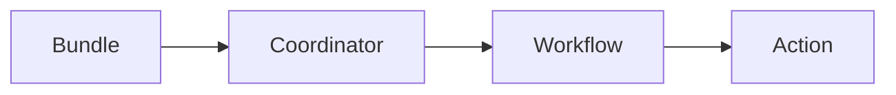

# Oozie Coordinator原理与代码实例讲解

## 1.背景介绍

### 1.1 什么是Oozie

Apache Oozie是一个用于管理Hadoop作业的工作流调度系统。它可以集成多种不同类型的Hadoop作业(如MapReduce、Pig、Hive、Sqoop等)到有向无环图(DAG)中,并按照指定的依赖关系和调度规则执行这些作业。Oozie提供了一种强大的方式来定义和执行复杂的工作流,使得管理Hadoop作业变得更加简单高效。

### 1.2 Oozie的作用

Oozie的主要作用包括:

- 工作流管理:将多个Hadoop作业组织成有向无环图,协调不同作业之间的执行顺序和依赖关系。
- 调度管理:支持基于时间(如cron表达式)和数据可用性的触发条件,实现复杂的调度策略。
- 作业监控:跟踪工作流执行状态,记录运行日志,支持重新运行失败的作业。
- 资源管理:管理工作流所需的各种资源(如代码、配置文件等),简化部署。

### 1.3 Oozie架构

Oozie的核心架构由以下几个主要组件组成:

- Workflow Engine:负责执行工作流作业,管理作业之间的依赖关系。
- Coordinator Engine:负责基于时间和数据触发条件调度工作流执行。
- Bundle Engine:用于管理多个相关的Coordinator作业。
- Configuration管理:管理工作流所需的各种资源和配置。
- Access Control:提供基于ACL的访问控制机制。

## 2.核心概念与联系

### 2.1 工作流(Workflow)

工作流是Oozie中最基本的概念,它定义了一组有向无环的动作(Action)集合,这些动作按照一定的控制依赖关系(如先后顺序、条件判断等)组织在一起。每个工作流都由一个XML定义文件描述,包含了所有动作及其执行顺序。

### 2.2 动作(Action)

动作是工作流中的基本执行单元,可以是MapReduce作业、Pig脚本、Hive查询等。Oozie支持多种不同类型的动作:

- MapReduce Action
- Pig Action 
- Hive Action
- SSH Action
- Shell Action
- FS Action(文件系统操作)
- Email Action

### 2.3 协调器(Coordinator)

协调器用于定义触发工作流执行的时间条件和数据条件。它由以下几个部分组成:

- 协调器应用程序:定义了协调器的元数据、执行频率等。
- 输入数据集:指定了触发协调器执行所依赖的输入数据。
- 输出数据集:指定协调器执行所产生的输出数据。
- 动作:指定协调器触发时所执行的工作流定义。

协调器支持基于时间(如cron表达式)和数据可用性的复杂调度策略。

### 2.4 捆绑包(Bundle)

捆绑包用于管理多个相关的协调器作业。通过捆绑包,我们可以将一组协调器作为一个逻辑单元进行部署、监控和管理。

### 2.5 核心概念关系

上述核心概念之间的关系如下所示:



- 捆绑包包含一个或多个协调器
- 协调器定义了触发条件和执行的工作流
- 工作流由一系列按特定顺序执行的动作组成

## 3.核心算法原理具体操作步骤  

### 3.1 工作流执行原理

Oozie工作流的执行过程遵循以下基本步骤:

1. 提交工作流作业
2. Workflow Engine解析工作流定义XML
3. 初始化工作流实例,创建相关元数据
4. 根据控制依赖关系,按顺序执行各个动作
5. 每个动作在完成后,更新状态并决定后续动作
6. 所有动作执行完毕,工作流实例结束

该过程可通过以下伪代码表示:

```
函数 executeWorkflow(workflowDef):
    实例化WorkflowInstance 
    actionList = 从workflowDef中解析出所有Action
    
    对于每个action in actionList:
        如果action的控制依赖条件满足:
            执行action
            更新action状态
            根据action状态决定后继动作
        else:
            等待依赖条件满足
            
    如果所有action执行成功:
        标记WorkflowInstance为成功状态
    else:
        标记WorkflowInstance为失败状态
        
    返回WorkflowInstance
```

### 3.2 协调器执行原理

Oozie协调器的执行遵循以下基本步骤:

1. 提交协调器作业
2. Coordinator Engine解析协调器定义
3. 根据时间/数据触发条件,创建工作流实例
4. 执行创建的工作流实例
5. 根据工作流执行结果,更新协调器状态
6. 重复3-5,直到满足终止条件

该过程可通过以下伪代码表示:

```
函数 executeCoordinator(coordDef):
    实例化CoordinatorInstance
    workflowDef = 从coordDef解析出关联的工作流定义
    
    while True:
        if 满足时间/数据触发条件:
            workflowInstance = executeWorkflow(workflowDef)
            根据workflowInstance状态更新CoordinatorInstance
        else:
            等待触发条件满足
            
        if 满足终止条件:
            break
            
    返回CoordinatorInstance
```

## 4.数学模型和公式详细讲解举例说明

在Oozie中,协调器的执行策略可以用数学模型来描述。假设一个协调器作业的执行间隔为T,输入数据集更新间隔为D,那么协调器实例创建的时间序列可表示为:

$$t_n = t_0 + nT \quad (n \in \mathbb{N})$$

其中$t_0$是协调器首次执行的时间。

对于基于数据可用性触发的协调器,如果输入数据集在$[t_n, t_{n+1})$时间段内有新数据,则会在$t_{n+1}$时刻创建一个新的协调器实例。输入数据集的更新时间序列可表示为:

$$d_m = d_0 + mD \quad (m \in \mathbb{N})$$

其中$d_0$是输入数据集首次更新的时间。

那么,在时间段$[t_n, t_{n+1})$内,如果存在$d_m$满足$t_n \le d_m < t_{n+1}$,则在$t_{n+1}$时刻会创建一个新的协调器实例。

以一个每天运行一次、依赖每小时更新一次的输入数据的协调器为例,其执行时间序列为:

$$t_n = 2023/06/01\;00:00 + n\times 24\text{hours}$$

输入数据更新时间序列为:

$$d_m = 2023/06/01\;00:00 + m\times 1\text{hour}$$

那么在2023/06/02这一天,协调器将在00:00创建一个新实例,因为在前一个24小时内,输入数据在多个时间点更新过($d_{24}$、$d_{25}$......)。

通过将时间、数据可用性等因素数学化,Oozie能够实现复杂的调度策略。

## 5.项目实践:代码实例和详细解释说明

### 5.1 工作流定义示例

以一个包含MapReduce作业、Hive查询的工作流为例,其XML定义如下:

```xml
<workflow-app name="mp-workflow" xmlns="uri:oozie:workflow:0.5">
  <start to="mr-node"/>
  
  <action name="mr-node">
    <map-reduce>
      <job-tracker>${jobTracker}</job-tracker>
      <name-node>${nameNode}</name-node>
      <configuration>
        <property>
          <name>mapred.mapper.class</name>
          <value>myapp.MapperClass</value>
        </property>
        ...
      </configuration>
    </map-reduce>
    <ok to="hive-node"/>
    <error to="fail"/>
  </action>

  <action name="hive-node">
    <hive xmlns="uri:oozie:hive-action:0.2">
      <job-tracker>${jobTracker}</job-tracker>
      <name-node>${nameNode}</name-node>
      <script>scripts/hive-script.sql</script>
      <file>scripts/queries.hql#queries</file>
    </hive>
    <ok to="end"/>
    <error to="fail"/>
  </action>
  
  <kill name="fail">
    <message>Workflow failed, error message[${wf:errorMessage(wf:lastErrorNode())}]</message>
  </kill>
  
  <end name="end"/>
</workflow-app>
```

- 工作流包含两个动作:MapReduce作业和Hive查询
- 动作通过ok/error标签指定执行成功/失败后的后继动作
- MapReduce作业使用map-reduce元素定义,包括作业配置等
- Hive查询使用hive元素定义,指定查询脚本和文件

### 5.2 协调器定义示例  

以一个每天运行一次、依赖HDFS目录中的数据文件的协调器为例,其定义如下:

```xml
<coordinator-app name="my-coord" 
  start="2023-06-01T00:00Z" end="2023-06-30T23:59Z" 
  frequency="${coord:days(1)}" timezone="UTC"
  xmlns="uri:oozie:coordinator:0.4">

  <controls>
    <timeout>10</timeout>
    <concurrency>1</concurrency>
    <execution>FIFO</execution>
  </controls>

  <datasets>
    <dataset name="my-input" frequency="${coord:hours(1)}" initial-instance="2023-06-01T00:00Z" timezone="UTC">
      <uri-template>hdfs://namenode/user/input/${YEAR}${MONTH}${DAY}</uri-template>
    </dataset>
    <dataset name="my-output" frequency="${coord:days(1)}" initial-instance="2023-06-01T00:00Z" timezone="UTC">
      <uri-template>hdfs://namenode/user/output/${YEAR}${MONTH}${DAY}</uri-template>
    </dataset>
  </datasets>

  <input-events>
    <data-in name="input" dataset="my-input">
      <instance>${coord:current(0)}</instance>
    </data-in>
  </input-events>

  <output-events>
    <data-out name="output" dataset="my-output">
      <instance>${coord:current(0)}</instance>
    </data-out>
  </output-events>

  <action>
    <workflow>
      <app-path>hdfs://namenode/user/workflow</app-path>
    </workflow>
  </action>
</coordinator-app>
```

- 协调器每天运行一次,时间范围为2023/6/1-2023/6/30
- 输入数据集为HDFS上每小时更新一次的目录
- 输出数据集为HDFS上每天更新一次的目录  
- 协调器触发条件为输入数据集有新数据
- 协调器执行的是一个预定义的工作流

通过这种方式,Oozie能够根据时间和数据可用性的条件自动触发工作流的执行。

## 6.实际应用场景

Oozie广泛应用于以下场景:

1. **ETL数据处理流程**:使用Oozie协调Sqoop导入数据、Hive转换处理、最终将结果导出到数据仓库。

2. **网站数据分析统计**:定期运行MapReduce作业从网站服务器日志中提取有价值的统计数据,并进行多维度分析。

3. **机器学习模型训练**:根据新数据的到达,自动触发模型重新训练,保证模型的时效性。

4. **自动化运维流程**:编排一系列运维脚本和命令,实现自动化的运维部署、备份等任务。

5. **大数据平台监控报警**:收集各类大数据组件的监控数据,进行多维度分析,当出现异常时自动触发报警流程。

总的来说,Oozie为复杂的大数据处理流程提供了一致的调度和管理框架,大大简化了开发和运维的工作量。

## 7.工具和资源推荐

以下是一些与Oozie相关的实用工具和学习资源:

- **Oozie Web Console**: Oozie自带的基于Web的控制台,可视化管理和监控工作流、协调器等。

- **Oozie命令行工具**: oozie命令,提供创建、启动、杀死作业等操作。

- **Oozie源码**: https://github.com/apache/oozie 开源代码,有助于深入理解Oozie原理。

- **Oozie官方文档**: https://oozie.apache.org/documentation.html 详细的概念、配置和使用指南。

- **Oozie实战书籍**: 《Oozie Workflow