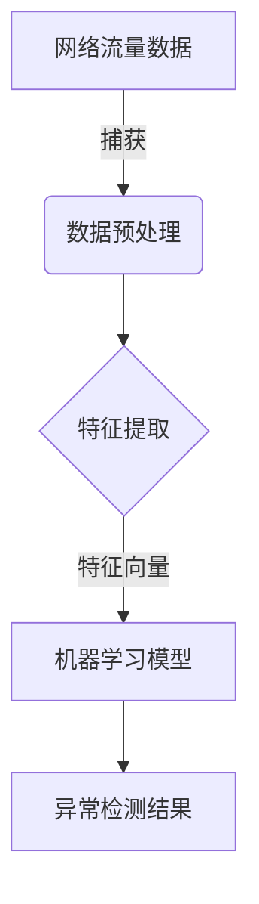

# Python机器学习实战：采用机器学习技术对网络流量进行分析

## 1.背景介绍

### 1.1 网络安全的重要性

在当今互联网时代，网络安全已经成为一个关乎国家安全、社会稳定和个人隐私的重大问题。随着网络攻击手段的不断升级和网络犯罪活动的日益猖獗,有效地检测和防御网络攻击已经成为一项紧迫的任务。传统的基于规则的网络入侵检测系统(NIDS)虽然可以检测已知的攻击模式,但是对于新型攻击手段往往无能为力。因此,需要采用更加智能化的方法来分析网络流量,及时发现异常行为。

### 1.2 机器学习在网络安全中的应用

机器学习作为一种人工智能技术,可以从大量数据中自动发现隐藏的模式和规律,并对新的数据进行预测和决策。近年来,机器学习技术在网络安全领域得到了广泛的应用,特别是在网络入侵检测、恶意软件检测、垃圾邮件过滤等方面取得了卓越的成绩。利用机器学习算法对网络流量进行分析,可以自动学习正常流量和异常流量的特征,从而实现对未知攻击的检测和预警。

### 1.3 Python在机器学习中的作用

Python作为一种简单易学的编程语言,在机器学习和数据科学领域得到了广泛的应用。Python拥有丰富的科学计算库,如NumPy、SciPy、Pandas等,可以高效地处理大量数据。同时,Python还有多个优秀的机器学习库,如Scikit-Learn、TensorFlow、Keras等,提供了各种机器学习算法的实现,极大地降低了机器学习应用的门槛。本文将介绍如何使用Python和相关库对网络流量进行分析,实现基于机器学习的网络入侵检测系统。

## 2.核心概念与联系

### 2.1 网络流量分析概述

网络流量分析是指对网络上传输的数据流进行捕获、处理和分析,以发现潜在的安全威胁或异常行为。网络流量数据通常包括源IP地址、目标IP地址、源端口、目标端口、协议类型、数据包长度等字段。通过对这些字段进行特征提取和模式识别,可以检测出各种网络攻击行为,如扫描、溢出、拒绝服务等。

### 2.2 机器学习在网络流量分析中的应用

机器学习算法可以从大量的网络流量数据中自动学习正常流量和异常流量的模式,从而实现对未知攻击的检测。常用的机器学习算法包括:

- 监督学习算法:
  - 逻辑回归
  - 支持向量机(SVM)
  - 决策树
  - 随机森林
  - 神经网络
- 无监督学习算法:
  - K-means聚类
  - DBSCAN聚类
  - 高斯混合模型(GMM)
  - 隔离森林

这些算法可以根据具体的应用场景和数据特征进行选择和组合,以获得最佳的检测性能。

### 2.3 Python机器学习库介绍

Python拥有多个优秀的机器学习库,为网络流量分析提供了强大的工具支持:

- **Scikit-Learn**:集成了多种监督和无监督学习算法,如逻辑回归、SVM、决策树、聚类算法等,使用简单,文档完善。
- **TensorFlow**:Google开源的端到端机器学习平台,支持构建和训练深度神经网络模型。
- **Keras**:基于TensorFlow的高级神经网络API,使得构建和训练深度学习模型更加简单。
- **PyTorch**:Facebook开源的机器学习库,具有动态计算图和良好的可扩展性。
- **MLxtend**:提供了一些实用的机器学习工具,如特征选择、集成学习等。

利用这些库,我们可以快速构建和部署网络流量分析系统,提高网络安全防护能力。

## 3.核心算法原理具体操作步骤

在网络流量分析中,常用的机器学习算法包括逻辑回归、支持向量机、决策树、随机森林和神经网络等。下面将详细介绍这些算法的原理和具体操作步骤。

### 3.1 逻辑回归

逻辑回归是一种广泛使用的监督学习算法,可以用于二分类问题。在网络流量分析中,我们可以将正常流量标记为0,异常流量标记为1,然后使用逻辑回归模型进行分类。

逻辑回归的核心思想是通过对数据特征进行线性组合,得到一个概率值,该概率值表示数据属于某一类别的可能性。具体步骤如下:

1. 数据预处理:对网络流量数据进行清洗和标准化处理。
2. 特征提取:从原始数据中提取相关特征,如源IP、目标IP、协议类型等,构建特征向量。
3. 训练逻辑回归模型:使用训练数据集训练逻辑回归模型,得到模型参数。
4. 模型评估:使用测试数据集评估模型的性能,计算准确率、精确率、召回率等指标。
5. 模型预测:对新的网络流量数据使用训练好的模型进行预测,判断是否为异常流量。

逻辑回归的优点是算法简单、训练速度快、可解释性强。但是对于线性不可分的数据,逻辑回归的性能会受到影响。

### 3.2 支持向量机(SVM)

支持向量机是一种有监督的机器学习算法,可以用于分类和回归问题。在网络流量分析中,SVM通常被用于异常检测,将正常流量和异常流量分为两类。

SVM的核心思想是在高维空间中找到一个超平面,将不同类别的数据分开,并使得两类数据到超平面的距离最大化。具体步骤如下:

1. 数据预处理:对网络流量数据进行清洗和标准化处理。
2. 特征提取:从原始数据中提取相关特征,构建特征向量。
3. 选择核函数:根据数据的分布情况,选择合适的核函数,如线性核、多项式核、高斯核等。
4. 训练SVM模型:使用训练数据集训练SVM模型,得到模型参数和支持向量。
5. 模型评估:使用测试数据集评估模型的性能,计算准确率、精确率、召回率等指标。
6. 模型预测:对新的网络流量数据使用训练好的模型进行预测,判断是否为异常流量。

SVM的优点是可以有效处理高维数据,并具有良好的泛化能力。但是对于大规模数据集,SVM的训练速度会变慢,需要进行核技巧优化。

### 3.3 决策树

决策树是一种常用的监督学习算法,可以用于分类和回归问题。在网络流量分析中,决策树可以根据网络流量特征构建决策规则,判断流量是否异常。

决策树的构建过程是一个递归的过程,具体步骤如下:

1. 数据预处理:对网络流量数据进行清洗和标准化处理。
2. 特征提取:从原始数据中提取相关特征,构建特征向量。
3. 选择最优特征:根据信息增益或基尼系数等指标,选择最优特征作为决策节点。
4. 生成子节点:根据最优特征的取值,将数据集分割为多个子集。
5. 递归构建子树:对每个子集重复步骤3和4,直到满足停止条件。
6. 模型评估:使用测试数据集评估模型的性能,计算准确率、精确率、召回率等指标。
7. 模型预测:对新的网络流量数据使用训练好的决策树模型进行预测,判断是否为异常流量。

决策树的优点是可解释性强、训练速度快。但是决策树容易过拟合,对于噪声数据敏感,需要进行剪枝等优化措施。

### 3.4 随机森林

随机森林是一种基于集成学习的算法,它通过构建多个决策树,并对它们的结果进行投票或平均,从而得到最终的预测结果。在网络流量分析中,随机森林可以提高异常检测的准确性和鲁棒性。

随机森林的构建过程如下:

1. 数据预处理:对网络流量数据进行清洗和标准化处理。
2. 特征提取:从原始数据中提取相关特征,构建特征向量。
3. 构建决策树集合:
   - 从原始数据集中Bootstrap采样,构建多个子数据集。
   - 对每个子数据集,随机选择一部分特征,构建一个决策树。
4. 模型集成:对所有决策树的预测结果进行投票或平均,得到最终的预测结果。
5. 模型评估:使用测试数据集评估模型的性能,计算准确率、精确率、召回率等指标。
6. 模型预测:对新的网络流量数据使用训练好的随机森林模型进行预测,判断是否为异常流量。

随机森林的优点是能够有效减少过拟合,提高模型的泛化能力。但是随机森林的训练速度相对较慢,需要优化决策树的构建过程。

### 3.5 神经网络

神经网络是一种强大的机器学习模型,可以用于分类、回归、聚类等多种任务。在网络流量分析中,神经网络可以自动从原始数据中学习特征表示,并对异常流量进行检测。

神经网络的构建过程包括以下步骤:

1. 数据预处理:对网络流量数据进行清洗和标准化处理。
2. 构建神经网络模型:确定网络结构,包括输入层、隐藏层和输出层,以及激活函数、损失函数等参数。
3. 训练神经网络:使用训练数据集训练神经网络模型,通过反向传播算法调整网络权重和偏置。
4. 模型评估:使用测试数据集评估模型的性能,计算准确率、精确率、召回率等指标。
5. 模型预测:对新的网络流量数据使用训练好的神经网络模型进行预测,判断是否为异常流量。

神经网络的优点是可以自动学习数据的特征表示,对于复杂的非线性问题有很强的拟合能力。但是神经网络的训练过程较为复杂,需要大量的计算资源,并且存在过拟合的风险。

## 4.数学模型和公式详细讲解举例说明

在网络流量分析中,常用的数学模型和公式包括信息熵、信息增益、基尼系数、逻辑回归模型、支持向量机模型等。下面将详细介绍这些模型和公式的原理及应用。

### 4.1 信息熵和信息增益

信息熵和信息增益是决策树算法中常用的概念,用于选择最优特征进行数据分割。

**信息熵**是度量数据集纯度的一种指标,定义如下:

$$
H(X) = -\sum_{i=1}^{n}p(x_i)\log_2 p(x_i)
$$

其中,n是类别的个数,$p(x_i)$是第i类样本的概率。当数据集中只有一个类别时,信息熵为0;当所有类别均等概率时,信息熵达到最大值。

**信息增益**是特征对数据集纯度增加的贡献,定义如下:

$$
IG(X,a) = H(X) - \sum_{v=1}^{V}\frac{|X_v|}{|X|}H(X_v)
$$

其中,a是特征,V是特征a的取值个数,$X_v$是特征a取值为v的子集,$|X_v|$和$|X|$分别是子集和数据集的大小。选择信息增益最大的特征作为决策节点,可以最大程度地减小数据集的无序程度。

在决策树算法中,我们可以根据信息增益或信息增益比来选择最优特征,构建决策树模型。

### 4.2 基尼