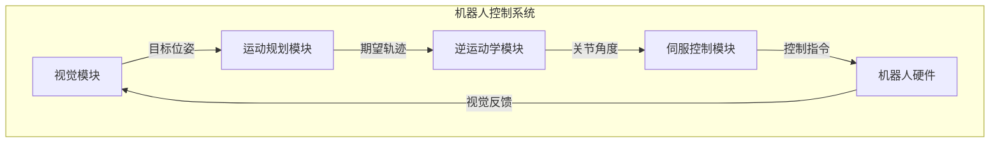

# Robotics and Control Systems 原理与代码实战案例讲解

## 1.背景介绍

机器人技术和控制系统是当前科技领域中最活跃和前沿的研究方向之一。随着人工智能、计算机视觉、传感器技术等相关领域的快速发展,机器人系统的功能不断增强,应用范围也在不断扩大。无论是工业制造、服务业、医疗卫生、国防军事,还是探索外太空,机器人技术都发挥着越来越重要的作用。

机器人技术的核心在于感知环境、规划路径、控制运动等多个环节的高度集成,需要多学科知识的交叉融合。控制理论为机器人提供了精确的运动控制方法,计算机视觉和传感器技术赋予了机器人"眼睛"和"耳朵",人工智能算法则是机器人"大脑"的核心。只有将这些技术有机结合,才能构建出真正智能化的机器人系统。

本文将系统介绍机器人技术和控制系统的核心原理,并结合实战案例,为读者呈现机器人系统的设计、开发和应用的全貌。

## 2.核心概念与联系

机器人技术和控制系统涉及多个核心概念,相互之间存在紧密联系:

### 2.1 机器人本体

机器人本体是指机器人的物理实体,包括机械结构、传动系统、执行器等硬件部分。不同类型的机器人有着不同的机械结构,如串联机器人、并联机器人、柔性机器人等。合理的机械设计是实现机器人高精度运动的基础。

### 2.2 传感器系统

传感器系统为机器人提供了获取环境信息的"眼睛"和"耳朵"。常见的传感器包括视觉传感器(相机)、激光雷达、测距传感器、惯性测量单元等。传感器数据的精确获取和处理对机器人的感知和决策至关重要。

### 2.3 运动控制

运动控制是机器人技术的核心,旨在根据规划的轨迹,精确控制机器人的运动。包括逆运动学求解、运动规划、伺服控制等多个环节。良好的运动控制能够保证机器人的运动精度和稳定性。

### 2.4 计算机视觉

计算机视觉技术赋予了机器人"视觉"能力,使其能够感知和理解三维环境。包括目标检测、三维重建、运动估计等多种视觉任务,为机器人的导航、操作等提供重要支持。

### 2.5 人工智能

人工智能算法是机器人"大脑"的核心,负责机器人的感知、决策、规划等高级功能。包括机器学习、自然语言处理、规划与决策等多种技术,使机器人具备一定的智能化水平。

上述核心概念相互关联、相辅相成,构成了完整的机器人技术体系。只有将这些技术有机融合,才能打造出真正智能化的机器人系统。

## 3.核心算法原理具体操作步骤

机器人技术和控制系统中有多种核心算法,下面将介绍其中几种最为关键的算法原理和具体操作步骤。

### 3.1 逆运动学求解

逆运动学求解是机器人运动控制的基础,旨在根据期望的末端执行器位姿,求解机器人各个关节的角度。对于串联机器人,可以采用数值迭代或解析法求解。

解析法求解步骤:

1) 建立机器人的运动学模型,包括D-H参数、变换矩阵等。
2) 根据末端执行器的期望位姿,列出位置和姿态约束方程。
3) 对约束方程进行符号化简,消去冗余变量。
4) 解析求解各个关节角度的解析表达式。
5) 对求解结果进行可行性检查,剔除不符合约束的解。

数值迭代法求解步骤:

1) 初始化关节角度的初值。
2) 通过正运动学计算当前末端执行器的位姿。
3) 计算当前位姿与期望位姿的误差。
4) 根据误差修正关节角度,如雅可比迭代法。
5) 重复步骤2-4,直至误差收敛到可接受范围。

### 3.2 运动规划

运动规划旨在为机器人生成平滑、无碰撞的运动轨迹,是机器人安全可靠运行的前提。常用的运动规划算法包括采样型规划、插值型规划等。

采样型规划(如RRT、RRT*)步骤:

1) 对机器人的配置空间进行采样,构建随机树状结构。
2) 从起点出发,不断延伸树枝,朝目标点生长。
3) 当树枝延伸到目标点附近时,搜索到可行路径。
4) 对路径进行短程优化,获得更优的轨迹。

插值型规划(如三次多项式插值)步骤:

1) 给定起点、终点及若干路径点的位姿约束。
2) 构造满足约束的三次多项式曲线段。
3) 拼接多个曲线段,生成平滑的插值轨迹。
4) 对轨迹进行速度、加速度规划,满足机器人的运动约束。

### 3.3 视觉伺服控制

视觉伺服控制是将视觉反馈信息引入控制回路,实现基于视觉的闭环控制。可分为位置基视觉伺服(PBVS)和图像基视觉伺服(IBVS)两种方式。

PBVS控制步骤:

1) 通过视觉算法估计目标在相机坐标系下的位姿。
2) 将目标位姿映射到机器人基坐标系下。 
3) 计算当前位姿与期望位姿的位置和姿态误差。
4) 基于误差,计算机器人的速度指令,实现位姿跟踪。

IBVS控制步骤:

1) 提取目标在图像上的特征,如角点等。
2) 计算特征在当前图像和期望图像上的位置误差。
3) 将图像误差映射到机器人空间速度的关系。
4) 基于速度关系,发送速度指令,实现特征跟踪。

上述算法均为机器人技术的核心算法,掌握它们的原理和实现步骤,对于开发机器人系统至关重要。

## 4.数学模型和公式详细讲解举例说明

机器人技术和控制系统中有许多数学模型和公式,下面将对其中几个核心公式进行详细讲解和举例说明。

### 4.1 机器人运动学模型

机器人的运动学模型描述了机器人各个连杆和关节之间的运动关系,是运动控制和路径规划的基础。常用的建模方法是利用 Denavit-Hartenberg(D-H) 表示法。

对于一个n自由度的串联机器人,D-H建模步骤如下:

1) 确定基坐标系 $\{0\}$ 和末端执行器坐标系 $\{n\}$。
2) 为每个连杆确定一个坐标系 $\{i\}$,按照 D-H 约定进行分配。
3) 根据相邻坐标系之间的位移和转角关系,确定 D-H 参数 $\alpha_{i-1}$、$a_{i-1}$、$d_i$、$\theta_i$。
4) 利用 D-H 参数构建每个连杆的齐次变换矩阵 $^{i-1}T_i$:

$$
^{i-1}T_i = \begin{bmatrix} 
\cos\theta_i & -\sin\theta_i\cos\alpha_{i-1} & \sin\theta_i\sin\alpha_{i-1} & a_{i-1}\cos\theta_i\\
\sin\theta_i & \cos\theta_i\cos\alpha_{i-1} & -\cos\theta_i\sin\alpha_{i-1} & a_{i-1}\sin\theta_i\\
0 & \sin\alpha_{i-1} & \cos\alpha_{i-1} & d_i\\
0 & 0 & 0 & 1
\end{bmatrix}
$$

5) 通过连乘各个连杆的变换矩阵,获得从基坐标系到末端执行器的总变换:

$$
^0T_n = ^0T_1 \cdot ^1T_2 \cdots ^{n-1}T_n
$$

$^0T_n$ 即为机器人的运动学模型,描述了末端执行器在基坐标系下的位姿。该模型是求解逆运动学、进行路径规划等的基础。

### 4.2 视觉伺服控制模型

视觉伺服控制是将视觉反馈引入机器人控制回路,实现基于视觉的闭环控制。图像基视觉伺服(IBVS)控制的核心是建立图像特征和机器人运动速度之间的解析关系模型。

设图像特征为 $\mathbf{s} = [x, y, \phi]^T$,表示目标在图像上的坐标 $(x, y)$ 和面积 $\phi$。机器人的空间运动速度为 $\mathbf{v} = [v_x, v_y, v_z, \omega_x, \omega_y, \omega_z]^T$,包括线速度和角速度分量。

根据视觉几何模型,可导出图像特征对机器人速度的解析关系:

$$
\dot{\mathbf{s}} = \mathbf{L}_s \mathbf{v}
$$

其中, $\mathbf{L}_s$ 为图像雅可比矩阵,描述了特征对速度的线性近似。对于上述特征 $\mathbf{s}$,雅可比矩阵为:

$$
\mathbf{L}_s = \begin{bmatrix}
-\frac{1}{Z} & 0 & \frac{x}{Z} & xy & -(1+x^2) & y\\
0 & -\frac{1}{Z} & \frac{y}{Z} & 1+y^2 & -xy & -x\\
0 & 0 & -\frac{1}{Z} & -y & x & 0
\end{bmatrix}
$$

其中, $Z$ 为目标到相机的深度。

基于上述模型,可以将期望的图像特征变化 $\dot{\mathbf{s}}_d$ 映射到所需的机器人速度:

$$
\mathbf{v} = \mathbf{L}_s^{+} \dot{\mathbf{s}}_d
$$

其中, $\mathbf{L}_s^{+}$ 为伪逆矩阵。通过不断发送速度指令 $\mathbf{v}$,可以实现图像特征的闭环跟踪控制。

上述公式和模型揭示了机器人技术中的一些核心数学原理,对于理解和开发机器人系统至关重要。

## 5.项目实践:代码实例和详细解释说明

为了加深对机器人技术的理解,本节将通过一个实战项目案例,结合代码实例,对相关理论知识进行具体的应用和解释说明。

### 5.1 项目概述

本项目旨在开发一个六自由度的串联机器人系统,实现基于视觉的自动装配任务。机器人需要首先通过视觉识别待装配的零件,然后自主规划路径,最终将零件精确装配到目标位置。

该项目集成了机器人运动学建模、逆运动学求解、运动规划、视觉目标识别与跟踪等多项核心技术,是一个较为完整的机器人系统实践案例。

### 5.2 系统架构

整个系统的架构如下所示:

各个模块的功能如下:

- 视觉模块: 基于相机图像,识别目标零件并估计其三维位姿。
- 运动规划模块: 根据目标位姿和机器人当前状态,规划无碰撞的运动轨迹。
- 逆运动学模块: 将规划轨迹转换为机器人各关节的角度序列。
- 伺服控制模块: 根据期望关节角度,发送控制指令驱动机器人运动。
- 机器人硬件: 执行实际的机械运动,并将视觉反馈回传至视觉模