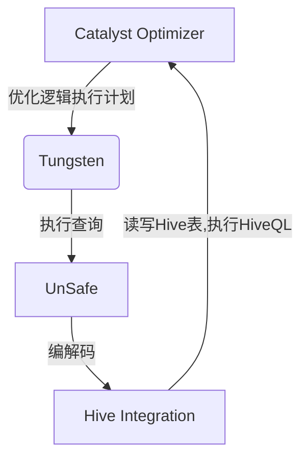
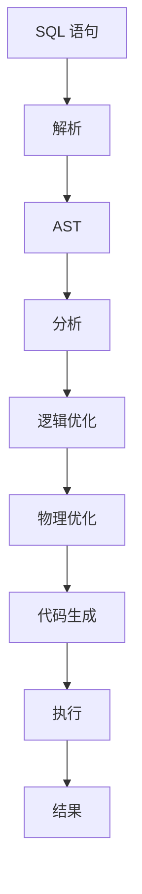

# Spark SQL 原理与代码实例讲解

## 1. 背景介绍

在大数据时代，数据处理和分析成为了一项关键的任务。Apache Spark 作为一个开源的大数据处理框架,凭借其高效的内存计算能力和通用性,已经成为了大数据领域中最受欢迎的技术之一。Spark SQL 作为 Spark 的一个重要模块,为结构化数据处理提供了强大的功能支持。

Spark SQL 不仅支持传统的 SQL 查询,还引入了更高级的分析功能,如数据流处理、机器学习等。它能够高效地处理大规模数据集,并提供了与 Spark 其他模块(如 Spark Streaming、MLlib 等)的无缝集成。无论是交互式数据分析还是批处理作业,Spark SQL 都可以提供出色的性能和易用性。

## 2. 核心概念与联系

### 2.1 Spark SQL 架构

Spark SQL 的架构主要包括以下几个核心组件:

- **Catalyst Optimizer**:  Spark SQL 中的查询优化器,负责优化逻辑执行计划。
- **Tungsten**:  Spark SQL 的执行引擎,提供了内存管理和 CPU 代码生成等性能优化功能。
- **UnSafe**:  Spark SQL 中的编解码器,用于高效地处理各种数据格式。
- **Hive Integration**:  提供了与 Apache Hive 的集成支持,使 Spark SQL 能够读写 Hive 表并执行 HiveQL 查询。

这些组件协同工作,为 Spark SQL 提供了高效的查询处理能力。



### 2.2 DataFrame 和 Dataset

Spark SQL 引入了两个新的编程抽象:DataFrame 和 Dataset,用于替代 Spark 早期版本中的 RDD。

- **DataFrame** 是一种以 `Row` 为单位的分布式数据集合,类似于关系型数据库中的表。它提供了一种高效的数据处理方式,并支持各种操作,如选择、过滤、聚合等。
- **Dataset** 是 DataFrame 的一种类型安全的扩展,它可以直接操作强类型的 Java/Scala 对象,而不需要进行反序列化和序列化操作。

DataFrame 和 Dataset 都支持 Spark SQL 的查询优化和代码生成功能,从而提供了优异的性能表现。

## 3. 核心算法原理具体操作步骤

### 3.1 查询执行流程

Spark SQL 的查询执行流程包括以下几个主要步骤:

1. **解析**:  将 SQL 语句解析为抽象语法树 (AST)。
2. **分析**:  对 AST 进行语义分析,并解析引用的表、视图等元数据。
3. **逻辑优化**:  对逻辑执行计划进行一系列优化,如谓词下推、投影剪裁等。
4. **物理优化**:  根据数据统计信息选择最优的物理执行计划。
5. **代码生成**:  将优化后的物理执行计划转换为可执行代码。
6. **执行**:  在集群上并行执行生成的代码,并返回结果。



### 3.2 Catalyst 优化器

Catalyst 优化器是 Spark SQL 中的查询优化器,它负责优化逻辑执行计划。优化器包括多个规则,这些规则可以应用于逻辑执行计划,以提高查询性能。一些常见的优化规则包括:

- **谓词下推**:  将过滤条件尽可能下推到数据源,以减少需要处理的数据量。
- **投影剪裁**:  只读取查询所需的列,避免不必要的数据读取和传输。
- **常量折叠**:  将常量表达式预先计算,以减少运行时的计算开销。
- **连接重排序**:  根据数据统计信息调整连接顺序,以减少中间结果的大小。

Catalyst 优化器还支持自定义优化规则,开发人员可以根据特定的需求编写自己的优化规则。

### 3.3 Tungsten 执行引擎

Tungsten 是 Spark SQL 的执行引擎,它提供了多种性能优化技术,如内存管理、代码生成等。

- **内存管理**:  Tungsten 使用了高效的内存管理策略,如对象池和字节码缓存,以减少内存分配和垃圾回收的开销。
- **代码生成**:  Tungsten 可以将部分计算转换为高效的本地代码,避免了解释器的开销。
- **缓存友好性**:  Tungsten 采用了缓存友好的数据布局,以提高 CPU 缓存的命中率。

通过这些优化技术,Tungsten 可以显著提高 Spark SQL 的查询执行性能。

## 4. 数学模型和公式详细讲解举例说明

在 Spark SQL 中,一些常见的数学模型和公式包括:

### 4.1 代价模型

Spark SQL 使用代价模型来选择最优的物理执行计划。代价模型基于一些统计信息,如表的大小、列的基数等,来估计每个执行计划的代价。常用的代价模型包括:

- **基于开销的模型**:  估计每个操作的 CPU 和内存开销。
- **基于行数的模型**:  估计每个操作输出的行数。

代价模型的目标是找到一个具有最小代价的执行计划。

假设有一个连接操作,其代价可以用以下公式表示:

$$
Cost(Join) = Cost(Left) + Cost(Right) + Cost(Build) + Cost(Probe) \times Rows(Left) \times Rows(Right)
$$

其中:

- $Cost(Left)$ 和 $Cost(Right)$ 分别表示左右子树的代价。
- $Cost(Build)$ 表示构建连接数据结构的代价。
- $Cost(Probe)$ 表示探测连接数据结构的代价。
- $Rows(Left)$ 和 $Rows(Right)$ 分别表示左右子树的输出行数。

### 4.2 统计估计

为了进行代价估计,Spark SQL 需要收集一些统计信息,如表的大小、列的基数等。这些统计信息可以通过采样或者直接扫描表来获得。

假设有一个表 `T`,其中列 `A` 的基数为 $d_A$,列 `B` 的基数为 $d_B$,则连接键 `(A, B)` 的基数可以估计为:

$$
d_{(A, B)} = d_A \times d_B
$$

这是一种简单的独立性假设,实际情况可能会更复杂。

### 4.3 数据倾斜处理

在处理大规模数据集时,数据倾斜是一个常见的问题。Spark SQL 提供了几种策略来缓解数据倾斜:

- **分区**:  根据连接键或者其他列对数据进行分区,使相关的数据位于同一个分区中。
- **广播连接**:  当一个表足够小时,可以将其广播到每个执行器,避免了洗牌操作。
- **自适应查询执行**:  在运行时动态调整执行计划,以应对数据倾斜。

假设有一个连接操作,其中一个表 `T1` 的大小为 $s_1$,另一个表 `T2` 的大小为 $s_2$,且 $s_1 \ll s_2$。如果采用广播连接策略,则连接的代价可以估计为:

$$
Cost(BroadcastJoin) = Cost(T1) + Cost(T2) + s_2
$$

其中 $s_2$ 表示将 `T1` 广播到每个执行器的开销。

## 5. 项目实践: 代码实例和详细解释说明

在本节中,我们将通过一个实际的项目示例来演示如何使用 Spark SQL 进行数据处理和分析。

### 5.1 项目背景

假设我们有一个电子商务网站,需要分析用户的购买行为。我们有两个数据集:

- `users.csv`:  包含用户信息,如用户 ID、年龄、性别等。
- `orders.csv`:  包含订单信息,如订单 ID、用户 ID、订单金额等。

我们需要回答以下几个问题:

1. 每个年龄段的用户数量是多少?
2. 每个性别的平均订单金额是多少?
3. 哪些用户的订单金额超过 1000 元?

### 5.2 环境准备

首先,我们需要启动 Spark 环境,并创建 SparkSession 对象:

```scala
import org.apache.spark.sql.SparkSession

val spark = SparkSession.builder()
  .appName("SparkSQLExample")
  .getOrCreate()
```

### 5.3 数据加载

接下来,我们加载 CSV 数据集:

```scala
val usersDF = spark.read.option("header", "true").csv("users.csv")
val ordersDF = spark.read.option("header", "true").csv("orders.csv")
```

### 5.4 数据处理

现在,我们可以使用 Spark SQL 来处理和分析数据。

#### 5.4.1 每个年龄段的用户数量

```scala
val ageGroupsDF = usersDF
  .select($"age")
  .groupBy(floor($"age" / 10) * 10 as "age_group")
  .agg(count("*") as "count")
  .orderBy($"age_group")

ageGroupsDF.show()
```

在这个示例中,我们首先从 `usersDF` 中选择 `age` 列,然后按照年龄段 (每 10 岁为一个组) 进行分组。接着,我们使用 `agg` 函数计算每个组的用户数量,并按年龄段排序。

#### 5.4.2 每个性别的平均订单金额

```scala
val avgOrderAmountByGender = ordersDF
  .join(usersDF, $"orders.user_id" === $"users.user_id")
  .groupBy($"users.gender")
  .agg(avg($"orders.order_amount") as "avg_order_amount")

avgOrderAmountByGender.show()
```

在这个示例中,我们首先将 `ordersDF` 和 `usersDF` 按照 `user_id` 列进行连接,以获取每个订单对应的用户性别信息。然后,我们按照性别进行分组,并使用 `agg` 函数计算每个组的平均订单金额。

#### 5.4.3 订单金额超过 1000 元的用户

```scala
val highValueCustomers = ordersDF
  .groupBy($"user_id")
  .agg(sum($"order_amount") as "total_order_amount")
  .filter($"total_order_amount" > 1000)
  .join(usersDF, $"user_id")
  .select($"users.user_id", $"users.name", $"total_order_amount")

highValueCustomers.show()
```

在这个示例中,我们首先按照 `user_id` 进行分组,并计算每个用户的总订单金额。接着,我们使用 `filter` 函数过滤出总订单金额超过 1000 元的用户。最后,我们将过滤后的结果与 `usersDF` 进行连接,以获取用户的详细信息。

### 5.5 结果输出

我们可以将结果输出到文件或者控制台:

```scala
// 输出到文件
ageGroupsDF.write.mode("overwrite").csv("age_groups.csv")

// 输出到控制台
highValueCustomers.show()
```

通过这个示例,我们可以看到如何使用 Spark SQL 进行数据处理和分析。Spark SQL 提供了丰富的 API,可以方便地进行各种数据操作,如选择、过滤、聚合等。

## 6. 实际应用场景

Spark SQL 在实际应用中有着广泛的用途,包括但不限于以下几个场景:

### 6.1 交互式数据分析

Spark SQL 提供了一个交互式 SQL 界面,用户可以直接输入 SQL 查询,并获取结果。这种交互式分析模式非常适合于数据探索和快速原型开发。

### 6.2 批处理作业

Spark SQL 也可以用于批处理作业,例如定期执行 ETL (提取、转换、加载) 任务或者生成报告。由于 Spark SQL 的高性能和容错能力,它可以高效地处理大规模数据集。

### 6