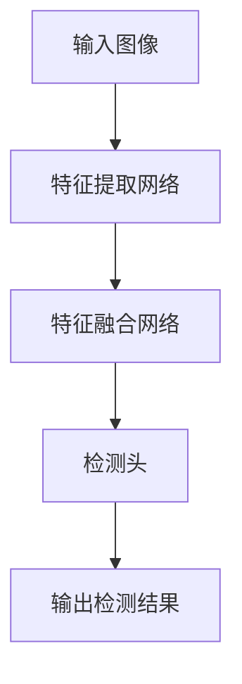

# YOLOv8原理与代码实例讲解

## 1.背景介绍

在计算机视觉领域，目标检测一直是一个重要的研究方向。目标检测不仅需要识别图像中的物体，还需要确定物体的位置。YOLO（You Only Look Once）系列算法自问世以来，以其高效的实时性能和较高的检测精度，迅速成为目标检测领域的主流方法之一。YOLOv8作为YOLO系列的最新版本，进一步提升了检测性能和速度。本文将深入探讨YOLOv8的原理、算法、数学模型、代码实例及其实际应用。

## 2.核心概念与联系

### 2.1 YOLO系列概述

YOLO系列算法的核心思想是将目标检测问题转化为回归问题，通过单次前向传播即可完成目标检测。YOLOv8在前几代的基础上，进一步优化了网络结构和损失函数，提高了检测精度和速度。

### 2.2 YOLOv8的创新点

YOLOv8引入了新的特征提取网络和更高效的损失函数，同时在数据增强和训练策略上也进行了改进。这些创新点使得YOLOv8在保持高效的同时，进一步提升了检测精度。

### 2.3 主要组件

YOLOv8的主要组件包括：
- 特征提取网络（Backbone）
- 特征融合网络（Neck）
- 检测头（Head）

这些组件共同作用，实现了高效的目标检测。

## 3.核心算法原理具体操作步骤

### 3.1 特征提取网络

特征提取网络负责从输入图像中提取多尺度的特征。YOLOv8采用了一种新的特征提取网络，结合了残差网络（ResNet）和注意力机制，能够更好地捕捉图像中的细节信息。

### 3.2 特征融合网络

特征融合网络将不同尺度的特征进行融合，以便更好地进行目标检测。YOLOv8采用了FPN（Feature Pyramid Network）和PAN（Path Aggregation Network）相结合的方式，实现了高效的特征融合。

### 3.3 检测头

检测头负责生成最终的检测结果，包括目标的类别和位置。YOLOv8的检测头采用了多尺度预测的方式，能够更好地处理不同大小的目标。

### 3.4 损失函数

YOLOv8的损失函数综合考虑了分类损失、定位损失和置信度损失，通过加权求和的方式进行优化。



## 4.数学模型和公式详细讲解举例说明

### 4.1 回归问题的定义

YOLOv8将目标检测问题转化为回归问题，通过预测每个网格单元的类别概率和边界框参数来实现目标检测。

### 4.2 损失函数

YOLOv8的损失函数由三部分组成：
- 分类损失：用于衡量预测类别与真实类别之间的差异。
- 定位损失：用于衡量预测边界框与真实边界框之间的差异。
- 置信度损失：用于衡量预测置信度与真实置信度之间的差异。

$$
L = L_{cls} + L_{loc} + L_{conf}
$$

其中，$L_{cls}$ 是分类损失，$L_{loc}$ 是定位损失，$L_{conf}$ 是置信度损失。

### 4.3 边界框回归

边界框回归的目标是预测目标的中心坐标 $(x, y)$、宽度 $w$ 和高度 $h$。YOLOv8采用如下公式进行边界框回归：

$$
t_x = \sigma(x) + c_x
$$
$$
t_y = \sigma(y) + c_y
$$
$$
t_w = p_w e^{w}
$$
$$
t_h = p_h e^{h}
$$

其中，$t_x$ 和 $t_y$ 是预测的中心坐标，$t_w$ 和 $t_h$ 是预测的宽度和高度，$\sigma$ 是 sigmoid 函数，$c_x$ 和 $c_y$ 是网格单元的偏移量，$p_w$ 和 $p_h$ 是锚框的宽度和高度。

## 5.项目实践：代码实例和详细解释说明

### 5.1 环境配置

首先，确保你的环境中安装了必要的库，如 PyTorch、OpenCV 等。

```bash
pip install torch torchvision opencv-python
```

### 5.2 数据准备

准备训练数据集，包括图像和对应的标注文件。标注文件通常采用 COCO 格式或 Pascal VOC 格式。

### 5.3 模型定义

定义 YOLOv8 的模型结构，包括特征提取网络、特征融合网络和检测头。

```python
import torch
import torch.nn as nn

class YOLOv8(nn.Module):
    def __init__(self):
        super(YOLOv8, self).__init__()
        # 定义特征提取网络
        self.backbone = ...
        # 定义特征融合网络
        self.neck = ...
        # 定义检测头
        self.head = ...

    def forward(self, x):
        x = self.backbone(x)
        x = self.neck(x)
        x = self.head(x)
        return x
```

### 5.4 训练模型

定义损失函数和优化器，进行模型训练。

```python
model = YOLOv8()
criterion = ...
optimizer = torch.optim.Adam(model.parameters(), lr=0.001)

for epoch in range(num_epochs):
    for images, targets in dataloader:
        outputs = model(images)
        loss = criterion(outputs, targets)
        optimizer.zero_grad()
        loss.backward()
        optimizer.step()
```

### 5.5 模型评估

使用验证集评估模型性能，计算 mAP（mean Average Precision）等指标。

```python
model.eval()
with torch.no_grad():
    for images, targets in val_dataloader:
        outputs = model(images)
        # 计算 mAP 等指标
```

## 6.实际应用场景

### 6.1 安全监控

YOLOv8 可以用于实时监控视频流，检测异常行为和可疑物体，提高安全性。

### 6.2 自动驾驶

在自动驾驶领域，YOLOv8 可以用于检测道路上的行人、车辆和交通标志，辅助决策系统。

### 6.3 医疗影像分析

YOLOv8 可以用于医疗影像分析，如检测病变区域和标记感兴趣区域，辅助医生诊断。

### 6.4 智能零售

在智能零售领域，YOLOv8 可以用于商品识别和库存管理，提高运营效率。

## 7.工具和资源推荐

### 7.1 开源项目

- [YOLOv8 GitHub 仓库](https://github.com/ultralytics/yolov8)
- [COCO 数据集](http://cocodataset.org/)

### 7.2 学习资源

- [PyTorch 官方文档](https://pytorch.org/docs/)
- [深度学习课程](https://www.coursera.org/learn/deep-learning)

### 7.3 实用工具

- [LabelImg](https://github.com/tzutalin/labelImg)：图像标注工具
- [OpenCV](https://opencv.org/)：计算机视觉库

## 8.总结：未来发展趋势与挑战

YOLOv8 作为 YOLO 系列的最新版本，在目标检测领域取得了显著的进展。然而，随着应用场景的不断扩展，YOLOv8 也面临着一些挑战，如处理复杂场景中的小目标检测、提高模型的鲁棒性和泛化能力等。未来，随着深度学习技术的不断发展，YOLO 系列算法有望在更多领域中发挥重要作用。

## 9.附录：常见问题与解答

### 9.1 YOLOv8 与 YOLOv7 的主要区别是什么？

YOLOv8 在特征提取网络、特征融合网络和损失函数上进行了改进，进一步提升了检测精度和速度。

### 9.2 如何选择合适的锚框？

锚框的选择可以通过聚类算法（如 k-means）在训练数据上进行优化，以适应不同的数据集和应用场景。

### 9.3 如何处理小目标检测问题？

可以通过多尺度特征融合和数据增强等方法，提高小目标的检测精度。

### 9.4 YOLOv8 是否支持多类别检测？

是的，YOLOv8 支持多类别检测，可以同时检测多个类别的目标。

### 9.5 如何提高 YOLOv8 的检测速度？

可以通过模型剪枝、量化和优化推理引擎等方法，提高 YOLOv8 的检测速度。

---

作者：禅与计算机程序设计艺术 / Zen and the Art of Computer Programming