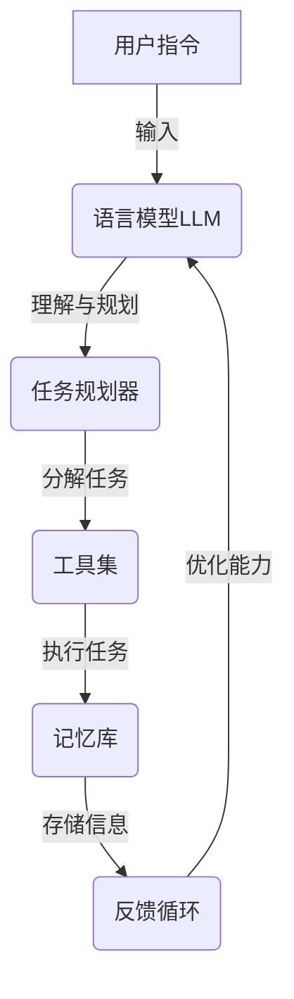

# 【大模型应用开发 动手做AI Agent】AutoGPT简介

## 1.背景介绍

在过去几年中,大型语言模型(LLM)在自然语言处理(NLP)领域取得了令人瞩目的进展。从GPT-3到ChatGPT,这些模型展示了惊人的文本生成能力,为人工智能(AI)代理的发展开辟了新的可能性。AutoGPT是一个开源的人工智能代理框架,旨在利用LLM的强大功能,为用户提供一个智能、自主和通用的AI助手。

### 1.1 人工智能代理的兴起

人工智能代理是一种能够根据用户的指令或需求执行各种任务的智能系统。随着计算能力的不断提高和算法的进步,AI代理已经渗透到我们生活的方方面面,如智能助手(Siri、Alexa)、聊天机器人、自动化工作流程等。然而,传统的AI代理通常是专门为特定任务而设计的,缺乏通用性和自主性。

### 1.2 大型语言模型的突破

近年来,大型语言模型(LLM)的出现为AI代理的发展带来了新的契机。LLM是一种基于海量文本数据训练的深度神经网络模型,能够生成看似人类写作的自然语言文本。这些模型不仅具有强大的语言理解和生成能力,而且可以应用于各种自然语言处理任务,如问答、摘要、翻译等。

GPT-3是OpenAI推出的一款里程碑式的LLM,它拥有1750亿个参数,在各种基准测试中表现出色。随后,OpenAI又推出了更强大的GPT-4模型。而ChatGPT则是一款基于GPT-3.5训练的对话式AI助手,它能够以人类的方式进行自然对话,回答各种问题,并执行一些简单的任务。ChatGPT的出现引发了人们对通用AI助手的浓厚兴趣。

### 1.3 AutoGPT的诞生

AutoGPT是一个基于LLM的开源AI代理框架,由Anthropic公司的研究人员开发。它旨在利用LLM的强大能力,创建一个自主、通用和持续学习的AI助手。AutoGPT能够根据用户的指令执行各种任务,如网页浏览、数据分析、编程等,并通过不断学习和交互来提高自己的能力。

AutoGPT的核心思想是让AI代理自主地规划和执行任务,而不是被动地等待指令。它可以根据用户的需求,自主分解任务、搜索相关信息、执行操作,并将结果呈现给用户。与传统的AI助手相比,AutoGPT具有更强的通用性和自主性,能够适应不同的任务场景。

## 2.核心概念与联系

### 2.1 自主智能代理

自主智能代理(Autonomous Intelligent Agent)是AutoGPT的核心概念。它是一种能够感知环境、规划行动并执行任务的智能系统,具有自主性和主动性。AutoGPT的自主智能代理由以下几个关键组件构成:

1. **语言模型(LLM)**: 作为代理的大脑,负责理解用户的指令、生成响应文本和规划任务。
2. **任务规划器**: 根据用户的需求,将复杂任务分解为一系列可执行的子任务。
3. **工具集**: 一组用于执行各种任务的工具,如网页浏览器、代码编辑器、数据分析工具等。
4. **记忆库**: 存储代理在执行任务过程中获取的信息和知识。
5. **反馈循环**: 代理根据任务执行的结果和用户的反馈,不断优化自身的能力。

这些组件协同工作,使得AutoGPT能够自主地规划和执行各种任务,并通过持续学习来提高自身的能力。

### 2.2 通用性与可扩展性

AutoGPT的另一个核心理念是通用性和可扩展性。传统的AI助手通常是为特定任务而设计的,缺乏通用性。而AutoGPT则旨在创建一个能够执行各种任务的通用AI代理。

通过集成不同的工具和API,AutoGPT可以执行多种任务,如网页浏览、数据分析、编程、文本生成等。同时,它还可以根据需求不断扩展新的功能,只需集成新的工具或API即可。这种模块化设计使得AutoGPT具有很强的可扩展性和灵活性。

### 2.3 持续学习

持续学习是AutoGPT的另一个关键特性。在执行任务的过程中,AutoGPT会不断获取新的知识和经验,并将它们存储在记忆库中。通过反馈循环,代理可以根据任务执行的结果和用户的反馈,不断优化自身的能力。

这种持续学习的机制使得AutoGPT能够随着时间的推移而变得越来越智能,适应不同的任务场景。同时,它也为AI代理的长期发展奠定了基础,有望最终实现通用人工智能(AGI)的目标。

## 3.核心算法原理具体操作步骤

AutoGPT的核心算法原理包括以下几个关键步骤:

1. **任务分解**
2. **信息搜索与获取**
3. **任务执行**
4. **结果评估与反馈**
5. **持续优化**

### 3.1 任务分解

当用户输入一个任务指令时,AutoGPT首先需要将这个复杂的任务分解为一系列可执行的子任务。这个过程由任务规划器完成,它利用语言模型(LLM)的理解能力和规划能力,将原始任务分解为一个有序的子任务序列。

例如,如果用户的任务是"分析某个公司的财务数据,并给出投资建议",任务规划器可能会将其分解为以下子任务:

1. 搜索并获取该公司的财务报表
2. 清理和预处理财务数据
3. 进行财务指标计算和分析
4. 根据分析结果给出投资建议
5. 将结果整理成报告并呈现给用户

通过这种分解,复杂的任务被转化为一系列较小的可执行步骤,从而降低了任务的难度。

### 3.2 信息搜索与获取

在执行任务的过程中,AutoGPT可能需要搜索和获取相关的信息。这个过程由语言模型(LLM)和工具集协同完成。

LLM根据当前的任务和上下文信息,生成相关的搜索查询。然后,工具集中的网页浏览器或搜索API会执行这些查询,从互联网或其他数据源获取相关信息。获取的信息会被存储在记忆库中,供后续的任务执行使用。

例如,在上述财务分析任务中,AutoGPT可能会搜索并获取该公司的年度财务报告、行业分析报告等相关信息。

### 3.3 任务执行

获取了必要的信息后,AutoGPT就可以执行具体的任务步骤了。这个过程由工具集中的各种工具完成,如文本编辑器、代码编辑器、数据分析工具等。

LLM会根据当前的任务和上下文信息,生成相应的指令,指导工具的使用。工具执行相应的操作,如编写代码、分析数据、生成文本等。执行的结果会被存储在记忆库中,供后续步骤使用。

在财务分析任务中,AutoGPT可能会使用数据分析工具对财务数据进行清理和计算,使用文本编辑器撰写投资建议报告等。

### 3.4 结果评估与反馈

任务执行完成后,AutoGPT需要评估执行的结果是否满足用户的需求。这个过程由语言模型(LLM)和反馈循环完成。

LLM会根据任务的原始目标和执行的结果,对结果进行评估和打分。如果结果不理想,反馈循环会根据评估结果,对任务规划、信息获取或工具使用等环节进行优化,以期在下一次执行同类任务时获得更好的结果。

用户也可以直接对结果进行反馈,AutoGPT会根据用户的反馈进行相应的优化。

在财务分析任务中,如果AutoGPT生成的投资建议报告不够全面或准确,它会根据评估结果和用户反馈,优化相关的分析流程和模型,以提高下次执行类似任务的质量。

### 3.5 持续优化

通过不断执行任务、评估结果并获取反馈,AutoGPT会逐步优化自身的能力,实现持续学习。这个过程由反馈循环和语言模型(LLM)共同完成。

反馈循环会根据任务执行的结果和用户反馈,对任务规划、信息获取、工具使用等各个环节进行优化,不断改进AutoGPT的决策和操作。同时,LLM也会根据获取的新知识和经验,持续调整和优化自身的语言理解和生成能力。

随着时间的推移,AutoGPT会变得越来越熟练于执行各种任务,其决策和操作也会变得越来越精准和高效。这种持续优化的机制为AutoGPT的长期发展奠定了基础。

## 4.数学模型和公式详细讲解举例说明

在AutoGPT的核心算法中,数学模型和公式发挥着重要作用,尤其是在语言模型(LLM)和反馈循环等关键组件中。

### 4.1 语言模型(LLM)

AutoGPT使用的语言模型(LLM)通常是基于Transformer架构的深度神经网络模型,如GPT-3、GPT-4等。这些模型的核心是自注意力(Self-Attention)机制,它能够捕捉输入序列中任意两个位置之间的依赖关系。

自注意力机制可以用以下公式表示:

$$
\text{Attention}(Q, K, V) = \text{softmax}\left(\frac{QK^T}{\sqrt{d_k}}\right)V
$$

其中:

- $Q$是查询(Query)向量
- $K$是键(Key)向量
- $V$是值(Value)向量
- $d_k$是缩放因子,用于防止点积过大导致梯度消失

通过计算查询向量与所有键向量的点积,并对结果进行软最大值归一化,我们可以获得一个注意力分数向量。然后,将这个注意力分数向量与值向量相乘,就可以得到加权后的值向量,作为自注意力的输出。

在Transformer模型中,自注意力机制被应用于编码器和解码器的多头注意力层,从而捕捉输入序列中的长程依赖关系。这种机制使得LLM能够理解和生成coherent和context-aware的自然语言文本。

### 4.2 反馈循环

在AutoGPT的反馈循环中,数学模型和公式也扮演着重要角色。反馈循环需要对任务执行的结果进行评估和打分,以确定是否需要优化。

一种常见的评估方法是使用回归模型,将任务结果映射到一个连续的分数空间。例如,在文本生成任务中,我们可以使用BLEU(Bilingual Evaluation Understudy)分数或ROUGE(Recall-Oriented Understudy for Gisting Evaluation)分数来评估生成文本的质量。

BLEU分数是基于n-gram精确度的指标,它衡量了候选翻译(或生成文本)与参考翻译(或人工文本)之间的相似度。BLEU分数的计算公式如下:

$$
\text{BLEU} = BP \cdot \exp\left(\sum_{n=1}^N w_n \log p_n\right)
$$

其中:

- $BP$是brevity penalty,用于惩罚过短的翻译
- $N$是最大的n-gram长度
- $w_n$是n-gram长度的权重
- $p_n$是n-gram的精确度

ROUGE分数则是基于n-gram重叠率的指标,它衡量了候选摘要(或生成文本)与参考摘要(或人工文本)之间的相似度。ROUGE-N分数的计算公式如下:

$$
\text{ROUGE-N} = \frac{\sum_{\text{gram}_n \in \