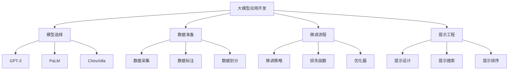

# 【大模型应用开发 动手做AI Agent】显示响应

## 1.背景介绍

随着人工智能技术的不断发展,大型语言模型(Large Language Model,LLM)在近年来取得了长足的进步。这些模型通过在海量文本数据上进行预训练,掌握了丰富的自然语言知识,展现出惊人的生成能力和理解能力。其中,OpenAI推出的GPT-3、谷歌的PaLM、OpenAI的InstructGPT、DeepMind的Chinchilla等大模型,都在各自的领域取得了突破性的成就。

大模型的强大能力为人工智能应用开发带来了新的机遇。通过对大模型进行微调(fine-tuning)和提示学习(Prompting),我们可以开发出各种智能应用程序,如对话系统、问答系统、文本生成、代码生成等。这些应用被称为AI Agent,能够根据用户的指令执行各种任务。

本文将重点探讨如何开发基于大模型的AI Agent,包括模型选择、数据准备、微调流程、提示工程等关键环节。我们将通过实践案例,手把手地教会读者如何构建自己的AI Agent,并分享相关的最佳实践和技巧。

## 2.核心概念与联系

### 2.1 大型语言模型(LLM)

大型语言模型是一种基于自然语言处理(NLP)技术的深度学习模型。它们通过在海量文本数据上进行无监督预训练,学习自然语言的统计规律和语义知识。常见的大型语言模型包括:

1. **GPT-3(Generative Pre-trained Transformer 3)**: 由OpenAI开发,是目前最大的语言模型之一,具有1750亿个参数。它展现出了强大的文本生成和理解能力,可以执行各种NLP任务。

2. **PaLM(Pathways Language Model)**: 由谷歌开发,是一种大规模的编码解码语言模型,具有5400亿个参数。它在多项NLP基准测试中表现出色,尤其擅长多任务和多模态学习。

3. **Chinchilla**: 由DeepMind开发,是一种大型对话式语言模型,具有7000亿个参数。它在开放域对话、问答等任务上表现优异,并且在计算效率和环境影响方面做出了优化。

这些大型语言模型通过预训练获得了丰富的自然语言知识,为后续的微调和提示学习奠定了基础。

### 2.2 微调(Fine-tuning)

微调是一种将预训练模型进一步训练以适应特定任务的方法。在微调过程中,我们将预训练模型的部分或全部参数进行调整,使其在目标任务上表现更好。

微调通常需要准备一个与目标任务相关的数据集,并根据任务类型设计合适的损失函数和优化策略。通过在特定数据集上进行训练,模型可以学习到与任务相关的知识和模式,从而提高在该任务上的表现。

### 2.3 提示工程(Prompting)

提示工程是一种通过设计合适的提示(Prompt)来指导大型语言模型完成特定任务的方法。提示是一段自然语言文本,用于向模型描述期望的输出或行为。

提示工程的关键在于设计高质量的提示,以最大限度地利用模型的能力。一个好的提示应该清晰地表达任务要求,并为模型提供足够的上下文信息。提示工程涉及多个方面,如提示设计、提示搜索和提示排序等。

通过提示工程,我们可以避免对大型语言模型进行昂贵的微调,从而节省计算资源和时间。同时,提示工程也为开发各种AI Agent应用提供了灵活性和可扩展性。

### 2.4 AI Agent

AI Agent是指基于大型语言模型开发的智能应用程序。它们能够根据用户的指令执行各种任务,如对话、问答、文本生成、代码生成等。AI Agent的核心是利用微调或提示工程等技术,将大型语言模型的能力应用到特定领域。

AI Agent可以广泛应用于多个领域,如客户服务、教育、医疗、金融等。它们为人工智能应用的开发和部署带来了新的机遇和挑战。

## 3.核心算法原理具体操作步骤

开发基于大模型的AI Agent主要涉及以下几个关键步骤:

### 3.1 模型选择

首先,我们需要选择一个合适的大型语言模型作为基础。模型的选择需要考虑多个因素,如模型大小、预训练数据、计算资源等。通常,较大的模型具有更强的性能,但也需要更多的计算资源。

常见的模型选择包括GPT-3、PaLM、Chinchilla等。我们可以根据具体应用场景和资源情况进行权衡。例如,对于开放域对话任务,Chinchilla可能是一个不错的选择;而对于需要处理多模态数据的任务,PaLM则更加适合。

### 3.2 数据准备

无论是采用微调还是提示工程,我们都需要准备高质量的数据集。数据准备过程包括以下几个步骤:

1. **数据采集**: 从各种来源收集与目标任务相关的数据,如网页、文档、对话记录等。

2. **数据标注**: 对采集的数据进行人工标注或自动标注,为模型提供监督信号。标注内容取决于具体任务,如对话系统需要标注响应,问答系统需要标注答案等。

3. **数据划分**: 将标注好的数据划分为训练集、验证集和测试集,用于模型训练、调参和评估。

4. **数据预处理**: 对数据进行必要的预处理,如去重、清洗、格式化等,以确保数据质量。

数据质量对模型性能有着重要影响。因此,我们需要投入足够的精力来准备高质量的数据集。

### 3.3 微调流程

如果选择采用微调的方式,我们需要遵循以下流程:

1. **设置微调参数**: 确定需要微调的模型层数、学习率、批大小等超参数。

2. **设计损失函数**: 根据任务类型设计合适的损失函数,如交叉熵损失函数、序列到序列损失函数等。

3. **选择优化器**: 选择合适的优化器,如AdamW、SGD等,用于更新模型参数。

4. **训练模型**: 在准备好的数据集上进行模型训练,并使用验证集进行模型评估和调参。

5. **模型评估**: 在测试集上评估微调后模型的性能,并与基线模型进行对比。

6. **模型部署**: 将微调好的模型部署到生产环境中,供AI Agent应用使用。

微调流程需要一定的计算资源和时间成本。因此,我们需要根据具体情况权衡微调的收益和代价。

### 3.4 提示工程流程

如果选择采用提示工程的方式,我们需要遵循以下流程:

1. **提示设计**: 设计高质量的提示,清晰地表达任务要求和上下文信息。提示设计需要结合任务特点和模型特性,通常需要反复试验和调整。

2. **提示搜索**: 通过搜索算法或人工方式,探索不同的提示变体,以找到最优的提示。

3. **提示排序**: 对搜索到的提示进行排序,选择性能最佳的提示用于模型推理。

4. **模型推理**: 使用选定的提示,让大型语言模型生成所需的输出,如对话响应、文本生成等。

5. **输出后处理**: 对模型生成的输出进行必要的后处理,如去重、过滤、格式化等,以满足应用需求。

6. **模型部署**: 将提示工程流程集成到AI Agent应用中,供用户使用。

提示工程流程相对于微调更加灵活和高效,但也需要更多的人工努力来设计和优化提示。在实践中,我们可以根据具体情况选择微调或提示工程,或者两者结合使用。

## 4.数学模型和公式详细讲解举例说明

大型语言模型通常采用自注意力机制(Self-Attention)和Transformer架构,其核心数学模型是多头自注意力(Multi-Head Attention)和前馈神经网络(Feed-Forward Neural Network)。

### 4.1 缩放点积注意力(Scaled Dot-Product Attention)

缩放点积注意力是自注意力机制的基础,它计算查询(Query)和键(Key)之间的相关性,并根据相关性分配值(Value)的权重。其数学表达式如下:

$$\text{Attention}(Q, K, V) = \text{softmax}\left(\frac{QK^T}{\sqrt{d_k}}\right)V$$

其中:

- $Q$ 表示查询矩阵(Query Matrix)
- $K$ 表示键矩阵(Key Matrix)
- $V$ 表示值矩阵(Value Matrix)
- $d_k$ 是缩放因子,通常取键的维度的平方根

缩放点积注意力首先计算查询和键之间的点积,然后除以缩放因子$\sqrt{d_k}$,以防止梯度过大或过小。接着,对点积结果应用softmax函数,得到注意力分数。最后,将注意力分数与值矩阵相乘,得到加权后的值向量。

### 4.2 多头自注意力(Multi-Head Attention)

多头自注意力是将多个缩放点积注意力的结果进行拼接,以捕获不同子空间的特征。其数学表达式如下:

$$\text{MultiHead}(Q, K, V) = \text{Concat}(\text{head}_1, \dots, \text{head}_h)W^O$$
$$\text{where } \text{head}_i = \text{Attention}(QW_i^Q, KW_i^K, VW_i^V)$$

其中:

- $h$ 表示头数(Number of Heads)
- $W_i^Q \in \mathbb{R}^{d_\text{model} \times d_k}$、$W_i^K \in \mathbb{R}^{d_\text{model} \times d_k}$、$W_i^V \in \mathbb{R}^{d_\text{model} \times d_v}$ 分别表示查询、键和值的线性映射矩阵
- $W^O \in \mathbb{R}^{hd_v \times d_\text{model}}$ 是最终的线性映射矩阵

多头自注意力首先将查询、键和值分别通过线性映射分解为多个子空间,然后在每个子空间上计算缩放点积注意力。最后,将所有子空间的注意力结果拼接起来,并通过一个线性映射得到最终的输出向量。

### 4.3 前馈神经网络(Feed-Forward Neural Network)

前馈神经网络是Transformer架构中的另一个重要组件,它对每个位置的输出向量进行独立的非线性映射。其数学表达式如下:

$$\text{FFN}(x) = \max(0, xW_1 + b_1)W_2 + b_2$$

其中:

- $W_1 \in \mathbb{R}^{d_\text{model} \times d_\text{ff}}$、$W_2 \in \mathbb{R}^{d_\text{ff} \times d_\text{model}}$ 分别表示前馈神经网络的第一层和第二层的权重矩阵
- $b_1 \in \mathbb{R}^{d_\text{ff}}$、$b_2 \in \mathbb{R}^{d_\text{model}}$ 分别表示第一层和第二层的偏置向量
- $d_\text{ff}$ 是前馈神经网络的隐藏层维度

前馈神经网络首先将输入向量与权重矩阵$W_1$相乘,并加上偏置$b_1$。然后,对结果应用ReLU激活函数,实现非线性映射。最后,将激活后的向量与权重矩阵$W_2$相乘,并加上偏置$b_2$,得到