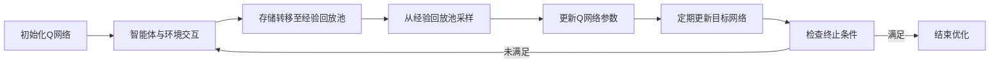

## 1. 背景介绍

在深度学习的领域中，强化学习已经成为了一个非常热门的研究方向。特别是深度Q网络（Deep Q-Network, DQN）的提出，它将深度学习与强化学习结合起来，成功地解决了许多复杂的决策问题。然而，随着模型复杂度的增加，过拟合成为了一个不可忽视的问题。本文将深入探讨DQN及其正则化技术，以及如何通过这些技术来防止过拟合，确保模型的泛化能力。

## 2. 核心概念与联系

在深入讨论DQN和正则化技术之前，我们需要明确几个核心概念及它们之间的联系：

- **强化学习（Reinforcement Learning, RL）**：一种学习方法，智能体通过与环境交互，从而学习如何在特定环境中做出最优决策。
- **Q学习（Q-Learning）**：一种无模型的强化学习算法，通过学习动作价值函数Q来寻找最优策略。
- **深度学习（Deep Learning）**：一种通过多层神经网络来学习数据表示的算法。
- **DQN**：结合了深度学习和Q学习的算法，使用深度神经网络来近似Q函数。
- **过拟合（Overfitting）**：模型在训练数据上表现良好，但在未见过的数据上表现不佳的现象。
- **正则化（Regularization）**：一系列技术的总称，旨在减少模型的过拟合，提高模型的泛化能力。

这些概念之间的联系是：DQN作为一种算法框架，结合了深度学习的表征能力和Q学习的决策能力，但在实际应用中可能会遇到过拟合问题。正则化技术则是解决这一问题的关键。

## 3. 核心算法原理具体操作步骤

DQN的核心算法原理可以分为以下几个步骤：

1. **初始化**：随机初始化Q网络的参数。
2. **经验回放**：智能体在环境中执行动作，并将转移（状态、动作、奖励、新状态）存储在经验回放池中。
3. **采样与学习**：从经验回放池中随机采样一批转移，利用这些转移来更新Q网络的参数。
4. **目标网络**：引入目标网络，定期从Q网络复制参数到目标网络，以稳定学习过程。
5. **迭代优化**：重复执行上述步骤，直到满足某些终止条件。



## 4. 数学模型和公式详细讲解举例说明

DQN的核心是通过最小化以下损失函数来更新Q网络的参数：

$$
L(\theta) = \mathbb{E}_{(s,a,r,s')\sim U(D)}\left[\left(r + \gamma \max_{a'}Q(s', a'; \theta^-) - Q(s, a; \theta)\right)^2\right]
$$

其中，$\theta$ 表示Q网络的参数，$\theta^-$ 表示目标网络的参数，$\gamma$ 是折扣因子，$U(D)$ 表示从经验回放池$D$中均匀采样。

为了防止过拟合，我们可以在损失函数中加入正则项，例如L2正则化：

$$
L(\theta) = \mathbb{E}_{(s,a,r,s')\sim U(D)}\left[\left(r + \gamma \max_{a'}Q(s', a'; \theta^-) - Q(s, a; \theta)\right)^2\right] + \lambda \|\theta\|^2
$$

其中，$\lambda$ 是正则化系数。

## 5. 项目实践：代码实例和详细解释说明

在实际项目中，DQN的实现可能如下：

```python
import torch
import torch.nn as nn
import torch.optim as optim

# 定义Q网络
class QNetwork(nn.Module):
    def __init__(self, state_size, action_size):
        super(QNetwork, self).__init__()
        self.fc1 = nn.Linear(state_size, 64)
        self.fc2 = nn.Linear(64, 64)
        self.fc3 = nn.Linear(64, action_size)

    def forward(self, state):
        x = torch.relu(self.fc1(state))
        x = torch.relu(self.fc2(x))
        return self.fc3(x)

# 初始化网络
q_network = QNetwork(state_size, action_size)
target_network = QNetwork(state_size, action_size)
optimizer = optim.Adam(q_network.parameters(), lr=0.001)

# 训练过程
for episode in range(num_episodes):
    state = env.reset()
    for t in range(max_timesteps):
        action = select_action(state, q_network)
        next_state, reward, done, _ = env.step(action)
        memory.add(state, action, reward, next_state, done)
        state = next_state

        # 从记忆中随机采样
        experiences = memory.sample()
        states, actions, rewards, next_states, dones = experiences

        # 计算目标
        Q_targets_next = target_network(next_states).detach().max(1)[0].unsqueeze(1)
        Q_targets = rewards + (gamma * Q_targets_next * (1 - dones))

        # 获取预测的Q值
        Q_expected = q_network(states).gather(1, actions)

        # 计算损失
        loss = F.mse_loss(Q_expected, Q_targets)

        # 反向传播优化
        optimizer.zero_grad()
        loss.backward()
        optimizer.step()

    # 更新目标网络
    if episode % target_update == 0:
        target_network.load_state_dict(q_network.state_dict())
```

在这个代码示例中，我们定义了一个简单的Q网络，使用了经验回放和目标网络来稳定训练过程。损失函数使用的是均方误差损失，优化器选择了Adam。

## 6. 实际应用场景

DQN及其变体在许多实际应用场景中都有着广泛的应用，例如：

- **游戏**：从简单的Atari游戏到复杂的多人在线战斗竞技场（MOBA）游戏。
- **机器人控制**：在机器人导航和操控任务中实现自主决策。
- **资源管理**：在数据中心能源管理和网络流量控制中优化资源分配。

## 7. 工具和资源推荐

为了更好地实现和研究DQN，以下是一些推荐的工具和资源：

- **TensorFlow** 和 **PyTorch**：两个流行的深度学习框架，都有支持DQN实现的库。
- **OpenAI Gym**：提供了一系列环境，可以用来测试和比较强化学习算法。
- **Stable Baselines**：一个基于OpenAI Gym的强化学习算法库，包含了许多经典和现代的算法实现。

## 8. 总结：未来发展趋势与挑战

DQN作为强化学习领域的一个里程碑，其研究和应用仍在不断进展。未来的发展趋势可能包括算法的进一步优化，如更高效的探索策略、多任务学习和转移学习。同时，挑战也是显而易见的，包括如何处理高维连续动作空间、如何提高样本效率，以及如何确保学习过程的稳定性和安全性。

## 9. 附录：常见问题与解答

**Q1：DQN如何选择动作？**

A1：DQN通常使用$\epsilon$-贪婪策略来选择动作，即以一定概率随机选择动作，以一定概率选择当前最优动作。

**Q2：为什么需要经验回放？**

A2：经验回放可以打破数据之间的相关性，提高学习的稳定性，并且可以多次利用历史数据，提高样本效率。

**Q3：目标网络为什么重要？**

A3：目标网络可以稳定Q值的目标，避免在学习过程中目标不断变化导致的不稳定性。

作者：禅与计算机程序设计艺术 / Zen and the Art of Computer Programming