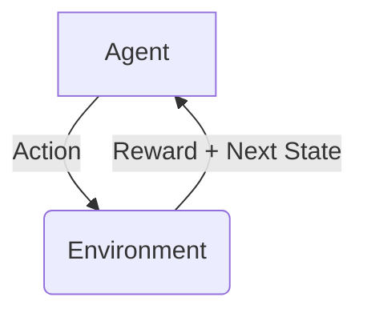
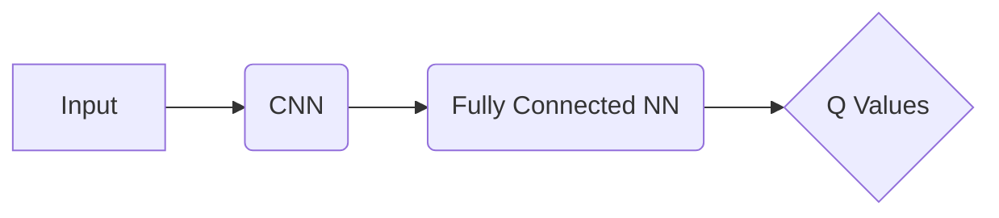
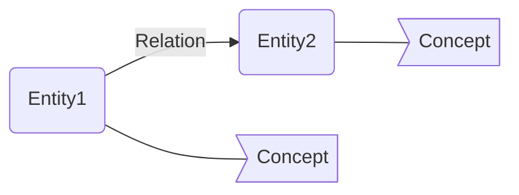
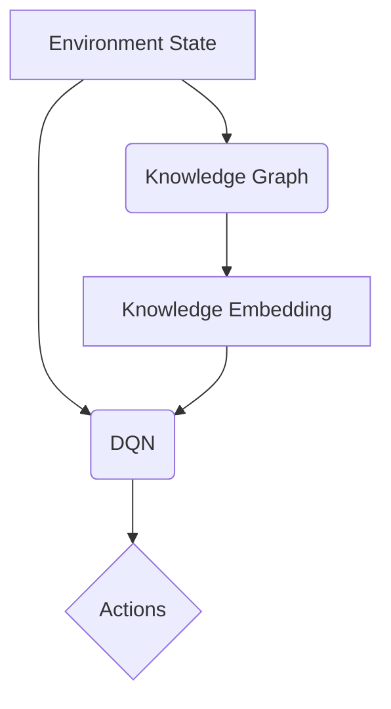

# 一切皆是映射：深度Q网络（DQN）与知识图谱的融合研究

## 1. 背景介绍

### 1.1 人工智能的崛起

在过去几十年中，人工智能(AI)技术的发展一直是科技领域的热门话题。从最初的专家系统和机器学习算法,到近年来深度学习和强化学习的突破性进展,AI已经渗透到我们生活的方方面面。其中,深度强化学习(Deep Reinforcement Learning,DRL)作为机器学习的一个重要分支,通过结合深度神经网络和强化学习算法,展现出了令人惊叹的能力,在游戏、机器人控制、自动驾驶等领域取得了卓越的成绩。

### 1.2 深度Q网络(DQN)的革命性贡献

在DRL领域,深度Q网络(Deep Q-Network,DQN)的提出可谓是一个里程碑式的突破。DQN是第一个成功将深度神经网络应用于强化学习的算法,它能够直接从高维度的原始输入(如视频游戏画面)中学习出最优策略,而无需手工设计特征。DQN的出现不仅推动了DRL在游戏领域的发展,更重要的是它为DRL在其他复杂问题上的应用奠定了基础。

### 1.3 知识图谱(Knowledge Graph)的重要性

另一方面,知识图谱(Knowledge Graph)作为一种结构化知识表示方式,近年来在自然语言处理、知识推理、问答系统等领域发挥着越来越重要的作用。知识图谱通过将实体(Entity)、概念(Concept)和它们之间的关系(Relation)以图的形式表示出来,形成了一种直观、富含语义的知识表示方式。这种表示方式不仅有利于机器理解和推理知识,更重要的是它为知识的共享和重用提供了基础。

### 1.4 融合DQN与知识图谱的意义

尽管DQN和知识图谱分别在不同领域取得了长足的进展,但将它们结合起来却鲜有探索。事实上,DQN和知识图谱在某种程度上是相辅相成的。一方面,知识图谱可以为DQN提供结构化的先验知识,有助于DQN更好地理解问题,提高学习效率;另一方面,DQN则可以通过自主探索来发现知识图谱中未包含的新知识,从而扩充和完善知识图谱。因此,探索DQN与知识图谱的融合,不仅可以推动DRL技术在更复杂的领域中的应用,也有助于构建更加完备的知识体系。

## 2. 核心概念与联系

在深入探讨DQN与知识图谱融合之前,我们有必要先了解一些核心概念。

### 2.1 强化学习(Reinforcement Learning)

强化学习是一种基于环境交互的机器学习范式。在强化学习中,智能体(Agent)通过与环境(Environment)进行交互,接收环境的反馈(Reward),不断调整自身的策略(Policy),最终学习到一个可以maximiz累积奖励的最优策略。强化学习的核心思想是"试错学习"(Trial-and-Error Learning),它不需要提前给定正确答案,而是通过不断的探索和反馈来获取知识。

### 2.2 Q-Learning与Q函数

Q-Learning是强化学习中一种基于价值函数(Value Function)的算法。在Q-Learning中,我们定义了一个Q函数(Q-Function),用于评估在某个状态(State)下执行某个动作(Action)的价值。通过不断更新Q函数,我们可以逐步找到一个最优策略。Q函数的更新公式如下:

$$Q(s_t, a_t) \leftarrow Q(s_t, a_t) + \alpha \big(r_t + \gamma \max_{a} Q(s_{t+1}, a) - Q(s_t, a_t)\big)$$

其中:
- $s_t$和$a_t$分别表示当前状态和动作
- $r_t$表示执行动作$a_t$后获得的即时奖励
- $\gamma$是折扣因子,用于权衡未来奖励的重要性
- $\alpha$是学习率,控制着Q函数的更新速度

### 2.3 深度Q网络(DQN)

传统的Q-Learning算法在处理高维观测数据(如视频游戏画面)时会遇到维数灾难的问题。为了解决这一问题,DQN将Q函数用一个深度神经网络来拟合,从而能够直接从原始高维输入中学习出Q值。DQN的核心思想是使用一个卷积神经网络(CNN)来提取输入数据的特征,再将提取到的特征输入到一个全连接神经网络中计算Q值。

### 2.4 知识图谱(Knowledge Graph)

知识图谱是一种以图的形式表示结构化知识的方法。在知识图谱中,知识被表示为一个包含实体(Entity)、概念(Concept)和关系(Relation)的有向图。实体表示现实世界中的具体对象,概念表示实体的抽象类别,而关系则描述实体或概念之间的语义联系。

知识图谱不仅能够直观地展现知识结构,更重要的是它为知识的共享、重用和推理提供了基础。许多著名的知识库,如Freebase、DBpedia和YAGO,都是以知识图谱的形式组织和存储知识的。

## 3. 核心算法原理具体操作步骤

现在,让我们来探讨如何将DQN与知识图谱相结合。我们将提出一种新的算法框架,即知识增强深度Q网络(Knowledge-Augmented Deep Q-Network,KA-DQN)。

### 3.1 KA-DQN框架概述

KA-DQN的核心思想是利用知识图谱中的结构化知识来增强DQN的学习能力。具体来说,我们将知识图谱中的实体、概念和关系作为DQN的辅助输入,与环境状态一起输入到DQN中,以指导DQN的决策过程。

在上图所示的KA-DQN框架中,知识图谱首先被嵌入到低维连续向量空间中,形成知识嵌入(Knowledge Embedding)。这些知识嵌入与环境状态一起作为DQN的输入,经过一系列卷积和全连接层后,输出对应的Q值。根据这些Q值,DQN就可以选择最优动作执行。

### 3.2 知识嵌入(Knowledge Embedding)

知识嵌入是将知识图谱中的实体、概念和关系映射到低维连续向量空间的过程。常见的知识嵌入方法有TransE、DistMult、ComplEx等。以TransE为例,它将每个实体和关系都映射为一个低维向量,并使关系向量能够在实体向量空间中对应于某种转换,从而对知识图谱中的三元组事实进行编码。

$$\mathbf{h} + \mathbf{r} \approx \mathbf{t}$$

其中$\mathbf{h}$、$\mathbf{r}$和$\mathbf{t}$分别表示头实体、关系和尾实体的向量表示。

通过知识嵌入,我们可以将知识图谱中的符号信息转化为数值向量,从而便于机器学习模型进行处理。

### 3.3 KA-DQN网络结构

在KA-DQN中,我们将环境状态和知识嵌入作为输入,送入一个由卷积层和全连接层组成的深度神经网络。具体来说:

1. 环境状态(如视频游戏画面)首先经过一系列卷积层,提取出视觉特征。
2. 知识嵌入则通过一个全连接层进行非线性转换,融合知识信息。
3. 视觉特征和转换后的知识嵌入在一个fusion层相加,融合为一个统一的特征表示。
4. 该特征表示再经过几层全连接层,最终输出对应的Q值。

通过这种方式,KA-DQN能够同时利用环境状态和知识图谱中的结构化知识,从而做出更加明智的决策。

### 3.4 KA-DQN训练过程

KA-DQN的训练过程与标准的DQN大致相似,都是基于经验回放(Experience Replay)和目标网络(Target Network)的思想。不同之处在于,KA-DQN需要同时处理环境状态和知识嵌入两种输入。

具体的训练步骤如下:

1. 初始化KA-DQN网络的参数,包括卷积层、全连接层和知识嵌入层的权重。
2. 初始化经验回放池和目标网络。
3. 对于每一个训练episode:
    - 根据当前的KA-DQN网络和探索策略(如$\epsilon$-greedy)选择动作。
    - 执行选择的动作,获得新的状态、奖励和是否终止的信息。
    - 将(状态、动作、奖励、新状态、终止信号)的转换存入经验回放池。
    - 从经验回放池中采样一个批次的转换。
    - 将环境状态和知识嵌入作为输入,通过KA-DQN网络计算Q值。
    - 根据目标网络计算期望的Q值目标。
    - 计算损失函数(如均方误差),并通过反向传播更新KA-DQN网络的参数。
    - 每隔一定步骤,将KA-DQN网络的参数复制到目标网络中。

通过上述过程,KA-DQN不断从环境交互中学习,同时利用知识图谱中的结构化知识来指导学习过程,从而获得更加准确和高效的Q值估计。

## 4. 数学模型和公式详细讲解举例说明

在前面的章节中,我们已经介绍了KA-DQN框架的总体思路。现在,让我们深入探讨一下KA-DQN中的数学模型和公式。

### 4.1 KA-DQN的损失函数

KA-DQN的训练目标是最小化一个损失函数,使得网络输出的Q值尽可能接近期望的Q值目标。常见的损失函数有均方误差(Mean Squared Error,MSE)和Huber损失(Huber Loss)等。

对于一个批次的转换$(s_t, a_t, r_t, s_{t+1})$,KA-DQN网络输出的Q值为$Q(s_t, a_t; \theta)$,其中$\theta$表示网络参数。期望的Q值目标则由下式给出:

$$y_t = r_t + \gamma \max_{a'} Q(s_{t+1}, a'; \theta^-)$$

其中$\theta^-$表示目标网络的参数,用于计算下一状态的最大Q值。$\gamma$是折扣因子,控制着未来奖励的重要性。

基于此,我们可以定义KA-DQN的损失函数为:

$$\mathcal{L}(\theta) = \mathbb{E}_{(s_t, a_t, r_t, s_{t+1}) \sim \mathcal{D}} \big[ \big(y_t - Q(s_t, a_t; \theta)\big)^2 \big]$$

其中$\mathcal{D}$表示经验回放池。通过最小化这个损失函数,我们可以使KA-DQN网络输出的Q值逐渐接近期望的Q值目标。

### 4.2 知识嵌入的损失函数

除了上述的Q值损失函数外,KA-DQN还需要考虑知识嵌入的损失函数,以确保知识嵌入能够很好地捕获知识图谱中的结构信息。

对于一个知识图谱$\mathcal{G}$,我们可以将其视为一个包含大量三元组$(h, r, t)$的集合,其中$h$表示头实体,$r$表示关系,而$t$表示尾实体。我们的目标是学习一个映射函数$f$,使得对于每个三元组$(h, r, t)$,都有$f(h, r) \approx t$。

常见的知识嵌入损失函数包括TransE的马尔可夫损失(Margin