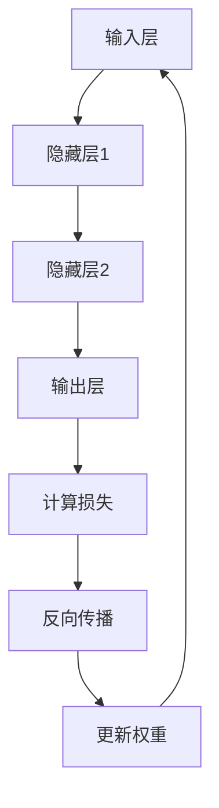

# 从零开始大模型开发与微调：反向传播神经网络的前身历史

## 1.背景介绍

在人工智能和机器学习的历史长河中，反向传播算法（Backpropagation）无疑是一个里程碑。它不仅推动了神经网络的发展，还为深度学习的崛起奠定了基础。然而，反向传播算法并非凭空出现，它有着深厚的历史背景和理论基础。本文将从零开始，带你了解反向传播神经网络的前身历史，深入探讨其核心概念、算法原理、数学模型、实际应用以及未来发展趋势。

## 2.核心概念与联系

### 2.1 神经网络的起源

神经网络的概念最早可以追溯到20世纪40年代，当时Warren McCulloch和Walter Pitts提出了第一个数学模型，用以模拟人类神经元的工作原理。这一模型被称为McCulloch-Pitts神经元，奠定了神经网络的基础。

### 2.2 感知机模型

1958年，Frank Rosenblatt提出了感知机（Perceptron）模型，这是第一个能够进行学习的神经网络模型。感知机通过调整权重来学习输入与输出之间的关系，但它只能解决线性可分的问题。

### 2.3 多层感知机与反向传播

为了克服感知机的局限性，研究者们提出了多层感知机（MLP），即包含多个隐藏层的神经网络。然而，如何有效地训练多层感知机成为一个难题。直到1986年，David Rumelhart、Geoffrey Hinton和Ronald Williams提出了反向传播算法，这一问题才得以解决。

## 3.核心算法原理具体操作步骤

反向传播算法的核心思想是通过计算损失函数的梯度来更新神经网络的权重。具体操作步骤如下：

### 3.1 前向传播

首先，将输入数据通过神经网络进行前向传播，计算每一层的输出，直到得到最终的预测结果。

### 3.2 计算损失

使用损失函数（如均方误差或交叉熵）计算预测结果与真实标签之间的误差。

### 3.3 反向传播

从输出层开始，逐层向后计算每个神经元的梯度。使用链式法则，将误差反向传播到每一层，计算每个权重的梯度。

### 3.4 更新权重

使用梯度下降算法，根据计算得到的梯度更新每个权重，使得损失函数逐渐减小。



## 4.数学模型和公式详细讲解举例说明

### 4.1 前向传播公式

假设我们有一个三层神经网络，输入层、隐藏层和输出层。输入层的输入为 $x$，隐藏层的输出为 $h$，输出层的输出为 $y$。

$$
h = \sigma(W_1 x + b_1)
$$

$$
y = \sigma(W_2 h + b_2)
$$

其中，$W_1$ 和 $W_2$ 分别是输入层到隐藏层、隐藏层到输出层的权重矩阵，$b_1$ 和 $b_2$ 是偏置向量，$\sigma$ 是激活函数。

### 4.2 损失函数

常用的损失函数有均方误差（MSE）和交叉熵（Cross-Entropy）。以均方误差为例：

$$
L = \frac{1}{2} \sum (y_{pred} - y_{true})^2
$$

### 4.3 反向传播公式

反向传播的关键在于计算每个权重的梯度。以输出层的权重 $W_2$ 为例，其梯度为：

$$
\frac{\partial L}{\partial W_2} = \delta_2 h^T
$$

其中，$\delta_2$ 是输出层的误差项，$h^T$ 是隐藏层的输出的转置。

隐藏层的误差项 $\delta_1$ 可以通过链式法则计算：

$$
\delta_1 = (W_2^T \delta_2) \odot \sigma'(z_1)
$$

其中，$\odot$ 表示元素逐个相乘，$\sigma'(z_1)$ 是激活函数的导数。

## 5.项目实践：代码实例和详细解释说明

为了更好地理解反向传播算法，我们将通过一个简单的Python代码实例来演示其具体实现。

```python
import numpy as np

# 激活函数及其导数
def sigmoid(x):
    return 1 / (1 + np.exp(-x))

def sigmoid_derivative(x):
    return x * (1 - x)

# 输入数据
X = np.array([[0, 0], [0, 1], [1, 0], [1, 1]])
y = np.array([[0], [1], [1], [0]])

# 初始化权重和偏置
np.random.seed(1)
W1 = np.random.rand(2, 2)
b1 = np.random.rand(1, 2)
W2 = np.random.rand(2, 1)
b2 = np.random.rand(1, 1)

# 学习率
learning_rate = 0.1

# 训练过程
for epoch in range(10000):
    # 前向传播
    z1 = np.dot(X, W1) + b1
    a1 = sigmoid(z1)
    z2 = np.dot(a1, W2) + b2
    a2 = sigmoid(z2)
    
    # 计算损失
    loss = y - a2
    
    # 反向传播
    d_a2 = loss * sigmoid_derivative(a2)
    d_W2 = np.dot(a1.T, d_a2)
    d_b2 = np.sum(d_a2, axis=0, keepdims=True)
    
    d_a1 = np.dot(d_a2, W2.T) * sigmoid_derivative(a1)
    d_W1 = np.dot(X.T, d_a1)
    d_b1 = np.sum(d_a1, axis=0, keepdims=True)
    
    # 更新权重和偏置
    W2 += learning_rate * d_W2
    b2 += learning_rate * d_b2
    W1 += learning_rate * d_W1
    b1 += learning_rate * d_b1

# 输出训练结果
print("训练后的输出：")
print(a2)
```

在这个代码实例中，我们定义了一个简单的两层神经网络，并使用反向传播算法进行训练。通过不断更新权重和偏置，神经网络逐渐学会了输入与输出之间的关系。

## 6.实际应用场景

反向传播算法在多个实际应用场景中得到了广泛应用，包括但不限于以下几个方面：

### 6.1 图像识别

反向传播算法是卷积神经网络（CNN）的核心，广泛应用于图像识别和分类任务中。例如，AlexNet、VGG和ResNet等经典模型都依赖于反向传播算法进行训练。

### 6.2 自然语言处理

在自然语言处理（NLP）领域，反向传播算法被用于训练循环神经网络（RNN）和长短期记忆网络（LSTM），以解决文本分类、机器翻译和情感分析等任务。

### 6.3 语音识别

反向传播算法在语音识别系统中也发挥了重要作用。通过训练深度神经网络（DNN），语音识别系统能够更准确地将语音信号转换为文本。

## 7.工具和资源推荐

### 7.1 深度学习框架

- TensorFlow：由Google开发的开源深度学习框架，支持多种平台和设备。
- PyTorch：由Facebook开发的开源深度学习框架，以其灵活性和易用性受到广泛欢迎。
- Keras：一个高级神经网络API，能够运行在TensorFlow、Theano和CNTK之上。

### 7.2 在线课程

- Coursera上的深度学习专项课程：由Andrew Ng教授主讲，涵盖了深度学习的基础知识和实践技巧。
- edX上的深度学习课程：由MIT和Harvard大学提供，深入讲解了深度学习的理论和应用。

### 7.3 书籍推荐

- 《深度学习》：由Ian Goodfellow、Yoshua Bengio和Aaron Courville合著，是深度学习领域的经典教材。
- 《神经网络与深度学习