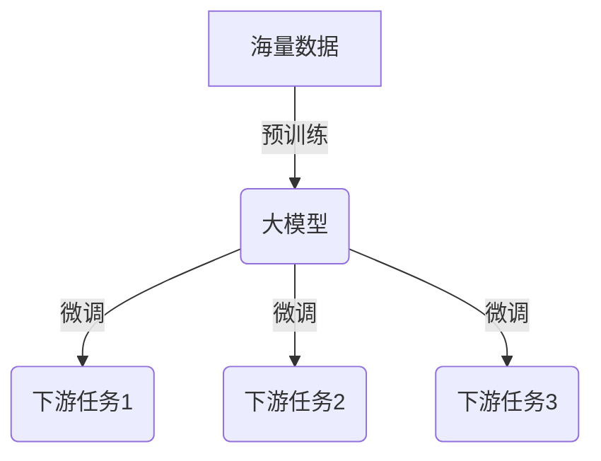
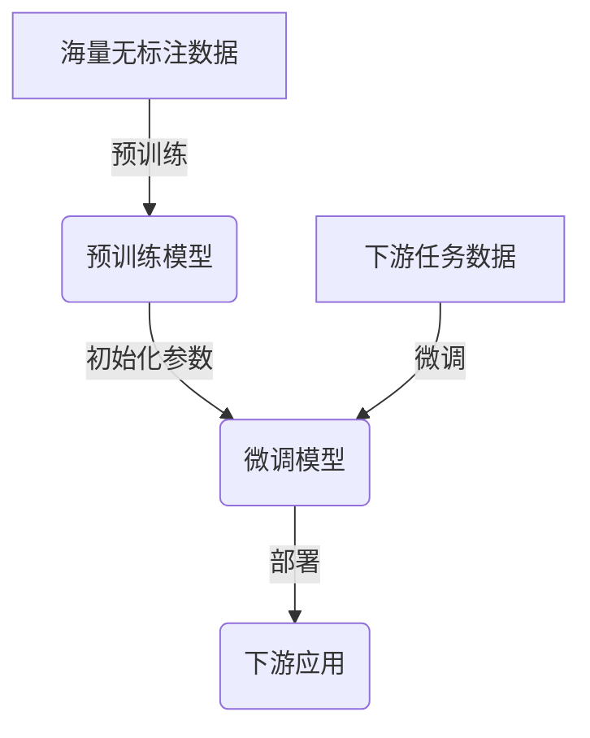

# 从零开始大模型开发与微调：近在咫尺的未来—大模型的应用前景

## 1.背景介绍

### 1.1 人工智能的飞速发展

人工智能(AI)技术在过去几年经历了爆炸式的发展,尤其是自然语言处理(NLP)和计算机视觉(CV)领域取得了令人瞩目的进步。这主要归功于深度学习算法、海量数据和强大的计算能力的结合。其中,大型语言模型和大型视觉模型的出现,为人工智能的应用带来了革命性的变化。

### 1.2 大模型的兴起

大模型(Large Model)是指具有数十亿甚至数万亿参数的超大规模深度神经网络模型。这些模型通过在海量数据上进行预训练,学习到了丰富的知识表示,展现出惊人的泛化能力。代表性的大模型有GPT-3、BERT、DALL-E等,它们在自然语言处理、计算机视觉等领域表现出色,推动了人工智能的发展。

### 1.3 大模型的应用前景

大模型不仅在学术界引起热议,也受到了产业界的高度重视。它们有望在多个领域发挥重要作用,如智能写作、智能问答、智能辅助设计、智能翻译等,为人类的工作和生活带来巨大便利。然而,大模型的开发和应用也面临着诸多挑战,如数据隐私、模型公平性、能源消耗等问题,需要我们进一步探索和解决。

## 2.核心概念与联系

### 2.1 大模型的核心思想

大模型的核心思想是通过在海量数据上进行预训练,学习到丰富的知识表示,从而获得强大的泛化能力。这种预训练-微调的范式,使得模型可以在有限的下游任务数据上进行微调,快速适应新的任务。



### 2.2 注意力机制

注意力机制(Attention Mechanism)是大模型中的关键技术,它允许模型在处理序列数据时,动态地关注输入的不同部分,捕捉长距离依赖关系。自注意力(Self-Attention)是一种特殊的注意力机制,它使模型能够学习输入序列内部的依赖关系,是大模型取得巨大成功的重要原因之一。

### 2.3 transformer架构

Transformer是一种全新的深度学习模型架构,它完全基于注意力机制,摒弃了传统的循环神经网络(RNN)和卷积神经网络(CNN)结构。Transformer架构在捕捉长距离依赖关系方面表现出色,并且具有高度的并行性,因此被广泛应用于大模型的设计中。

### 2.4 预训练任务

大模型通常采用自监督学习的方式进行预训练,常见的预训练任务包括:

- **蒙版语言模型(Masked Language Modeling, MLM)**: 随机将输入序列中的一部分词替换为特殊的掩码标记,模型需要预测被掩码的词。
- **下一句预测(Next Sentence Prediction, NSP)**: 给定两个句子,模型需要预测它们是否连续出现。
- **自回归语言模型(Autoregressive Language Modeling)**: 模型需要基于前面的词预测下一个词。

通过这些预训练任务,大模型可以学习到丰富的语义和语法知识,为下游任务做好充分准备。

## 3.核心算法原理具体操作步骤

### 3.1 transformer编码器

Transformer编码器是大模型中的核心组件之一,它将输入序列映射为高维向量表示。编码器的主要步骤如下:

1. **词嵌入(Word Embedding)**: 将输入序列中的每个词映射为一个固定长度的向量表示。
2. **位置编码(Positional Encoding)**: 为每个位置添加一个位置向量,使模型能够捕捉序列的位置信息。
3. **多头自注意力(Multi-Head Self-Attention)**: 计算每个词与输入序列中其他词的注意力权重,捕捉长距离依赖关系。
4. **前馈神经网络(Feed-Forward Neural Network)**: 对注意力输出进行非线性变换,提取高级特征。
5. **层归一化(Layer Normalization)**: 对每一层的输出进行归一化,加速训练并提高性能。
6. **残差连接(Residual Connection)**: 将每一层的输入与输出相加,缓解梯度消失问题。

通过堆叠多个编码器层,transformer编码器可以学习到丰富的语义表示。


### 3.2 transformer解码器

Transformer解码器与编码器类似,但增加了一个掩码自注意力(Masked Self-Attention)层,用于防止解码器获取未来位置的信息。解码器的主要步骤如下:

1. **掩码自注意力(Masked Self-Attention)**: 计算当前位置的词与之前位置的词的注意力权重,防止获取未来信息。
2. **编码器-解码器注意力(Encoder-Decoder Attention)**: 计算解码器输出与编码器输出之间的注意力权重,融合编码器的信息。
3. **前馈神经网络(Feed-Forward Neural Network)**: 对注意力输出进行非线性变换,提取高级特征。
4. **层归一化(Layer Normalization)**: 对每一层的输出进行归一化,加速训练并提高性能。
5. **残差连接(Residual Connection)**: 将每一层的输入与输出相加,缓解梯度消失问题。

通过堆叠多个解码器层,transformer解码器可以生成高质量的输出序列。


### 3.3 预训练和微调

大模型的训练通常分为两个阶段:预训练(Pre-training)和微调(Fine-tuning)。

1. **预训练**: 在海量无标注数据上训练模型,学习到丰富的语义和语法知识。常见的预训练任务包括蒙版语言模型、下一句预测和自回归语言模型等。

2. **微调**: 在特定的下游任务数据上,使用预训练模型的参数初始化,并进行进一步的训练。由于模型已经学习到了丰富的知识表示,因此只需要少量的下游任务数据就可以取得良好的性能。

通过预训练-微调的范式,大模型可以在多个下游任务上展现出强大的泛化能力,避免了从头开始训练的巨大计算开销。



## 4.数学模型和公式详细讲解举例说明

### 4.1 自注意力机制

自注意力机制是transformer模型的核心,它允许模型动态地关注输入序列的不同部分,捕捉长距离依赖关系。给定一个输入序列 $X = (x_1, x_2, \dots, x_n)$,自注意力计算每个位置 $i$ 与所有位置 $j$ 的注意力权重 $\alpha_{ij}$,然后根据权重对输入进行加权求和,得到新的表示 $y_i$:

$$y_i = \sum_{j=1}^n \alpha_{ij}(x_j W^V)$$

其中,注意力权重 $\alpha_{ij}$ 由以下公式计算:

$$\alpha_{ij} = \frac{exp(e_{ij})}{\sum_{k=1}^n exp(e_{ik})}$$
$$e_{ij} = \frac{(x_iW^Q)(x_jW^K)^T}{\sqrt{d_k}}$$

$W^Q$、$W^K$、$W^V$ 分别是查询(Query)、键(Key)和值(Value)的线性变换矩阵,用于将输入映射到不同的子空间;$d_k$ 是缩放因子,用于防止点积过大导致梯度饱和。

多头自注意力(Multi-Head Attention)是将多个注意力头的输出进行拼接,捕捉不同的依赖关系:

$$MultiHead(Q, K, V) = Concat(head_1, \dots, head_h)W^O$$
$$head_i = Attention(QW_i^Q, KW_i^K, VW_i^V)$$

其中,$W_i^Q$、$W_i^K$、$W_i^V$ 是第 $i$ 个注意力头的线性变换矩阵,$W^O$ 是最终的线性变换矩阵。

### 4.2 transformer损失函数

transformer通常采用自回归语言模型的方式进行训练,目标是最大化序列的条件概率:

$$\mathcal{L}(\theta) = -\sum_{t=1}^T \log P(y_t | y_{<t}, X; \theta)$$

其中,$y_t$ 是目标序列的第 $t$ 个词,$y_{<t}$ 表示前 $t-1$ 个词,$X$ 是输入序列,$\theta$ 是模型参数。

对于分类任务,可以将transformer的输出映射到类别概率分布:

$$P(y | X) = \text{softmax}(h_y^T z)$$

其中,$h_y$ 是类别 $y$ 的向量表示,$z$ 是transformer的输出向量。目标是最小化交叉熵损失:

$$\mathcal{L}(\theta) = -\sum_i y_i \log P(y_i | X_i; \theta)$$

通过梯度下降等优化算法,可以有效地训练transformer模型。

## 5.项目实践：代码实例和详细解释说明

以下是一个基于PyTorch实现的transformer模型示例,用于机器翻译任务。

### 5.1 导入所需库

```python
import torch
import torch.nn as nn
import math
```

### 5.2 定义模型架构

```python
class TransformerEncoder(nn.Module):
    def __init__(self, input_dim, hid_dim, n_layers, n_heads, pf_dim, dropout, device):
        super().__init__()

        self.tok_embedding = nn.Embedding(input_dim, hid_dim)
        self.pos_embedding = nn.Embedding(1000, hid_dim)
        
        self.layers = nn.ModuleList([EncoderLayer(hid_dim, n_heads, pf_dim, dropout, device)
                                     for _ in range(n_layers)])
        
        self.dropout = nn.Dropout(dropout)
        
        self.scale = torch.sqrt(torch.FloatTensor([hid_dim])).to(device)
        
    def forward(self, src, src_mask):
        
        batch_size = src.shape[0]
        src_len = src.shape[1]
        
        pos = torch.arange(0, src_len).unsqueeze(0).repeat(batch_size, 1).to(device)
        
        src = self.dropout((self.tok_embedding(src) * self.scale) + self.pos_embedding(pos))
        
        for layer in self.layers:
            src = layer(src, src_mask)
            
        return src

class EncoderLayer(nn.Module):
    def __init__(self, hid_dim, n_heads, pf_dim, dropout, device):
        super().__init__()
        
        self.self_attn_layer_norm = nn.LayerNorm(hid_dim)
        self.ff_layer_norm = nn.LayerNorm(hid_dim)
        self.self_attention = MultiHeadAttentionLayer(hid_dim, n_heads, dropout, device)
        self.positionwise_feedforward = PositionwiseFeedforwardLayer(hid_dim, pf_dim, dropout)
        self.dropout = nn.Dropout(dropout)
        
    def forward(self, src, src_mask):
        
        _src, _ = self.self_attention(src, src, src, src_mask)
        
        src = self.self_attn_layer_norm(src + self.dropout(_src))
        
        _src = self.positionwise_feedforward(src)
        
        src = self.ff_layer_norm(src + self.dropout(_src))
        
        return src

class MultiHeadAttentionLayer(nn.Module):
    def __init__(self, hid_dim, n_heads, dropout, device):
        super().__init