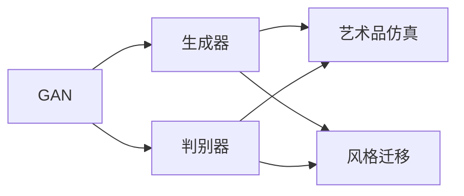

# 基于生成对抗网络的艺术品仿真与风格迁移技术

## 1. 背景介绍
### 1.1 艺术品仿真与风格迁移的意义
在当今数字时代,艺术品仿真与风格迁移技术正在重塑我们创作、欣赏和传播艺术的方式。这一技术不仅为艺术家提供了新的创作工具和灵感来源,也为普通大众带来了更加丰富多彩的艺术体验。通过对艺术作品进行仿真和风格迁移,我们可以生成各种风格迥异、极具创意的艺术作品,为艺术领域注入新的活力。

### 1.2 生成对抗网络(GAN)的兴起 
生成对抗网络(Generative Adversarial Networks, GAN)自2014年被提出以来,迅速成为计算机视觉和深度学习领域的研究热点。GAN由生成器(Generator)和判别器(Discriminator)两部分组成,通过两个网络的对抗学习,可以生成与真实数据极其相似的合成数据。GAN强大的生成能力很快被应用到图像生成、超分辨率、风格迁移等诸多领域,取得了令人瞩目的成果。

### 1.3 GAN在艺术品仿真与风格迁移中的应用前景
将GAN应用于艺术品仿真与风格迁移,可以让计算机学习并模仿艺术家的创作风格,自动生成各种风格的艺术作品。这不仅可以辅助艺术家的创作,还能让普通大众轻松体验艺术创作的乐趣。此外,风格迁移技术还可以将一幅图像的风格迁移到另一幅图像上,创造出独特的艺术效果,为艺术创作提供更多可能性。GAN在该领域的应用前景十分广阔。

## 2. 核心概念与联系
### 2.1 生成对抗网络(GAN)
- 生成器(Generator):生成合成数据的网络,目标是生成尽可能逼真的数据以欺骗判别器。
- 判别器(Discriminator):判断数据真伪的网络,目标是准确区分真实数据和生成的合成数据。
- 对抗学习:生成器和判别器互相博弈、不断提升的学习过程。

### 2.2 艺术品仿真
利用GAN学习艺术家的创作风格,生成与原作风格相似的全新艺术作品。关键是提取并再现艺术作品的风格特征。

### 2.3 风格迁移  
将一幅图像的风格迁移到另一幅图像的内容上,生成融合了两种图像特征的新图像。核心是分离并重组图像的内容和风格表征。

### 2.4 核心概念之间的联系


## 3. 核心算法原理与具体操作步骤
### 3.1 GAN的基本原理
1. 随机噪声向量作为生成器的输入,生成器生成合成数据
2. 判别器同时接收真实数据和合成数据,判断其真伪
3. 根据判别器的反馈调整生成器和判别器的参数
4. 重复步骤1-3,直到生成器可以生成以假乱真的合成数据

### 3.2 艺术品仿真的具体步骤
1. 收集特定艺术家的作品数据集
2. 训练GAN模型学习该艺术家的创作风格
3. 随机生成噪声向量输入训练好的生成器
4. 生成器输出仿制的艺术品图像
5. 评估生成图像的质量并不断改进模型

### 3.3 风格迁移的具体步骤
1. 准备内容图像和风格图像
2. 使用预训练的卷积神经网络提取图像的内容和风格特征
3. 初始化合成图像,使其内容与内容图像相似
4. 通过优化合成图像,使其内容特征与内容图像相似,风格特征与风格图像相似
5. 输出风格迁移后的合成图像

## 4. 数学模型和公式详细讲解举例说明
### 4.1 GAN的数学模型
GAN的目标是求解生成器G和判别器D的参数,使得生成器可以生成与真实数据分布相似的合成数据。这可以表示为如下的极小极大博弈问题:

$$\min_G \max_D V(D,G) = \mathbb{E}_{x \sim p_{data}(x)}[\log D(x)] + \mathbb{E}_{z \sim p_z(z)}[\log (1 - D(G(z)))]$$

其中,$x$表示真实数据,$z$表示随机噪声向量,$p_{data}$和$p_z$分别表示真实数据和噪声的分布。生成器G试图最小化目标函数,而判别器D试图最大化目标函数。

### 4.2 风格迁移的数学模型
风格迁移的目标是生成一幅合成图像,使其内容与内容图像$I_c$相似,风格与风格图像$I_s$相似。设合成图像为$I_g$,风格迁移的数学模型可表示为:

$$\min_{I_g} \alpha \cdot \mathcal{L}_{content}(I_g, I_c) + \beta \cdot \mathcal{L}_{style}(I_g, I_s)$$

其中,$\mathcal{L}_{content}$表示内容损失函数,$\mathcal{L}_{style}$表示风格损失函数,$\alpha$和$\beta$为平衡两种损失的权重系数。内容损失通常使用预训练网络的高层特征表示的欧氏距离,风格损失通常使用基于Gram矩阵的特征统计量的差异。

举例说明:假设我们要将梵高的《星夜》的风格迁移到一张风景照片上。我们先将两幅图像输入预训练的VGG网络,提取其内容和风格特征。然后初始化一张噪声图像作为合成图像,通过最小化上述目标函数,不断调整合成图像的像素值,使其在内容上接近风景照片,在风格上接近《星夜》。最终得到一张融合了风景照片内容和梵高风格的全新图像。

## 5. 项目实践:代码实例与详细解释说明
下面是使用PyTorch实现DCGAN(Deep Convolutional GAN)进行艺术品仿真的简要代码示例:

```python
import torch
import torch.nn as nn
import torch.optim as optim
from torchvision import datasets, transforms

# 生成器
class Generator(nn.Module):
    def __init__(self, nz=100, ngf=64, nc=3):
        super(Generator, self).__init__()
        self.main = nn.Sequential(
            nn.ConvTranspose2d(nz, ngf*8, 4, 1, 0, bias=False),
            nn.BatchNorm2d(ngf*8),
            nn.ReLU(True),
            # ... 省略中间层 ...
            nn.ConvTranspose2d(ngf, nc, 4, 2, 1, bias=False),
            nn.Tanh()
        )
        
    def forward(self, x):
        return self.main(x)

# 判别器 
class Discriminator(nn.Module):
    def __init__(self, nc=3, ndf=64):
        super(Discriminator, self).__init__()
        self.main = nn.Sequential(
            nn.Conv2d(nc, ndf, 4, 2, 1, bias=False),
            nn.LeakyReLU(0.2, inplace=True),
            # ... 省略中间层 ...
            nn.Conv2d(ndf*8, 1, 4, 1, 0, bias=False),
            nn.Sigmoid()
        )

    def forward(self, x):
        return self.main(x)

# 初始化生成器和判别器
netG = Generator().cuda() 
netD = Discriminator().cuda()

# 定义损失函数和优化器
criterion = nn.BCELoss()
optimizerG = optim.Adam(netG.parameters(), lr=0.0002, betas=(0.5, 0.999)) 
optimizerD = optim.Adam(netD.parameters(), lr=0.0002, betas=(0.5, 0.999))

# 加载艺术品数据集
dataset = datasets.ImageFolder(root='./data', transform=transforms.Compose([
    transforms.Resize(64),
    transforms.CenterCrop(64),
    transforms.ToTensor(),
    transforms.Normalize((0.5, 0.5, 0.5), (0.5, 0.5, 0.5)),
]))
dataloader = torch.utils.data.DataLoader(dataset, batch_size=128, shuffle=True)

# 训练GAN
for epoch in range(num_epochs):
    for i, data in enumerate(dataloader):
        # 训练判别器
        netD.zero_grad()
        real_imgs = data[0].cuda()
        z = torch.randn(real_imgs.size(0), 100, 1, 1).cuda()
        fake_imgs = netG(z)
        
        real_labels = torch.ones(real_imgs.size(0), 1).cuda()
        fake_labels = torch.zeros(fake_imgs.size(0), 1).cuda()

        real_loss = criterion(netD(real_imgs), real_labels)
        fake_loss = criterion(netD(fake_imgs.detach()), fake_labels)
        d_loss = real_loss + fake_loss
        
        d_loss.backward()
        optimizerD.step()

        # 训练生成器
        netG.zero_grad()
        fake_imgs = netG(z)
        g_loss = criterion(netD(fake_imgs), real_labels)
        
        g_loss.backward()
        optimizerG.step()
```

以上代码实现了一个基本的DCGAN结构,用于艺术品图像的仿真生成。主要步骤如下:

1. 定义生成器和判别器的网络结构。生成器使用转置卷积层将随机噪声向量映射为合成图像,判别器使用卷积层将图像映射为真伪概率。

2. 初始化生成器和判别器,定义二元交叉熵损失函数和Adam优化器。

3. 加载艺术品图像数据集,对图像进行尺寸调整、裁剪、归一化等预处理。

4. 训练GAN:
   - 训练判别器:分别计算判别器在真实图像和生成图像上的损失,然后反向传播更新判别器参数。
   - 训练生成器:固定判别器,计算生成器的损失,然后反向传播更新生成器参数。

5. 重复第4步直到模型收敛,最终得到一个可以生成逼真艺术品图像的生成器。

通过调整网络结构和超参数,并使用更大的艺术品数据集进行训练,可以得到更加优质的艺术品仿真效果。

## 6. 实际应用场景
### 6.1 辅助艺术创作
艺术家可以使用训练好的GAN模型进行灵感激发和创意探索。通过随机生成各种风格的艺术品图像,艺术家可以获得新的创作思路,扩展创意空间。同时,风格迁移技术可以帮助艺术家将现有作品快速转换为不同风格,提高创作效率。

### 6.2 艺术教育和普及
利用GAN生成的仿制艺术品,可以制作高仿真的艺术品复制品,用于艺术教育和普及。学生可以通过观察和临摹这些复制品,更直观地理解艺术家的创作技法和风格特点。同时,博物馆和美术馆也可以利用这一技术,为观众提供更加生动形象的艺术品介绍和互动体验。

### 6.3 数字艺术品交易
随着区块链技术和NFT(非同质化代币)的兴起,数字艺术品交易日益火热。利用GAN生成的独特艺术作品,可以作为数字藏品在区块链平台上进行发行和交易。这为传统艺术品市场带来了新的机遇,也为数字艺术创作者提供了新的变现渠道。

### 6.4 游戏和虚拟现实中的应用  
在游戏和虚拟现实场景中,需要大量逼真的艺术资源,如场景、角色、道具等。利用GAN可以快速生成各种风格的游戏美术素材,提高美术资源的制作效率。此外,风格迁移技术还可以为游戏中的画面渲染提供更多艺术表现力,带来更加沉浸的游戏体验。

## 7. 工具和资源推荐
### 7.1 常用的GAN框架和库
- PyTorch: https://pytorch.org/
- TensorFlow: https://www.tensorflow.org/
- Keras: https://keras.io/
- NVIDIA StyleGAN: