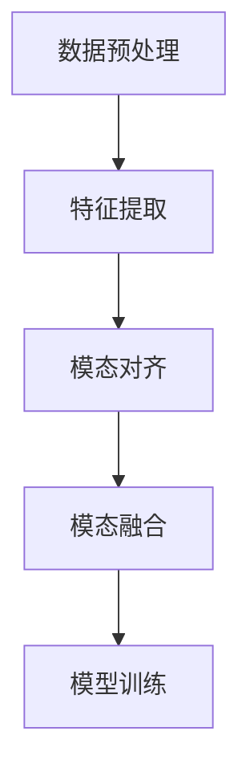

# 多模态大模型：技术原理与实战 智能试穿

## 1.背景介绍

在人工智能领域，多模态大模型（Multimodal Large Models, MLMs）正逐渐成为研究和应用的热点。多模态大模型能够处理和理解多种类型的数据，如文本、图像、音频和视频，并将这些不同模态的数据进行融合，提供更为全面和智能的解决方案。智能试穿作为多模态大模型的一个典型应用场景，能够通过结合图像识别、自然语言处理和生成模型等技术，实现虚拟试衣、个性化推荐等功能。

## 2.核心概念与联系

### 2.1 多模态数据

多模态数据指的是来自不同来源或具有不同特性的多种数据类型。常见的模态包括文本、图像、音频和视频。多模态数据的融合能够提供更为丰富的信息，从而提升模型的理解和生成能力。

### 2.2 大模型

大模型通常指的是具有大量参数和复杂结构的深度学习模型，如GPT-3、BERT等。这些模型通过大规模数据训练，能够捕捉复杂的模式和关系，具备强大的泛化能力。

### 2.3 多模态大模型

多模态大模型结合了多模态数据和大模型的优势，能够同时处理和理解多种模态的数据，并进行跨模态的融合和生成。例如，CLIP模型能够将图像和文本进行对齐，从而实现图像描述生成和图像搜索等功能。

### 2.4 智能试穿

智能试穿是多模态大模型的一个具体应用，通过结合图像识别、自然语言处理和生成模型等技术，实现虚拟试衣、个性化推荐等功能。用户可以通过上传自己的照片或视频，系统自动识别用户的体型和风格，并生成适合的服装搭配和试穿效果。

## 3.核心算法原理具体操作步骤

### 3.1 数据预处理

数据预处理是多模态大模型训练的第一步。对于图像数据，通常需要进行归一化、裁剪和增强等操作；对于文本数据，需要进行分词、去停用词和词向量化等处理。

### 3.2 特征提取

特征提取是多模态大模型的关键步骤。对于图像数据，通常使用卷积神经网络（CNN）进行特征提取；对于文本数据，通常使用预训练的语言模型（如BERT）进行特征提取。

### 3.3 模态对齐

模态对齐是多模态大模型的核心技术之一。通过对齐不同模态的数据，模型能够理解和生成跨模态的信息。例如，CLIP模型通过对齐图像和文本的特征向量，实现了图像描述生成和图像搜索等功能。

### 3.4 模态融合

模态融合是多模态大模型的另一个关键技术。通过融合不同模态的数据，模型能够生成更为丰富和准确的结果。例如，智能试穿系统通过融合用户的图像和文本描述，生成个性化的服装搭配和试穿效果。

### 3.5 模型训练

模型训练是多模态大模型的最后一步。通过大规模数据的训练，模型能够捕捉复杂的模式和关系，具备强大的泛化能力。



## 4.数学模型和公式详细讲解举例说明

### 4.1 特征提取

对于图像数据，特征提取通常使用卷积神经网络（CNN）。假设输入图像为 $I$，通过卷积层和池化层的操作，得到特征向量 $F_I$：

$$
F_I = CNN(I)
$$

对于文本数据，特征提取通常使用预训练的语言模型（如BERT）。假设输入文本为 $T$，通过BERT模型的操作，得到特征向量 $F_T$：

$$
F_T = BERT(T)
$$

### 4.2 模态对齐

模态对齐的目标是将不同模态的数据映射到同一个特征空间。假设图像特征向量为 $F_I$，文本特征向量为 $F_T$，通过对齐网络 $Align$，得到对齐后的特征向量 $A_I$ 和 $A_T$：

$$
A_I = Align(F_I)
$$

$$
A_T = Align(F_T)
$$

### 4.3 模态融合

模态融合的目标是将对齐后的特征向量进行融合，生成最终的特征向量 $F$。常见的融合方法包括加权平均、拼接和注意力机制等。假设使用加权平均的方法进行融合：

$$
F = \alpha A_I + \beta A_T
$$

其中，$\alpha$ 和 $\beta$ 为融合权重。

### 4.4 模型训练

模型训练的目标是通过大规模数据的训练，优化模型参数，使得模型能够捕捉复杂的模式和关系。常见的优化方法包括梯度下降、Adam等。假设损失函数为 $L$，模型参数为 $\theta$，通过梯度下降的方法进行优化：

$$
\theta = \theta - \eta \nabla_\theta L
$$

其中，$\eta$ 为学习率。

## 5.项目实践：代码实例和详细解释说明

### 5.1 数据预处理

```python
import cv2
import numpy as np
from transformers import BertTokenizer

# 图像数据预处理
def preprocess_image(image_path):
    image = cv2.imread(image_path)
    image = cv2.resize(image, (224, 224))
    image = image / 255.0
    return image

# 文本数据预处理
def preprocess_text(text):
    tokenizer = BertTokenizer.from_pretrained('bert-base-uncased')
    tokens = tokenizer(text, return_tensors='pt', padding=True, truncation=True)
    return tokens
```

### 5.2 特征提取

```python
import torch
import torchvision.models as models
from transformers import BertModel

# 图像特征提取
def extract_image_features(image):
    model = models.resnet50(pretrained=True)
    model.eval()
    with torch.no_grad():
        features = model(image)
    return features

# 文本特征提取
def extract_text_features(text):
    model = BertModel.from_pretrained('bert-base-uncased')
    model.eval()
    with torch.no_grad():
        features = model(**text)
    return features
```

### 5.3 模态对齐

```python
import torch.nn as nn

# 模态对齐网络
class AlignNetwork(nn.Module):
    def __init__(self, input_dim, output_dim):
        super(AlignNetwork, self).__init__()
        self.fc = nn.Linear(input_dim, output_dim)

    def forward(self, x):
        return self.fc(x)

# 对齐特征向量
def align_features(image_features, text_features):
    align_network = AlignNetwork(input_dim=2048, output_dim=512)
    aligned_image_features = align_network(image_features)
    aligned_text_features = align_network(text_features)
    return aligned_image_features, aligned_text_features
```

### 5.4 模态融合

```python
# 模态融合
def fuse_features(aligned_image_features, aligned_text_features, alpha=0.5, beta=0.5):
    fused_features = alpha * aligned_image_features + beta * aligned_text_features
    return fused_features
```

### 5.5 模型训练

```python
import torch.optim as optim

# 损失函数
criterion = nn.MSELoss()

# 优化器
optimizer = optim.Adam(model.parameters(), lr=0.001)

# 训练循环
for epoch in range(num_epochs):
    for data in dataloader:
        images, texts, labels = data
        image_features = extract_image_features(images)
        text_features = extract_text_features(texts)
        aligned_image_features, aligned_text_features = align_features(image_features, text_features)
        fused_features = fuse_features(aligned_image_features, aligned_text_features)
        
        # 前向传播
        outputs = model(fused_features)
        loss = criterion(outputs, labels)
        
        # 反向传播和优化
        optimizer.zero_grad()
        loss.backward()
        optimizer.step()
```

## 6.实际应用场景

### 6.1 虚拟试衣

虚拟试衣是智能试穿的一个典型应用场景。用户可以通过上传自己的照片或视频，系统自动识别用户的体型和风格，并生成适合的服装搭配和试穿效果。这不仅提升了用户的购物体验，还能够减少退货率和库存压力。

### 6.2 个性化推荐

个性化推荐是多模态大模型的另一个重要应用。通过结合用户的历史行为、偏好和当前需求，系统能够生成个性化的推荐结果。例如，智能试穿系统可以根据用户的体型和风格，推荐适合的服装和搭配。

### 6.3 图像搜索

图像搜索是多模态大模型的一个常见应用。通过对齐图像和文本的特征向量，系统能够实现图像描述生成和图像搜索等功能。例如，用户可以通过输入文本描述，系统自动搜索符合描述的图像。

## 7.工具和资源推荐

### 7.1 开源框架

- **TensorFlow**：一个开源的机器学习框架，支持多模态大模型的训练和部署。
- **PyTorch**：一个开源的深度学习框架，支持多模态大模型的训练和部署。
- **Hugging Face Transformers**：一个开源的自然语言处理库，提供了预训练的语言模型和工具。

### 7.2 数据集

- **COCO**：一个常用的图像数据集，包含大量的图像和对应的文本描述。
- **Fashion-MNIST**：一个常用的服装图像数据集，适用于智能试穿的研究和应用。
- **OpenAI CLIP Dataset**：一个多模态数据集，包含大量的图像和文本对。

### 7.3 预训练模型

- **BERT**：一个预训练的语言模型，适用于文本特征提取。
- **ResNet**：一个预训练的卷积神经网络，适用于图像特征提取。
- **CLIP**：一个预训练的多模态模型，适用于图像和文本的对齐和融合。

## 8.总结：未来发展趋势与挑战

多模态大模型在人工智能领域展现了巨大的潜力和应用前景。随着数据和计算资源的不断增加，多模态大模型将能够处理和理解更为复杂和多样的数据，提供更为智能和全面的解决方案。然而，多模态大模型也面临着一些挑战，如数据的标注和质量、模型的解释性和可控性等。未来的研究和应用需要在这些方面不断探索和改进，以实现多模态大模型的更广泛和深入的应用。

## 9.附录：常见问题与解答

### 9.1 多模态大模型的优势是什么？

多模态大模型能够处理和理解多种类型的数据，并将这些不同模态的数据进行融合，