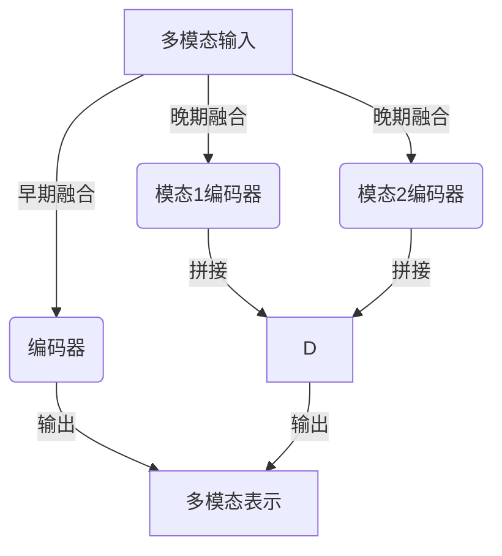
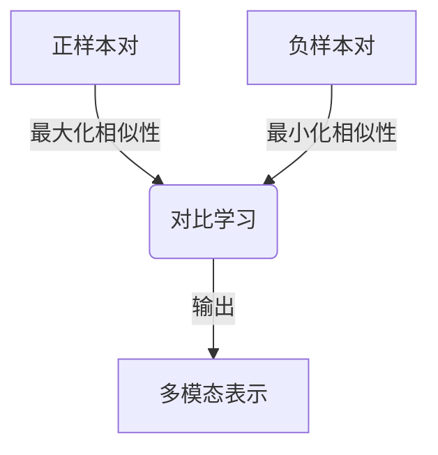
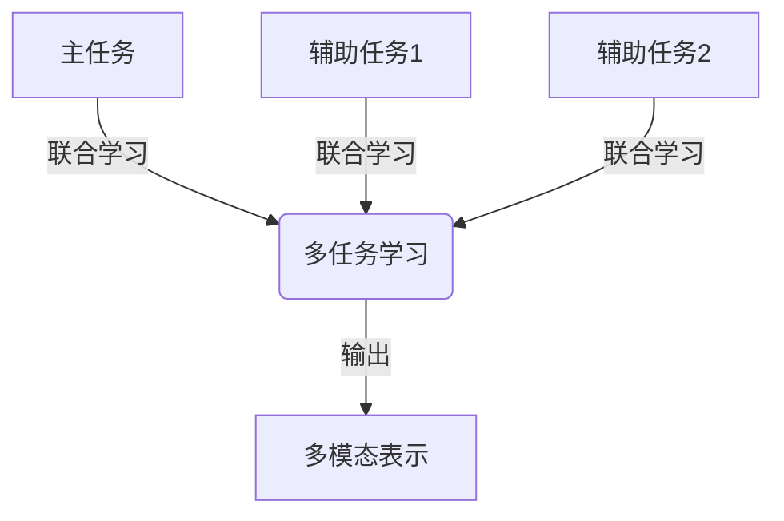
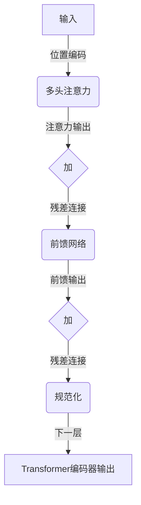
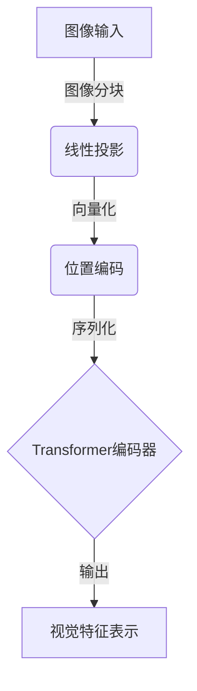
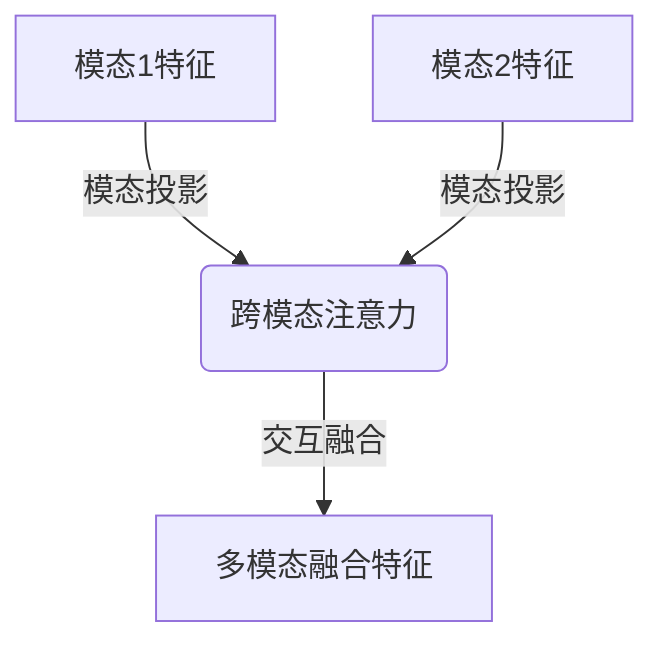
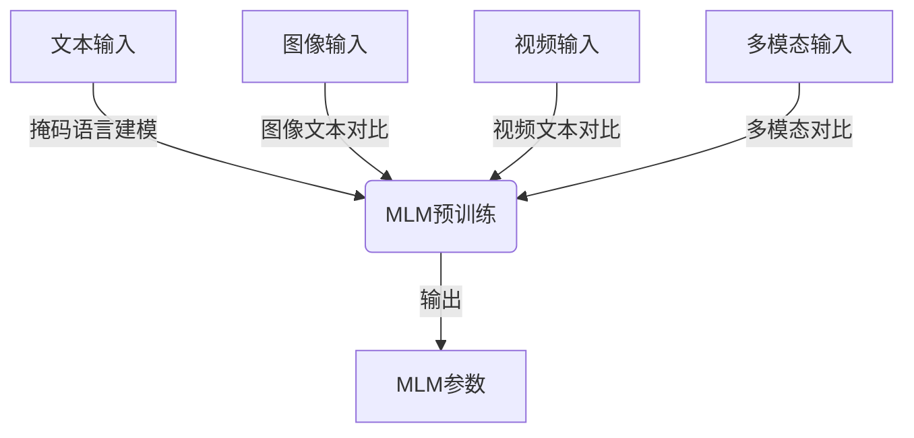

# 多模态大模型：技术原理与实战 自然语言处理的发展历程

## 1.背景介绍

### 1.1 自然语言处理的重要性

自然语言处理(Natural Language Processing, NLP)是人工智能领域中一个极具挑战和应用价值的分支。它旨在使计算机能够理解和生成人类语言,实现人机自然交互。随着大数据时代的到来,海量的非结构化文本数据急需被高效处理和分析,推动了NLP技术的快速发展。

### 1.2 NLP发展历程

早期的NLP系统主要基于规则和统计模型,需要大量的人工特征工程。随着深度学习的兴起,NLP领域取得了突破性进展。2018年,Transformer模型的提出极大地提高了序列建模的性能,成为NLP主流模型。而近年来,大规模预训练语言模型(PrLM)的出现,使NLP模型在下游任务上取得了惊人的成绩,推动了NLP的新一轮爆发式发展。

### 1.3 多模态大模型的兴起

尽管PrLM取得了巨大成功,但它们仍然局限于单一文本模态,无法充分利用多源异构数据。为了解决这一问题,多模态大模型(Multimodal Large Model, MLM)应运而生。MLM能够同时处理文本、图像、视频等多种模态数据,展现出强大的泛化能力,被视为人工智能发展的新前沿。

## 2.核心概念与联系

### 2.1 多模态表示学习

多模态表示学习旨在学习不同模态数据的联合表示,捕获模态间的相关性。常见的方法包括:

1. **早期融合**: 将不同模态数据拼接或级联后输入编码器
2. **晚期融合**: 分别对每个模态编码,然后将编码向量拼接
3. **交互融合**: 不同模态特征在编码过程中交互更新



### 2.2 多模态对比学习

对比学习(Contrastive Learning)是一种自监督学习范式,通过最大化正样本对的相似性,最小化负样本对的相似性,学习出良好的表示。在多模态场景下,对比学习可以增强模态间的相关性建模。



### 2.3 多任务学习

多任务学习(Multi-Task Learning)旨在同时优化多个相关任务的性能,利用任务间的关联知识提升泛化能力。在多模态场景下,可以设计多个不同模态的辅助任务,促进模型学习多模态交互特征。



## 3.核心算法原理具体操作步骤

### 3.1 Transformer编码器

Transformer编码器是MLM的核心组件,用于编码单模或多模输入序列。它主要包括以下步骤:

1. **位置编码**: 为输入序列添加位置信息
2. **多头注意力**: 计算查询向量与键向量的注意力权重,加权值向量
3. **前馈网络**: 对注意力输出进行非线性变换
4. **残差连接**: 将注意力输出和前馈输出分别与输入相加
5. **层范式**: 重复上述步骤多层以提取更高层次特征



### 3.2 Vision Transformer

用于处理图像等视觉模态输入的Vision Transformer(ViT),包括以下关键步骤:

1. **图像分块**: 将图像分割为多个图像块(Image Patch)
2. **线性投影**: 将每个图像块映射为一个向量
3. **位置编码**: 为图像块向量添加位置信息
4. **Transformer编码器**: 输入图像块序列,生成视觉特征表示



### 3.3 跨模态注意力

跨模态注意力机制是MLM的核心,用于捕获不同模态间的相关性:

1. **模态投影**: 将不同模态的特征映射到同一语义空间
2. **跨模态注意力**: 计算不同模态特征间的注意力权重
3. **交互融合**: 根据注意力权重,交互融合不同模态特征



### 3.4 预训练策略

MLM通常采用自监督的方式进行预训练,以捕获多模态数据的内在规律:

1. **掩码语言建模**: 在文本模态,随机掩码部分词元,预测被掩码词元
2. **图像文本对比**: 最大化图像和描述文本之间的相似性
3. **视频文本对比**: 最大化视频和描述文本之间的相似性
4. **多模态对比学习**: 最大化不同模态正样本对的相似性



## 4.数学模型和公式详细讲解举例说明

### 4.1 Transformer注意力机制

Transformer的核心是缩放点积注意力(Scaled Dotted-Product Attention),用于捕获序列元素间的长程依赖关系。给定查询向量$\mathbf{q}$、键向量$\mathbf{K}$和值向量$\mathbf{V}$,注意力计算公式如下:

$$\begin{aligned}
\text{Attention}(\mathbf{Q}, \mathbf{K}, \mathbf{V}) &= \text{softmax}\left(\frac{\mathbf{Q}\mathbf{K}^\top}{\sqrt{d_k}}\right)\mathbf{V} \\
&= \sum_{j=1}^n \alpha_{ij}\mathbf{v}_j
\end{aligned}$$

其中,$\alpha_{ij}$表示查询$\mathbf{q}_i$对键$\mathbf{k}_j$的注意力权重,$d_k$是缩放因子,用于防止内积值过大导致梯度消失。

多头注意力(Multi-Head Attention)则是将注意力分成多个子空间,分别计算后拼接,以提高表示能力:

$$\text{MultiHead}(\mathbf{Q}, \mathbf{K}, \mathbf{V}) = \text{Concat}(\text{head}_1, \dots, \text{head}_h)\mathbf{W}^O$$
$$\text{head}_i = \text{Attention}(\mathbf{Q}\mathbf{W}_i^Q, \mathbf{K}\mathbf{W}_i^K, \mathbf{V}\mathbf{W}_i^V)$$

其中,$\mathbf{W}_i^Q$、$\mathbf{W}_i^K$、$\mathbf{W}_i^V$和$\mathbf{W}^O$是可学习的线性投影参数。

### 4.2 视觉-语义对比损失

视觉-语义对比损失(Vision-Language Contrastive Loss)是MLM预训练中常用的目标函数,用于最大化视觉和语义模态之间的相似性。给定图像$\mathbf{v}$、文本$\mathbf{t}$和其他图像$\mathbf{v}^-$、文本$\mathbf{t}^-$作为负样本,损失函数定义为:

$$\mathcal{L}_\text{vc} = -\log\frac{e^{\text{sim}(\mathbf{v}, \mathbf{t})/\tau}}{\sum_{(\mathbf{v}^-, \mathbf{t}^-)} e^{\text{sim}(\mathbf{v}, \mathbf{t}^-)/\tau} + e^{\text{sim}(\mathbf{v}^-, \mathbf{t})/\tau}}$$

其中,$\text{sim}(\cdot, \cdot)$表示两个向量的相似度函数(如点积或余弦相似度),$\tau$是温度超参数,用于控制相似度分布的平滑程度。

此外,还可以添加掩码语言建模损失$\mathcal{L}_\text{mlm}$和图像重建损失$\mathcal{L}_\text{recon}$等辅助损失,形成多任务联合训练目标:

$$\mathcal{L} = \mathcal{L}_\text{vc} + \lambda_1 \mathcal{L}_\text{mlm} + \lambda_2 \mathcal{L}_\text{recon}$$

其中,$\lambda_1$和$\lambda_2$是损失项的权重系数。

## 5.项目实践:代码实例和详细解释说明

以下是一个基于PyTorch实现的简化版MLM示例代码,用于图像-文本双模态建模任务。

### 5.1 数据预处理

```python
import torch
from torchvision import transforms

# 图像预处理
image_transform = transforms.Compose([
    transforms.Resize(256),
    transforms.CenterCrop(224),
    transforms.ToTensor(),
    transforms.Normalize(mean=[0.485, 0.456, 0.406], std=[0.229, 0.224, 0.225])
])

# 文本预处理
tokenizer = BertTokenizer.from_pretrained('bert-base-uncased')

def process_data(images, texts):
    processed_images = [image_transform(image) for image in images]
    encoded_texts = [tokenizer.encode_plus(text, padding='max_length', max_length=32, return_tensors='pt', truncation=True) for text in texts]
    
    image_tensors = torch.stack(processed_images)
    text_input_ids = torch.cat([encoded['input_ids'] for encoded in encoded_texts], dim=0)
    text_attention_mask = torch.cat([encoded['attention_mask'] for encoded in encoded_texts], dim=0)
    
    return image_tensors, text_input_ids, text_attention_mask
```

### 5.2 模型定义

```python
import torch.nn as nn

class MultimodalTransformer(nn.Module):
    def __init__(self, text_dim, image_dim, hidden_dim, num_heads, num_layers):
        super().__init__()
        self.text_encoder = BertModel.from_pretrained('bert-base-uncased')
        self.image_encoder = ViTModel(image_dim, hidden_dim, num_heads, num_layers)
        
        self.text_proj = nn.Linear(text_dim, hidden_dim)
        self.image_proj = nn.Linear(image_dim, hidden_dim)
        
        self.cross_attn = nn.MultiheadAttention(hidden_dim, num_heads)
        self.output_layer = nn.Linear(hidden_dim, 1)
        
    def forward(self, images, text_input_ids, text_attention_mask):
        text_feats = self.text_encoder(text_input_ids, text_attention_mask)[1]
        text_feats = self.text_proj(text_feats)
        
        image_feats = self.image_encoder(images)
        image_feats = self.image_proj(image_feats)
        
        cross_feats, _ = self.cross_attn(text_feats, image_feats, image_feats)
        output = self.output_layer(cross_feats)
        
        return output
```

### 5.3 训练和评估

```python
import torch.optim as optim

device = torch.device('cuda' if torch.cuda.is_available() else 'cpu')
model = MultimodalTransformer(text_dim=768, image_dim=768, hidden_dim=512, num_heads=8, num_layers=6).to(device)
criterion = nn.CrossEntropyLoss()
optimizer = optim.Adam(model.parameters(), lr=1e-4)

for epoch in range(num_epochs):
    for images, text_input_ids, text_attention_mask, labels in dataloader:
        images