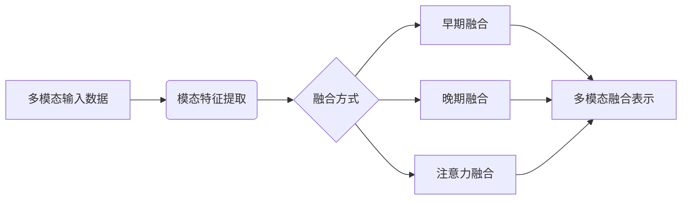
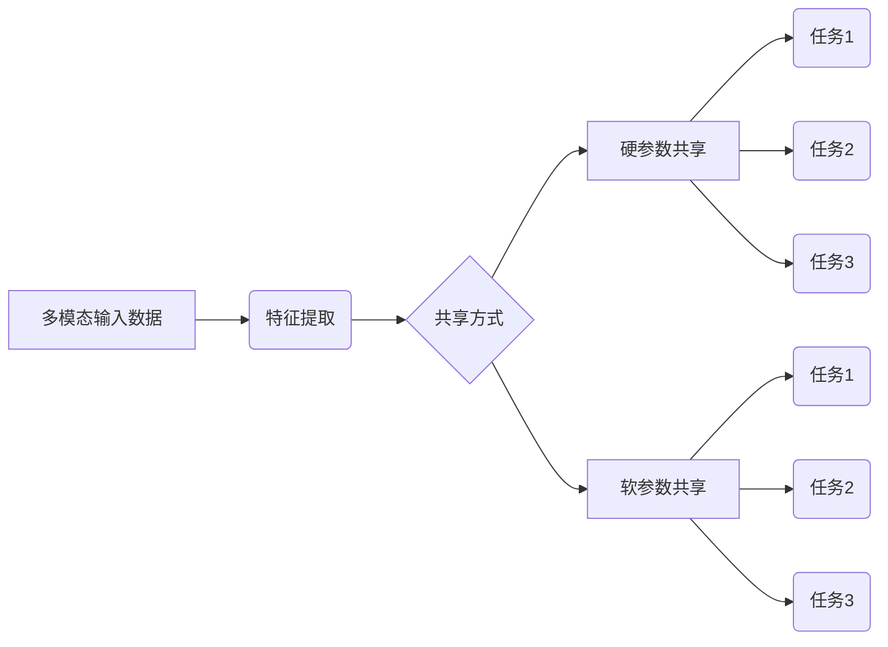
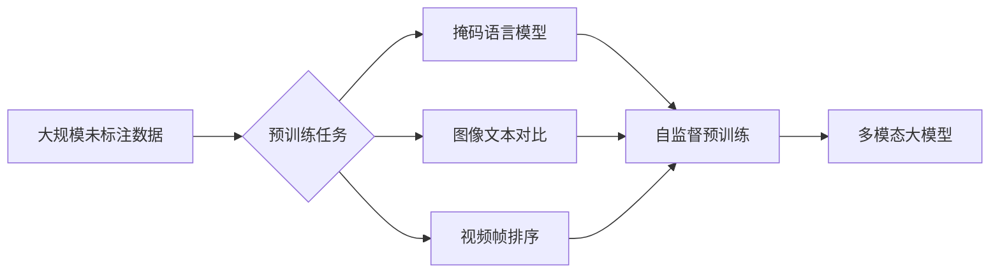
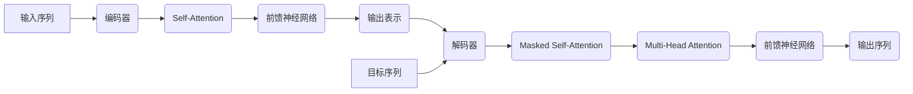
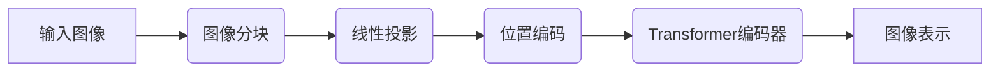
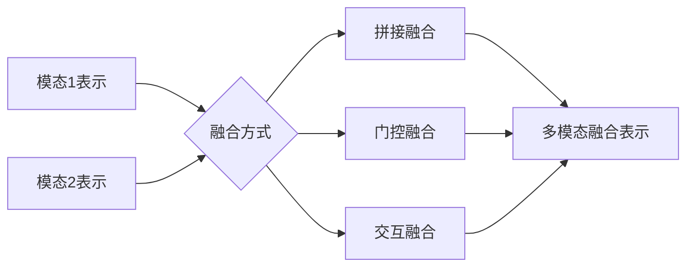
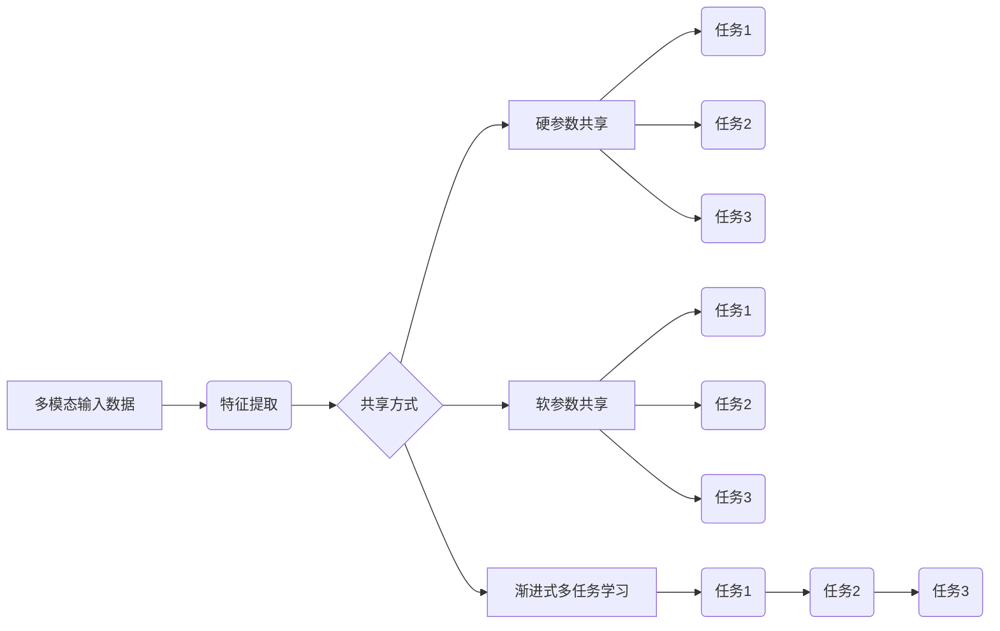

# 多模态大模型：技术原理与实战 认知能力评测

## 1.背景介绍

### 1.1 人工智能发展历程

人工智能(Artificial Intelligence, AI)是当代科技发展的重要方向,自20世纪50年代诞生以来,已经经历了几个重要发展阶段。早期的人工智能系统主要基于规则和逻辑推理,如专家系统、决策树等。20世纪80年代,机器学习算法开始兴起,如支持向量机、决策树等,能从数据中自动学习模型。进入21世纪,深度学习算法在语音识别、计算机视觉等领域取得突破性进展。

### 1.2 大模型兴起

近年来,由于算力、数据和模型优化算法的飞速进步,大规模的深度神经网络模型开始兴起。这些大模型通过在海量数据上预训练,获得了强大的模式识别和泛化能力。2018年,谷歌的BERT模型在自然语言处理任务上取得重大突破,掀起了预训练语言模型的热潮。2021年,OpenAI的GPT-3大模型展现了惊人的文本生成能力,进一步推动了大模型的发展。

### 1.3 多模态大模型兴起

单模态大模型只能处理单一类型的数据,如文本或图像。但现实世界是多模态的,人类认知是基于视觉、听觉、语言等多种信息源的融合。为了更好地模拟人类认知,多模态大模型应运而生。多模态大模型能同时处理文本、图像、视频、语音等多种模态数据,在多模态任务上展现出优异的性能,如视觉问答、图文生成等,被视为人工智能发展的新前沿。

## 2.核心概念与联系

### 2.1 多模态表示学习

多模态表示学习(Multimodal Representation Learning)是多模态大模型的核心技术,旨在从多种模态数据中学习出统一的表示,捕获不同模态之间的相关性。常用的方法包括:

1. **早期融合**(Early Fusion):在底层直接拼接不同模态的特征,通过后续的网络层学习融合表示。
2. **晚期融合**(Late Fusion):先分别学习每种模态的表示,然后在高层融合。
3. **注意力融合**(Attention Fusion):使用注意力机制动态地融合不同模态的表示。

### 2.2 多任务学习

多任务学习(Multi-Task Learning)是训练单个模型同时完成多个相关任务的范式。在多模态大模型中,通过在多个任务上联合训练,可以提高模型的泛化能力,增强模型对不同模态和任务的理解。常见的多任务学习方式包括:

1. **硬参数共享**(Hard Parameter Sharing):不同任务共享模型的部分或全部参数。
2. **软参数共享**(Soft Parameter Sharing):为每个任务设置独立参数,通过正则化约束参数之间的相似性。

### 2.3 自监督预训练

自监督预训练(Self-Supervised Pretraining)是多模态大模型的关键技术。与监督学习需要大量人工标注数据不同,自监督学习可以利用大规模未标注的数据进行预训练,从而获得强大的模式识别和泛化能力。常见的自监督预训练策略包括:

1. **掩码语言模型**(Masked Language Modeling):随机掩码部分文本,预测被掩码的词语。
2. **图像文本对比**(Image-Text Contrastive):最大化图像和对应文本描述的相似性,最小化与其他文本的相似性。
3. **视频帧排序**(Video Frame Ordering):打乱视频帧序列,预测正确的帧序。

## 3.核心算法原理具体操作步骤

### 3.1 Transformer模型

Transformer是多模态大模型的核心架构,具有高度的并行性和长距离依赖建模能力。它主要由编码器(Encoder)和解码器(Decoder)组成,使用Self-Attention机制捕获输入序列中元素之间的依赖关系,而不需要复杂的循环或卷积操作。

1. **编码器**(Encoder):将输入序列(如文本、图像等)映射为隐藏表示。
2. **解码器**(Decoder):基于编码器的输出和目标序列(如需生成的文本),生成预测序列。

### 3.2 Vision Transformer

Vision Transformer(ViT)是Transformer在计算机视觉领域的应用,直接对图像分块作为输入序列,通过Transformer编码器学习图像的表示。

1. **图像分块**(Image Patchification):将图像分割为多个图像块(Patch)。
2. **线性投影**(Linear Projection):将每个图像块映射为一个固定维度的向量。
3. **位置编码**(Position Encoding):为每个向量添加位置信息。
4. **Transformer编码器**(Transformer Encoder):输入向量序列,输出图像的隐藏表示。

### 3.3 多模态融合

多模态大模型需要将不同模态的表示进行融合,以捕获跨模态的相关性。常见的融合方式包括:

1. **拼接融合**(Concatenation Fusion):直接将不同模态的表示拼接在一起。
2. **门控融合**(Gated Fusion):使用门控机制动态控制不同模态的融合权重。
3. **交互融合**(Interactive Fusion):在不同模态之间建立交互,使模态之间的表示相互影响。

### 3.4 多任务学习

多任务学习可以提高模型的泛化能力,常见的多任务学习方式包括:

1. **硬参数共享**(Hard Parameter Sharing):不同任务共享模型的部分或全部参数。
2. **软参数共享**(Soft Parameter Sharing):为每个任务设置独立参数,通过正则化约束参数之间的相似性。
3. **渐进式多任务学习**(Progressive Multi-Task Learning):按一定顺序逐步加入新任务,避免遗忘先前学习的知识。

## 4.数学模型和公式详细讲解举例说明

### 4.1 Self-Attention机制

Self-Attention是Transformer模型的核心机制,用于捕获序列中元素之间的长距离依赖关系。给定一个序列 $X = (x_1, x_2, \dots, x_n)$,Self-Attention的计算过程如下:

1. **查询向量**(Query)、**键向量**(Key)和**值向量**(Value):将输入序列 $X$ 分别映射为 $Q$、$K$ 和 $V$。

$$Q = XW_Q, K = XW_K, V = XW_V$$

其中 $W_Q$、$W_K$ 和 $W_V$ 是可学习的权重矩阵。

2. **注意力分数**(Attention Scores):计算查询向量 $Q$ 与所有键向量 $K$ 的相似性,得到注意力分数矩阵 $A$。

$$A = \text{softmax}\left(\frac{QK^T}{\sqrt{d_k}}\right)$$

其中 $d_k$ 是缩放因子,用于防止内积值过大导致梯度消失。

3. **加权求和**(Weighted Sum):将注意力分数 $A$ 与值向量 $V$ 相乘,得到输出表示 $Z$。

$$Z = AV$$

通过Self-Attention,模型可以自适应地为每个输出元素分配注意力权重,关注序列中的不同部分。

### 4.2 多头注意力机制

为了捕获不同子空间的依赖关系,Transformer引入了多头注意力(Multi-Head Attention)机制。给定 $h$ 个注意力头,每个头都会独立计算注意力,然后将所有头的输出拼接起来。

对于第 $i$ 个注意力头,其计算过程为:

$$\text{Head}_i = \text{Attention}(QW_i^Q, KW_i^K, VW_i^V)$$

其中 $W_i^Q$、$W_i^K$ 和 $W_i^V$ 是该头的可学习权重矩阵。

多头注意力的输出为所有头的拼接:

$$\text{MultiHead}(Q, K, V) = \text{Concat}(\text{Head}_1, \dots, \text{Head}_h)W^O$$

其中 $W^O$ 是可学习的输出权重矩阵。

通过多头注意力机制,模型可以从不同子空间捕获不同的依赖关系,提高了模型的表示能力。

### 4.3 掩码语言模型

掩码语言模型(Masked Language Modeling, MLM)是自监督预训练的一种常用策略,通过预测被掩码的词语来学习语义表示。给定一个文本序列 $X = (x_1, x_2, \dots, x_n)$,MLM的目标是最大化掩码词语的条件概率:

$$\mathcal{L}_\text{MLM} = -\mathbb{E}_{X, \mathcal{M}}\left[\sum_{i \in \mathcal{M}}\log P(x_i | X_{\backslash \mathcal{M}})\right]$$

其中 $\mathcal{M}$ 是被掩码的词语位置集合, $X_{\backslash \mathcal{M}}$ 表示去掉掩码词语的序列。

在预训练过程中,模型需要基于上下文信息推断出被掩码的词语,从而学习到有效的语义表示。

### 4.4 对比学习

对比学习(Contrastive Learning)是自监督预训练的另一种重要策略,通过最大化正样本对的相似性,最小化负样本对的相似性,学习出有区分性的表示。

给定一个正样本对 $(x, x^+)$ 和一组负样本 $\{x^-_1, x^-_2, \dots, x^-_k\}$,对比损失函数可以定义为:

$$\mathcal{L}_\text{CL} = -\log \frac{e^{\text{sim}(f(x), f(x^+)) / \tau}}{\sum_{x^- \in \{x^-_1, \dots, x^-_k\}} e^{\text{sim}(f(x), f(x^-)) / \tau}}$$

其中 $f(\cdot)$ 是编码器网络, $\text{sim}(\cdot, \cdot)$ 是相似性函数(如点积), $\tau$ 是温度超