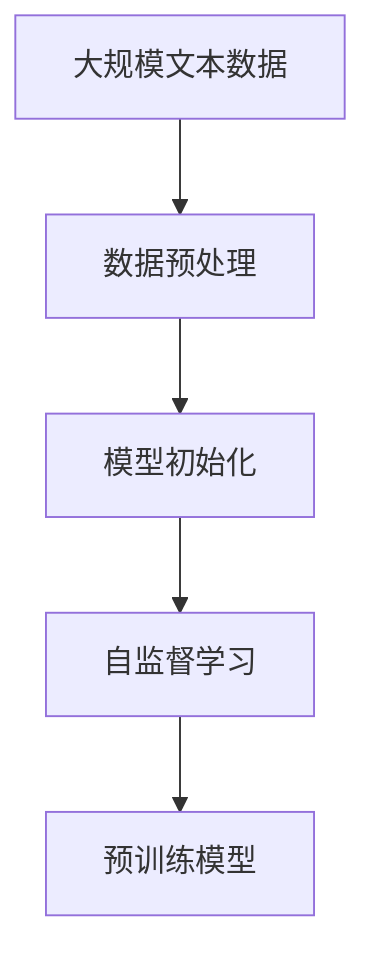
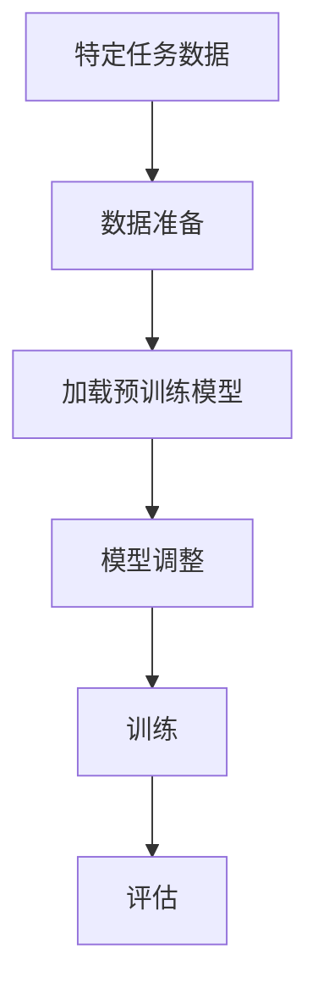

# 大语言模型原理与工程实践：大语言模型微调面临的挑战

## 1.背景介绍

大语言模型（Large Language Models, LLMs）近年来在自然语言处理（NLP）领域取得了显著的进展。诸如GPT-3、BERT和T5等模型在各种任务中表现出色，从文本生成到翻译，再到问答系统。然而，尽管这些模型在预训练阶段表现出色，但在实际应用中，微调（Fine-tuning）过程仍然面临诸多挑战。本文将深入探讨大语言模型微调的原理、挑战及其解决方案。

## 2.核心概念与联系

### 2.1 大语言模型简介

大语言模型是基于深度学习的模型，通常使用数十亿甚至数百亿的参数进行训练。它们通过在大规模文本数据上进行预训练，学习到丰富的语言表示。

### 2.2 微调的定义

微调是指在预训练模型的基础上，使用特定任务的数据进行进一步训练，以提高模型在该任务上的表现。微调通常涉及调整模型的参数，使其更适应特定任务的需求。

### 2.3 预训练与微调的关系

预训练和微调是大语言模型训练过程中的两个关键阶段。预训练阶段，模型在大规模通用数据上学习语言表示；微调阶段，模型在特定任务数据上进行优化。

## 3.核心算法原理具体操作步骤

### 3.1 预训练阶段

预训练阶段通常使用自监督学习方法，如掩码语言模型（Masked Language Model, MLM）和自回归语言模型（Autoregressive Language Model, ARLM）。



### 3.2 微调阶段

微调阶段通常包括以下步骤：

1. **数据准备**：收集并清洗特定任务的数据。
2. **模型加载**：加载预训练模型。
3. **模型调整**：根据任务需求调整模型架构。
4. **训练**：使用特定任务数据进行训练。
5. **评估**：评估模型在特定任务上的表现。



## 4.数学模型和公式详细讲解举例说明

### 4.1 预训练目标函数

在预训练阶段，常用的目标函数是最大化似然估计（Maximum Likelihood Estimation, MLE）。对于自回归语言模型，目标函数可以表示为：

$$
L(\theta) = \sum_{t=1}^{T} \log P(x_t | x_{1:t-1}; \theta)
$$

其中，$x_t$ 表示第 $t$ 个词，$\theta$ 表示模型参数。

### 4.2 微调目标函数

在微调阶段，目标函数通常根据具体任务而定。例如，对于分类任务，常用的目标函数是交叉熵损失（Cross-Entropy Loss）：

$$
L(\theta) = -\sum_{i=1}^{N} y_i \log P(y_i | x_i; \theta)
$$

其中，$y_i$ 表示第 $i$ 个样本的真实标签，$P(y_i | x_i; \theta)$ 表示模型预测的概率。

## 5.项目实践：代码实例和详细解释说明

### 5.1 数据准备

```python
import pandas as pd

# 加载数据
data = pd.read_csv('task_data.csv')

# 数据清洗
data = data.dropna()
data['text'] = data['text'].apply(lambda x: x.lower())
```

### 5.2 模型加载与调整

```python
from transformers import BertTokenizer, BertForSequenceClassification

# 加载预训练模型和分词器
tokenizer = BertTokenizer.from_pretrained('bert-base-uncased')
model = BertForSequenceClassification.from_pretrained('bert-base-uncased', num_labels=2)

# 模型调整
model.config.hidden_dropout_prob = 0.3
```

### 5.3 训练与评估

```python
from transformers import Trainer, TrainingArguments

# 准备训练数据
train_encodings = tokenizer(data['text'].tolist(), truncation=True, padding=True)
train_labels = data['label'].tolist()

# 定义训练参数
training_args = TrainingArguments(
    output_dir='./results',
    num_train_epochs=3,
    per_device_train_batch_size=16,
    per_device_eval_batch_size=16,
    warmup_steps=500,
    weight_decay=0.01,
    logging_dir='./logs',
)

# 定义Trainer
trainer = Trainer(
    model=model,
    args=training_args,
    train_dataset=train_encodings,
    eval_dataset=eval_encodings
)

# 训练模型
trainer.train()

# 评估模型
trainer.evaluate()
```

## 6.实际应用场景

### 6.1 文本分类

大语言模型可以用于文本分类任务，如垃圾邮件检测、情感分析等。

### 6.2 机器翻译

通过微调，大语言模型可以在特定语言对上实现高质量的机器翻译。

### 6.3 问答系统

大语言模型可以用于构建智能问答系统，提供准确的答案。

## 7.工具和资源推荐

### 7.1 工具

- **Transformers**：Hugging Face 提供的开源库，支持多种预训练模型。
- **TensorFlow**：谷歌开发的深度学习框架，支持大规模模型训练。
- **PyTorch**：Facebook 开发的深度学习框架，灵活性高，适合研究和开发。

### 7.2 资源

- **论文**：阅读最新的研究论文，如《Attention is All You Need》、《BERT: Pre-training of Deep Bidirectional Transformers for Language Understanding》等。
- **数据集**：使用公开的NLP数据集，如GLUE、SQuAD等。

## 8.总结：未来发展趋势与挑战

### 8.1 未来发展趋势

- **模型规模继续扩大**：随着计算资源的增加，未来的大语言模型将会更加庞大，性能也会进一步提升。
- **多模态学习**：结合图像、音频等多种模态的数据，提升模型的综合理解能力。
- **自监督学习**：自监督学习方法将会进一步发展，减少对标注数据的依赖。

### 8.2 挑战

- **计算资源需求**：大语言模型的训练和微调需要大量的计算资源，成本高昂。
- **数据隐私**：在使用大规模数据进行训练时，如何保护用户隐私是一个重要问题。
- **模型解释性**：大语言模型的复杂性使得其内部机制难以解释，影响了其在某些领域的应用。

## 9.附录：常见问题与解答

### 9.1 微调时常见的过拟合问题如何解决？

过拟合是微调过程中常见的问题，可以通过以下方法解决：
- 使用正则化技术，如L2正则化和Dropout。
- 增加训练数据量。
- 使用数据增强技术。

### 9.2 如何选择合适的预训练模型？

选择预训练模型时，可以考虑以下因素：
- 任务类型：不同的任务可能需要不同类型的预训练模型。
- 模型规模：根据计算资源选择合适规模的模型。
- 社区支持：选择有良好社区支持的模型，方便获取帮助和资源。

### 9.3 微调过程中如何设置超参数？

超参数设置是微调过程中的关键，可以通过以下方法进行优化：
- 网格搜索：尝试不同的超参数组合，选择最优的设置。
- 贝叶斯优化：使用贝叶斯优化方法自动搜索最优超参数。
- 经验法则：根据经验和文献推荐的设置进行调整。

---

作者：禅与计算机程序设计艺术 / Zen and the Art of Computer Programming