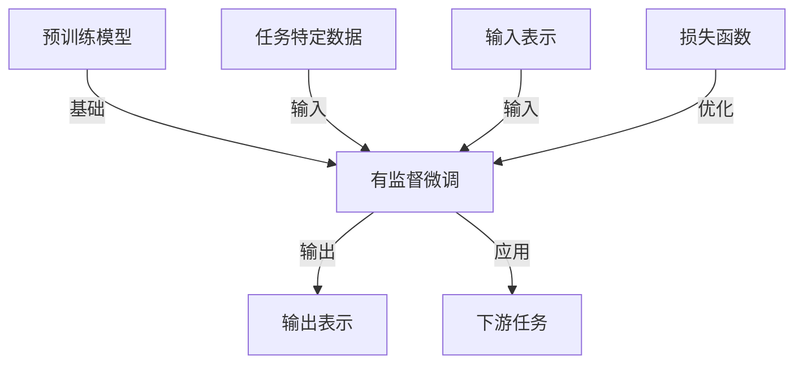

# 大语言模型原理与工程实践：挖掘大语言模型潜能：有监督微调

## 1.背景介绍

随着深度学习技术的不断发展,大型语言模型(Large Language Model, LLM)近年来取得了令人瞩目的进展。这些模型通过在大规模语料库上进行预训练,学习到了丰富的语言知识和上下文信息,展现出惊人的泛化能力。然而,直接使用预训练模型并不能完全满足实际应用场景的需求,因此有监督微调(Supervised Fine-tuning)作为一种广泛采用的技术,通过在特定任务数据上进行进一步训练,使模型能够更好地适应目标任务,充分挖掘大语言模型的潜能。

### 1.1 大语言模型的兴起

大语言模型的发展可以追溯到2018年,当时Transformer模型在机器翻译任务上取得了突破性的成果。随后,OpenAI发布了GPT(Generative Pre-trained Transformer)模型,展示了大型语言模型在自然语言生成任务上的卓越表现。接着,谷歌推出了BERT(Bidirectional Encoder Representations from Transformers)模型,在自然语言理解任务上取得了显著的进展。

### 1.2 大语言模型的优势

与传统的基于规则或统计方法相比,大语言模型具有以下优势:

1. **语义理解能力强**: 通过预训练,模型学习到了丰富的语义和上下文知识,能够更好地理解和生成自然语言。
2. **泛化能力好**: 模型在大规模语料库上进行预训练,因此能够更好地泛化到新的领域和任务。
3. **端到端训练**: 无需手工设计复杂的特征工程,模型可以直接从原始文本数据中学习特征表示。

### 1.3 有监督微调的必要性

尽管大语言模型展现出了强大的能力,但直接将预训练模型应用于特定任务通常效果并不理想。原因如下:

1. **预训练目标与下游任务存在差异**: 预训练阶段的目标函数(如掩码语言模型)与下游任务的目标函数(如文本分类、机器阅读理解等)存在差距。
2. **领域偏移**: 预训练语料库与下游任务数据的领域分布可能存在偏移,导致模型在新领域的表现下降。
3. **任务特定知识缺失**: 预训练模型缺乏针对特定任务的知识,需要通过进一步训练来获取相关知识。

因此,有监督微调作为一种广泛采用的技术,通过在特定任务数据上进行进一步训练,使模型能够更好地适应目标任务,充分挖掘大语言模型的潜能。

## 2.核心概念与联系

有监督微调是一种将预训练模型应用于特定任务的常用方法。它包含以下几个核心概念:

1. **预训练模型(Pre-trained Model)**: 通过自监督学习或无监督学习在大规模语料库上训练得到的基础语言模型,如BERT、GPT等。
2. **下游任务(Downstream Task)**: 需要应用语言模型的实际任务,如文本分类、机器阅读理解、序列到序列生成等。
3. **任务特定数据(Task-specific Data)**: 用于微调的标注数据集,与下游任务相关。
4. **微调(Fine-tuning)**: 在任务特定数据上对预训练模型进行进一步训练,使其适应目标任务。
5. **输入表示(Input Representation)**: 将文本输入转换为模型可以理解的张量表示,通常使用词嵌入或子词嵌入。
6. **输出表示(Output Representation)**: 模型对输入的输出表示,根据任务的不同可以是分类标签、span预测、序列生成等。
7. **损失函数(Loss Function)**: 用于优化模型参数的目标函数,根据任务的不同而有所不同。

这些概念之间的关系如下所示:



上图展示了有监督微调的核心流程。首先,我们需要一个预训练的语言模型作为基础模型。然后,将任务特定数据和输入表示作为输入,通过微调过程优化模型参数,使得模型的输出表示能够适应目标任务。在优化过程中,需要定义合适的损失函数来指导模型训练。最终,微调后的模型可以应用于特定的下游任务。

## 3.核心算法原理具体操作步骤

有监督微调的核心算法原理可以概括为以下几个步骤:

1. **加载预训练模型**: 首先需要加载一个预训练的语言模型,如BERT、GPT等,作为微调的基础模型。

2. **准备任务特定数据**: 根据目标任务,准备相应的标注数据集,用于微调模型。数据集通常需要进行预处理,如分词、标注转换等。

3. **构建输入表示**: 将文本输入转换为模型可以理解的张量表示,通常使用词嵌入或子词嵌入。对于不同的任务,输入表示的构建方式可能有所不同。

4. **定义输出表示**: 根据任务的不同,定义模型的输出表示形式。例如,对于文本分类任务,输出表示可以是分类标签的概率分布;对于机器阅读理解任务,输出表示可以是答案span的起始和终止位置。

5. **设计损失函数**: 根据任务的特点,设计合适的损失函数,用于优化模型参数。常见的损失函数包括交叉熵损失、平方损失等。

6. **微调模型参数**: 使用任务特定数据和定义好的损失函数,对预训练模型进行微调。通常采用梯度下降等优化算法,迭代地更新模型参数,使得模型在目标任务上的性能不断提高。

7. **模型评估**: 在验证集上评估微调后模型的性能,根据指标(如准确率、F1分数等)判断模型的效果。如果性能不理想,可以调整超参数或改进模型结构。

8. **模型部署**: 当模型性能满足要求后,可以将其部署到实际的应用系统中,用于处理目标任务。

需要注意的是,不同任务的具体细节可能有所不同,上述步骤只是一个通用的框架。在实际应用中,可能需要根据任务的特点进行一些调整和优化。

## 4.数学模型和公式详细讲解举例说明

在有监督微调过程中,我们需要定义合适的损失函数来优化模型参数。常见的损失函数包括交叉熵损失、平方损失等。下面我们以文本分类任务为例,详细介绍交叉熵损失的数学模型和公式。

### 4.1 交叉熵损失

交叉熵损失(Cross-Entropy Loss)是一种常用的损失函数,适用于多分类问题。它衡量了模型预测的概率分布与真实标签之间的差异。

对于单个样本,交叉熵损失的公式如下:

$$\mathcal{L}(y, \hat{y}) = -\sum_{c=1}^{C} y_c \log(\hat{y}_c)$$

其中:
- $y$ 是真实标签的一热编码向量,长度为 $C$ (类别数)
- $\hat{y}$ 是模型预测的概率分布向量,长度也为 $C$
- $y_c$ 和 $\hat{y}_c$ 分别表示 $y$ 和 $\hat{y}$ 在第 $c$ 个位置的值

对于整个训练集,交叉熵损失的计算公式为:

$$\mathcal{L} = -\frac{1}{N}\sum_{i=1}^{N}\sum_{c=1}^{C} y_c^{(i)} \log(\hat{y}_c^{(i)})$$

其中 $N$ 是训练集的样本数量。

我们可以通过梯度下降法来优化模型参数,使得交叉熵损失最小化。对于单个样本,交叉熵损失关于模型输出 $\hat{y}_c$ 的梯度为:

$$\frac{\partial \mathcal{L}}{\partial \hat{y}_c} = -\frac{y_c}{\hat{y}_c}$$

在实践中,为了防止分母为零导致的数值不稳定性,我们通常会对 $\hat{y}_c$ 加上一个很小的平滑项 $\epsilon$,即:

$$\frac{\partial \mathcal{L}}{\partial \hat{y}_c} = -\frac{y_c}{\hat{y}_c + \epsilon}$$

通过计算梯度并应用梯度下降法,我们可以不断更新模型参数,使得模型在训练集上的交叉熵损失最小化。

### 4.2 交叉熵损失的直观解释

交叉熵损失可以理解为模型预测概率分布与真实标签之间的"差异"或"距离"。具体来说:

- 对于正确的类别 $c$,如果模型预测的概率 $\hat{y}_c$ 越大,则 $\log(\hat{y}_c)$ 的值越大,交叉熵损失 $-y_c \log(\hat{y}_c)$ 就越小。
- 对于错误的类别 $c$,如果模型预测的概率 $\hat{y}_c$ 越小,则 $\log(\hat{y}_c)$ 的值越小(接近负无穷),交叉熵损失 $-y_c \log(\hat{y}_c)$ 也越小(接近零)。

因此,交叉熵损失函数会"惩罚"模型对正确类别的低概率预测,以及对错误类别的高概率预测。通过最小化交叉熵损失,模型会被引导去学习将正确类别的概率预测为尽可能大,错误类别的概率预测为尽可能小,从而提高分类准确率。

### 4.3 交叉熵损失的例子

假设我们有一个三分类问题,真实标签为 $[0, 1, 0]$,模型预测的概率分布为 $[0.1, 0.7, 0.2]$。

根据交叉熵损失的公式,我们可以计算出损失值为:

$$\begin{aligned}
\mathcal{L} &= -(0 \log(0.1) + 1 \log(0.7) + 0 \log(0.2)) \\
           &= -(0 + (-0.357) + 0) \\
           &= 0.357
\end{aligned}$$

我们可以看到,由于模型对正确类别(第二类)的预测概率 $0.7$ 较高,而对错误类别(第一类和第三类)的预测概率 $0.1$ 和 $0.2$ 较低,因此交叉熵损失的值相对较小。

如果我们将模型预测的概率分布改为 $[0.6, 0.2, 0.2]$,则交叉熵损失会变为:

$$\begin{aligned}
\mathcal{L} &= -(0 \log(0.6) + 1 \log(0.2) + 0 \log(0.2)) \\
           &= -(0 + (-1.609) + 0) \\
           &= 1.609
\end{aligned}$$

我们可以看到,由于模型对正确类别(第二类)的预测概率 $0.2$ 较低,而对错误类别(第一类)的预测概率 $0.6$ 较高,因此交叉熵损失的值变大了。

通过这个例子,我们可以直观地感受到交叉熵损失函数如何"惩罚"模型对正确类别的低概率预测,以及对错误类别的高概率预测,从而引导模型学习更准确的概率预测。

## 5.项目实践:代码实例和详细解释说明

在这一部分,我们将通过一个文本分类任务的实例,演示如何使用PyTorch框架进行有监督微调。我们将使用BERT作为预训练模型,并在IMDB电影评论数据集上进行微调,以完成二分类任务(判断评论的情感是正面还是负面)。

### 5.1 准备工作

首先,我们需要导入必要的库和模块:

```python
import torch
from torch.utils.data import DataLoader, TensorDataset
from transformers import BertTokenizer, BertForSequenceClassification
```

然后,加载IMDB数据集并进行预处理:

```python
from torchtext.