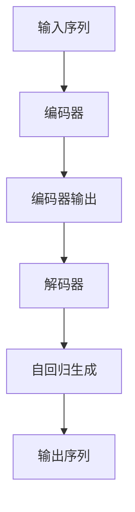

# 大语言模型原理与工程实践：解码器

## 1.背景介绍

### 1.1 什么是大语言模型?

大语言模型(Large Language Model, LLM)是一种基于深度学习的自然语言处理(NLP)模型,通过在大规模语料库上进行预训练,学习语言的统计规律和语义关联。这些模型能够理解和生成人类语言,在各种自然语言处理任务中表现出色,如机器翻译、问答系统、文本摘要和内容生成等。

大语言模型的核心是transformer编码器-解码器架构,包含两个主要组件:编码器(Encoder)和解码器(Decoder)。编码器负责处理输入序列,将其映射为语义向量表示;解码器则根据编码器的输出,生成相应的目标序列输出。

### 1.2 解码器在大语言模型中的作用

解码器是大语言模型中至关重要的一个组件,负责将编码器的输出转化为目标序列。在生成任务(如机器翻译、文本摘要等)中,解码器根据输入序列的语义表示,自回归地生成每个目标词元,直至生成完整的输出序列。

解码器的设计和优化对于提高大语言模型的性能至关重要。高效的解码算法能够加快推理速度,减少计算资源消耗;合理的解码策略能够提升输出质量,生成更加流畅、连贯的文本。

## 2.核心概念与联系

### 2.1 自回归(Autoregressive)

自回归是解码器生成序列的核心机制。在每个时间步,解码器根据之前生成的词元和编码器的输出,预测当前时间步的词元概率分布,并从中采样获得输出词元。这种方式使得解码器能够捕捉序列内部的依赖关系,生成连贯的文本。

自回归过程可以形式化表示为:

$$P(y_1, y_2, ..., y_T) = \prod_{t=1}^{T}P(y_t|y_1, y_2, ..., y_{t-1}, x)$$

其中 $x$ 表示输入序列, $y_1, y_2, ..., y_T$ 表示目标序列。解码器在每个时间步 $t$ 预测当前词元 $y_t$ 的概率,条件于之前生成的词元 $y_1, y_2, ..., y_{t-1}$ 和输入序列 $x$。

### 2.2 注意力机制(Attention Mechanism)

注意力机制是transformer架构中的关键创新,使得模型能够在编码和解码过程中,动态地关注输入序列的不同部分,捕捉长距离依赖关系。

在解码器中,注意力机制包括两个部分:

1. **Encoder-Decoder Attention**:解码器关注编码器输出的不同位置,获取与当前生成步骤相关的语义信息。
2. **Self-Attention**:解码器关注自身之前生成的词元,捕捉目标序列内部的依赖关系。

注意力机制赋予了解码器强大的建模能力,使其能够灵活地关注不同的语义信息,生成高质量的输出序列。

### 2.3 掩码机制(Masking)

在自回归生成过程中,解码器不能利用当前时间步之后的信息,否则会导致训练时的信息泄露。因此需要采用掩码机制,在Self-Attention中屏蔽未来时间步的信息。

掩码机制通过构造掩码张量,将注意力分数矩阵中对应未来位置的值设置为负无穷,确保这些位置的注意力权重为0,从而避免利用未来信息。



## 3.核心算法原理具体操作步骤

### 3.1 Transformer解码器架构

Transformer解码器的核心架构包括以下几个主要模块:

1. **Word Embedding层**:将输入词元映射为词向量表示。
2. **位置编码(Positional Encoding)**:引入位置信息,使模型能够捕捉序列的顺序结构。
3. **掩码多头自注意力(Masked Multi-Head Self-Attention)**:捕捉目标序列内部的依赖关系,并应用掩码机制避免利用未来信息。
4. **多头注意力(Multi-Head Attention)**:将编码器输出和当前解码器状态相结合,获取与当前生成步骤相关的语义信息。
5. **前馈神经网络(Feed-Forward Network)**:对注意力输出进行非线性变换,提取更高层次的特征表示。
6. **规范化(Normalization)**和**残差连接(Residual Connection)**:加速训练收敛并缓解梯度消失问题。

解码器的核心操作步骤如下:

1. 将输入词元映射为词向量表示,并添加位置编码。
2. 通过掩码多头自注意力模块,捕捉目标序列内部的依赖关系。
3. 将自注意力输出与编码器输出相结合,通过多头注意力模块获取与当前生成步骤相关的语义信息。
4. 对注意力输出进行前馈神经网络变换,提取更高层次的特征表示。
5. 将特征表示输入到输出层,生成当前时间步的词元概率分布。
6. 根据概率分布采样输出词元,重复上述步骤直至生成完整序列。

### 3.2 Beam Search解码策略

Beam Search是解码器中常用的近似搜索算法,旨在生成更高质量的输出序列。它维护一组概率最高的候选序列(beam),在每个时间步根据概率对这些候选序列进行扩展和剪枝,最终输出概率最高的序列作为结果。

Beam Search算法步骤如下:

1. 初始化beam,包含起始词元`<bos>`。
2. 对于beam中的每个候选序列:
    a. 通过解码器生成下一个时间步的概率分布。
    b. 获取概率最高的k个词元,与当前候选序列相结合,形成k个新的候选序列。
3. 将所有新生成的候选序列按照总体概率从高到低排序,保留概率最高的beam_size个序列作为新的beam。
4. 重复步骤2-3,直到所有序列均生成终止词元`<eos>`或达到最大长度。
5. 从beam中选择概率最高的序列作为最终输出。

通过Beam Search,解码器能够在一定程度上避免局部最优,生成整体质量更高的输出序列。但同时也增加了计算开销,需要在性能和质量之间进行权衡。

### 3.3 Top-K/Top-P采样策略

在自回归生成过程中,通常需要从解码器输出的词元概率分布中采样获得输出词元。常用的采样策略包括Top-K采样和Top-P采样。

**Top-K采样**:从概率分布中挑选出概率值最高的K个词元,并从这K个词元中进行采样。这种方式能够过滤掉低概率的词元,提高输出质量,但可能会导致生成的文本缺乏多样性。

**Top-P采样**:从概率分布中挑选出累积概率达到阈值P的最小词元集合,并从这些词元中进行采样。这种方式能够在保留一定多样性的同时,也能够避免生成低概率的词元。

这两种采样策略都能够在一定程度上缓解解码器的重复性和无意义输出问题,提高生成质量。在实践中,通常需要根据具体任务和需求,调整采样策略的参数,以获得最佳效果。

## 4.数学模型和公式详细讲解举例说明

### 4.1 Transformer解码器数学模型

Transformer解码器的数学模型可以表示为:

$$\begin{aligned}
&\mathbf{Q}, \mathbf{K}, \mathbf{V} = \text{Linear}(\mathbf{X}) \\
&\text{Attention}(\mathbf{Q}, \mathbf{K}, \mathbf{V}) = \text{Softmax}\left(\frac{\mathbf{Q}\mathbf{K}^T}{\sqrt{d_k}}\right)\mathbf{V} \\
&\text{MultiHead}(\mathbf{Q}, \mathbf{K}, \mathbf{V}) = \text{Concat}(\text{head}_1, \ldots, \text{head}_h)\mathbf{W}^O \\
&\text{where } \text{head}_i = \text{Attention}(\mathbf{Q}\mathbf{W}_i^Q, \mathbf{K}\mathbf{W}_i^K, \mathbf{V}\mathbf{W}_i^V) \\
&\mathbf{Y} = \text{Transformer}(\mathbf{X}) = \text{Norm}(\mathbf{X} + \text{MultiHead}(\mathbf{Q}, \mathbf{K}, \mathbf{V})) \\
&\mathbf{Z} = \text{FFN}(\mathbf{Y}) = \max(0, \mathbf{Y}\mathbf{W}_1 + \mathbf{b}_1)\mathbf{W}_2 + \mathbf{b}_2 \\
&\mathbf{O} = \text{Norm}(\mathbf{Y} + \mathbf{Z})
\end{aligned}$$

其中:

- $\mathbf{X}$是输入序列的词向量表示
- $\mathbf{Q}$、$\mathbf{K}$、$\mathbf{V}$分别表示查询(Query)、键(Key)和值(Value)
- $\text{Attention}(\mathbf{Q}, \mathbf{K}, \mathbf{V})$计算注意力权重和加权值
- $\text{MultiHead}(\mathbf{Q}, \mathbf{K}, \mathbf{V})$是多头注意力机制
- $\text{Norm}$表示层归一化(Layer Normalization)
- $\text{FFN}$是前馈神经网络,用于提取高层次特征
- $\mathbf{W}$和$\mathbf{b}$是可学习的权重和偏置参数

解码器通过自注意力(Self-Attention)和编码器-解码器注意力(Encoder-Decoder Attention)模块交替计算,捕捉目标序列内部和与输入序列之间的依赖关系。最终输出$\mathbf{O}$作为解码器的输出特征表示,送入输出层生成目标序列。

### 4.2 注意力分数计算示例

假设我们有一个输入序列"今天天气很好",对应的词向量表示为$\mathbf{X} = [\mathbf{x}_1, \mathbf{x}_2, \mathbf{x}_3, \mathbf{x}_4]$。我们计算第三个词"很"的注意力分数,即查询向量$\mathbf{q} = \mathbf{x}_3$,键向量$\mathbf{K} = [\mathbf{k}_1, \mathbf{k}_2, \mathbf{k}_3, \mathbf{k}_4]$,值向量$\mathbf{V} = [\mathbf{v}_1, \mathbf{v}_2, \mathbf{v}_3, \mathbf{v}_4]$。

注意力分数计算过程如下:

$$\begin{aligned}
\text{score}(\mathbf{q}, \mathbf{k}_i) &= \frac{\mathbf{q} \cdot \mathbf{k}_i}{\sqrt{d_k}} \\
\text{where } i &\in \{1, 2, 3, 4\} \\
\alpha_i &= \text{Softmax}(\text{score}(\mathbf{q}, \mathbf{k}_i)) \\
\text{Attention}(\mathbf{q}, \mathbf{K}, \mathbf{V}) &= \sum_{i=1}^4 \alpha_i \mathbf{v}_i
\end{aligned}$$

其中$d_k$是键向量的维度,用于缩放点积注意力分数。$\alpha_i$是通过Softmax函数计算得到的注意力权重,代表了查询向量$\mathbf{q}$对键向量$\mathbf{k}_i$的关注程度。

最终,注意力机制通过加权求和的方式,将值向量$\mathbf{V}$中的信息融合到查询向量$\mathbf{q}$的表示中,得到注意力输出$\text{Attention}(\mathbf{q}, \mathbf{K}, \mathbf{V})$。

## 5.项目实践:代码实例和详细解释说明

以下是使用PyTorch实现Transformer解码器的代码示例,包括解码器模块的定义和Beam Search解码器的实现。

```python
import torch
import torch.nn as nn
import torch.nn.functional as F

class TransformerDecoder(nn.Module):
    def __init__(self, vocab_size, d_model, nhead, num_layers, dim