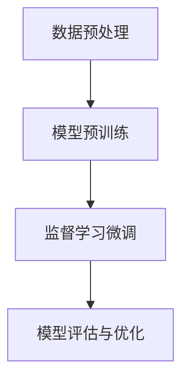

# 大语言模型原理基础与前沿 基于监督学习进行微调

## 1.背景介绍

大语言模型（Large Language Models, LLMs）近年来在自然语言处理（NLP）领域取得了显著的进展。自从OpenAI发布了GPT系列模型以来，LLMs在文本生成、翻译、问答系统等多个应用场景中展现了强大的能力。本文将深入探讨大语言模型的原理基础与前沿技术，特别是基于监督学习进行微调的技术细节。

## 2.核心概念与联系

### 2.1 大语言模型的定义

大语言模型是一种通过大量文本数据训练的深度学习模型，能够理解和生成自然语言。其核心在于使用神经网络，特别是变压器（Transformer）架构，来捕捉语言中的复杂模式和语义关系。

### 2.2 监督学习的基本概念

监督学习是一种机器学习方法，通过给定的输入输出对（训练数据）来训练模型，使其能够在新的数据上进行预测。对于大语言模型，监督学习通常用于微调预训练模型，以适应特定任务。

### 2.3 微调的概念

微调（Fine-tuning）是指在预训练模型的基础上，使用特定任务的数据进行进一步训练。微调可以显著提升模型在特定任务上的性能，同时减少训练时间和计算资源。

### 2.4 核心概念之间的联系

大语言模型通过预训练获得广泛的语言知识，而监督学习和微调则使其能够在特定任务上表现出色。预训练和微调的结合，使得大语言模型既具备通用性，又能在特定应用中展现高效能。

## 3.核心算法原理具体操作步骤

### 3.1 数据预处理

数据预处理是训练大语言模型的第一步。包括数据清洗、标注和分词等步骤。数据的质量直接影响模型的性能。

### 3.2 模型预训练

预训练是指在大规模未标注文本数据上训练模型，使其学习语言的基本结构和语义。常用的预训练方法包括自回归模型（如GPT）和自编码模型（如BERT）。

### 3.3 监督学习微调

在预训练模型的基础上，使用标注数据进行微调。具体步骤如下：

1. **数据准备**：收集并标注特定任务的数据集。
2. **模型初始化**：加载预训练模型的参数。
3. **训练设置**：设置学习率、批量大小等超参数。
4. **训练过程**：使用标注数据进行训练，更新模型参数。
5. **模型评估**：在验证集上评估模型性能，调整超参数。

### 3.4 模型评估与优化

使用多种评估指标（如准确率、F1-score等）对模型进行评估，并通过超参数调优、正则化等方法优化模型性能。



## 4.数学模型和公式详细讲解举例说明

### 4.1 变压器模型的数学基础

变压器模型的核心在于自注意力机制（Self-Attention）。其计算公式如下：

$$
\text{Attention}(Q, K, V) = \text{softmax}\left(\frac{QK^T}{\sqrt{d_k}}\right)V
$$

其中，$Q$、$K$、$V$分别表示查询（Query）、键（Key）和值（Value）矩阵，$d_k$是键的维度。

### 4.2 预训练目标

以GPT为例，其预训练目标是最大化条件概率：

$$
P(w_1, w_2, \ldots, w_n) = \prod_{i=1}^{n} P(w_i | w_1, w_2, \ldots, w_{i-1})
$$

### 4.3 微调过程中的损失函数

在微调过程中，常用的损失函数是交叉熵损失（Cross-Entropy Loss）：

$$
L = -\sum_{i=1}^{N} y_i \log(\hat{y}_i)
$$

其中，$y_i$是实际标签，$\hat{y}_i$是模型预测的概率。

### 4.4 举例说明

假设我们要微调一个大语言模型用于情感分析任务。首先，我们需要一个标注好的情感分析数据集。然后，使用上述公式和步骤进行微调，最终得到一个能够准确预测文本情感的模型。

## 5.项目实践：代码实例和详细解释说明

### 5.1 环境准备

首先，确保安装了必要的库，如Transformers、PyTorch等。

```bash
pip install transformers torch
```

### 5.2 数据准备

假设我们使用IMDb电影评论数据集进行情感分析。

```python
from datasets import load_dataset

dataset = load_dataset("imdb")
train_dataset = dataset['train']
test_dataset = dataset['test']
```

### 5.3 模型加载与微调

加载预训练的GPT模型，并进行微调。

```python
from transformers import GPT2Tokenizer, GPT2ForSequenceClassification, Trainer, TrainingArguments

tokenizer = GPT2Tokenizer.from_pretrained('gpt2')
model = GPT2ForSequenceClassification.from_pretrained('gpt2')

def tokenize_function(examples):
    return tokenizer(examples['text'], padding="max_length", truncation=True)

train_dataset = train_dataset.map(tokenize_function, batched=True)
test_dataset = test_dataset.map(tokenize_function, batched=True)

training_args = TrainingArguments(
    output_dir='./results',
    evaluation_strategy="epoch",
    learning_rate=2e-5,
    per_device_train_batch_size=8,
    per_device_eval_batch_size=8,
    num_train_epochs=3,
    weight_decay=0.01,
)

trainer = Trainer(
    model=model,
    args=training_args,
    train_dataset=train_dataset,
    eval_dataset=test_dataset,
)

trainer.train()
```

### 5.4 模型评估

在测试集上评估模型性能。

```python
results = trainer.evaluate()
print(results)
```

## 6.实际应用场景

### 6.1 文本生成

大语言模型可以用于生成高质量的文本，如新闻报道、小说等。

### 6.2 机器翻译

通过微调，大语言模型可以在特定语言对上实现高质量的翻译。

### 6.3 问答系统

大语言模型可以用于构建智能问答系统，提供准确的答案。

### 6.4 情感分析

通过微调，大语言模型可以用于情感分析，帮助企业了解用户情感。

## 7.工具和资源推荐

### 7.1 开源库

- **Transformers**：由Hugging Face提供的开源库，支持多种预训练模型。
- **PyTorch**：深度学习框架，广泛用于研究和生产。

### 7.2 数据集

- **IMDb**：电影评论数据集，用于情感分析。
- **SQuAD**：问答数据集，用于训练问答系统。

### 7.3 在线资源

- **Hugging Face Model Hub**：提供多种预训练模型和数据集。
- **Kaggle**：数据科学竞赛平台，提供丰富的数据集和代码示例。

## 8.总结：未来发展趋势与挑战

### 8.1 未来发展趋势

- **多模态学习**：结合文本、图像、音频等多种模态的数据，提升模型的理解能力。
- **自监督学习**：减少对标注数据的依赖，通过自监督学习提升模型性能。
- **模型压缩与加速**：通过模型压缩和加速技术，使大语言模型在资源受限的环境中也能高效运行。

### 8.2 挑战

- **数据隐私与安全**：大语言模型需要大量数据进行训练，如何保护数据隐私是一个重要挑战。
- **模型偏见**：大语言模型可能会学习到训练数据中的偏见，如何消除这些偏见是一个亟待解决的问题。
- **计算资源**：训练和部署大语言模型需要大量计算资源，如何降低成本是一个重要课题。

## 9.附录：常见问题与解答

### 9.1 大语言模型的训练需要多长时间？

训练时间取决于模型的规模和计算资源。一般来说，训练一个大型模型可能需要数周甚至数月的时间。

### 9.2 如何选择合适的预训练模型？

选择预训练模型时，应考虑任务的具体需求和模型的性能。可以参考模型的评估指标和社区反馈。

### 9.3 微调过程中常见的问题有哪些？

常见问题包括过拟合、训练不稳定等。可以通过调整超参数、增加正则化等方法进行优化。

### 9.4 如何评估大语言模型的性能？

可以使用多种评估指标，如准确率、F1-score等。在不同任务上，选择合适的评估指标进行评估。

### 9.5 大语言模型的未来发展方向是什么？

未来，大语言模型将朝着多模态学习、自监督学习、模型压缩与加速等方向发展，以提升模型的性能和应用范围。

---

作者：禅与计算机程序设计艺术 / Zen and the Art of Computer Programming