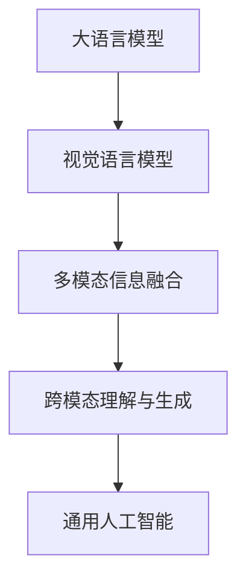

# 大语言模型原理基础与前沿 视觉语言模型

## 1.背景介绍
### 1.1 大语言模型的发展历程
#### 1.1.1 早期的语言模型
#### 1.1.2 神经网络语言模型的兴起
#### 1.1.3 Transformer的革命性突破

### 1.2 视觉语言模型的诞生
#### 1.2.1 多模态学习的兴起
#### 1.2.2 图像描述任务的推动
#### 1.2.3 视觉语言预训练模型的出现

### 1.3 视觉语言模型的研究意义
#### 1.3.1 推动人工智能通用智能的发展
#### 1.3.2 促进多模态信息融合与理解
#### 1.3.3 拓展语言模型的应用场景

## 2.核心概念与联系
### 2.1 大语言模型
#### 2.1.1 定义与特点
#### 2.1.2 预训练与微调
#### 2.1.3 生成式与判别式语言模型

### 2.2 视觉语言模型
#### 2.2.1 定义与特点 
#### 2.2.2 编码器-解码器架构
#### 2.2.3 跨模态注意力机制

### 2.3 大语言模型与视觉语言模型的关系
#### 2.3.1 共同的理论基础
#### 2.3.2 互补的信息处理能力
#### 2.3.3 融合的发展趋势



## 3.核心算法原理具体操作步骤
### 3.1 视觉语言预训练
#### 3.1.1 掩码语言建模
#### 3.1.2 图像-文本匹配
#### 3.1.3 对比学习

### 3.2 视觉语言微调
#### 3.2.1 图像描述生成
#### 3.2.2 视觉问答
#### 3.2.3 视觉常识推理

### 3.3 多模态融合策略
#### 3.3.1 早期融合
#### 3.3.2 晚期融合
#### 3.3.3 交互式融合

## 4.数学模型和公式详细讲解举例说明
### 4.1 Transformer模型
#### 4.1.1 自注意力机制
$$
Attention(Q,K,V) = softmax(\frac{QK^T}{\sqrt{d_k}})V
$$
其中，$Q$, $K$, $V$ 分别表示查询、键、值矩阵，$d_k$ 为键向量的维度。

#### 4.1.2 多头注意力
$$
MultiHead(Q,K,V) = Concat(head_1, ..., head_h)W^O \\
head_i = Attention(QW_i^Q, KW_i^K, VW_i^V)
$$
其中，$W_i^Q$, $W_i^K$, $W_i^V$ 和 $W^O$ 为可学习的权重矩阵。

#### 4.1.3 位置编码
$$
PE_{(pos,2i)} = sin(pos/10000^{2i/d_{model}}) \\
PE_{(pos,2i+1)} = cos(pos/10000^{2i/d_{model}})
$$
其中，$pos$ 表示位置，$i$ 为维度索引，$d_{model}$ 为嵌入维度。

### 4.2 对比学习
#### 4.2.1 InfoNCE损失
$$
\mathcal{L}_{InfoNCE} = -\mathbb{E}_{(x,y)\sim p_{data}}\left[\log \frac{e^{f(x,y)/\tau}}{\sum_{y'\in Y}e^{f(x,y')/\tau}}\right]
$$
其中，$x$ 为锚点样本，$y$ 为正样本，$Y$ 为负样本集合，$f$ 为对比学习的评分函数，$\tau$ 为温度超参数。

#### 4.2.2 对比语言-图像预训练(CLIP)
$$
\mathcal{L}_{CLIP} = \mathcal{L}_{InfoNCE}(I,T) + \mathcal{L}_{InfoNCE}(T,I)
$$
其中，$I$ 表示图像特征，$T$ 表示文本特征。CLIP通过最大化图像和文本之间的互信息来学习对齐的多模态表示。

## 5.项目实践：代码实例和详细解释说明
### 5.1 使用Hugging Face Transformers库进行视觉语言预训练
```python
from transformers import VisionEncoderDecoderModel, ViTFeatureExtractor, AutoTokenizer

# 加载预训练的视觉编码器和文本解码器
encoder = ViTFeatureExtractor.from_pretrained("google/vit-base-patch16-224-in21k")
decoder = AutoTokenizer.from_pretrained("gpt2")

# 初始化视觉语言模型
model = VisionEncoderDecoderModel.from_encoder_decoder_pretrained("google/vit-base-patch16-224-in21k", "gpt2")

# 准备数据集
dataset = load_dataset("my_image_caption_dataset")

# 定义预训练任务
def preprocess_function(examples):
    # 对图像和文本进行预处理
    pixel_values = encoder(images=examples["image"], return_tensors="pt").pixel_values
    captions = [decoder.decode(c, skip_special_tokens=True) for c in examples["caption"]]
    labels = decoder(text_target=captions, return_tensors="pt").input_ids
    return {"pixel_values": pixel_values, "labels": labels}

dataset = dataset.map(preprocess_function, batched=True)

# 开始预训练
model.train()
trainer = Trainer(model=model, train_dataset=dataset["train"], args=TrainingArguments(...))
trainer.train()
```
以上代码展示了如何使用Hugging Face Transformers库来进行视觉语言预训练。首先加载预训练的视觉编码器(如ViT)和文本解码器(如GPT-2)，然后初始化视觉语言模型。接着准备图像描述数据集，定义预训练任务，对图像和文本进行预处理。最后使用Trainer类进行模型训练。

### 5.2 使用预训练的视觉语言模型进行下游任务微调
```python
from transformers import VisionEncoderDecoderModel, ViTFeatureExtractor, AutoTokenizer

# 加载预训练的视觉语言模型
model = VisionEncoderDecoderModel.from_pretrained("my_pretrained_model")
encoder = ViTFeatureExtractor.from_pretrained("google/vit-base-patch16-224-in21k")
decoder = AutoTokenizer.from_pretrained("gpt2")

# 准备下游任务数据集
dataset = load_dataset("my_downstream_task_dataset")

# 定义微调任务
def preprocess_function(examples):
    # 对图像和文本进行预处理
    pixel_values = encoder(images=examples["image"], return_tensors="pt").pixel_values
    captions = [decoder.decode(c, skip_special_tokens=True) for c in examples["caption"]]
    labels = decoder(text_target=captions, return_tensors="pt").input_ids
    return {"pixel_values": pixel_values, "labels": labels}

dataset = dataset.map(preprocess_function, batched=True)

# 开始微调
model.train()
trainer = Trainer(model=model, train_dataset=dataset["train"], args=TrainingArguments(...))
trainer.train()
```
以上代码展示了如何使用预训练的视觉语言模型进行下游任务微调。首先加载预训练的视觉语言模型以及相应的特征提取器和分词器。然后准备下游任务数据集，定义微调任务，对图像和文本进行预处理。最后使用Trainer类进行模型微调。

## 6.实际应用场景
### 6.1 智能图像描述生成
视觉语言模型可以根据给定的图像自动生成自然语言描述，应用于图像搜索、无障碍辅助等场景。

### 6.2 视觉问答
视觉语言模型可以根据图像内容回答自然语言问题，应用于智能客服、知识图谱构建等场景。

### 6.3 视觉常识推理
视觉语言模型可以根据图像进行常识推理，如判断物体之间的关系、推断事件的因果关系等，应用于自动驾驶、智能安防等场景。

### 6.4 多模态信息检索
视觉语言模型可以实现图像-文本的跨模态检索，根据文本查找相关图像，或根据图像查找相关文本，应用于内容管理、版权保护等场景。

## 7.工具和资源推荐
### 7.1 开源库
- Hugging Face Transformers：提供了丰富的预训练语言模型和视觉语言模型，以及方便的微调和推理接口。
- OpenAI CLIP：提供了预训练的视觉语言对比学习模型，可用于图像-文本匹配、零样本学习等任务。
- Microsoft Oscar：提供了大规模的图像-文本对齐数据集和预训练模型，支持多种下游任务。

### 7.2 数据集
- COCO Captions：包含超过12万张图像及其对应的自然语言描述，广泛用于图像描述生成任务。
- Visual Genome：包含超过10万张图像及其对应的场景图、问答对等丰富标注，适用于视觉常识推理任务。
- Flickr30K：包含3万张图像及其对应的5个英文描述，适用于图像-文本匹配任务。

### 7.3 学习资源
- CS231n: Convolutional Neural Networks for Visual Recognition：斯坦福大学计算机视觉课程，涵盖卷积神经网络、图像分类、目标检测等内容。
- Natural Language Processing with Deep Learning：斯坦福大学自然语言处理课程，涵盖词向量、序列模型、注意力机制、Transformer等内容。
- MultiModal Machine Learning：介绍多模态机器学习的综述性论文，涵盖多模态表示学习、跨模态对齐、多模态融合等主题。

## 8.总结：未来发展趋势与挑战
### 8.1 更大规模的视觉语言预训练
随着计算资源的增长和数据规模的扩大，视觉语言模型将朝着更大规模的预训练方向发展，学习更加通用和鲁棒的多模态表示。

### 8.2 更紧密的多模态融合
未来的视觉语言模型将探索更紧密的多模态融合策略，如交互式注意力机制、跨模态知识蒸馏等，以实现更深层次的跨模态理解和生成。

### 8.3 更广泛的应用场景
视觉语言模型将拓展到更多的应用场景，如视频理解、交互式对话、创意设计等，为人机交互和智能决策提供更自然、高效的解决方案。

### 8.4 可解释性和公平性
随着视觉语言模型在关键领域的应用，如医疗诊断、法律判决等，模型的可解释性和公平性将成为重要的研究课题，以确保模型的决策过程透明、无偏见。

### 8.5 低资源场景下的适应性
如何在低资源场景下（如小样本、无标注数据）有效地适应和优化视觉语言模型，是未来需要重点关注的挑战之一。

## 9.附录：常见问题与解答
### 9.1 视觉语言模型与传统的图像描述生成方法有何区别？
视觉语言模型通过端到端的预训练方式学习图像和文本的联合表示，无需手工设计特征或模板，可以生成更加自然、多样的描述。传统方法通常依赖于手工设计的视觉特征和语言模板，生成的描述较为刻板、单一。

### 9.2 视觉语言预训练需要多大规模的数据和计算资源？
视觉语言预训练通常需要数百万甚至数亿张图像-文本对进行训练，对计算资源要求较高。常见的预训练模型如CLIP、ALIGN等，使用了数百个GPU并行训练数周时间。但随着开源模型和算法的发展，中小规模的视觉语言预训练也逐渐成为可能。

### 9.3 视觉语言模型能否直接应用于下游任务？
视觉语言模型学习到的是通用的多模态表示，可以通过微调的方式应用于具体的下游任务。微调过程通常需要相应任务的标注数据，但所需的数据规模远小于从头训练。此外，视觉语言模型还可以通过提示学习（prompt learning）的方式实现零样本或少样本学习。

### 9.4 视觉语言模型的泛化能力如何？
经过大规模预训练的视觉语言模型具有较好的泛化能力，可以在不同领域、不同任务上进行迁移学习。但在面对显著不同于训练数据的