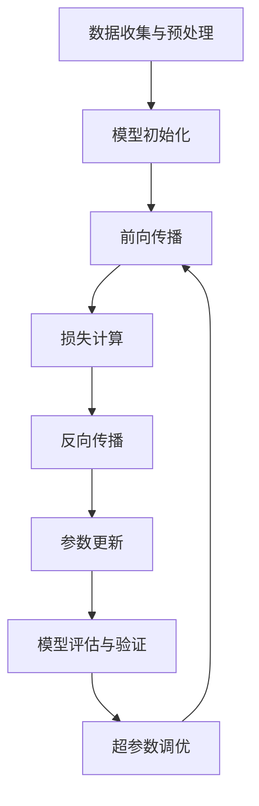

# 大语言模型应用指南：大语言模型的训练过程

## 1.背景介绍

大语言模型（Large Language Models, LLMs）近年来在自然语言处理（NLP）领域取得了显著的进展。它们不仅在生成文本、翻译、问答等任务中表现出色，还在许多实际应用中展现了巨大的潜力。本文将深入探讨大语言模型的训练过程，帮助读者理解其核心概念、算法原理、数学模型、实际应用以及未来发展趋势。

## 2.核心概念与联系

### 2.1 大语言模型的定义

大语言模型是一种基于深度学习的模型，通常使用数十亿甚至数千亿的参数来捕捉语言的复杂性。它们通过大量的文本数据进行训练，能够生成高质量的自然语言文本。

### 2.2 语言模型的基本原理

语言模型的基本任务是预测给定上下文的下一个词。具体来说，给定一个词序列 $w_1, w_2, ..., w_{n-1}$，模型的目标是估计下一个词 $w_n$ 的概率分布 $P(w_n | w_1, w_2, ..., w_{n-1})$。

### 2.3 训练数据与预处理

大语言模型的训练需要大量的文本数据，这些数据通常来自互联网、书籍、文章等多种来源。在训练之前，数据需要进行预处理，包括去除噪声、分词、标注等步骤。

### 2.4 模型架构

目前最流行的大语言模型架构是基于Transformer的。Transformer通过自注意力机制（Self-Attention）来捕捉词与词之间的关系，具有并行计算效率高、捕捉长距离依赖能力强的优点。

## 3.核心算法原理具体操作步骤

### 3.1 数据收集与预处理

数据收集是训练大语言模型的第一步。数据来源可以是互联网、书籍、新闻等。预处理步骤包括去除HTML标签、分词、去除停用词等。

### 3.2 模型初始化

模型初始化是指在训练开始之前，对模型参数进行初始化。常用的初始化方法有Xavier初始化、He初始化等。

### 3.3 训练过程

训练过程包括前向传播、损失计算、反向传播和参数更新。具体步骤如下：

1. **前向传播**：输入数据通过模型，计算输出。
2. **损失计算**：计算模型输出与真实标签之间的损失，常用的损失函数有交叉熵损失。
3. **反向传播**：通过链式法则计算损失对模型参数的梯度。
4. **参数更新**：使用优化算法（如Adam、SGD）更新模型参数。

### 3.4 模型评估与验证

在训练过程中，需要定期评估模型的性能，常用的评估指标有准确率、困惑度（Perplexity）等。验证集用于评估模型的泛化能力，防止过拟合。

### 3.5 超参数调优

超参数调优是指调整模型的超参数（如学习率、批次大小、层数等）以获得最佳性能。常用的方法有网格搜索、随机搜索和贝叶斯优化。



## 4.数学模型和公式详细讲解举例说明

### 4.1 语言模型的数学定义

语言模型的目标是估计词序列的联合概率分布 $P(w_1, w_2, ..., w_n)$。根据链式法则，这可以分解为条件概率的乘积：

$$
P(w_1, w_2, ..., w_n) = P(w_1) P(w_2 | w_1) P(w_3 | w_1, w_2) ... P(w_n | w_1, w_2, ..., w_{n-1})
$$

### 4.2 自注意力机制

自注意力机制是Transformer的核心。给定输入序列 $X = [x_1, x_2, ..., x_n]$，自注意力机制计算每个词对其他词的注意力权重。具体公式如下：

$$
\text{Attention}(Q, K, V) = \text{softmax}\left(\frac{QK^T}{\sqrt{d_k}}\right)V
$$

其中，$Q$、$K$、$V$ 分别是查询矩阵、键矩阵和值矩阵，$d_k$ 是键的维度。

### 4.3 损失函数

常用的损失函数是交叉熵损失。给定真实标签 $y$ 和预测概率分布 $\hat{y}$，交叉熵损失定义为：

$$
L = -\sum_{i} y_i \log(\hat{y}_i)
$$

### 4.4 优化算法

Adam优化算法是训练大语言模型时常用的优化算法。其更新公式如下：

$$
m_t = \beta_1 m_{t-1} + (1 - \beta_1) g_t
$$

$$
v_t = \beta_2 v_{t-1} + (1 - \beta_2) g_t^2
$$

$$
\hat{m}_t = \frac{m_t}{1 - \beta_1^t}
$$

$$
\hat{v}_t = \frac{v_t}{1 - \beta_2^t}
$$

$$
\theta_t = \theta_{t-1} - \alpha \frac{\hat{m}_t}{\sqrt{\hat{v}_t} + \epsilon}
$$

## 5.项目实践：代码实例和详细解释说明

### 5.1 数据预处理代码示例

```python
import re
import nltk
from nltk.corpus import stopwords

# 下载停用词
nltk.download('stopwords')

def preprocess_text(text):
    # 去除HTML标签
    text = re.sub(r'<.*?>', '', text)
    # 分词
    words = nltk.word_tokenize(text)
    # 去除停用词
    words = [word for word in words if word.lower() not in stopwords.words('english')]
    return ' '.join(words)

# 示例文本
sample_text = "<p>This is a sample text with <b>HTML</b> tags.</p>"
clean_text = preprocess_text(sample_text)
print(clean_text)
```

### 5.2 模型训练代码示例

```python
import torch
import torch.nn as nn
import torch.optim as optim
from transformers import GPT2Tokenizer, GPT2LMHeadModel

# 加载预训练的GPT-2模型和分词器
tokenizer = GPT2Tokenizer.from_pretrained('gpt2')
model = GPT2LMHeadModel.from_pretrained('gpt2')

# 定义损失函数和优化器
criterion = nn.CrossEntropyLoss()
optimizer = optim.Adam(model.parameters(), lr=1e-4)

# 示例训练数据
texts = ["Hello, how are you?", "I am fine, thank you!"]
inputs = tokenizer(texts, return_tensors='pt', padding=True, truncation=True)

# 训练步骤
model.train()
for epoch in range(10):
    optimizer.zero_grad()
    outputs = model(**inputs, labels=inputs['input_ids'])
    loss = outputs.loss
    loss.backward()
    optimizer.step()
    print(f'Epoch {epoch+1}, Loss: {loss.item()}')
```

### 5.3 模型评估代码示例

```python
from sklearn.metrics import accuracy_score

# 示例验证数据
val_texts = ["How are you?", "I am good."]
val_inputs = tokenizer(val_texts, return_tensors='pt', padding=True, truncation=True)

# 模型评估
model.eval()
with torch.no_grad():
    outputs = model(**val_inputs)
    predictions = torch.argmax(outputs.logits, dim=-1)

# 计算准确率
accuracy = accuracy_score(val_inputs['input_ids'].flatten(), predictions.flatten())
print(f'Validation Accuracy: {accuracy}')
```

## 6.实际应用场景

### 6.1 文本生成

大语言模型可以用于生成高质量的自然语言文本，应用于新闻写作、小说创作等领域。例如，OpenAI的GPT-3可以生成连贯的文章、对话等。

### 6.2 机器翻译

大语言模型在机器翻译任务中表现出色。通过训练多语言数据，模型可以实现高质量的语言翻译。例如，Google Translate使用的Transformer模型在多语言翻译中取得了显著的效果。

### 6.3 问答系统

大语言模型可以用于构建智能问答系统，回答用户提出的问题。例如，BERT模型在SQuAD数据集上的表现超过了人类水平。

### 6.4 情感分析

大语言模型可以用于情感分析，帮助企业了解用户的情感倾向。例如，社交媒体上的评论分析可以帮助企业改进产品和服务。

### 6.5 对话系统

大语言模型可以用于构建对话系统，实现自然语言的人机交互。例如，智能客服系统可以通过大语言模型回答用户的问题，提高服务效率。

## 7.工具和资源推荐

### 7.1 开源框架

- **TensorFlow**：谷歌开发的开源深度学习框架，支持大规模分布式训练。
- **PyTorch**：Facebook开发的开源深度学习框架，易于使用，支持动态计算图。
- **Transformers**：Hugging Face开发的开源库，提供了多种预训练的语言模型。

### 7.2 数据集

- **Wikipedia**：包含大量的百科全书条目，是训练语言模型的优质数据源。
- **Common Crawl**：包含大量的网页数据，适合大规模语言模型的训练。
- **BooksCorpus**：包含大量的书籍文本，适合语言模型的训练。

### 7.3 在线资源

- **arXiv**：提供了大量的学术论文，是了解最新研究进展的重要资源。
- **GitHub**：提供了大量的开源项目代码，是学习和实践的重要平台。
- **Kaggle**：提供了大量的数据集和竞赛，是提升技能的重要平台。

## 8.总结：未来发展趋势与挑战

### 8.1 未来发展趋势

大语言模型在未来将