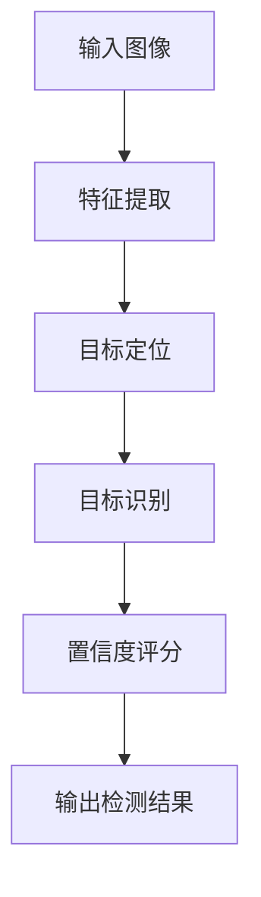

# 对象检测 (Object Detection) 原理与代码实例讲解

## 1. 背景介绍

对象检测是计算机视觉和深度学习领域的一个核心任务,旨在自动定位和识别图像或视频中的物体实例。它广泛应用于安防监控、自动驾驶、机器人视觉、人脸识别等诸多领域。随着深度学习技术的发展,基于卷积神经网络(CNN)的对象检测算法取得了长足进步,目前在准确率和速度上都有了突破性的提升。

### 1.1 对象检测的挑战

尽管深度学习推动了对象检测的飞速发展,但仍面临诸多挑战:

1. **尺度变化**:同一物体在不同场景下可能呈现出不同的大小。
2. **遮挡**:目标物体可能被其他物体部分遮挡。
3. **视角变化**:相机视角的变化会导致物体在图像中的形状发生变形。
4. **光照变化**:不同的光照条件会影响物体在图像中的外观。
5. **背景复杂度**:复杂的背景会干扰目标检测。
6. **物体形变**:非刚性物体会发生形变,增加了检测难度。

### 1.2 对象检测的应用

对象检测技术在以下领域有着广泛的应用:

- **安防监控**:检测违法行为、可疑人员和物品。
- **自动驾驶**:检测行人、车辆、障碍物等,确保行车安全。
- **机器人视觉**:帮助机器人识别和操作目标物体。
- **人脸识别**:用于身份验证、监控和人群分析。
- **医疗影像分析**:检测医学影像中的病灶、器官等。
- **零售业**:统计货架上的商品数量、类型等。
- **无人机航拍**:用于目标跟踪、环境监测等。

## 2. 核心概念与联系

对象检测的核心概念包括:

### 2.1 目标定位

目标定位是指在图像中准确地定位出感兴趣物体的位置和大小,通常用一个边界框(bounding box)来表示。边界框由四个坐标值(x, y, w, h)定义,分别表示矩形框的左上角坐标(x, y)、宽度w和高度h。

### 2.2 目标识别

目标识别是指对定位到的目标进行分类,确定其所属类别。常见的目标类别包括人、车辆、动物、家具等。

### 2.3 置信度评分

对于每个检测到的目标,算法会给出一个置信度评分,表示该目标属于某个类别的概率。置信度评分越高,检测结果越可靠。

以下是对象检测的核心概念及其联系的Mermaid流程图:



## 3. 核心算法原理具体操作步骤

目前主流的对象检测算法主要基于深度卷积神经网络,可分为两大类:

1. **单阶段检测器(One-Stage Detector)**
2. **双阶段检测器(Two-Stage Detector)**

### 3.1 单阶段检测器

单阶段检测器直接对输入图像进行端到端的目标检测,将目标定位和目标识别合并为一个统一的回归问题。这种方法计算效率较高,但检测精度相对较低。

典型的单阶段检测算法包括YOLO(You Only Look Once)系列、SSD(Single Shot MultiBox Detector)等。

#### 3.1.1 YOLO算法

YOLO算法将输入图像划分为许多网格单元,每个单元预测该单元内是否存在目标物体,以及该目标的边界框坐标和类别概率。YOLO算法的具体步骤如下:

1. 将输入图像划分为S×S个网格单元。
2. 对于每个网格单元,预测B个边界框以及每个边界框所含物体的置信度。
3. 对于每个边界框,预测C个类别概率(包括背景类)。
4. 使用非极大值抑制(Non-Maximum Suppression)去除重复检测框。
5. 根据置信度阈值过滤检测结果。

YOLO算法的优点是速度快,但缺点是对小目标的检测精度较低。

### 3.2 双阶段检测器

双阶段检测器首先生成候选区域,然后对这些候选区域进行分类和边界框回归。这种方法检测精度较高,但计算效率较低。

典型的双阶段检测算法包括R-CNN系列(R-CNN、Fast R-CNN、Faster R-CNN等)。

#### 3.2.1 Faster R-CNN算法

Faster R-CNN算法是R-CNN系列中最新的变体,它使用区域候选网络(Region Proposal Network, RPN)来生成候选区域,从而提高了检测速度。Faster R-CNN算法的具体步骤如下:

1. 使用卷积神经网络从输入图像中提取特征图。
2. 在特征图上滑动窗口,生成anchors(预定义的参考框)。
3. 使用RPN网络对anchors进行二分类(前景或背景)和边界框回归。
4. 将RPN输出的候选区域输入到全连接层,进行目标分类和边界框精细化。
5. 使用非极大值抑制(NMS)去除重复检测框。

Faster R-CNN算法在保持高精度的同时,检测速度也有了大幅提升。

### 3.3 注意力机制

近年来,注意力机制(Attention Mechanism)在对象检测领域也得到了广泛应用。注意力机制可以让模型自适应地关注图像的不同区域,从而提高检测精度。

常见的注意力机制包括:

- **空间注意力**:根据空间位置对特征图进行加权。
- **通道注意力**:根据通道信息对特征图进行加权。
- **混合注意力**:结合空间注意力和通道注意力。

## 4. 数学模型和公式详细讲解举例说明

### 4.1 边界框回归

在对象检测中,我们需要预测目标物体的边界框坐标。通常使用参数化的边界框表示,将预测值映射到实际的边界框坐标。

设$b=(b_x, b_y, b_w, b_h)$表示预测的边界框,其中$(b_x, b_y)$是边界框中心坐标,$(b_w, b_h)$是边界框的宽度和高度。

设$g=(g_x, g_y, g_w, g_h)$表示实际的边界框坐标,其中$(g_x, g_y)$是边界框中心坐标,$(g_w, g_h)$是边界框的宽度和高度。

我们定义以下公式将预测值映射到实际坐标:

$$
\begin{aligned}
b_x &= p_x + a_x(g_x - c_x) / c_w \\
b_y &= p_y + a_y(g_y - c_y) / c_h \\
b_w &= p_w \exp(a_w \log(g_w / c_w)) \\
b_h &= p_h \exp(a_h \log(g_h / c_h))
\end{aligned}
$$

其中$(p_x, p_y)$是预测的中心坐标,$(p_w, p_h)$是预测的宽度和高度。$(a_x, a_y, a_w, a_h)$是可学习的缩放参数,用于调节预测值的范围。$(c_x, c_y, c_w, c_h)$是先验框的中心坐标、宽度和高度。

上述公式可以保证预测值的范围合理,并且对于不同尺度的目标具有一定的不变性。

### 4.2 损失函数

对象检测算法通常使用多任务损失函数,同时优化分类损失和回归损失。

#### 4.2.1 分类损失

分类损失用于衡量预测的类别概率与真实类别之间的差异。常用的分类损失函数包括交叉熵损失、焦点损失(Focal Loss)等。

交叉熵损失的公式如下:

$$
\mathcal{L}_{cls}(p, y) = -\sum_{i=1}^{C} y_i \log(p_i)
$$

其中$p$是预测的类别概率分布,包含C个类别。$y$是one-hot编码的真实类别标签。

焦点损失是交叉熵损失的改进版本,它对分类难度较大的样本给予更高的权重,从而缓解正负样本不平衡的问题。焦点损失的公式如下:

$$
\mathcal{L}_{fl}(p, y) = -\alpha_t(1 - p_t)^\gamma \log(p_t)
$$

其中$p_t$是正确类别的预测概率,$\alpha_t$是该类别的权重系数,$\gamma$是调节因子,用于控制难易样本的权重。

#### 4.2.2 回归损失

回归损失用于衡量预测的边界框坐标与真实边界框之间的差异。常用的回归损失函数包括平滑L1损失、IoU损失等。

平滑L1损失的公式如下:

$$
\mathcal{L}_{reg}(t_i, t_i^*) = \sum_{i \in \{x, y, w, h\}} \text{smoothL1}(t_i - t_i^*)
$$

其中$t_i$是预测的边界框参数,$t_i^*$是真实的边界框参数。平滑L1损失在小值范围内使用L2范数,在大值范围内使用L1范数,从而更加鲁棒。

IoU损失直接优化预测边界框与真实边界框之间的IoU(交并比)值,公式如下:

$$
\mathcal{L}_{iou}(b, b^*) = 1 - \frac{\text{area}(b \cap b^*)}{\text{area}(b \cup b^*)}
$$

其中$b$是预测的边界框,$b^*$是真实的边界框。

最终的损失函数是分类损失和回归损失的加权和:

$$
\mathcal{L} = \lambda_1 \mathcal{L}_{cls} + \lambda_2 \mathcal{L}_{reg}
$$

其中$\lambda_1$和$\lambda_2$是可调节的权重系数。

## 5. 项目实践:代码实例和详细解释说明

在这一节,我们将使用PyTorch框架实现一个基于Faster R-CNN的对象检测模型,并在COCO数据集上进行训练和测试。

### 5.1 环境配置

首先,我们需要安装所需的Python包:

```bash
pip install torch torchvision
```

### 5.2 数据准备

我们使用COCO数据集进行训练和测试。COCO数据集包含80个常见对象类别,如人、车辆、动物等。我们可以使用`torchvision.datasets.CocoDetection`模块加载数据集。

```python
from torchvision.datasets import CocoDetection
import torchvision.transforms as transforms

# 定义数据预处理
data_transform = transforms.Compose([
    transforms.ToTensor()
])

# 加载训练集
train_dataset = CocoDetection(root='path/to/coco', 
                              annFile='path/to/annotations/train.json',
                              transform=data_transform)

# 加载测试集
test_dataset = CocoDetection(root='path/to/coco',
                             annFile='path/to/annotations/test.json',
                             transform=data_transform)
```

### 5.3 模型定义

我们使用PyTorch提供的`torchvision.models.detection`模块中的Faster R-CNN模型。

```python
import torchvision
from torchvision.models.detection import FasterRCNN
from torchvision.models.detection.rpn import AnchorGenerator

# 加载预训练模型
model = torchvision.models.detection.fasterrcnn_resnet50_fpn(pretrained=True)

# 获取类别数量
num_classes = 91  # 80个对象类别 + 1个背景类别

# 获取输入图像的尺寸
image_mean = model.backbone.body.op.get_downsample_strides(1)
image_size = (800, 800)  # 输入图像尺寸

# 定义anchor生成器
anchor_generator = AnchorGenerator(sizes=((32, 64, 128, 256, 512),),
                                   aspect_ratios=((0.5, 1.0, 2.0),))

# 设置Faster R-CNN模型的参数
model.rpn.anchor_generator = anchor_generator
model.roi_heads.box_predictor.cls_score.out_features = num_classes
model.roi_heads.box_predictor.bbox_pred.out_features = num_classes * 4
```

### 5.4 模型训练