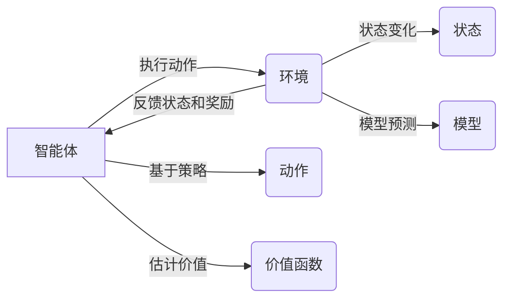

# 强化学习(Reinforcement Learning)原理与代码实战案例讲解

## 1. 背景介绍
强化学习（Reinforcement Learning, RL）是机器学习的一个重要分支，它致力于研究在不确定的环境中，智能体（agent）如何通过学习获得最优策略，以实现目标的最大化累积奖励。与监督学习和无监督学习不同，强化学习关注于在时间序列中的决策问题，其灵感来源于心理学中的行为主义理论，特别是“试错学习”机制。

## 2. 核心概念与联系
在强化学习中，智能体与环境的交互是核心框架。智能体在环境中执行动作，环境则以状态的变化和给予的奖励作为反馈。以下是强化学习的核心概念：

- **智能体（Agent）**：执行动作的主体。
- **环境（Environment）**：智能体所处的外部世界，可以是实际的或模拟的。
- **状态（State）**：环境在某一时刻的具体情况。
- **动作（Action）**：智能体在某状态下可以选择的行为。
- **奖励（Reward）**：环境对智能体执行动作的即时反馈。
- **策略（Policy）**：智能体决定动作的规则。
- **价值函数（Value Function）**：预测未来奖励的函数。
- **模型（Model）**：环境的抽象，用于预测下一状态和奖励。

这些概念之间的联系可以用以下Mermaid流程图表示：



## 3. 核心算法原理具体操作步骤
强化学习的核心算法可以分为三类：基于模型的方法、无模型的方法和深度强化学习。基于模型的方法需要对环境建模，而无模型的方法则直接从与环境的交互中学习。深度强化学习结合了深度学习，使得智能体能够处理高维的输入空间。

### 3.1 基于模型的方法
1. **初始化**：定义状态空间、动作空间、奖励函数和状态转移概率。
2. **策略评估**：计算当前策略下的状态价值函数。
3. **策略改进**：根据状态价值函数改进策略。
4. **策略迭代**：重复策略评估和策略改进过程，直至策略收敛。

### 3.2 无模型的方法
1. **初始化**：定义状态空间和动作空间。
2. **选择动作**：根据当前策略或价值函数选择动作。
3. **执行动作**：在环境中执行动作，观察新状态和奖励。
4. **学习更新**：根据观察到的奖励和新状态更新策略或价值函数。
5. **重复过程**：直至学习完成。

### 3.3 深度强化学习
1. **初始化**：定义状态空间、动作空间和深度神经网络。
2. **经验回放**：存储智能体的经验，以便随机采样学习。
3. **选择动作**：根据当前网络预测的价值或策略选择动作。
4. **执行动作**：在环境中执行动作，观察新状态和奖励。
5. **网络更新**：使用观察到的经验更新神经网络。
6. **重复过程**：直至网络收敛。

## 4. 数学模型和公式详细讲解举例说明
强化学习的数学基础是马尔可夫决策过程（Markov Decision Process, MDP）。MDP可以用一个四元组 $(S, A, P, R)$ 表示，其中 $S$ 是状态空间，$A$ 是动作空间，$P$ 是状态转移概率，$R$ 是奖励函数。

### 4.1 状态价值函数和动作价值函数
状态价值函数 $V(s)$ 表示从状态 $s$ 开始，遵循特定策略 $\pi$ 的期望回报。动作价值函数 $Q(s, a)$ 表示在状态 $s$ 下，执行动作 $a$ 并遵循策略 $\pi$ 的期望回报。

$$
V^\pi(s) = \mathbb{E}_\pi \left[ \sum_{k=0}^{\infty} \gamma^k R_{t+k+1} \mid S_t = s \right]
$$

$$
Q^\pi(s, a) = \mathbb{E}_\pi \left[ \sum_{k=0}^{\infty} \gamma^k R_{t+k+1} \mid S_t = s, A_t = a \right]
$$

其中，$\gamma$ 是折扣因子，用于平衡即时奖励和未来奖励的重要性。

### 4.2 贝尔曼方程
贝尔曼方程是强化学习中的核心，它提供了一种递归的方式来计算价值函数。

$$
V^\pi(s) = \sum_{a \in A} \pi(a \mid s) \sum_{s' \in S} P(s' \mid s, a) \left[ R(s, a, s') + \gamma V^\pi(s') \right]
$$

$$
Q^\pi(s, a) = \sum_{s' \in S} P(s' \mid s, a) \left[ R(s, a, s') + \gamma \sum_{a' \in A} \pi(a' \mid s') Q^\pi(s', a') \right]
$$

### 4.3 举例说明
假设一个简单的迷宫游戏，智能体的目标是找到出口。状态空间包括迷宫中的每一个位置，动作空间是上、下、左、右移动。奖励函数为到达出口时给予正奖励，撞墙时给予负奖励。通过迭代更新价值函数，智能体可以学习到达出口的最优路径。

## 5. 项目实践：代码实例和详细解释说明
在本节中，我们将通过一个简单的强化学习项目来展示代码实例。我们将使用Python和OpenAI Gym来实现一个Q学习算法。

### 5.1 环境设置和初始化
```python
import gym
import numpy as np

# 创建环境
env = gym.make('FrozenLake-v0')

# 初始化Q表
Q = np.zeros([env.observation_space.n, env.action_space.n])
```

### 5.2 Q学习算法实现
```python
# 超参数
learning_rate = 0.8
discount_factor = 0.95
num_episodes = 2000

# Q学习算法
for i in range(num_episodes):
    state = env.reset()
    done = False
    
    while not done:
        # 选择动作
        action = np.argmax(Q[state, :] + np.random.randn(1, env.action_space.n) * (1. / (i + 1)))
        # 执行动作并观察结果
        new_state, reward, done, _ = env.step(action)
        # 更新Q表
        Q[state, action] = Q[state, action] + learning_rate * (reward + discount_factor * np.max(Q[new_state, :]) - Q[state, action])
        state = new_state
```

### 5.3 代码解释
在上述代码中，我们首先创建了一个FrozenLake环境，并初始化了一个全零的Q表。我们设置了学习率、折扣因子和迭代次数作为超参数。在每个迭代中，智能体会在环境中执行动作，并根据观察到的奖励和新状态来更新Q表。通过这个过程，智能体逐渐学习到了在环境中获得最大奖励的策略。

## 6. 实际应用场景
强化学习已经在多个领域得到了成功的应用，包括但不限于：

- **游戏**：如AlphaGo，通过强化学习训练出超越人类的围棋策略。
- **机器人**：用于机器人的自主导航和操控。
- **推荐系统**：动态调整推荐策略以最大化用户的点击率或满意度。
- **自动驾驶**：强化学习被用于优化自动驾驶车辆的决策过程。

## 7. 工具和资源推荐
以下是一些强化学习研究和实践中常用的工具和资源：

- **OpenAI Gym**：一个用于开发和比较强化学习算法的工具包。
- **TensorFlow Agents**：一个基于TensorFlow的强化学习库。
- **PyTorch**：一个灵活的深度学习框架，适合实现深度强化学习算法。
- **RLlib**：一个开源的强化学习库，支持多种RL算法和分布式训练。

## 8. 总结：未来发展趋势与挑战
强化学习作为一种高效的决策学习方法，其未来的发展趋势包括算法的进一步优化、多智能体系统的研究、以及与其他机器学习方法的结合。同时，强化学习面临的挑战包括样本效率问题、稳定性和鲁棒性的提升、以及在复杂环境中的应用。

## 9. 附录：常见问题与解答
**Q1：强化学习和监督学习有什么区别？**
A1：强化学习是基于环境反馈的学习，不需要标签数据；而监督学习需要大量的标签数据来训练模型。

**Q2：如何选择合适的强化学习算法？**
A2：选择算法时需要考虑问题的特性，如状态空间的大小、是否需要模型、任务的复杂度等。

**Q3：强化学习如何处理连续动作空间？**
A3：对于连续动作空间，可以使用策略梯度方法或者深度确定性策略梯度（DDPG）等算法。

**Q4：强化学习在实际应用中的主要挑战是什么？**
A4：实际应用中的挑战包括环境建模的准确性、算法的样本效率、以及策略的泛化能力。

作者：禅与计算机程序设计艺术 / Zen and the Art of Computer Programming