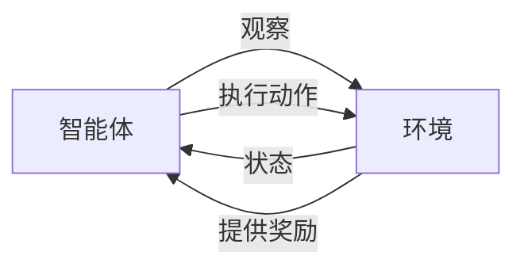

# 强化学习：在物联网系统中的应用

## 1. 背景介绍
随着物联网（IoT）技术的飞速发展，越来越多的设备被连接到互联网，产生了海量的数据。这些数据中蕴含着巨大的价值，如何有效地利用这些数据，提高物联网系统的智能化水平，成为了研究和工业界关注的焦点。强化学习（Reinforcement Learning, RL）作为一种学习策略从环境反馈中进行优化的机器学习方法，为物联网系统提供了新的解决方案。

## 2. 核心概念与联系
强化学习是一种通过与环境的交互来学习最优策略的方法。它涉及到智能体（agent）、环境（environment）、状态（state）、动作（action）和奖励（reward）等核心概念。在物联网系统中，智能体可以是一个中央控制器或者分布式的设备，环境则是包括所有设备和用户交互的物理世界。



## 3. 核心算法原理具体操作步骤
强化学习的核心算法包括Q学习、Sarsa、深度Q网络（DQN）等。以Q学习为例，其操作步骤如下：
1. 初始化Q表格，为所有状态-动作对赋予初始值。
2. 选择并执行一个动作，观察结果状态和奖励。
3. 更新Q表格中的值。
4. 重复步骤2和3，直到学习过程结束。

## 4. 数学模型和公式详细讲解举例说明
Q学习的更新公式为：
$$ Q(s, a) \leftarrow Q(s, a) + \alpha [r + \gamma \max_{a'} Q(s', a') - Q(s, a)] $$
其中，$s$ 和 $s'$ 分别代表当前状态和下一个状态，$a$ 是当前动作，$r$ 是奖励，$\alpha$ 是学习率，$\gamma$ 是折扣因子。

## 5. 项目实践：代码实例和详细解释说明
以一个简单的物联网温控系统为例，我们可以使用Python编写一个Q学习的示例代码来控制温度。

```python
# 伪代码示例
class ThermostatAgent:
    def __init__(self):
        self.q_table = defaultdict(lambda: 0.0)
    
    def choose_action(self, state):
        # 选择动作的逻辑
        pass
    
    def update_q_table(self, state, action, reward, next_state):
        # 更新Q表的逻辑
        pass
```

## 6. 实际应用场景
强化学习在物联网系统中的应用场景包括智能家居、工业自动化、能源管理等。例如，在智能家居中，强化学习可以用来优化室内温度控制，节省能源消耗。

## 7. 工具和资源推荐
推荐使用的工具和资源包括OpenAI Gym、TensorFlow、PyTorch等。这些工具提供了丰富的库和接口，方便开发者实现和测试强化学习算法。

## 8. 总结：未来发展趋势与挑战
强化学习在物联网领域的应用前景广阔，但也面临着数据安全、隐私保护、算法稳定性等挑战。未来的研究将更加注重算法的鲁棒性和适应性。

## 9. 附录：常见问题与解答
Q: 强化学习如何选择最优策略？
A: 通过不断地尝试和学习，强化学习算法可以逐渐逼近最优策略。

作者：禅与计算机程序设计艺术 / Zen and the Art of Computer Programming