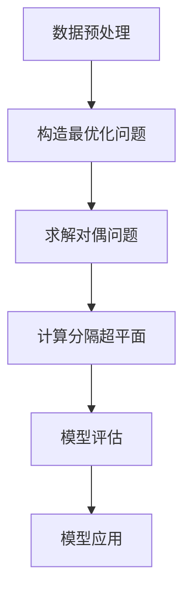

# 支持向量机SVM原理与代码实例讲解

## 1.背景介绍

支持向量机(Support Vector Machine, SVM)是一种有监督的机器学习算法,被广泛应用于模式识别、数据挖掘和分类问题中。它的出现源于20世纪90年代,由Vladimir Vapnik等人提出。SVM的核心思想是基于结构风险最小化原理,寻求将不同类别的样本分隔开的最优分隔超平面,使分类间隔最大化。

SVM最初被设计用于线性可分数据的分类问题,后来通过核技巧(Kernel Trick)被推广到非线性分类问题。与其他经典算法相比,SVM具有泛化能力强、计算开销小、可解决高维数据等优点,因此在实际应用中表现出色。

## 2.核心概念与联系

### 2.1 线性可分支持向量机

对于线性可分的二分类问题,存在一个超平面能够将两类样本完全分开。SVM的目标是找到一个最优超平面,使得两类样本到超平面的距离最大。这个最大间隔被称为"间隔"(Margin)。

间隔最大化的思想源于统计学习理论,可以提高分类器的稳健性和泛化能力。支持向量(Support Vector)是指离超平面最近的那些训练样本,它们决定了超平面的位置和方向。

### 2.2 核函数与非线性SVM

在现实问题中,数据往往是线性不可分的。为了解决这个问题,SVM引入了核函数(Kernel Function)的概念。通过将数据映射到高维空间,使得在高维空间中线性可分,从而解决非线性分类问题。

常用的核函数包括线性核、多项式核、高斯核(RBF核)等。不同的核函数对应不同的映射,适用于不同的数据分布情况。

### 2.3 软间隔与正则化

对于一些噪声数据或异常值,硬间隔的SVM可能会过拟合。软间隔SVM通过引入松弛变量,允许某些样本违反约束条件,从而提高了模型的鲁棒性。同时,SVM还引入了正则化项,用于控制模型的复杂度,防止过拟合。

### 2.4 SVM的优化问题

SVM的训练过程可以转化为一个凸二次规划(Convex Quadratic Programming)优化问题,求解对偶问题可以得到最优解。常用的求解方法包括序列最小优化算法(SMO)、分解方法等。

## 3.核心算法原理具体操作步骤

以线性可分SVM为例,其算法步骤如下:

1. **数据预处理**:对训练数据进行标准化或归一化处理,使数据分布在同一量级。

2. **构造最优化问题**:根据训练数据,构造间隔最大化的优化目标函数和约束条件。

3. **求解对偶问题**:通过拉格朗日乘子法,将原始问题转化为对偶问题,求解对偶问题的最优解。

4. **计算分隔超平面**:利用支持向量和对偶问题的最优解,计算出分隔超平面的方程。

5. **模型评估**:在测试集上评估分类器的性能,计算准确率、精确率、召回率等指标。

6. **模型应用**:将训练好的SVM分类器应用于实际问题中。

算法流程图如下所示:



## 4.数学模型和公式详细讲解举例说明

### 4.1 线性可分SVM

对于线性可分的二分类问题,训练数据集为 $\{(x_1, y_1), (x_2, y_2), \dots, (x_n, y_n)\}$,其中 $x_i \in \mathbb{R}^d$ 为 $d$ 维特征向量, $y_i \in \{-1, 1\}$ 为类别标记。

我们希望找到一个超平面 $w^T x + b = 0$,使得:

$$
\begin{cases}
w^T x_i + b \ge 1, & y_i = 1\\
w^T x_i + b \le -1, & y_i = -1
\end{cases}
$$

上式可以合并为:

$$
y_i(w^T x_i + b) \ge 1, \quad i = 1, 2, \dots, n
$$

间隔(Margin)定义为两个异类支持向量到超平面的距离之和,可以表示为 $\frac{2}{\|w\|}$。为了最大化间隔,我们需要最小化 $\frac{1}{2}\|w\|^2$,从而得到以下优化问题:

$$
\begin{aligned}
&\min\limits_{w, b} \frac{1}{2}\|w\|^2\\
&\text{s.t.} \quad y_i(w^T x_i + b) \ge 1, \quad i = 1, 2, \dots, n
\end{aligned}
$$

通过拉格朗日乘子法,可以将原始问题转化为对偶问题:

$$
\begin{aligned}
&\max\limits_{\alpha} \sum_{i=1}^n \alpha_i - \frac{1}{2} \sum_{i=1}^n \sum_{j=1}^n \alpha_i \alpha_j y_i y_j x_i^T x_j\\
&\text{s.t.} \quad \sum_{i=1}^n \alpha_i y_i = 0, \quad \alpha_i \ge 0, \quad i = 1, 2, \dots, n
\end{aligned}
$$

求解对偶问题的最优解 $\alpha^*$,可以得到超平面的法向量 $w^* = \sum_{i=1}^n \alpha_i^* y_i x_i$ 和偏置项 $b^* = y_j - w^{*T} x_j$。

对于新的测试样本 $x$,分类决策函数为:

$$
f(x) = \text{sign}(w^{*T} x + b^*)
$$

### 4.2 非线性SVM

对于非线性问题,我们可以通过核函数 $\phi(x)$ 将输入数据映射到高维特征空间,使得在高维空间中线性可分。

在高维特征空间中,分类超平面的方程为:

$$
w^T \phi(x) + b = 0
$$

对偶问题中的内积项 $x_i^T x_j$ 被替换为 $\phi(x_i)^T \phi(x_j)$,即核函数 $K(x_i, x_j) = \phi(x_i)^T \phi(x_j)$。

常用的核函数包括:

- 线性核: $K(x_i, x_j) = x_i^T x_j$
- 多项式核: $K(x_i, x_j) = (\gamma x_i^T x_j + r)^d, \gamma > 0$
- 高斯核(RBF核): $K(x_i, x_j) = \exp(-\gamma \|x_i - x_j\|^2), \gamma > 0$

通过核函数技巧,我们可以在高维特征空间中求解线性可分SVM,而无需显式计算映射函数 $\phi(x)$,从而简化了计算复杂度。

### 4.3 软间隔SVM

对于一些噪声数据或异常值,硬间隔的SVM可能会过拟合。软间隔SVM通过引入松弛变量 $\xi_i \ge 0$,允许某些样本违反约束条件,从而提高了模型的鲁棒性。

软间隔SVM的优化问题为:

$$
\begin{aligned}
&\min\limits_{w, b, \xi} \frac{1}{2}\|w\|^2 + C \sum_{i=1}^n \xi_i\\
&\text{s.t.} \quad y_i(w^T x_i + b) \ge 1 - \xi_i, \quad i = 1, 2, \dots, n\\
&\qquad\qquad \xi_i \ge 0, \quad i = 1, 2, \dots, n
\end{aligned}
$$

其中 $C > 0$ 是惩罚参数,用于控制模型的复杂度和训练误差之间的权衡。当 $C$ 较大时,模型更关注于minimizing训练误差;当 $C$ 较小时,模型更关注于minimizing模型复杂度。

## 5.项目实践:代码实例和详细解释说明

以下是使用Python中的scikit-learn库实现线性SVM分类器的代码示例:

```python
from sklearn import datasets
from sklearn.model_selection import train_test_split
from sklearn.svm import SVC
from sklearn.metrics import accuracy_score

# 加载鸢尾花数据集
iris = datasets.load_iris()
X, y = iris.data, iris.target

# 将数据集划分为训练集和测试集
X_train, X_test, y_train, y_test = train_test_split(X, y, test_size=0.2, random_state=42)

# 创建线性SVM分类器
svm_clf = SVC(kernel='linear', C=1.0)

# 训练模型
svm_clf.fit(X_train, y_train)

# 在测试集上进行预测
y_pred = svm_clf.predict(X_test)

# 计算准确率
accuracy = accuracy_score(y_test, y_pred)
print(f"Accuracy: {accuracy:.2f}")
```

代码解释:

1. 首先导入所需的库和数据集。
2. 将数据集划分为训练集和测试集,其中测试集占20%。
3. 创建线性SVM分类器实例,设置核函数为'linear',惩罚参数C=1.0。
4. 使用训练集数据对SVM分类器进行训练。
5. 在测试集上进行预测,获得预测标签。
6. 计算预测准确率。

对于非线性数据,可以将kernel参数设置为'rbf'(高斯核)或'poly'(多项式核)。

```python
# 创建RBF核SVM分类器
svm_rbf = SVC(kernel='rbf', gamma='auto', C=1.0)

# 创建多项式核SVM分类器
svm_poly = SVC(kernel='poly', degree=3, coef0=1, C=1.0)
```

其中,gamma参数用于控制RBF核的宽度,degree参数用于控制多项式核的次数。

## 6.实际应用场景

SVM在以下领域有广泛的应用:

- **文本分类**: 将文本文档分类到预定义的类别中,如垃圾邮件过滤、新闻分类等。
- **图像识别**: 识别图像中的物体、人脸、手写体等。
- **生物信息学**: 基因表达数据分析、蛋白质结构预测等。
- **信用评分**: 根据客户信息预测信用风险等级。
- **入侵检测**: 识别计算机网络中的异常活动和攻击行为。
- **手写数字识别**: 识别手写数字图像。

SVM在上述应用中表现出色,主要得益于其优秀的泛化能力和对噪声数据的鲁棒性。

## 7.工具和资源推荐

- **scikit-learn**: Python中流行的机器学习库,提供了SVM的实现。
- **LibSVM**: SVM的经典开源库,提供了多种语言的接口。
- **Kernel Machines**: Bernhard Schölkopf和Alexander J. Smola所著的经典书籍,深入探讨了SVM的理论基础和应用。
- **SVM光盘交流区**: 一个活跃的SVM在线社区,提供了丰富的资源和讨论。
- **Kaggle**: 一个著名的数据科学竞赛平台,可以在上面练习和应用SVM算法。

## 8.总结:未来发展趋势与挑战

SVM是一种成熟且强大的机器学习算法,在多个领域取得了卓越的成绩。然而,随着大数据时代的到来,SVM在处理海量数据时面临着一些挑战:

- **可扩展性**: 当数据规模增大时,SVM的训练时间和内存消耗会急剧增加,需要提高算法的可扩展性。
- **在线学习**: 传统SVM需要一次性加载所有训练数据,无法适应动态变化的数据流,在线学习SVM是一个重要的研究方向。
- **核函数选择**: 合适的核函数对SVM的性能至关重要,但目前缺乏自动选择核函数的有效方法。
- **非结构化数据处理**: 如何将SVM应用于处理非结构化数据(如图像、视频、语音等)仍是一个挑战。

未来,SVM可能会与深度学习等新兴技术相结合,形成更加强大的混合模型。同时,SVM在特定领域的应用也将不断深入