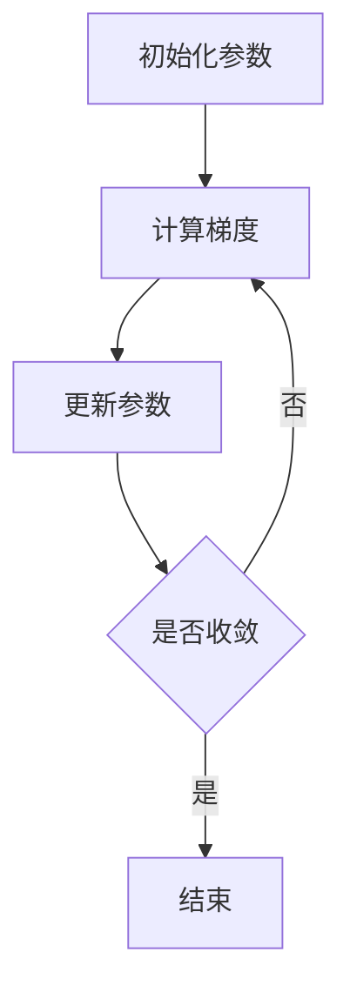

# 梯度下降(Gradient Descent) - 原理与代码实例讲解

## 1.背景介绍

梯度下降（Gradient Descent）是机器学习和深度学习中最常用的优化算法之一。它通过迭代地调整模型参数，使得损失函数逐步减小，从而找到最优解。梯度下降的应用范围非常广泛，包括线性回归、逻辑回归、神经网络等。本文将深入探讨梯度下降的原理、数学模型、具体操作步骤，并通过代码实例进行详细讲解。

## 2.核心概念与联系

### 2.1 梯度的定义

梯度是一个向量，表示函数在某一点的方向导数。对于多变量函数，梯度是各个变量的偏导数组成的向量。梯度的方向是函数值增长最快的方向，而梯度的负方向则是函数值减小最快的方向。

### 2.2 损失函数

损失函数（Loss Function）是衡量模型预测值与真实值之间差异的函数。常见的损失函数有均方误差（MSE）、交叉熵损失等。梯度下降算法的目标是最小化损失函数。

### 2.3 学习率

学习率（Learning Rate）是梯度下降算法中的一个超参数，决定了每次参数更新的步长。学习率过大可能导致算法不收敛，学习率过小则可能导致收敛速度过慢。

### 2.4 全局最优与局部最优

在优化过程中，梯度下降算法可能会陷入局部最优解，而非全局最优解。为了解决这个问题，可以使用一些改进的梯度下降算法，如动量梯度下降、Adam等。

## 3.核心算法原理具体操作步骤

### 3.1 初始化参数

首先，随机初始化模型参数。参数的初始值可以对算法的收敛速度和最终效果产生影响。

### 3.2 计算梯度

计算损失函数对每个参数的偏导数，得到梯度向量。梯度向量的每个分量表示损失函数在该参数方向上的变化率。

### 3.3 更新参数

根据梯度向量和学习率，更新模型参数。更新公式为：

$$
\theta_{new} = \theta_{old} - \alpha \cdot \nabla J(\theta)
$$

其中，$\theta$ 表示模型参数，$\alpha$ 表示学习率，$\nabla J(\theta)$ 表示损失函数的梯度。

### 3.4 迭代

重复步骤 3.2 和 3.3，直到损失函数收敛或达到预设的迭代次数。



## 4.数学模型和公式详细讲解举例说明

### 4.1 线性回归中的梯度下降

在线性回归中，假设模型为：

$$
y = \theta_0 + \theta_1 x
$$

损失函数为均方误差（MSE）：

$$
J(\theta) = \frac{1}{2m} \sum_{i=1}^{m} (h_\theta(x^{(i)}) - y^{(i)})^2
$$

其中，$h_\theta(x) = \theta_0 + \theta_1 x$，$m$ 为样本数量。

### 4.2 梯度计算

对损失函数 $J(\theta)$ 求偏导数，得到梯度：

$$
\frac{\partial J(\theta)}{\partial \theta_0} = \frac{1}{m} \sum_{i=1}^{m} (h_\theta(x^{(i)}) - y^{(i)})
$$

$$
\frac{\partial J(\theta)}{\partial \theta_1} = \frac{1}{m} \sum_{i=1}^{m} (h_\theta(x^{(i)}) - y^{(i)}) x^{(i)}
$$

### 4.3 参数更新

根据梯度下降算法的更新公式，更新参数：

$$
\theta_0 := \theta_0 - \alpha \frac{1}{m} \sum_{i=1}^{m} (h_\theta(x^{(i)}) - y^{(i)})
$$

$$
\theta_1 := \theta_1 - \alpha \frac{1}{m} \sum_{i=1}^{m} (h_\theta(x^{(i)}) - y^{(i)}) x^{(i)}
$$

## 5.项目实践：代码实例和详细解释说明

### 5.1 线性回归的梯度下降实现

以下是使用 Python 实现线性回归梯度下降的代码示例：

```python
import numpy as np

# 生成样本数据
X = np.array([1, 2, 3, 4, 5])
y = np.array([1, 3, 2, 3, 5])

# 初始化参数
theta_0 = 0
theta_1 = 0
alpha = 0.01
iterations = 1000

# 梯度下降算法
for _ in range(iterations):
    h = theta_0 + theta_1 * X
    gradient_0 = np.sum(h - y) / len(y)
    gradient_1 = np.sum((h - y) * X) / len(y)
    theta_0 -= alpha * gradient_0
    theta_1 -= alpha * gradient_1

print(f"theta_0: {theta_0}, theta_1: {theta_1}")
```

### 5.2 代码解释

1. **生成样本数据**：创建输入数据 $X$ 和目标值 $y$。
2. **初始化参数**：设置初始参数 $\theta_0$ 和 $\theta_1$，学习率 $\alpha$ 以及迭代次数。
3. **梯度下降算法**：在每次迭代中，计算预测值 $h$，然后计算梯度并更新参数。
4. **输出结果**：打印最终的参数值。

## 6.实际应用场景

### 6.1 机器学习模型训练

梯度下降广泛应用于各种机器学习模型的训练过程，如线性回归、逻辑回归、支持向量机等。

### 6.2 深度学习

在深度学习中，梯度下降用于训练神经网络，通过反向传播算法计算梯度并更新权重。

### 6.3 优化问题

梯度下降也用于解决各种优化问题，如最小化成本函数、最大化收益等。

## 7.工具和资源推荐

### 7.1 编程语言和库

- **Python**：广泛使用的编程语言，适合机器学习和数据科学。
- **NumPy**：用于数值计算的基础库。
- **TensorFlow** 和 **PyTorch**：深度学习框架，提供高效的梯度计算和优化算法。

### 7.2 在线课程和书籍

- **Coursera** 和 **edX**：提供大量机器学习和深度学习的在线课程。
- **《深度学习》**：Ian Goodfellow 等人编写的经典教材。
- **《机器学习实战》**：Peter Harrington 编写的实用指南。

## 8.总结：未来发展趋势与挑战

梯度下降作为一种基础的优化算法，已经在机器学习和深度学习中取得了广泛应用。然而，随着模型复杂度的增加和数据规模的扩大，梯度下降算法也面临一些挑战，如收敛速度慢、容易陷入局部最优等。未来，改进的优化算法（如Adam、RMSprop等）和分布式计算技术将进一步提升梯度下降的效率和效果。

## 9.附录：常见问题与解答

### 9.1 学习率如何选择？

学习率的选择需要在实验中进行调整。可以使用学习率调度器或自适应学习率算法（如Adam）来自动调整学习率。

### 9.2 如何避免局部最优？

可以使用动量梯度下降、随机梯度下降等方法来避免陷入局部最优。此外，初始化参数时使用不同的随机种子也有助于找到全局最优解。

### 9.3 梯度消失和梯度爆炸问题如何解决？

梯度消失和梯度爆炸是深度神经网络训练中的常见问题。可以使用归一化技术（如Batch Normalization）、调整激活函数（如ReLU）以及使用梯度裁剪等方法来缓解这些问题。

---

作者：禅与计算机程序设计艺术 / Zen and the Art of Computer Programming