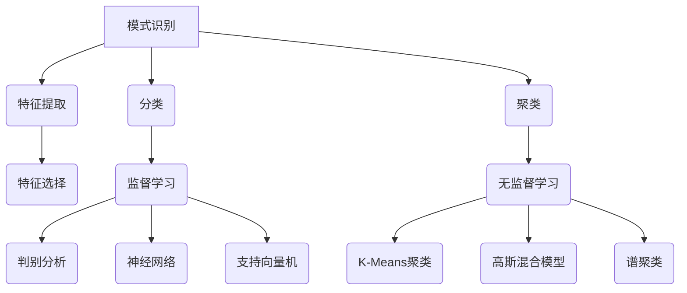

# 模式识别 原理与代码实例讲解

## 1. 背景介绍

模式识别是一门研究如何用机器有效地描述和识别物体、事件或数据规律的学科,它融合了多种理论和技术,包括人工智能、机器学习、统计学、神经网络等。随着计算能力和数据量的不断增长,模式识别已经广泛应用于计算机视觉、自然语言处理、生物信息学、金融分析等诸多领域。

### 1.1 模式识别的定义

模式识别是从原始数据中获取有用信息的过程,主要包括以下几个步骤:

1. 数据采集和预处理
2. 特征提取
3. 模式分类或聚类
4. 后处理

### 1.2 模式识别的应用

模式识别已经在许多领域发挥着重要作用,例如:

- 计算机视觉:图像分类、目标检测、人脸识别等
- 自然语言处理:语音识别、文本分类、机器翻译等
- 生物信息学:基因表达分析、蛋白质结构预测等
- 金融分析:欺诈检测、风险评估、市场预测等

## 2. 核心概念与联系

模式识别涉及多个关键概念,这些概念相互关联,构成了整个理论和方法的基础。



### 2.1 特征提取

特征提取是将原始数据转换为适合后续处理的特征向量的过程。合适的特征对模式识别的性能至关重要。常用的特征提取方法包括:

- 统计特征:均值、方差、相关系数等
- 几何特征:面积、周长、曲率等
- 纹理特征:灰度共生矩阵、小波变换等
- 其他特征:HOG、SIFT、LBP等

### 2.2 分类与聚类

分类和聚类是模式识别的两大核心任务:

- 分类(Classification)是将输入模式划分到已知类别中的过程,属于监督学习。
- 聚类(Clustering)是自动发现数据内在的结构和模式的过程,属于无监督学习。

### 2.3 监督学习与无监督学习

- 监督学习(Supervised Learning)利用已标注的训练数据学习模型,常用于分类和回归任务。
- 无监督学习(Unsupervised Learning)直接从未标注的数据中发现内在结构,常用于聚类和降维任务。

## 3. 核心算法原理具体操作步骤

模式识别涉及多种算法,下面将介绍几种核心算法的原理和具体操作步骤。

### 3.1 K-近邻算法(KNN)

KNN是一种基本的监督学习分类算法,其核心思想是:如果一个样本在特征空间中的k个最相似(即特征向量最邻近)的训练样本中大部分属于某一个类别,则该样本也属于这个类别。

KNN算法步骤:

1. 计算测试数据与各个训练数据之间的距离(如欧氏距离)
2. 按距离递增次序排序
3. 选取与测试数据距离最小的K个训练数据
4. 确定前K个训练数据中出现次数最多的类别
5. 将该类别作为测试数据的预测分类

### 3.2 朴素贝叶斯分类器

朴素贝叶斯分类器是一种基于贝叶斯定理与特征条件独立假设的简单分类器。尽管其对于现实任务的假设过于简单,但在实际应用中表现出色。

朴素贝叶斯分类器步骤:

1. 计算每个类别的先验概率P(C)
2. 根据特征条件独立性假设,计算条件概率P(X|C)
3. 将P(C)和P(X|C)代入贝叶斯公式,计算P(C|X)
4. 将测试数据X分类到后验概率P(C|X)最大的类别

### 3.3 决策树

决策树是一种常用的监督学习算法,可用于分类和回归任务。它通过将特征空间递归划分为较小的区域来构建决策树模型。

决策树构建步骤:

1. 从根节点开始,对整个数据集构建决策树模型
2. 计算各个特征对数据集的信息增益或信息增益比,选择增益最大的特征作为当前节点
3. 根据该特征的取值将数据集划分为若干子集
4. 对每个子集递归构建决策树分支,直至满足终止条件
5. 决策树构建完成后,对测试数据进行分类或回归预测

### 3.4 K-Means聚类

K-Means是一种经典的无监督学习聚类算法,通过迭代优化将数据划分为K个聚类。

K-Means聚类步骤:

1. 随机初始化K个聚类中心
2. 对每个数据点,计算其到K个聚类中心的距离,将其分配到最近的聚类
3. 对每个聚类,重新计算聚类中心为该聚类所有数据点的均值向量
4. 重复步骤2和3,直至聚类中心不再发生变化或满足其他终止条件

## 4. 数学模型和公式详细讲解举例说明

模式识别中涉及多种数学模型和公式,下面将详细讲解其中的几种。

### 4.1 欧氏距离

欧氏距离是最常用的距离度量,用于计算两个n维向量之间的距离:

$$d(x,y) = \sqrt{\sum_{i=1}^{n}(x_i-y_i)^2}$$

其中$x=(x_1,x_2,...,x_n)$和$y=(y_1,y_2,...,y_n)$是两个n维向量。

例如,计算两个二维向量$(1,2)$和$(3,4)$之间的欧氏距离:

$$d((1,2),(3,4))=\sqrt{(1-3)^2+(2-4)^2}=\sqrt{4+4}=2\sqrt{2}$$

### 4.2 信息增益

信息增益是决策树算法中常用的特征选择指标,用于评估某个特征对数据集的分类能力。

假设数据集D的经验熵为$H(D)$,将D根据特征A分为若干子集$D_1,D_2,...,D_n$,则特征A对D的信息增益为:

$$Gain(A)=H(D)-\sum_{i=1}^{n}\frac{|D_i|}{|D|}H(D_i)$$

其中,$H(D)$是D的经验熵,$|D_i|$和$|D|$分别是子集和数据集的大小。

例如,假设数据集D包含6个样本,其中3个正例和3个反例,则D的经验熵为:

$$H(D)=-\frac{3}{6}\log_2\frac{3}{6}-\frac{3}{6}\log_2\frac{3}{6}=1$$

如果根据特征A将D划分为两个子集$D_1$和$D_2$,其中$D_1$包含2个正例和1个反例,$D_2$包含1个正例和2个反例,则特征A的信息增益为:

$$Gain(A)=1-\frac{3}{6}\left(-\frac{2}{3}\log_2\frac{2}{3}-\frac{1}{3}\log_2\frac{1}{3}\right)-\frac{3}{6}\left(-\frac{1}{3}\log_2\frac{1}{3}-\frac{2}{3}\log_2\frac{2}{3}\right)=0.278$$

### 4.3 高斯混合模型

高斯混合模型(Gaussian Mixture Model,GMM)是一种常用的无监督学习模型,可以对数据进行聚类。它假设数据由多个高斯分布的混合而成。

对于D维数据$x=(x_1,x_2,...,x_D)$,K个混合成分的高斯混合模型的概率密度函数为:

$$p(x|\pi,\mu,\Sigma)=\sum_{k=1}^{K}\pi_k\mathcal{N}(x|\mu_k,\Sigma_k)$$

其中,$\pi_k$是第k个混合成分的先验概率,$\mathcal{N}(x|\mu_k,\Sigma_k)$是D维高斯分布的概率密度函数,由均值向量$\mu_k$和协方差矩阵$\Sigma_k$确定。

通过期望最大化(EM)算法可以估计GMM的参数$\pi,\mu,\Sigma$,从而对数据进行软聚类。

## 5. 项目实践:代码实例和详细解释说明

为了加深对模式识别算法的理解,下面将通过Python代码实现KNN和朴素贝叶斯分类器,并在经典数据集上进行测试。

### 5.1 KNN分类器

```python
import numpy as np
from collections import Counter

class KNNClassifier:
    def __init__(self, k):
        self.k = k
        self.X_train = None
        self.y_train = None

    def fit(self, X_train, y_train):
        self.X_train = X_train
        self.y_train = y_train

    def predict(self, X_test):
        y_pred = []
        for x in X_test:
            distances = [np.linalg.norm(x - x_train) for x_train in self.X_train]
            k_indices = np.argsort(distances)[:self.k]
            k_nearest_labels = [self.y_train[i] for i in k_indices]
            y_pred.append(Counter(k_nearest_labels).most_common(1)[0][0])
        return np.array(y_pred)
```

上述代码实现了KNN分类器,主要步骤如下:

1. 初始化分类器,设置K值
2. `fit`函数用于存储训练数据
3. `predict`函数对测试数据进行预测:
   - 计算测试样本到每个训练样本的距离
   - 选取距离最近的K个训练样本
   - 统计K个最近邻中各类别的个数
   - 将测试样本预测为K个最近邻中数量最多的类别

### 5.2 朴素贝叶斯分类器

```python
import numpy as np

class NaiveBayesClassifier:
    def __init__(self):
        self.class_priors = {}
        self.feature_probs = {}

    def fit(self, X_train, y_train):
        n_samples = len(y_train)
        self.classes = np.unique(y_train)
        
        # 计算每个类别的先验概率
        for c in self.classes:
            self.class_priors[c] = np.sum(y_train == c) / n_samples
        
        # 计算每个特征对于每个类别的条件概率
        for c in self.classes:
            X_c = X_train[y_train == c]
            self.feature_probs[c] = {}
            for feature in range(X_train.shape[1]):
                values = X_c[:, feature]
                self.feature_probs[c][feature] = (np.sum(values == 1) + 1) / (len(values) + 2)

    def predict(self, X_test):
        y_pred = []
        for x in X_test:
            posteriors = {}
            for c in self.classes:
                posterior = self.class_priors[c]
                for feature, value in enumerate(x):
                    if value == 1:
                        posterior *= self.feature_probs[c][feature]
                    else:
                        posterior *= (1 - self.feature_probs[c][feature])
                posteriors[c] = posterior
            y_pred.append(max(posteriors, key=posteriors.get))
        return np.array(y_pred)
```

上述代码实现了朴素贝叶斯分类器,主要步骤如下:

1. 初始化分类器
2. `fit`函数用于训练模型:
   - 计算每个类别的先验概率
   - 计算每个特征对于每个类别的条件概率
3. `predict`函数对测试数据进行预测:
   - 对每个测试样本,计算其属于每个类别的后验概率
   - 将测试样本预测为后验概率最大的类别

### 5.3 测试

我们将在经典的虹膜数据集上测试上述两个分类器的性能。

```python
from sklearn.datasets import load_iris
from sklearn.model_selection import train_test_split
from sklearn.metrics import accuracy_score

# 加载虹膜数据集
iris = load_iris()
X, y = iris.data, iris.target

# 划分训练集和测试集
X_train, X_test, y_train, y_test = train_test