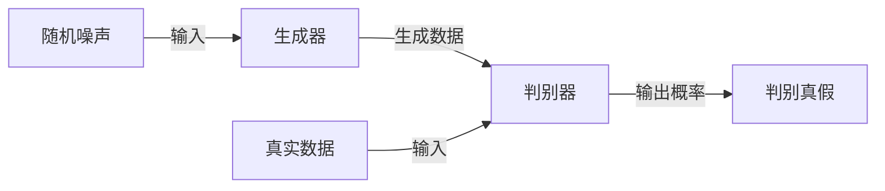

# 生成对抗网络 (GAN) 原理与代码实例讲解

## 1. 背景介绍

生成对抗网络（GAN）是深度学习领域的一项革命性创新，自2014年由Ian Goodfellow等人提出以来，它已经在图像生成、语音合成、数据增强等多个领域展现出了巨大的潜力。GAN的核心思想是通过两个神经网络——生成器（Generator）和判别器（Discriminator）的对抗过程，来学习生成数据的分布。这种方法在学习无监督特征表示方面具有独特的优势。

## 2. 核心概念与联系

GAN的工作机制可以类比于伪造者与警察的博弈。生成器（伪造者）试图生成逼真的假数据，而判别器（警察）的任务是区分真实数据和生成的假数据。通过这种对抗过程，生成器学习到如何产生越来越逼真的数据，而判别器则变得越来越擅长识别。

### 2.1 生成器（Generator）

生成器的目标是学习真实数据的分布，以便能够生成无法被判别器区分的新数据。它通常是一个深度神经网络，输入是一个随机噪声向量，输出是生成的数据。

### 2.2 判别器（Discriminator）

判别器的目标是正确区分真实数据和生成器产生的假数据。它同样是一个深度神经网络，输入是真实数据或生成的数据，输出是一个概率值，表示输入数据为真实数据的概率。

### 2.3 对抗过程

在GAN的训练过程中，生成器和判别器交替进行训练。生成器试图生成越来越逼真的数据，而判别器则努力提高其区分真假数据的能力。这个过程可以用下面的Mermaid流程图表示：



## 3. 核心算法原理具体操作步骤

GAN的训练过程涉及到以下几个步骤：

1. **初始化**：随机初始化生成器和判别器的参数。
2. **生成假数据**：生成器接收随机噪声，输出生成数据。
3. **训练判别器**：用真实数据和生成的假数据训练判别器，目标是最大化区分真假数据的能力。
4. **训练生成器**：更新生成器的参数，目标是最小化判别器正确区分真假数据的概率。
5. **重复步骤2-4**：交替训练生成器和判别器，直到达到平衡点。

## 4. 数学模型和公式详细讲解举例说明

GAN的核心是一个极小极大问题，其目标函数可以用以下公式表示：

$$
\min_G \max_D V(D, G) = \mathbb{E}_{x\sim p_{data}(x)}[\log D(x)] + \mathbb{E}_{z\sim p_z(z)}[\log(1 - D(G(z)))]
$$

其中，$G$ 表示生成器，$D$ 表示判别器，$p_{data}$ 是真实数据的分布，$p_z$ 是生成器输入的噪声分布。判别器的目标是最大化$V(D, G)$，而生成器的目标是最小化$V(D, G)$。

## 5. 项目实践：代码实例和详细解释说明

在这一部分，我们将通过一个简单的代码示例来展示如何实现一个基本的GAN。由于篇幅限制，这里只提供核心代码片段。

```python
import torch
import torch.nn as nn

# 定义生成器
class Generator(nn.Module):
    # ...

# 定义判别器
class Discriminator(nn.Module):
    # ...

# 初始化生成器和判别器
G = Generator()
D = Discriminator()

# 定义损失函数和优化器
criterion = nn.BCELoss()
optimizer_g = torch.optim.Adam(G.parameters(), lr=0.0002)
optimizer_d = torch.optim.Adam(D.parameters(), lr=0.0002)

# 训练过程
for epoch in range(num_epochs):
    for i, data in enumerate(dataloader, 0):
        # ...

# 生成假数据
fake_data = G(noise)

# 训练判别器
# ...

# 训练生成器
# ...
```

## 6. 实际应用场景

GAN在多个领域都有广泛的应用，包括但不限于：

- **图像合成**：生成高质量的人脸、风景等图像。
- **风格迁移**：将一种风格的图像转换为另一种风格。
- **数据增强**：为小数据集生成额外的训练样本。
- **超分辨率**：提高图像的分辨率。

## 7. 工具和资源推荐

- **TensorFlow** 和 **PyTorch**：两个流行的深度学习框架，都支持GAN的实现。
- **NVIDIA cuDNN**：用于加速深度神经网络的GPU加速库。
- **GAN Zoo**：收集了各种GAN变体的列表。

## 8. 总结：未来发展趋势与挑战

GAN的研究仍在快速发展中，未来的趋势可能包括更高效的训练方法、更强大的生成能力以及更广泛的应用领域。同时，GAN也面临着一些挑战，如训练不稳定、模式崩溃等问题。

## 9. 附录：常见问题与解答

- **Q1**: GAN训练不稳定的原因是什么？
- **A1**: GAN的训练不稳定通常是由于生成器和判别器之间的动态不平衡造成的。

- **Q2**: 如何解决模式崩溃问题？
- **A2**: 可以通过改进GAN的架构、损失函数或训练策略来缓解模式崩溃问题。

作者：禅与计算机程序设计艺术 / Zen and the Art of Computer Programming