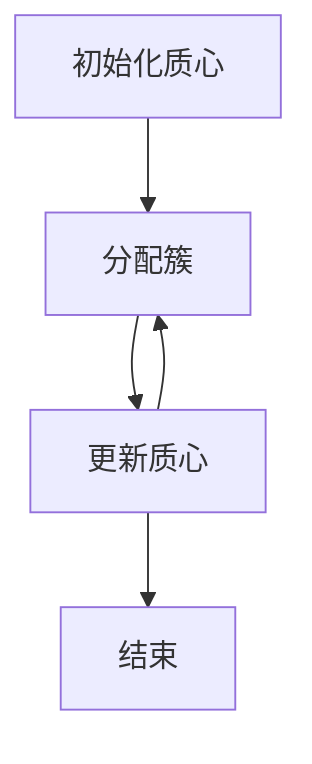
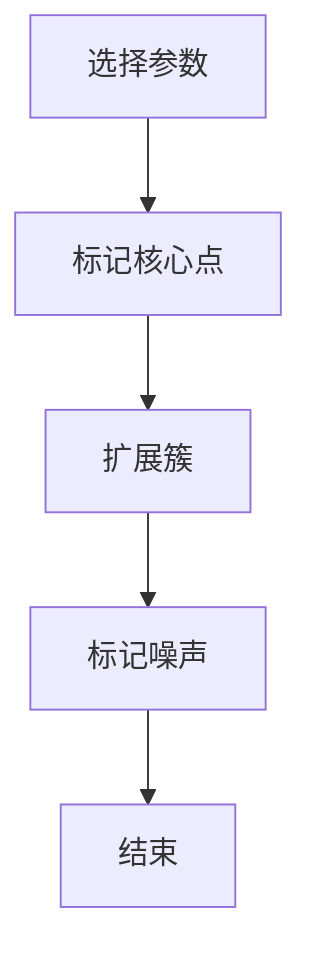

# 聚类 (Clustering) 原理与代码实例讲解

## 1.背景介绍

聚类（Clustering）是一种无监督学习方法，广泛应用于数据挖掘、图像处理、市场分析等领域。其主要目标是将数据集中的对象分成若干个簇，使得同一簇内的对象相似度较高，而不同簇之间的对象相似度较低。聚类算法的应用场景非常广泛，从客户细分、图像分割到社交网络分析，都能看到它的身影。

## 2.核心概念与联系

### 2.1 聚类的定义

聚类是将数据集分成若干个簇的过程，每个簇包含相似的对象。相似度通常通过某种距离度量来衡量，如欧氏距离、曼哈顿距离等。

### 2.2 聚类与分类的区别

聚类是无监督学习方法，不需要预先标注的数据，而分类是有监督学习方法，需要预先标注的数据集。聚类的目标是发现数据的内在结构，而分类的目标是将新数据点分配到已有的类别中。

### 2.3 聚类算法的类型

聚类算法可以分为以下几类：

- **划分方法**：如K-means、K-medoids。
- **层次方法**：如凝聚层次聚类、分裂层次聚类。
- **基于密度的方法**：如DBSCAN、OPTICS。
- **基于网格的方法**：如STING、CLIQUE。
- **基于模型的方法**：如高斯混合模型（GMM）。

## 3.核心算法原理具体操作步骤

### 3.1 K-means算法

K-means算法是一种经典的划分方法，操作步骤如下：

1. **初始化**：随机选择K个初始质心。
2. **分配簇**：将每个数据点分配到最近的质心。
3. **更新质心**：计算每个簇的质心。
4. **重复**：重复步骤2和3，直到质心不再变化或达到最大迭代次数。



### 3.2 DBSCAN算法

DBSCAN是一种基于密度的聚类算法，操作步骤如下：

1. **选择参数**：选择半径参数 $\epsilon$ 和最小点数参数 MinPts。
2. **核心点**：标记所有核心点（邻域内点数大于MinPts）。
3. **扩展簇**：从核心点开始，扩展簇，包含所有密度可达的点。
4. **标记噪声**：未被标记的点为噪声。



## 4.数学模型和公式详细讲解举例说明

### 4.1 K-means算法的数学模型

K-means算法的目标是最小化簇内平方误差和（Sum of Squared Errors, SSE），其数学表达式为：

$$
SSE = \sum_{i=1}^{K} \sum_{x \in C_i} \| x - \mu_i \|^2
$$

其中，$K$ 是簇的数量，$C_i$ 是第 $i$ 个簇，$\mu_i$ 是第 $i$ 个簇的质心，$x$ 是数据点。

### 4.2 DBSCAN算法的数学模型

DBSCAN算法基于密度的概念，定义如下：

- **$\epsilon$-邻域**：点 $p$ 的 $\epsilon$-邻域是指距离 $p$ 小于 $\epsilon$ 的所有点的集合。
- **核心点**：如果点 $p$ 的 $\epsilon$-邻域内的点数大于等于 MinPts，则 $p$ 是核心点。
- **密度可达**：如果点 $q$ 在点 $p$ 的 $\epsilon$-邻域内，且 $p$ 是核心点，则 $q$ 是密度可达的。

## 5.项目实践：代码实例和详细解释说明

### 5.1 K-means算法的代码实例

以下是使用Python实现K-means算法的代码示例：

```python
import numpy as np
from sklearn.datasets import make_blobs
import matplotlib.pyplot as plt
from sklearn.cluster import KMeans

# 生成数据
X, y = make_blobs(n_samples=300, centers=4, cluster_std=0.60, random_state=0)

# K-means聚类
kmeans = KMeans(n_clusters=4)
kmeans.fit(X)
y_kmeans = kmeans.predict(X)

# 可视化结果
plt.scatter(X[:, 0], X[:, 1], c=y_kmeans, s=50, cmap='viridis')
centers = kmeans.cluster_centers_
plt.scatter(centers[:, 0], centers[:, 1], c='red', s=200, alpha=0.75)
plt.show()
```

### 5.2 DBSCAN算法的代码实例

以下是使用Python实现DBSCAN算法的代码示例：

```python
import numpy as np
from sklearn.datasets import make_moons
import matplotlib.pyplot as plt
from sklearn.cluster import DBSCAN

# 生成数据
X, y = make_moons(n_samples=300, noise=0.05)

# DBSCAN聚类
dbscan = DBSCAN(eps=0.2, min_samples=5)
y_dbscan = dbscan.fit_predict(X)

# 可视化结果
plt.scatter(X[:, 0], X[:, 1], c=y_dbscan, s=50, cmap='viridis')
plt.show()
```

## 6.实际应用场景

### 6.1 客户细分

通过聚类算法，可以将客户分成不同的细分市场，从而进行精准营销。例如，电商平台可以根据客户的购买行为进行聚类，识别出高价值客户和潜在客户。

### 6.2 图像分割

在图像处理中，聚类算法可以用于图像分割，将图像分成若干个区域。例如，K-means算法可以将图像的像素点聚类成不同的颜色区域，从而实现图像分割。

### 6.3 社交网络分析

在社交网络中，聚类算法可以用于社区发现，识别出社交网络中的不同社区。例如，DBSCAN算法可以识别出社交网络中的密集区域，从而发现社区结构。

## 7.工具和资源推荐

### 7.1 工具推荐

- **Scikit-learn**：Python的机器学习库，提供了多种聚类算法的实现。
- **Matplotlib**：Python的绘图库，可以用于可视化聚类结果。
- **Pandas**：Python的数据分析库，可以用于数据预处理和分析。

### 7.2 资源推荐

- **《Pattern Recognition and Machine Learning》**：Christopher M. Bishop著，详细介绍了聚类算法的原理和应用。
- **Coursera上的机器学习课程**：Andrew Ng教授的机器学习课程，包含聚类算法的详细讲解和代码示例。

## 8.总结：