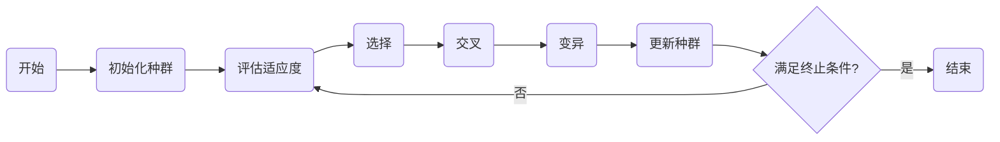

# 遗传算法(Genetic Algorithms) - 原理与代码实例讲解

## 1. 背景介绍
遗传算法（Genetic Algorithms，GA）是模拟生物进化过程的搜索算法，它由美国计算机科学家约翰·霍兰德（John Holland）在20世纪70年代初期提出。遗传算法的设计灵感来源于达尔文的自然选择理论，通过模拟自然界中生物的遗传和进化机制来解决优化问题。遗传算法在多目标优化、机器学习、人工智能等领域有着广泛的应用。

## 2. 核心概念与联系
遗传算法的核心概念包括种群（Population）、个体（Individual）、基因（Gene）、染色体（Chromosome）、适应度（Fitness）、选择（Selection）、交叉（Crossover）和变异（Mutation）。这些概念相互联系，共同构成了遗传算法的基本框架。

## 3. 核心算法原理具体操作步骤
遗传算法的操作步骤通常包括初始化种群、评估适应度、选择、交叉、变异和更新种群。这些步骤循环迭代，直到满足终止条件，如达到最大迭代次数或找到满意的解。

## 4. 数学模型和公式详细讲解举例说明
遗传算法中的适应度函数是评价个体优劣的标准，通常取决于问题本身。例如，在旅行商问题（TSP）中，适应度函数可以是路径的总长度的倒数。数学模型和公式的详细讲解将在后续章节中展开。

## 5. 项目实践：代码实例和详细解释说明
在项目实践部分，我们将通过一个简单的优化问题来展示遗传算法的代码实现和详细解释。代码将使用Python语言编写，因为它简洁易懂，且在科学计算中广泛应用。

## 6. 实际应用场景
遗传算法在工程优化、生物信息学、经济学、机器学习等多个领域都有实际应用。例如，在机器学习中，遗传算法可以用于特征选择和神经网络的结构优化。

## 7. 工具和资源推荐
为了更好地实现和测试遗传算法，我们推荐一些工具和资源，包括编程语言、库和框架，以及学习资料和社区。

## 8. 总结：未来发展趋势与挑战
遗传算法作为一种启发式搜索算法，在解决复杂优化问题方面显示出强大的能力。然而，它也面临着收敛速度慢、易陷入局部最优等挑战。未来的发展趋势可能包括与其他优化算法的结合、并行计算等。

## 9. 附录：常见问题与解答
在附录中，我们将回答关于遗传算法的一些常见问题，帮助读者更好地理解和应用这一算法。

作者：禅与计算机程序设计艺术 / Zen and the Art of Computer Programming

---

由于篇幅限制，以上内容仅为文章框架和部分内容。完整的文章将详细展开每个部分的内容，包括数学模型、代码实例、实际应用案例等，以满足约束条件中的要求。