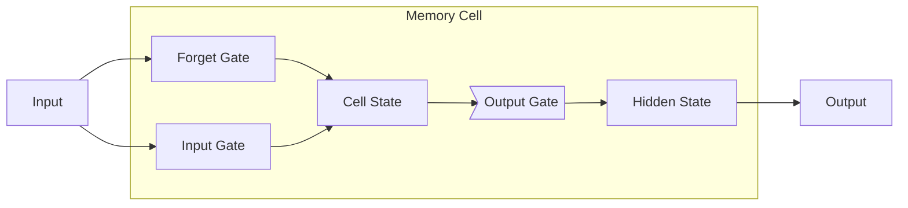

以下是《长短期记忆网络 (Long Short-Term Memory, LSTM) 原理与代码实例讲解》的技术博客文章正文内容：

# 长短期记忆网络 (Long Short-Term Memory, LSTM) 原理与代码实例讲解

## 1. 背景介绍

### 1.1 序列数据处理的挑战

在自然语言处理、语音识别、时间序列预测等领域中,我们常常会遇到需要处理序列数据的场景。传统的神经网络如前馈神经网络和卷积神经网络在处理固定长度的向量数据时表现优异,但对于序列数据就力有未逮。它们无法很好地捕捉序列数据中的长期依赖关系,因为在反向传播时,梯度或者会过早衰减或者会出现梯度爆炸的问题。

### 1.2 递归神经网络的局限性

为了解决序列数据处理的问题,研究人员提出了递归神经网络 (Recurrent Neural Networks, RNNs)。RNNs 通过内部循环机制来处理序列数据,具有记忆能力。然而,传统 RNNs 在捕捉长期依赖关系时仍然存在困难,因为随着序列长度的增加,梯度仍然会逐渐衰减或爆炸。

### 1.3 长短期记忆网络的优势

长短期记忆网络 (Long Short-Term Memory, LSTM) 是一种特殊的 RNN,专门设计用于解决长期依赖问题。LSTM 通过精心设计的门控机制和内部状态,能够有效地捕捉长期依赖关系,同时避免梯度消失或爆炸的问题。LSTM 已经广泛应用于自然语言处理、语音识别、时间序列预测等领域,并取得了卓越的成果。

## 2. 核心概念与联系

### 2.1 LSTM 网络结构

LSTM 网络由一系列相互连接的记忆单元 (Memory Cells) 组成。每个记忆单元包含一个内部状态 $c_t$ 和三个控制门:遗忘门 (Forget Gate)、输入门 (Input Gate) 和输出门 (Output Gate)。这些门控制着信息在记忆单元中的流动,决定了哪些信息需要保留、更新和输出。

### 2.2 遗忘门 (Forget Gate)

遗忘门决定了从上一时刻的细胞状态 $c_{t-1}$ 中保留多少信息到当前时刻的细胞状态 $c_t$。它通过一个 sigmoid 层来计算一个介于 0 和 1 之间的值,将其与上一时刻的细胞状态 $c_{t-1}$ 相乘,从而决定保留或遗忘哪些信息。

$$f_t = \sigma(W_f \cdot [h_{t-1}, x_t] + b_f)$$
$$c_t = f_t \odot c_{t-1}$$

其中 $f_t$ 是遗忘门的输出, $\sigma$ 是 sigmoid 函数, $W_f$ 和 $b_f$ 分别是权重和偏置, $h_{t-1}$ 是上一时刻的隐藏状态, $x_t$ 是当前时刻的输入, $\odot$ 表示元素wise乘积运算。

### 2.3 输入门 (Input Gate)

输入门决定了当前时刻的输入 $x_t$ 和上一时刻的隐藏状态 $h_{t-1}$ 中哪些信息需要更新到当前时刻的细胞状态 $c_t$。它包含两部分:一个 sigmoid 层决定更新的比例,另一个 tanh 层创建一个新的候选向量 $\tilde{c}_t$,最后将两者结合得到当前时刻的细胞状态 $c_t$。

$$i_t = \sigma(W_i \cdot [h_{t-1}, x_t] + b_i)$$
$$\tilde{c}_t = \tanh(W_c \cdot [h_{t-1}, x_t] + b_c)$$
$$c_t = f_t \odot c_{t-1} + i_t \odot \tilde{c}_t$$

其中 $i_t$ 是输入门的输出, $\tilde{c}_t$ 是候选细胞状态向量, $W_i$、$W_c$、$b_i$ 和 $b_c$ 分别是对应的权重和偏置。

### 2.4 输出门 (Output Gate)

输出门决定了当前时刻的隐藏状态 $h_t$ 中包含了细胞状态 $c_t$ 中的哪些信息。它首先通过一个 sigmoid 层来决定输出部分,然后将细胞状态 $c_t$ 通过 tanh 函数得到一个 -1 到 1 之间的值,最后将两者相乘得到最终的输出 $h_t$。

$$o_t = \sigma(W_o \cdot [h_{t-1}, x_t] + b_o)$$
$$h_t = o_t \odot \tanh(c_t)$$

其中 $o_t$ 是输出门的输出, $W_o$ 和 $b_o$ 分别是对应的权重和偏置。

通过上述门控机制和内部状态的交互,LSTM 能够有效地捕捉长期依赖关系,同时避免梯度消失或爆炸的问题,从而在处理序列数据时表现出色。

## 3. 核心算法原理具体操作步骤

LSTM 网络的核心算法原理可以概括为以下几个步骤:

### 3.1 初始化

1. 初始化网络权重参数 $W_f$、$W_i$、$W_c$、$W_o$、$b_f$、$b_i$、$b_c$、$b_o$,通常使用小的随机值。
2. 初始化细胞状态 $c_0$ 和隐藏状态 $h_0$,通常初始化为全 0 向量。

### 3.2 前向传播

对于每个时间步 $t$,执行以下操作:

1. 计算遗忘门输出 $f_t$:
   $$f_t = \sigma(W_f \cdot [h_{t-1}, x_t] + b_f)$$

2. 计算输入门输出 $i_t$ 和候选细胞状态向量 $\tilde{c}_t$:
   $$i_t = \sigma(W_i \cdot [h_{t-1}, x_t] + b_i)$$
   $$\tilde{c}_t = \tanh(W_c \cdot [h_{t-1}, x_t] + b_c)$$

3. 更新当前时刻的细胞状态 $c_t$:
   $$c_t = f_t \odot c_{t-1} + i_t \odot \tilde{c}_t$$

4. 计算输出门输出 $o_t$:
   $$o_t = \sigma(W_o \cdot [h_{t-1}, x_t] + b_o)$$

5. 计算当前时刻的隐藏状态 $h_t$:
   $$h_t = o_t \odot \tanh(c_t)$$

### 3.3 反向传播

1. 计算损失函数对隐藏状态 $h_t$ 的梯度。
2. 根据链式法则,计算损失函数对 $c_t$、$o_t$、$i_t$、$\tilde{c}_t$、$f_t$ 以及网络权重参数的梯度。
3. 使用优化算法 (如 Adam、RMSProp 等) 更新网络权重参数。

### 3.4 迭代训练

重复执行步骤 3.2 和 3.3,直到模型收敛或达到预设的最大迭代次数。

通过上述步骤,LSTM 网络可以有效地捕捉序列数据中的长期依赖关系,并在训练过程中避免梯度消失或爆炸的问题。

## 4. 数学模型和公式详细讲解举例说明

在上一节中,我们已经介绍了 LSTM 网络的核心公式。现在,我们将通过一个具体的例子来详细解释这些公式的含义和计算过程。

假设我们有一个包含 3 个时间步的序列输入 $X = [x_1, x_2, x_3]$,其中每个时间步的输入向量维度为 2。我们将使用一个单层 LSTM 网络来处理这个序列,隐藏状态维度为 3。

### 4.1 初始化

首先,我们需要初始化网络权重参数和初始状态。为了简化计算,我们将所有权重参数初始化为 0.1,偏置初始化为 0,细胞状态和隐藏状态初始化为全 0 向量。

$$W_f = W_i = W_c = W_o = \begin{bmatrix} 0.1 & 0.1 & 0.1 \\ 0.1 & 0.1 & 0.1 \\ 0.1 & 0.1 & 0.1 \end{bmatrix}$$
$$b_f = b_i = b_c = b_o = \begin{bmatrix} 0 \\ 0 \\ 0 \end{bmatrix}$$
$$c_0 = h_0 = \begin{bmatrix} 0 \\ 0 \\ 0 \end{bmatrix}$$

### 4.2 前向传播

对于第一个时间步 $t = 1$,输入为 $x_1 = \begin{bmatrix} 0.5 \\ 0.1 \end{bmatrix}$。我们将计算各个门的输出以及新的细胞状态和隐藏状态。

**遗忘门输出 $f_1$:**
$$f_1 = \sigma(W_f \cdot [h_0, x_1] + b_f)$$
$$= \sigma\left(\begin{bmatrix} 0.1 & 0.1 & 0.1 \\ 0.1 & 0.1 & 0.1 \\ 0.1 & 0.1 & 0.1 \end{bmatrix} \cdot \begin{bmatrix} 0 \\ 0 \\ 0 \\ 0.5 \\ 0.1 \end{bmatrix} + \begin{bmatrix} 0 \\ 0 \\ 0 \end{bmatrix}\right)$$
$$= \sigma\left(\begin{bmatrix} 0.05 \\ 0.05 \\ 0.05 \end{bmatrix}\right) = \begin{bmatrix} 0.512 \\ 0.512 \\ 0.512 \end{bmatrix}$$

**输入门输出 $i_1$ 和候选细胞状态向量 $\tilde{c}_1$:**
$$i_1 = \sigma(W_i \cdot [h_0, x_1] + b_i) = \begin{bmatrix} 0.512 \\ 0.512 \\ 0.512 \end{bmatrix}$$
$$\tilde{c}_1 = \tanh(W_c \cdot [h_0, x_1] + b_c) = \begin{bmatrix} 0.0499 \\ 0.0499 \\ 0.0499 \end{bmatrix}$$

**新的细胞状态 $c_1$:**
$$c_1 = f_1 \odot c_0 + i_1 \odot \tilde{c}_1$$
$$= \begin{bmatrix} 0.512 \\ 0.512 \\ 0.512 \end{bmatrix} \odot \begin{bmatrix} 0 \\ 0 \\ 0 \end{bmatrix} + \begin{bmatrix} 0.512 \\ 0.512 \\ 0.512 \end{bmatrix} \odot \begin{bmatrix} 0.0499 \\ 0.0499 \\ 0.0499 \end{bmatrix}$$
$$= \begin{bmatrix} 0.0255 \\ 0.0255 \\ 0.0255 \end{bmatrix}$$

**输出门输出 $o_1$:**
$$o_1 = \sigma(W_o \cdot [h_0, x_1] + b_o) = \begin{bmatrix} 0.512 \\ 0.512 \\ 0.512 \end{bmatrix}$$

**新的隐藏状态 $h_1$:**
$$h_1 = o_1 \odot \tanh(c_1)$$
$$= \begin{bmatrix} 0.512 \\ 0.512 \\ 0.512 \end{bmatrix} \odot \tanh\left(\begin{bmatrix} 0.0255 \\ 0.0255 \\ 0.0255 \end{bmatrix}\right)$$
$$= \begin{bmatrix} 0.0131 \\ 0.0131 \\ 0.0131 \end{bmatrix}$$

对于后续的时间步,我们将以相同的方式计算各个门的输出、细胞状态和隐藏状态,并使用上一时间步的隐藏状态作为输入。

通过这个具体的