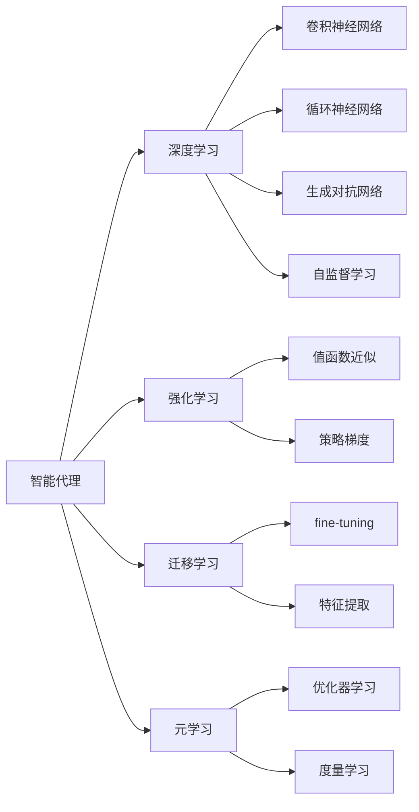

# AI人工智能深度学习算法：智能深度学习代理的构建基础

作者：禅与计算机程序设计艺术 / Zen and the Art of Computer Programming

关键词：人工智能、深度学习、智能代理、神经网络、强化学习、迁移学习、元学习、自监督学习

## 1. 背景介绍
### 1.1 问题的由来
人工智能(Artificial Intelligence, AI)自诞生以来就一直是计算机科学领域最令人神往的研究方向之一。如何让机器像人一样思考、学习和解决问题,是无数科学家孜孜以求的目标。近年来,随着大数据、云计算、GPU等技术的飞速发展,AI迎来了新的春天。其中,深度学习(Deep Learning, DL)更是异军突起,在计算机视觉、自然语言处理、语音识别等诸多领域取得了突破性进展,成为当前AI研究的主流范式。

### 1.2 研究现状
目前,深度学习的研究主要集中在对各种神经网络结构的探索和优化上,如卷积神经网络(CNN)、循环神经网络(RNN)、生成对抗网络(GAN)等。这些网络在特定任务上表现出色,但仍存在泛化能力差、可解释性不足、样本效率低等问题。如何构建一个通用的、高效的、可解释的智能深度学习代理(Agent),成为亟待解决的关键科学问题。

### 1.3 研究意义 
智能深度学习代理的构建对于推动AI从"弱人工智能"向"强人工智能"跨越具有重要意义。一个理想的智能代理应该具备持续学习、迁移学习、主动探索、因果推理等多种能力,能够像人一样快速理解和适应环境,高效地学习新知识和新技能。这不仅是实现通用人工智能(Artificial General Intelligence, AGI)的必由之路,也将极大地拓展AI的应用场景和价值空间。

### 1.4 本文结构
本文将围绕智能深度学习代理的构建这一主题展开探讨。第2节介绍相关的核心概念;第3节阐述几种关键的深度学习算法原理;第4节给出算法所依赖的数学模型和公式推导;第5节通过代码实例演示算法的具体实现;第6节分析智能代理在实际场景中的应用前景;第7节推荐相关的学习资源和工具;第8节总结全文并展望未来;第9节列举一些常见问题与解答。

## 2. 核心概念与联系

在探讨智能深度学习代理的构建之前,我们有必要先明确几个核心概念:

- 智能代理(Intelligent Agent):能够感知环境并采取行动以实现特定目标的自主实体。理想的智能代理应具备感知、推理、规划、学习、执行等多种能力。
- 深度学习(Deep Learning):一类基于多层神经网络的机器学习方法。通过学习大量数据中的特征表示,深度学习模型能够自动提取高层语义信息,在多个AI领域取得了state-of-the-art的表现。  
- 强化学习(Reinforcement Learning):一种让智能体通过与环境的交互来学习最优策略的机器学习范式。强化学习聚焦序贯决策问题,在机器人控制、自动驾驶、游戏AI等领域有广泛应用。
- 迁移学习(Transfer Learning):利用已学习的知识来辅助新任务学习的一类方法。通过知识迁移,智能体可以在相关领域实现快速学习和泛化。
- 元学习(Meta-Learning):又称"学会学习"(Learning to Learn),旨在学习一个通用的学习器,使其能够快速适应新的任务。元学习是实现few-shot learning的重要途径。
- 自监督学习(Self-supervised Learning):不依赖人工标注数据,通过自动构建监督信号来进行表示学习的范式。自监督学习可以充分利用无标注数据,是无监督学习的一个重要发展方向。

下图展示了这些概念之间的关联:

智能代理的构建需要深度学习、强化学习、迁移学习、元学习等多种技术的融合。深度学习为智能体提供了强大的感知和特征提取能力;强化学习使智能体能够通过试错来学习最优决策;迁移学习让智能体能够在新环境中复用已有知识;元学习则让智能体具备了快速学习的能力。这些技术的结合,将助力我们构建出更加智能和高效的学习代理。

## 3. 核心算法原理 & 具体操作步骤
### 3.1 算法原理概述
智能深度学习代理的构建涉及多个关键算法,包括深度神经网络、强化学习、元学习等。下面我们对其中几个核心算法的原理进行概述。

#### 3.1.1 深度神经网络
深度神经网络(Deep Neural Network, DNN)是一种由多个处理层组成的人工神经网络。通过逐层提取输入数据的特征表示,DNN能够学习到高度非线性的函数映射。前馈神经网络(Feedforward Neural Network, FNN)、卷积神经网络(Convolutional Neural Network, CNN)、循环神经网络(Recurrent Neural Network, RNN)是几种常见的DNN结构。

#### 3.1.2 强化学习
强化学习(Reinforcement Learning, RL)是一种让智能体通过与环境交互来学习最优策略的机器学习范式。RL的目标是最大化长期累积奖励,其核心要素包括状态(State)、动作(Action)、奖励(Reward)和策略(Policy)。Q-learning、SARSA、Policy Gradient是几种经典的RL算法。

#### 3.1.3 元学习
元学习(Meta-Learning)旨在学习一个通用的学习器,使其能够在新任务上实现快速学习。元学习可分为基于度量的(Metric-based)、基于模型的(Model-based)和基于优化的(Optimization-based)三大类。MAML(Model-Agnostic Meta-Learning)是一种著名的基于优化的元学习算法,通过学习一组适应任意任务的初始化参数,实现了对新任务的快速适应。

### 3.2 算法步骤详解
接下来,我们以MAML算法为例,详细讲解其具体步骤。

MAML的核心思想是学习一组适用于不同任务的初始化参数。具体而言,给定一组训练任务$\mathcal{T}=\{\mathcal{T}_1,\dots,\mathcal{T}_n\}$,每个任务$\mathcal{T}_i$包含一个支持集$\mathcal{D}_i^{train}$和一个查询集$\mathcal{D}_i^{test}$。MAML的目标是找到一组模型参数$\theta$,经过几步梯度下降后,能在查询集上取得较好性能。形式化地,MAML的优化目标可表示为:

$$
\min_\theta \sum_{\mathcal{T}_i \sim p(\mathcal{T})} \mathcal{L}_{\mathcal{T}_i}(f_{\theta_i'}) = 
\sum_{\mathcal{T}_i \sim p(\mathcal{T})} \mathcal{L}_{\mathcal{T}_i}(f_{\theta - \alpha \nabla_\theta \mathcal{L}_{\mathcal{T}_i}(f_\theta)})
$$

其中$\theta_i'$是在任务$\mathcal{T}_i$上进行梯度下降后得到的参数,$\alpha$是内循环学习率。

MAML算法的具体步骤如下:

1. 随机初始化一组模型参数$\theta$。
2. 对每个任务$\mathcal{T}_i$:
   1. 在支持集$\mathcal{D}_i^{train}$上计算损失$\mathcal{L}_{\mathcal{T}_i}(f_\theta)$。 
   2. 计算梯度$\nabla_\theta \mathcal{L}_{\mathcal{T}_i}(f_\theta)$。
   3. 更新参数$\theta_i'=\theta-\alpha \nabla_\theta \mathcal{L}_{\mathcal{T}_i}(f_\theta)$。
   4. 在查询集$\mathcal{D}_i^{test}$上计算更新后的损失$\mathcal{L}_{\mathcal{T}_i}(f_{\theta_i'})$。
3. 更新$\theta \leftarrow \theta - \beta \nabla_\theta \sum_{\mathcal{T}_i \sim p(\mathcal{T})} \mathcal{L}_{\mathcal{T}_i}(f_{\theta_i'})$。

其中$\beta$是外循环的学习率。通过不断在一批任务上进行梯度下降,MAML最终学习到一组适用于大多数任务的初始化参数$\theta$。在面对新任务时,只需在$\theta$的基础上进行少量微调,即可快速适应新任务。

### 3.3 算法优缺点
MAML算法的主要优点包括:
- 可以快速适应新任务,实现few-shot learning。
- 对网络结构没有特殊要求,适用性广。
- 训练过程简单,容易实现。

但MAML也存在一些局限性:
- 计算开销大,需要二阶梯度。
- 容易过拟合,泛化能力有待提高。
- 对任务分布敏感,鲁棒性不足。

### 3.4 算法应用领域
元学习在few-shot learning、强化学习、在线学习等领域有广泛应用。基于MAML的few-shot图像分类、few-shot目标检测等工作不断涌现。将元学习思想引入RL,可以提高智能体在新环境中的适应能力。在线元学习(Online Meta-Learning)致力于让智能体在连续的环境交互中不断进行元学习,提高其在非平稳环境下的学习效率。

## 4. 数学模型和公式 & 详细讲解 & 举例说明
### 4.1 数学模型构建
智能深度学习代理的构建依赖于多个数学模型,包括马尔可夫决策过程(Markov Decision Process, MDP)、随机梯度下降(Stochastic Gradient Descent, SGD)等。下面我们重点介绍MDP模型。

MDP提供了对强化学习问题的数学刻画。一个MDP由一个五元组$\langle \mathcal{S}, \mathcal{A}, \mathcal{P}, \mathcal{R}, \gamma \rangle$定义:
- 状态空间$\mathcal{S}$:所有可能的状态的集合。
- 动作空间$\mathcal{A}$:所有可能的动作的集合。 
- 转移概率$\mathcal{P}$:状态转移的条件概率分布,即$\mathcal{P}(s'|s,a)=\Pr(S_{t+1}=s'|S_t=s,A_t=a)$。
- 奖励函数$\mathcal{R}$:在状态$s$下采取动作$a$后获得的即时奖励的期望,即$\mathcal{R}(s,a)=\mathbb{E}[R_{t+1}|S_t=s,A_t=a]$。
- 折扣因子$\gamma \in [0,1]$:未来奖励的折现率。$\gamma$越大,智能体越重视长远利益。

MDP描述了智能体与环境交互的动力学特性。在时刻$t$,智能体处于状态$s_t \in \mathcal{S}$,采取动作$a_t \in \mathcal{A}$,环境转移到新状态$s_{t+1} \sim \mathcal{P}(\cdot|s_t,a_t)$,同时智能体获得奖励$r_{t+1} \sim \mathcal{R}(s_t,a_t)$。智能体的目标是学习一个策略$\pi(a|s)$,使得长期累积奖励$\mathbb{E}[\sum_{t=0}^\infty \gamma^t r_t|\pi]$最大化。

### 4.2 公式推导过程
接下来,我们推导策略梯度定理(Policy Gradient Theorem),阐明如何基于梯度上升来搜索最优策略。

定义智能体在策略$\pi_\theta$下的性能指标