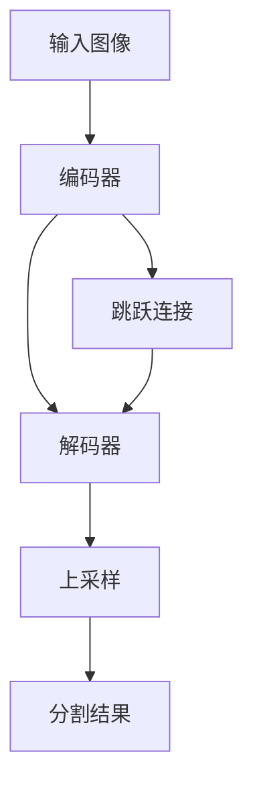

# FCN原理与代码实例讲解

作者：禅与计算机程序设计艺术 / Zen and the Art of Computer Programming

关键词：全卷积网络，语义分割，端到端，上采样，跳跃连接

## 1. 背景介绍

### 1.1 问题的由来

随着深度学习的快速发展，计算机视觉领域取得了一系列突破性进展。其中，语义分割作为图像理解的基础任务之一，旨在对图像中的每个像素进行分类，预测其所属的语义类别。传统的语义分割方法主要基于手工设计特征，存在特征表达能力不足的问题。而深度学习的出现，为语义分割提供了新的思路。

### 1.2 研究现状

近年来，基于深度学习的语义分割方法不断涌现，其中以全卷积网络（Fully Convolutional Networks，FCN）为代表。FCN最早由Long等人于2015年提出，开创了端到端语义分割的先河。此后，FCN逐渐成为语义分割领域的主流方法，并衍生出一系列改进模型，如U-Net、SegNet、DeepLab系列等。

### 1.3 研究意义 

FCN是深度学习时代语义分割的开山之作，对后续的研究产生了深远影响。一方面，FCN证明了卷积神经网络可以端到端地解决语义分割问题，为后续的研究指明了方向；另一方面，FCN提出的一些关键技术，如上采样、跳跃连接等，为后续的模型改进提供了重要参考。因此，深入理解FCN的原理与实现，对于掌握语义分割的基本方法和思想具有重要意义。

### 1.4 本文结构

本文将围绕FCN展开详细讨论。首先，介绍FCN的核心概念与联系；然后，阐述FCN的算法原理与具体操作步骤；接着，讲解FCN涉及的数学模型与公式；随后，通过代码实例和详细解释，演示FCN的项目实践；最后，总结FCN的实际应用场景、未来发展趋势与挑战，并提供相关的工具和资源推荐。

## 2. 核心概念与联系

FCN是一种端到端（end-to-end）、像素到像素（pixel-to-pixel）的语义分割方法。与传统的基于分类的语义分割方法不同，FCN抛弃了全连接层，转而采用全卷积结构，使得网络可以接受任意大小的输入图像，并生成与输入尺寸相同的分割结果。

FCN的核心概念包括：

1. 全卷积结构：FCN将传统卷积神经网络中的全连接层转换为卷积层，使得网络成为一个完全卷积的结构。这样，网络可以接受任意大小的输入，并生成相应尺寸的输出。

2. 上采样（Upsampling）：为了恢复空间信息，FCN在网络的末端使用上采样操作，将低分辨率的特征图还原为与输入尺寸相同的高分辨率分割结果。上采样可以通过反卷积（Deconvolution）或双线性插值（Bilinear Interpolation）等方式实现。

3. 跳跃连接（Skip Connection）：FCN引入了跳跃连接的思想，将编码器（Encoder）部分不同层次的特征图与解码器（Decoder）部分的上采样结果进行融合，以结合不同尺度的特征信息，提高分割精度。

下图展示了FCN的整体架构，体现了上述核心概念之间的联系：

## 3. 核心算法原理 & 具体操作步骤

### 3.1 算法原理概述

FCN的核心思想是将传统卷积神经网络的全连接层转换为卷积层，使得网络可以接受任意大小的输入，并生成相应尺寸的输出。具体而言，FCN的算法原理可以概括为以下几个关键点：

1. 卷积化：将全连接层转换为卷积层，使得网络成为全卷积结构。
2. 上采样：通过上采样操作恢复空间信息，生成与输入尺寸相同的分割结果。
3. 跳跃连接：融合不同层次的特征图，结合不同尺度的特征信息。
4. 端到端训练：整个网络可以端到端地进行训练和推理。

### 3.2 算法步骤详解

FCN的具体算法步骤如下：

1. 将预训练的卷积神经网络（如VGG、ResNet等）作为编码器，去除其全连接层。
2. 在编码器的末端添加卷积层，将最后一个卷积块的通道数调整为所需的类别数。
3. 对编码器的输出进行上采样，使其恢复到与输入尺寸相同。上采样可以通过反卷积或双线性插值等方式实现。
4. 将编码器中间层的特征图进行上采样，并与解码器相应层的特征图进行融合（跳跃连接）。
5. 对融合后的特征图进行卷积和上采样，直到恢复到输入尺寸。
6. 使用softmax函数对最终的特征图进行像素级分类，得到每个像素所属的类别概率。
7. 计算损失函数（如交叉熵损失），并使用反向传播算法优化网络参数。
8. 重复步骤1-7，直到网络收敛或达到预定的迭代次数。

### 3.3 算法优缺点

FCN的优点包括：

1. 端到端：FCN实现了端到端的语义分割，无需手工设计特征或后处理步骤。
2. 任意尺寸输入：由于采用全卷积结构，FCN可以接受任意大小的输入图像。
3. 像素级预测：FCN可以对每个像素进行分类，生成与输入尺寸相同的分割结果。
4. 结构简单：相比其他语义分割方法，FCN的结构相对简单，易于理解和实现。

FCN的缺点包括：

1. 空间信息损失：由于编码器部分存在多次下采样，导致空间信息的损失，影响分割精度。
2. 边界不精确：FCN对物体边界的刻画不够精细，存在一定的模糊和锯齿现象。
3. 上下文信息利用不足：FCN对全局上下文信息的利用不够充分，影响对小目标和复杂场景的分割性能。

### 3.4 算法应用领域

FCN作为语义分割的经典方法，在诸多领域得到了广泛应用，包括：

1. 自动驾驶：FCN可以用于道路场景理解，实现车道线检测、障碍物分割等功能。
2. 医学图像分析：FCN可以用于医学图像的器官、肿瘤等区域的自动分割，辅助疾病诊断和治疗。
3. 遥感图像解译：FCN可以用于卫星或航拍图像的土地利用分类、变化检测等任务。
4. 增强现实：FCN可以用于实时场景理解，实现虚拟对象与真实环境的无缝融合。
5. 机器人视觉：FCN可以用于机器人的环境感知、目标识别和定位等任务。

## 4. 数学模型和公式 & 详细讲解 & 举例说明

### 4.1 数学模型构建

FCN的数学模型可以表示为一个映射函数 $f$，将输入图像 $\mathbf{X}$ 映射为像素级别的分割结果 $\mathbf{Y}$：

$$
\mathbf{Y} = f(\mathbf{X}; \mathbf{W})
$$

其中，$\mathbf{W}$ 表示FCN的可学习参数。

FCN的损失函数通常采用交叉熵损失，对于每个像素 $i$，其交叉熵损失定义为：

$$
\ell_i = -\sum_{c=1}^{C} y_{i,c} \log(\hat{y}_{i,c})
$$

其中，$C$ 表示类别数，$y_{i,c}$ 表示像素 $i$ 属于类别 $c$ 的真实标签（0或1），$\hat{y}_{i,c}$ 表示FCN预测的像素 $i$ 属于类别 $c$ 的概率。

整个图像的损失函数为所有像素的交叉熵损失之和：

$$
L = \frac{1}{N} \sum_{i=1}^{N} \ell_i
$$

其中，$N$ 表示像素总数。

### 4.2 公式推导过程

FCN的前向传播过程可以表示为一系列卷积、上采样和跳跃连接操作。对于第 $l$ 层的特征图 $\mathbf{F}^{(l)}$，其计算公式为：

$$
\mathbf{F}^{(l)} = 
\begin{cases}
\mathbf{X}, & l = 0 \\
f^{(l)}(\mathbf{F}^{(l-1)}), & l = 1, 2, ..., L-1 \\
\text{upsample}(f^{(l)}(\mathbf{F}^{(l-1)})) + \mathbf{F}^{(l')}, & l = L
\end{cases}
$$

其中，$f^{(l)}$ 表示第 $l$ 层的卷积操作，$L$ 表示网络的总层数，$\text{upsample}$ 表示上采样操作，$\mathbf{F}^{(l')}$ 表示编码器中间层的特征图。

最终的分割结果通过对最后一层特征图 $\mathbf{F}^{(L)}$ 应用 softmax 函数得到：

$$
\hat{y}_{i,c} = \frac{\exp(f_{i,c}^{(L)})}{\sum_{j=1}^{C} \exp(f_{i,j}^{(L)})}
$$

其中，$f_{i,c}^{(L)}$ 表示最后一层特征图在位置 $i$ 处的第 $c$ 个通道的值。

### 4.3 案例分析与讲解

以图像分割任务为例，假设我们要将一张输入图像分割为前景和背景两类。输入图像的尺寸为 $H \times W \times 3$，其中 $H$ 和 $W$ 分别表示图像的高度和宽度，3表示RGB三个颜色通道。

FCN的编码器部分通过一系列卷积和下采样操作，将输入图像编码为低分辨率的特征图。假设编码器的输出特征图尺寸为 $\frac{H}{16} \times \frac{W}{16} \times 512$。

接下来，通过上采样操作将特征图的尺寸恢复到与输入图像相同。上采样可以通过反卷积或双线性插值等方式实现。假设我们使用双线性插值进行上采样，则上采样后的特征图尺寸为 $H \times W \times 512$。

为了结合不同尺度的特征信息，我们将编码器中间层的特征图也进行上采样，并与解码器相应层的特征图进行融合。假设我们选取编码器中第3个卷积块的输出作为跳跃连接的特征图，其尺寸为 $\frac{H}{8} \times \frac{W}{8} \times 256$。我们将其上采样到 $H \times W \times 256$，并与解码器的特征图进行逐元素相加。

最后，我们对融合后的特征图应用一个 $1 \times 1$ 卷积，将通道数调整为类别数（在这个例子中为2），得到尺寸为 $H \times W \times 2$ 的最终特征图。对该特征图应用 softmax 函数，即可得到每个像素属于前景或背景的概率。

### 4.4 常见问题解答

**问题1：FCN的上采样操作是否会引入额外的参数？**

答：这取决于上采样的具体实现方式。如果使用反卷积进行上采样，则会引入额外的可学习参数；如果使用双线性插值进行上采样，则不会引入额外的参数。

**问题2：FCN的跳跃连接是否可以多次使用？**

答：是的，FCN可以使用多个跳跃连接，将编码器的多个中间层特征图与解码器的特征图进行融合。这有助于结合不同尺度的特征信息，提高分割精度。

**问题3：FCN的损失函数可以使用其他形式吗？**

答：除了交叉