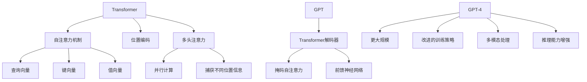

# GPT-4原理与代码实例讲解

## 1. 背景介绍

### 1.1 问题的由来

在过去几年中,自然语言处理(NLP)领域取得了长足的进步,其中变革性的突破是由Transformer模型和大型语言模型(LLM)的出现所推动的。作为当前最先进的语言模型之一,GPT(Generative Pre-trained Transformer)系列模型展现出了令人印象深刻的性能,在广泛的自然语言处理任务中表现出色。

GPT-4作为GPT系列的最新版本,其强大的语言生成能力、多模态处理能力和推理能力备受关注。与前代模型相比,GPT-4在模型规模、训练数据、训练策略等多个方面都有重大突破,使其能够更好地理解和生成自然语言,并具备跨模态的处理能力。

### 1.2 研究现状

自GPT-4发布以来,业界和学术界对其原理和性能进行了广泛的研究和探讨。研究人员从模型架构、训练策略、数据处理等多个角度对GPT-4进行了深入分析,试图揭示其卓越性能的关键因素。同时,GPT-4在多个领域的应用也取得了令人瞩目的成绩,例如对话系统、文本生成、问答系统等,展现出了其强大的实用价值。

然而,GPT-4作为一个复杂的深度学习模型,其内部机理并非一目了然。许多研究人员仍在努力探索GPT-4的工作原理,以期能够更好地理解和优化这一革命性的模型。此外,GPT-4也面临着一些挑战,例如对抗性攻击、偏差和公平性问题等,需要进一步的研究和解决。

### 1.3 研究意义

深入研究GPT-4的原理和实现细节,对于推动自然语言处理领域的发展具有重要意义。通过揭示GPT-4的内部机制,我们可以更好地理解大型语言模型的工作原理,从而为设计和优化下一代模型提供宝贵的经验和见解。

此外,研究GPT-4的应用场景和实践案例,也有助于我们充分发掘其潜力,并将其应用于更多的领域,为解决实际问题提供有力的工具。同时,探讨GPT-4面临的挑战和局限性,有助于我们制定相应的解决方案,推动模型的持续改进和发展。

### 1.4 本文结构

本文将全面介绍GPT-4的原理、实现细节和实践案例。我们将从模型架构、训练策略、数据处理等多个角度深入探讨GPT-4的核心技术,并通过数学模型和公式详细阐述其内部机制。此外,我们还将提供丰富的代码实例和详细解释,帮助读者更好地理解和实践GPT-4。

在实际应用场景部分,我们将介绍GPT-4在不同领域的应用案例,展示其强大的实用价值。同时,我们也将分享一些有用的工具和资源,为读者提供更多的学习和开发支持。

最后,我们将总结GPT-4的研究成果,展望其未来的发展趋势和面临的挑战,并对未来的研究方向提出建议和展望。

## 2. 核心概念与联系

在深入探讨GPT-4的核心算法原理之前,我们需要先了解一些基本的核心概念和它们之间的关系。这些概念为理解GPT-4的工作原理奠定了基础。

1. **Transformer**：Transformer是一种革命性的序列到序列(Seq2Seq)模型架构,它完全基于注意力机制,不依赖于循环神经网络(RNN)或卷积神经网络(CNN)。Transformer模型在机器翻译、文本生成等自然语言处理任务中表现出色,成为了当前主流的模型架构。

2. **自注意力机制**：自注意力机制是Transformer模型的核心组件之一,它允许模型在计算目标输出时,同时关注输入序列的所有位置。这种机制通过计算查询向量、键向量和值向量之间的相似性来捕获输入序列中不同位置之间的依赖关系。

3. **位置编码**：由于Transformer模型不再依赖于序列的顺序信息,因此需要引入位置编码来为模型提供序列中每个位置的位置信息。位置编码可以通过不同的方式实现,例如正弦位置编码或可学习的位置嵌入。

4. **多头注意力**：多头注意力机制是自注意力机制的一种扩展,它将注意力过程分成多个并行的"头"。每个头都会独立地计算注意力权重,然后将它们的结果进行拼接和线性变换。这种机制可以帮助模型从不同的表示子空间中捕获不同的位置信息。

5. **GPT (Generative Pre-trained Transformer)**：GPT是一种基于Transformer解码器的自回归语言模型,它专门用于生成式任务,如文本生成、机器翻译等。GPT模型采用了掩码自注意力机制,只允许模型关注当前位置之前的上下文信息,从而实现自回归生成。

6. **GPT-4**：作为GPT系列的最新版本,GPT-4在模型规模、训练数据、训练策略等多个方面都有重大突破。GPT-4不仅拥有更大的模型规模,还采用了改进的训练策略,如反向传播、对抗训练等,以提高模型的性能和鲁棒性。此外,GPT-4还具备了多模态处理能力,可以同时处理文本、图像、音频等不同模态的数据。最后,GPT-4的推理能力也得到了增强,使其能够更好地理解上下文信息,进行推理和决策。

这些核心概念相互关联,共同构建了GPT-4的理论基础和技术框架。理解它们之间的联系,对于深入掌握GPT-4的原理至关重要。

## 3. 核心算法原理与具体操作步骤

### 3.1 算法原理概述

GPT-4的核心算法原理基于Transformer架构和自注意力机制。它采用了自回归语言模型的形式,通过掩码自注意力机制实现自回归生成。在生成过程中,GPT-4会根据已生成的上下文信息,预测下一个最可能的标记(如单词或子词)。

GPT-4的自注意力机制可以捕捉输入序列中任意两个位置之间的依赖关系,从而更好地理解上下文信息。与传统的序列模型(如RNN)相比,自注意力机制不受序列长度的限制,可以更有效地处理长序列。

此外,GPT-4还采用了多头注意力机制,将注意力过程分成多个并行的"头"。每个头都会独立地计算注意力权重,然后将它们的结果进行拼接和线性变换。这种机制可以帮助模型从不同的表示子空间中捕获不同的位置信息,从而提高模型的表示能力。

在模型架构方面,GPT-4基于Transformer解码器,由多个解码器层堆叠而成。每个解码器层包含一个掩码自注意力子层和一个前馈神经网络子层。掩码自注意力子层负责捕获输入序列中不同位置之间的依赖关系,而前馈神经网络子层则用于进一步处理和转换表示。

为了提高模型的性能和鲁棚性,GPT-4采用了一些改进的训练策略,如反向传播、对抗训练等。这些策略有助于减小模型的偏差,提高其在各种任务和数据集上的泛化能力。

### 3.2 算法步骤详解

GPT-4的自回归生成过程可以分为以下几个主要步骤:

1. **输入编码**:将输入序列(如文本)转换为模型可以理解的向量表示形式。这通常包括将单词或子词映射到embedding向量,并添加位置编码以捕获序列的位置信息。

2. **掩码自注意力计算**:在每个解码器层中,输入序列的编码表示会被送入掩码自注意力子层。该子层会计算输入序列中每个位置与其他位置之间的注意力权重,从而捕获它们之间的依赖关系。由于是自回归模型,因此在计算注意力权重时,每个位置只能关注其之前的上下文信息。

3. **多头注意力融合**:在计算完单个注意力头的权重后,多头注意力机制会将所有头的注意力权重进行拼接和线性变换,得到最终的注意力表示。

4. **前馈神经网络处理**:注意力表示会被送入前馈神经网络子层进行进一步的非线性变换和处理。这一步骤有助于捕获更复杂的特征和模式。

5. **层归一化和残差连接**:为了提高模型的稳定性和收敛速度,GPT-4在每个子层的输出上应用了层归一化和残差连接操作。

6. **输出生成**:在最后一个解码器层的输出上,GPT-4会使用一个线性层和softmax函数来生成下一个标记的概率分布。根据这个概率分布,模型可以采样或选择最可能的标记作为输出。

7. **自回归迭代**:生成过程是自回归的,即模型会将已生成的标记作为新的输入,重复上述步骤以生成下一个标记。这个过程会一直持续,直到达到预定的序列长度或生成终止符。

通过上述步骤,GPT-4可以逐步生成出连贯、流畅的自然语言序列,如文本、代码等。值得注意的是,在实际应用中,GPT-4还可能会结合其他技术和策略,如梯度裁剪、注意力掩码等,以进一步提高模型的性能和效率。

### 3.3 算法优缺点

**优点**:

1. **并行计算能力强**:自注意力机制允许模型并行计算输入序列中任意两个位置之间的依赖关系,从而提高了计算效率。

2. **长距离依赖捕获能力强**:与RNN相比,Transformer架构可以更有效地捕获长距离的依赖关系,不受序列长度的限制。

3. **多头注意力机制增强了表示能力**:通过从多个表示子空间捕获不同的位置信息,多头注意力机制提高了模型的表示能力。

4. **可解释性较好**:自注意力机制的计算过程相对可解释,有助于理解模型的内部工作原理。

5. **泛化能力强**:通过改进的训练策略,GPT-4在各种任务和数据集上表现出较强的泛化能力。

**缺点**:

1. **计算复杂度高**:自注意力机制需要计算输入序列中所有位置对之间的注意力权重,计算复杂度较高,尤其是对于长序列。

2. **内存消耗大**:由于需要存储所有位置对之间的注意力权重,Transformer模型的内存消耗相对较大。

3. **序列长度限制**:虽然比RNN有所改善,但Transformer模型在处理极长序列时仍然存在一定的限制。

4. **缺乏显式的位置信息**:Transformer模型需要依赖位置编码来提供序列的位置信息,而位置编码的最优选择仍然是一个开放问题。

5. **训练数据需求量大**:为了获得良好的性能,GPT-4需要大量的高质量训练数据,这对数据采集和处理提出了更高的要求。

### 3.4 算法应用领域

由于其强大的语言生成能力,GPT-4可以应用于广泛的自然语言处理任务,包括但不限于:

1. **文本生成**:GPT-4可以用于生成各种类型的文本内容,如新闻