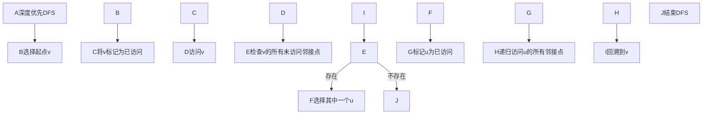
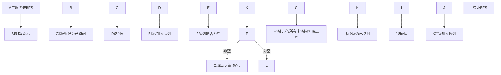

# Graph Traversal图遍历原理与代码实例讲解

作者：禅与计算机程序设计艺术 / Zen and the Art of Computer Programming

关键词：图遍历、深度优先搜索、广度优先搜索、拓扑排序、最短路径、最小生成树

## 1. 背景介绍

### 1.1 问题的由来

图(Graph)是一种非常重要的数据结构,在计算机科学、数学、工程等领域有广泛的应用。许多实际问题都可以抽象为图模型,如社交网络、交通路线规划、任务调度等。图遍历(Graph Traversal)是图算法中的基础,是许多高级算法的基石。掌握图遍历算法对理解和运用图论知识至关重要。

### 1.2 研究现状

目前,关于图遍历的研究已经比较成熟,形成了一套完整的理论和算法体系。经典的图遍历算法主要有深度优先搜索(DFS)和广度优先搜索(BFS)两大类。此外,还衍生出了许多变种和优化算法,如双向搜索、A*搜索等。这些算法在理论和工程实践中都得到了广泛应用。

### 1.3 研究意义 

深入理解图遍历算法,对于提高程序员的算法思维能力和解决实际问题的能力有重要意义。通过学习图遍历,可以加深对图这一数据结构的理解,培养抽象建模和逻辑推理的能力。同时,图遍历在面试和算法竞赛中也是常考点,掌握这些知识有助于提升竞争力。

### 1.4 本文结构

本文将从以下几个方面对图遍历进行系统讲解:

- 图的基本概念和表示方法
- 深度优先搜索(DFS)算法原理与代码实现  
- 广度优先搜索(BFS)算法原理与代码实现
- 图遍历的典型应用,如拓扑排序、最短路径、连通分量等
- 图遍历相关的数学模型与公式推导
- 代码实践与注意事项
- 工具和学习资源推荐

## 2. 核心概念与联系

在正式介绍图遍历算法之前,我们先来回顾一下图的一些基本概念:

- 顶点(Vertex):图中的基本元素,表示一个独立的对象或实体。
- 边(Edge):连接两个顶点,表示它们之间的关系。边可以是有向的或无向的。
- 权重(Weight):边上的一个数值,表示两个顶点之间的距离或耗费。
- 路径(Path):由一系列顶点和边首尾连接形成的序列。
- 连通图:图中任意两个顶点之间都存在路径。
- 度(Degree):与一个顶点相连的边的数量。

图的常见存储方式有:邻接矩阵、邻接表、边集数组等。

图遍历的本质是以某种次序访问图中的所有顶点,并且每个顶点只访问一次。通过图遍历,我们可以:

- 检查图的连通性
- 寻找特定顶点或路径
- 生成图的线性序
- 计算图的一些性质,如顶点的度、距离等

DFS和BFS是两种最基本的图遍历方式,它们的区别在于:

- DFS:从起点出发,先访问起点的一个未访问过的邻接点,然后再从该点出发深度优先遍历,直到所有顶点都被访问到。
- BFS:从起点出发,先访问起点的所有未访问过的邻接点,然后再依次访问这些邻接点的所有未访问邻接点,直到所有顶点都被访问到。

可以看出,DFS是纵向的逐层访问,BFS是横向的逐层访问。它们适用于不同的场景。

下面我们通过流程图直观地展示DFS和BFS的基本过程:





## 3. 核心算法原理 & 具体操作步骤

### 3.1 算法原理概述

DFS和BFS虽然访问顶点的次序不同,但它们的基本思想是类似的:

1. 选择图中的一个起点,并标记为已访问。 
2. 访问该顶点。
3. 寻找该顶点的一个未访问过的邻接点,标记为已访问并访问它。
4. 重复步骤3,直到所有顶点都被访问到。

不同之处在于:

- DFS:步骤3中优先选择深度方向上的顶点,用栈来实现。
- BFS:步骤3中优先选择广度方向上的顶点,用队列来实现。

### 3.2 算法步骤详解

下面我们用伪代码来描述DFS和BFS的具体步骤。

DFS:
```
// 输入:图G,起点v
DFS(G, v)
  v.visited = true
  visit(v) 
  for u in v.neighbors
    if u.visited == false
      DFS(G, u)
```

其中,`visit(v)`表示访问顶点`v`时要执行的操作,如打印顶点、更新数据等。

BFS:
```
// 输入:图G,起点v
BFS(G, v)
  v.visited = true
  visit(v)
  Q = new Queue()
  Q.enqueue(v)
  while Q is not empty
    u = Q.dequeue()
    for w in u.neighbors
      if w.visited == false  
        w.visited = true
        visit(w)
        Q.enqueue(w)
```

可以看出,BFS需要一个队列来存储待访问的顶点。每次从队列取出一个顶点,将其未访问过的邻接点加入队列。

### 3.3 算法优缺点

DFS和BFS作为两种基础的图遍历算法,各有优缺点。

DFS的优点:
- 空间复杂度低,只需要维护一个栈。
- 适合探索未知的领域,如迷宫问题。
- 适合求解可达性问题,如两点间是否存在路径。

DFS的缺点:  
- 时间复杂度高,最坏情况下需要遍历所有顶点和边。
- 不适合求最短路径,因为找到的路径不一定是最短的。

BFS的优点:
- 可以找到起点到其他顶点的最短路径。
- 空间换时间,时间复杂度通常比DFS低。

BFS的缺点:
- 空间复杂度高,需要维护一个队列。
- 不适合解决迷宫等探索类问题。

### 3.4 算法应用领域

图遍历在许多领域都有应用,下面列举一些典型场景:

- 拓扑排序:在一个有向无环图中,将所有顶点排成一个线性序列。常用于任务调度、依赖分析等。
- 最短路径:求解加权图中两个顶点之间的最短路径,如Dijkstra算法。
- 关键路径:找出加权有向图中起点到终点的最长路径,如AOE网。
- 二分图匹配:判断一个图是否为二分图,并找出最大匹配。
- 连通分量:找出无向图中的所有连通子图。
- 环检测:判断一个有向图中是否存在环。
- 树的遍历:二叉树的先序、中序、后序遍历实质上就是图的DFS。

## 4. 数学模型和公式 & 详细讲解 & 举例说明

图遍历中涉及的数学概念主要有:

- 图的表示:邻接矩阵、邻接表。
- 图的连通性:强连通、弱连通。
- 最短路径:Dijkstra算法、Floyd算法。
- 拓扑排序:Kahn算法、DFS算法。

### 4.1 数学模型构建

以最短路径问题为例,我们来看看如何将问题抽象为数学模型。

设有一个加权有向图$G=(V,E)$,其中$V$为顶点集,$E$为边集。边$(u,v)$的权值为$w(u,v)$,表示从$u$到$v$的距离。我们要求$G$中从顶点$s$到顶点$t$的最短路径。

定义$d(v)$为$s$到$v$的最短距离,显然有:

$$
d(s) = 0 \\
d(v) = \min\{d(u) + w(u,v) | (u,v) \in E\}
$$

这就是Dijkstra算法的核心思想:不断更新顶点的最短距离,直到找到目标顶点。

### 4.2 公式推导过程

下面我们推导Dijkstra算法的数学公式。

1. 初始化:$d(s)=0$,其他顶点$d(v)=\infty$。
2. 选择一个未访问过的、$d$值最小的顶点$u$,标记为已访问。
3. 对于$u$的每个未访问过的邻接点$v$,更新$d(v)=\min\{d(v), d(u)+w(u,v)\}$。
4. 重复步骤2-3,直到所有顶点都被访问过。

可以用数学归纳法证明,每次选择的$u$就是当前$s$到$u$的最短距离。

设$S$为已访问过的顶点集,$V-S$为未访问过的顶点集。

- 初始时,$S=\{s\}$,结论成立。
- 假设某一时刻结论成立,从$V-S$中选择$d$值最小的$u$加入$S$。
- 对于任意$v \in V-S$,如果$(u,v) \in E$,则有:

$$
d(v) \leq d(u) + w(u,v)
$$

- 又因为$u$是$V-S$中$d$值最小的,所以$d(u)$就是$s$到$u$的最短距离。
- 由数学归纳法,结论对所有顶点都成立。

### 4.3 案例分析与讲解

下面我们用一个具体例子来说明Dijkstra算法的执行过程。


1. 初始化:$d(A)=0$,其他顶点$d=\infty$。
2. 选择$A$,更新$d(B)=10,d(C)=3$。
3. 选择$C$,更新$d(B)=5,d(D)=11$。
4. 选择$B$,更新$d(D)=7,d(E)=12$。
5. 选择$D$,更新$d(E)=7,d(F)=13$。
6. 选择$E$,更新$d(F)=9$。
7. 选择$F$,算法结束。

最终求得从$A$到其他顶点的最短距离为:

$$
d(B)=5, d(C)=3, d(D)=7, d(E)=7, d(F)=9
$$

### 4.4 常见问题解答

Q:Dijkstra算法能否处理负权边?
A:不能。Dijkstra算法要求所有边的权值非负,否则会出现逆向更新的情况。如果有负权边,可以使用Bellman-Ford算法或SPFA算法。

Q:Dijkstra算法的时间复杂度是多少?
A:使用邻接矩阵存储图时,时间复杂度为$O(V^2)$;使用邻接表和优先队列时,时间复杂度为$O(E\log V)$。

Q:Dijkstra算法与BFS有什么区别?  
A:它们都是求最短路径的算法,但BFS只适用于无权图,而Dijkstra算法适用于非负权图。BFS的队列是先进先出,Dijkstra的队列是优先队列。

## 5. 项目实践：代码实例和详细解释说明

下面我们用C++代码来实现DFS、BFS和Dijkstra算法。

### 