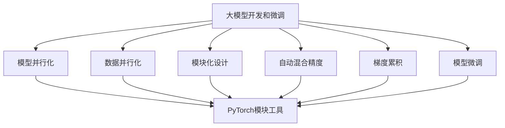

# 从零开始大模型开发与微调：PyTorch 2.0中的模块工具

## 1. 背景介绍

### 1.1 问题的由来

在当前的人工智能领域中,大型神经网络模型(例如GPT-3、BERT、DALL-E等)已经取得了令人瞩目的成就,展现出强大的语言理解、生成和视觉理解能力。然而,训练这些大模型需要耗费大量的计算资源,并且需要海量的数据进行预训练。因此,如何高效地开发和微调这些大模型成为了一个亟待解决的问题。

### 1.2 研究现状

目前,PyTorch作为一个流行的深度学习框架,已经提供了许多有用的工具和模块来支持大模型的开发和微调。PyTorch 2.0版本进一步增强了这些功能,引入了新的模块化设计和优化技术,旨在简化大模型的开发过程,提高训练效率和可扩展性。

### 1.3 研究意义

本文将深入探讨PyTorch 2.0中的模块化工具,以及如何利用这些工具从零开始开发和微调大型神经网络模型。通过掌握这些技术,研究人员和开发人员将能够更高效地构建和优化大模型,推动人工智能领域的进一步发展。

### 1.4 本文结构

本文将首先介绍大模型开发和微调中的核心概念,然后详细讲解PyTorch 2.0中的模块化工具及其算法原理。接下来,我们将通过数学模型和公式,深入探讨这些工具的理论基础。随后,我们将提供实际的代码示例,展示如何在项目中应用这些工具。最后,我们将讨论大模型的实际应用场景、未来发展趋势和面临的挑战。

## 2. 核心概念与联系

在深入探讨PyTorch 2.0中的模块化工具之前,让我们先了解一些核心概念和它们之间的联系。

### 2.1 大模型

大模型(Large Model)是指具有数十亿甚至上百亿参数的巨型神经网络模型。这些模型通常在海量数据上进行预训练,以获取广泛的知识和能力。常见的大模型包括GPT-3、BERT、DALL-E等。

### 2.2 模型并行化

由于大模型的巨大规模,单个GPU或CPU无法容纳整个模型。因此,需要将模型分散到多个设备(GPU或TPU)上进行并行计算,这就是模型并行化(Model Parallelism)。

### 2.3 数据并行化

除了模型并行化,还需要将训练数据分散到多个设备上进行并行计算,以加速训练过程。这种技术被称为数据并行化(Data Parallelism)。

### 2.4 模块化设计

为了更好地管理大模型的复杂性,PyTorch 2.0采用了模块化设计(Modularity)。模型被分解为多个可重用的模块,每个模块负责特定的功能,从而提高了代码的可维护性和可扩展性。

### 2.5 自动混合精度

自动混合精度(Automatic Mixed Precision,AMP)是一种优化技术,它可以在保持数值精度的同时,利用较低精度的数据类型(如FP16)进行计算,从而提高计算效率和内存利用率。

### 2.6 梯度累积

梯度累积(Gradient Accumulation)是一种训练技术,它可以将多个小批次的梯度累积起来,然后一次性更新模型参数。这种方法可以有效地提高内存利用率,从而支持更大的批次大小和模型规模。

### 2.7 模型微调

模型微调(Fine-tuning)是指在预训练模型的基础上,使用特定任务的数据进行进一步训练,以适应新的任务。这种方法可以有效地利用预训练模型中的知识,加快新任务的训练过程。

### 2.8 Mermaid流程图

上图展示了大模型开发和微调中的核心概念及其相互关系。PyTorch 2.0中的模块化工具为这些概念提供了支持,帮助开发人员更高效地构建和优化大模型。

## 3. 核心算法原理 & 具体操作步骤

在本节中,我们将详细介绍PyTorch 2.0中用于大模型开发和微调的核心算法原理,以及具体的操作步骤。

### 3.1 算法原理概述

PyTorch 2.0中的模块化工具主要包括以下几个核心算法:

1. **模型并行化算法**: 将大模型分散到多个设备(GPU或TPU)上进行并行计算,以克服单个设备内存限制。
2. **数据并行化算法**: 将训练数据分散到多个设备上进行并行计算,以加速训练过程。
3. **自动混合精度算法**: 利用较低精度的数据类型(如FP16)进行计算,从而提高计算效率和内存利用率,同时保持数值精度。
4. **梯度累积算法**: 将多个小批次的梯度累积起来,然后一次性更新模型参数,以支持更大的批次大小和模型规模。
5. **模型微调算法**: 在预训练模型的基础上,使用特定任务的数据进行进一步训练,以适应新的任务。

这些算法相互协作,为大模型开发和微调提供了高效、可扩展的解决方案。

### 3.2 算法步骤详解

接下来,我们将详细介绍每个算法的具体操作步骤。

#### 3.2.1 模型并行化算法

1. **划分模型**: 将大模型划分为多个子模块,每个子模块将被分配到不同的设备上运行。
2. **数据传输**: 在不同设备之间传输必要的数据,以确保每个设备都能获取所需的输入数据。
3. **并行计算**: 在各个设备上并行执行子模块的计算操作。
4. **结果合并**: 将各个设备的计算结果合并,得到最终的模型输出。

#### 3.2.2 数据并行化算法

1. **划分数据**: 将训练数据划分为多个子集,每个子集将被分配到不同的设备上进行处理。
2. **并行计算**: 在各个设备上并行计算每个子集的前向传播和反向传播。
3. **梯度聚合**: 将各个设备上计算得到的梯度聚合起来,得到整个模型的梯度。
4. **参数更新**: 使用聚合后的梯度,更新模型参数。

#### 3.2.3 自动混合精度算法

1. **数据类型转换**: 将模型参数和输入数据从FP32转换为FP16,以节省内存和提高计算效率。
2. **前向传播**: 使用FP16进行前向传播计算。
3. **损失计算**: 将前向传播的输出转换回FP32,计算损失函数。
4. **反向传播**: 使用FP16进行反向传播计算,得到FP16格式的梯度。
5. **梯度转换**: 将FP16格式的梯度转换为FP32,用于更新模型参数。

#### 3.2.4 梯度累积算法

1. **初始化累积器**: 初始化一个累积器,用于存储多个批次的梯度。
2. **前向传播和反向传播**: 对每个批次进行前向传播和反向传播计算,得到梯度。
3. **梯度累积**: 将当前批次的梯度累加到累积器中。
4. **参数更新**: 当累积器中的梯度达到预设阈值时,使用累积器中的梯度更新模型参数,并清空累积器。

#### 3.2.5 模型微调算法

1. **加载预训练模型**: 加载预先训练好的大模型,作为微调的起点。
2. **准备微调数据**: 准备用于微调的任务特定数据集。
3. **微调训练**: 使用微调数据集对预训练模型进行进一步训练,以适应新的任务。
4. **模型评估**: 在验证集或测试集上评估微调后的模型性能。
5. **模型保存**: 保存微调后的模型,以供后续使用。

### 3.3 算法优缺点

上述算法具有以下优点:

- **高效利用资源**: 通过模型并行化和数据并行化,可以充分利用多个设备的计算资源,加速训练过程。
- **节省内存**: 自动混合精度和梯度累积算法可以有效地减少内存占用,支持更大规模的模型和批次大小。
- **提高灵活性**: 模型微调算法允许在预训练模型的基础上进行进一步优化,适应不同的任务需求。

然而,这些算法也存在一些潜在的缺点:

- **通信开销**: 在多设备环境下,不同设备之间的数据传输可能会引入额外的通信开销。
- **数值稳定性**: 自动混合精度算法可能会引入数值不稳定的问题,需要谨慎处理。
- **超参数调优**: 许多算法都涉及一些超参数的设置,需要进行适当的调优以获得最佳性能。

### 3.4 算法应用领域

PyTorch 2.0中的模块化工具及其相关算法可以广泛应用于以下领域:

- **自然语言处理**: 训练和微调大型语言模型,如GPT-3、BERT等。
- **计算机视觉**: 训练和微调大型视觉模型,如DALL-E、Vision Transformer等。
- **多模态任务**: 训练和微调融合了多种模态(如文本、图像、视频等)的大型模型。
- **科学计算**: 在科学计算领域,利用大模型进行复杂的模拟和预测。
- **推荐系统**: 训练和微调大型推荐模型,以提供个性化的推荐服务。

## 4. 数学模型和公式 & 详细讲解 & 举例说明

在本节中,我们将探讨大模型开发和微调中的数学模型和公式,并通过具体案例进行详细讲解。

### 4.1 数学模型构建

在构建大型神经网络模型时,我们通常采用一种模块化的方式,将整个模型分解为多个可重用的子模块。每个子模块都可以被视为一个独立的函数或运算单元,具有特定的输入和输出。

假设我们有一个由 $N$ 个子模块组成的大型模型,其中第 $i$ 个子模块的输入为 $\mathbf{x}_i$,输出为 $\mathbf{y}_i$,参数为 $\boldsymbol{\theta}_i$。那么,整个模型的输出 $\mathbf{y}$ 可以表示为:

$$\mathbf{y} = f_N(\mathbf{y}_{N-1}, \boldsymbol{\theta}_N) \circ f_{N-1}(\mathbf{y}_{N-2}, \boldsymbol{\theta}_{N-1}) \circ \cdots \circ f_1(\mathbf{x}_1, \boldsymbol{\theta}_1)$$

其中,符号 $\circ$ 表示函数的复合运算。

在训练过程中,我们需要优化模型的参数 $\boldsymbol{\theta} = \{\boldsymbol{\theta}_1, \boldsymbol{\theta}_2, \cdots, \boldsymbol{\theta}_N\}$,以最小化一个损失函数 $\mathcal{L}(\mathbf{y}, \mathbf{t})$,其中 $\mathbf{t}$ 表示期望的目标输出。通常采用梯度下降法进行优化,即根据损失函数对参数的梯度进行更新:

$$\boldsymbol{\theta} \leftarrow \boldsymbol{\theta} - \eta \frac{\partial \mathcal{L}}{\partial \boldsymbol{\theta}}$$

其中,$\eta$ 是学习率。

### 4.2 公式推导过程

在模型并行化和数据并行化的情况下,我们需要将模型和数据分散到多个设备上进行并行计算。假设我们有 $M$ 个设备,每个设备上的模型参数和输入数据分别记为 $\boldsymbol{\theta}^{(m)}$ 和 $\mathbf{x}^{(m)}