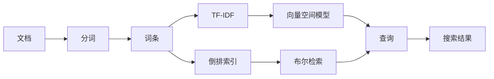

# 全文搜索 原理与代码实例讲解

作者：禅与计算机程序设计艺术 / Zen and the Art of Computer Programming 

关键词：全文搜索、倒排索引、TF-IDF、向量空间模型、布尔检索、Lucene

## 1. 背景介绍
### 1.1  问题的由来
在互联网时代，信息的爆炸式增长给信息检索带来了巨大挑战。用户希望能够快速、准确地从海量数据中找到自己需要的信息。全文搜索技术应运而生，它能够高效地检索大规模非结构化文本数据，极大地提升了信息获取的效率。
### 1.2  研究现状
目前，全文搜索已经成为互联网领域不可或缺的关键技术之一。各大互联网公司纷纷推出了自己的全文搜索引擎，如Google、Baidu、Elasticsearch等。学术界对全文搜索的研究也非常活跃，涌现出了一批优秀的全文搜索算法和模型，如倒排索引、向量空间模型、概率检索模型等。
### 1.3  研究意义
全文搜索在各行各业都有广泛应用，如搜索引擎、电商平台、企业知识库等。深入研究全文搜索的原理和实现，对于提升搜索系统的性能和用户体验具有重要意义。同时，全文搜索涉及到信息检索、自然语言处理、分布式计算等多个学科领域，对于推动这些领域的发展也有积极作用。
### 1.4  本文结构
本文将从以下几个方面对全文搜索进行深入探讨：
- 第2部分介绍全文搜索的核心概念及其联系
- 第3部分详细讲解全文搜索的核心算法原理及具体操作步骤
- 第4部分给出全文搜索涉及的数学模型和公式，并举例说明
- 第5部分通过代码实例，讲解全文搜索的具体实现
- 第6部分介绍全文搜索的实际应用场景
- 第7部分推荐全文搜索相关的学习资源和开发工具
- 第8部分总结全文搜索技术的研究现状和未来发展趋势
- 第9部分列举全文搜索的常见问题，并给出解答

## 2. 核心概念与联系
要理解全文搜索的工作原理，首先需要了解几个核心概念：

- 文档(Document)：全文搜索处理的基本单元。一般是非结构化的文本数据，如网页、文章、书籍等。

- 词条(Term)：构成文档的基本单位。通过对文档进行分词，提取出一系列关键词，即词条。

- 倒排索引(Inverted Index)：全文搜索的核心数据结构。记录每个词条出现在哪些文档中。通过倒排索引，可以根据词条快速找到包含该词条的所有文档。

- TF-IDF：一种用于评估词条重要性的统计方法。TF(Term Frequency)表示词条在文档中出现的频率，IDF(Inverse Document Frequency)表示词条在所有文档中的独特程度。将二者相乘，可以得到词条对文档的重要程度。

- 向量空间模型(Vector Space Model)：将文档和查询都表示成向量的形式，通过计算向量之间的相似度，得到查询结果的排序。

- 布尔检索(Boolean Retrieval)：基于布尔逻辑的检索模型。用户输入布尔表达式作为查询条件，系统返回完全匹配的文档。

这些概念之间的联系可以用下图表示：

## 3. 核心算法原理 & 具体操作步骤
### 3.1  算法原理概述
全文搜索的核心是建立倒排索引。倒排索引由两部分组成：词典和倒排表。词典记录了所有词条，倒排表记录了每个词条出现在哪些文档中。

在进行搜索时，系统先对用户输入的查询进行分词，得到一系列词条。然后在倒排索引中查找这些词条，获取包含这些词条的文档。最后根据相关性算法，如TF-IDF、BM25等，对结果进行排序，返回给用户。

### 3.2  算法步骤详解
1. 文档预处理
   - 文档清洗：去除文档中的HTML标签、特殊字符等噪声数据
   - 文档分词：采用特定的分词算法，如结巴分词，将文档切分成一系列词条
   - 词条过滤：去除停用词等无意义的词条，减少倒排索引的存储开销
   - 词条归一化：将词条统一转换成标准形式，如stemming, lemmatization等

2. 倒排索引构建
   - 词典构建：将文档集合中的所有词条去重，得到词典
   - 倒排表构建：遍历文档集合，对每个词条，记录它出现在哪些文档中，形成倒排表
   - 索引压缩：采用压缩算法，减小倒排索引的存储空间

3. 查询处理
   - 查询分析：对用户输入的查询进行分词、归一化等处理，得到查询词条
   - 检索：在倒排索引中查找查询词条，获取包含这些词条的文档
   - 排序：采用相关性算法，如TF-IDF、BM25等，对结果进行排序
   - 高亮：在结果文档中对查询词条进行高亮显示，方便用户浏览

4. 系统优化
   - 缓存：使用缓存技术，加速检索过程
   - 分布式：采用分布式架构，支持海量数据的存储和检索
   - 增量更新：定期更新索引，保证搜索结果的实时性

### 3.3  算法优缺点
全文搜索相比关系型数据库的优势在于：
- 支持非结构化数据的检索
- 查询灵活，支持多关键词组合查询
- 查询效率高，秒级响应

全文搜索的缺点包括：
- 索引构建耗时长，不适合频繁更新的场景
- 存储空间占用大
- 对中文分词的准确性要求高

### 3.4  算法应用领域
全文搜索几乎覆盖了互联网的各个领域，主要应用场景包括：
- 搜索引擎：如Google、Baidu、Bing等
- 电商平台：商品搜索、店铺搜索等
- 资讯平台：新闻搜索、博客搜索、论坛搜索等
- 企业内部：OA系统、邮件系统、知识库等
- 学术领域：论文检索、专利检索等

## 4. 数学模型和公式 & 详细讲解 & 举例说明
### 4.1  数学模型构建
全文搜索涉及到的主要数学模型包括：

1. 布尔模型(Boolean Model)
布尔模型是最简单的检索模型，查询条件是一个布尔表达式，如"Java AND (Hadoop OR Spark)"。系统只返回完全匹配布尔表达式的文档。

2. 向量空间模型(Vector Space Model) 
向量空间模型将文档和查询都表示成向量的形式。文档向量的每个维度表示一个词条的权重，常用TF-IDF来计算。查询向量也类似构建。两个向量的相似度可以用余弦相似度(Cosine Similarity)来衡量：

$$ \cos(\vec{d}, \vec{q}) = \frac{\vec{d} \cdot \vec{q}}{\|\vec{d}\| \|\vec{q}\|} $$

其中$\vec{d}$和$\vec{q}$分别表示文档向量和查询向量，$\cdot$表示向量点积，$\|\vec{d}\|$表示向量的模。

3. 概率检索模型(Probabilistic Retrieval Model)
概率检索模型计算文档与查询的相关概率，将高概率的文档排在前面。代表模型有BM25、Language Model等。以BM25为例，它计算文档$D$与查询$Q$的相关性得分为：

$$\text{score}(D,Q) = \sum_{i=1}^n \text{IDF}(q_i) \cdot \frac{f(q_i, D) \cdot (k_1 + 1)}{f(q_i, D) + k_1 \cdot (1 - b + b \cdot \frac{|D|}{\text{avgdl}})}$$

其中$\text{IDF}(q_i)$是$q_i$的逆文档频率，$f(q_i, D)$是$q_i$在文档$D$中的词频，$|D|$是文档$D$的长度，$\text{avgdl}$是所有文档的平均长度，$k_1$和$b$是调节因子。

### 4.2  公式推导过程
以TF-IDF为例，它由两部分组成：

1. TF(Term Frequency)：词条$t$在文档$d$中出现的频率。
$$\text{TF}(t,d) = \frac{f_{t,d}}{\sum_{t'\in d} f_{t',d}}$$
其中$f_{t,d}$表示词条$t$在文档$d$中出现的次数，分母是文档$d$中所有词条出现的次数之和。

2. IDF(Inverse Document Frequency)：词条$t$在整个文档集合中的独特程度。
$$\text{IDF}(t) = \log \frac{N}{|\{d\in D: t\in d\}|}$$
其中$N$是文档集合的总数，$|\{d\in D: t\in d\}|$表示包含词条$t$的文档数。

将TF和IDF相乘，就得到了词条$t$对文档$d$的重要程度：
$$\text{TF-IDF}(t,d) = \text{TF}(t,d) \cdot \text{IDF}(t)$$

### 4.3  案例分析与讲解
以下是一个TF-IDF的计算示例。假设有3个文档：
- $d_1$ = "I love apple"
- $d_2$ = "I eat apple"
- $d_3$ = "I love banana"

对这3个文档进行分词，得到4个词条：{"I", "love", "apple", "eat", "banana"}。

构建词条-文档矩阵，矩阵的每个元素表示词条在文档中出现的次数：
|       | "I"   | "love" | "apple" | "eat"  | "banana" |
|:-----:|:-----:|:------:|:-------:|:------:|:--------:|
| $d_1$ | 1     | 1      | 1       | 0      | 0        |
| $d_2$ | 1     | 0      | 1       | 1      | 0        |
| $d_3$ | 1     | 1      | 0       | 0      | 1        |

计算每个词条的IDF：
- $\text{IDF}(\text{"I"}) = \log(3/3) = 0$
- $\text{IDF}(\text{"love"}) = \log(3/2) = 0.405$
- $\text{IDF}(\text{"apple"}) = \log(3/2) = 0.405$
- $\text{IDF}(\text{"eat"}) = \log(3/1) = 1.099$
- $\text{IDF}(\text{"banana"}) = \log(3/1) = 1.099$

将TF和IDF相乘，得到TF-IDF矩阵：
|       | "I"   | "love" | "apple" | "eat"  | "banana" |
|:-----:|:-----:|:------:|:-------:|:------:|:--------:|
| $d_1$ | 0     | 0.405  | 0.405   | 0      | 0        |
| $d_2$ | 0     | 0      | 0.405   | 1.099  | 0        |
| $d_3$ | 0     | 0.405  | 0       | 0      | 1.099    |

从矩阵可以看出，"eat"和"banana"这两个词条的区分度最高，对文档的表示最重要。而"I"这个词条在所有文档中都出现，对文档的区分度几乎为0。

### 4.4  常见问题解答
1. 为什么要用倒排索引，而不是正排索引？
正排索引是以文档为中心，记录每个文档包含哪些词条。而倒排索引是以词条为中心，记录每个词条出现在哪些文档中。在搜索时，用户输入的是词条，因此采用倒排索引可以快速找到包含查询词条的文档，检索效率更高。

2. 为什么不直接比较词条