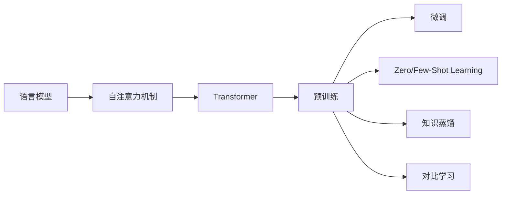

# 大语言模型应用指南：人工智能的起源

作者：禅与计算机程序设计艺术 / Zen and the Art of Computer Programming

关键词：大语言模型, 人工智能, 自然语言处理, Transformer, GPT, BERT, 深度学习, 知识图谱, 对话系统, 文本生成

## 1. 背景介绍
### 1.1 问题的由来
人工智能(Artificial Intelligence, AI)自诞生以来就一直是计算机科学领域最令人着迷和充满挑战的研究方向之一。自然语言处理(Natural Language Processing, NLP)作为人工智能的一个重要分支，旨在让计算机能够理解、生成和处理人类语言。近年来，随着深度学习技术的飞速发展，尤其是Transformer[1]架构的提出和大规模语料库的构建，大语言模型(Large Language Model, LLM)在NLP领域取得了突破性进展，引领了人工智能新的浪潮。

### 1.2 研究现状 
目前业界主流的大语言模型主要包括GPT系列[2]、BERT系列[3]、T5[4]、XLNet[5]等。这些模型在机器翻译、文本分类、命名实体识别、问答系统、对话生成等任务上取得了State-of-the-Art的表现。同时，大语言模型强大的语言理解和生成能力，使其在更广泛的应用场景中崭露头角，如代码生成、创意写作、知识图谱构建等。大语言模型的蓬勃发展正在重塑人工智能的技术图景。

### 1.3 研究意义
大语言模型的研究对于推动人工智能的进步具有重要意义。首先，大语言模型能够从海量无标注数据中学习语言知识，突破了传统监督学习范式对标注数据的依赖。其次，大语言模型具备强大的迁移学习能力，可以方便地应用到下游任务，大大降低了任务适配的成本。再次，大语言模型所蕴含的语言理解和常识推理能力，为构建更加智能化的对话系统和知识服务系统奠定了基础。最后，大语言模型为探索人类语言智能提供了新的视角和路径，有助于揭示语言的本质规律。

### 1.4 本文结构
本文将全面介绍大语言模型的基本概念、核心技术、代表模型以及在各领域的应用实践。第2部分阐述大语言模型的核心概念和内在联系；第3部分详细讲解Transformer等核心算法原理和具体操作步骤；第4部分介绍大语言模型常用的数学模型和公式推导过程；第5部分通过代码实例演示如何训练和使用大语言模型；第6部分总结大语言模型的实际应用场景；第7部分推荐相关的学习资源和开发工具；第8部分展望大语言模型的未来发展趋势和面临的挑战；第9部分为常见问题解答。

## 2. 核心概念与联系
大语言模型的核心概念主要包括：

- **语言模型(Language Model, LM)**：对语言符号序列的概率分布建模，可用于预测下一个词或评估语句的合理性。早期的n-gram语言模型[6]基于马尔科夫假设，而神经网络语言模型(Neural Network Language Model, NNLM)[7]能够学习词语的分布式表示。
  
- **自注意力机制(Self-Attention Mechanism)**：一种能够捕捉任意距离依赖关系的注意力机制[8]。自注意力通过计算序列中元素之间的相关性来聚合信息。它克服了RNN/CNN等模型难以建模长距离依赖的问题。

- **Transformer**：基于自注意力机制的Seq2Seq模型。抛弃了RNN/CNN等结构，完全依靠注意力来建模序列。Transformer的编码器和解码器都由若干个自注意力层和前馈层组成。

- **预训练(Pre-training)**：在大规模无标注语料上进行自监督学习，让模型自主学习语言知识和结构信息。预训练分为自回归语言建模(如GPT)和去噪自编码(如BERT)两大类。预训练使模型能够从数据中归纳语言规律。

- **微调(Fine-tuning)**：在下游任务的标注数据上对预训练模型进行监督学习，使其适应特定任务。微调一般只需少量标注数据，即可取得不错的效果。微调体现了预训练语言模型的迁移学习能力。

- **Zero/Few-Shot Learning**：在没有或很少任务特定训练数据的情况下进行学习。大语言模型通过prompt engineering[9]可以实现zero-shot或few-shot学习，无需微调即可应用到新任务。

- **知识蒸馏(Knowledge Distillation)**：将大型复杂模型(Teacher Model)的知识转移到小型简单模型(Student Model)的过程[10]。知识蒸馏可以压缩模型体积，提高推理速度，便于模型的实际部署。

- **对比学习(Contrastive Learning)**：通过最小化正样本对的距离和最大化负样本对的距离来学习数据表示的范式[11]。对比学习常用于为下游任务学习更好的文本表示。

下图展示了这些核心概念之间的内在联系：

## 3. 核心算法原理 & 具体操作步骤
### 3.1 算法原理概述
Transformer是大语言模型的核心架构，其主要由编码器(Encoder)和解码器(Decoder)组成。编码器用于对输入序列进行特征提取，解码器根据编码器的输出和之前的预测结果，逐个生成目标序列。Transformer抛弃了传统的RNN/CNN等结构，完全依靠自注意力机制来建模序列。

### 3.2 算法步骤详解

**编码器**：
1. 输入嵌入(Input Embedding)：将输入序列中的每个token映射为固定维度的稠密向量。
2. 位置编码(Positional Encoding)：由于自注意力对位置信息不敏感，需要显式地将位置信息编码到输入嵌入中。
3. 自注意力层(Self-Attention Layer)：通过计算序列中任意两个位置之间的注意力权重，聚合全局信息。具体包括计算Query/Key/Value矩阵，执行点积注意力并拼接多头注意力的结果。
4. 前馈神经网络层(Feed-Forward Layer)：通过两层全连接网络对自注意力的输出进行非线性变换，增强特征交互。
5. 层标准化与残差连接(Layer Normalization & Residual Connection)：对每一层的输入进行标准化，并与上一层的输出进行残差连接，有助于稳定训练。
6. 重复步骤3-5多次，堆叠多个编码器块(Encoder Block)。

**解码器**：
1. 输出嵌入(Output Embedding)：类似编码器的输入嵌入。
2. 自注意力屏蔽(Self-Attention Mask)：在解码器的自注意力计算中，屏蔽当前位置之后的信息，保证自回归属性。
3. 编码-解码注意力层(Encoder-Decoder Attention Layer)：以编码器的输出为Key/Value，解码器的状态为Query，计算注意力权重。
4. 前馈神经网络层、层标准化与残差连接：与编码器类似。
5. 重复步骤2-4多次，堆叠多个解码器块(Decoder Block)。
6. 线性层和Softmax层：将解码器最后一层的输出通过线性变换和Softmax函数，得到下一个token的概率分布。

### 3.3 算法优缺点
Transformer的优点包括：
- 并行计算：自注意力可以充分利用GPU等硬件进行并行计算，训练速度快。
- 长程依赖：自注意力能够天然地捕捉任意距离的依赖关系，对长文本建模更有优势。 
- 特征交互：多头注意力允许模型在不同子空间学习不同的注意力模式，增强了特征的交互。

Transformer的缺点包括：
- 计算复杂度：自注意力的计算复杂度随序列长度呈平方增长，对超长文本的建模受限。
- 位置信息缺失：自注意力缺乏先验的位置偏好，需要引入额外的位置编码。
- 过度平滑问题：自注意力倾向于关注所有位置，可能导致特征表示趋于平均，丢失细粒度信息。

### 3.4 算法应用领域
Transformer已成为大语言模型的标准范式，在NLP的各个任务中得到广泛应用，如机器翻译、文本分类、命名实体识别、文本摘要、对话生成、问答系统等。同时Transformer也被引入到计算机视觉、语音识别、图表示学习等领域，展现出广阔的应用前景。

## 4. 数学模型和公式 & 详细讲解 & 举例说明
### 4.1 数学模型构建
Transformer的数学模型可以用如下公式表示：

编码器第$l$层的第$i$个位置的隐状态$h_i^{(l)}$为：

$$
h_i^{(l)} = \text{Attention}(Q_i^{(l)}, K^{(l)}, V^{(l)}) + h_i^{(l-1)} \\
Q_i^{(l)} = W_Q^{(l)}h_i^{(l-1)} \\  
K^{(l)} = W_K^{(l)}H^{(l-1)} \\ 
V^{(l)} = W_V^{(l)}H^{(l-1)}
$$

其中，$\text{Attention}$为点积注意力，$Q,K,V$分别为注意力的查询、键、值矩阵，$W$为可学习的线性变换矩阵。$H^{(l-1)}$为上一层编码器的隐状态矩阵，$h_i^{(l-1)}$为其第$i$行。

解码器第$l$层的第$i$个位置的隐状态$s_i^{(l)}$为：

$$
s_i^{(l)} = \text{Attention}(Q_i^{(l)}, K_{<i}^{(l)}, V_{<i}^{(l)}) + s_i^{(l-1)} \\  
c_i^{(l)} = \text{Attention}(Q_i^{'(l)}, K^{(L)}, V^{(L)}) \\
Q_i^{'(l)} = W_Q^{'(l)}s_i^{(l)}
$$

其中，$\text{Attention}$的第一项为解码器自注意力，采用序列屏蔽只关注$i$之前的位置。$c_i^{(l)}$为编码-解码注意力，以编码器最后一层$L$的输出$K^{(L)},V^{(L)}$为键值对。

### 4.2 公式推导过程
自注意力$\text{Attention}(Q,K,V)$的计算过程为：

$$
\text{Attention}(Q,K,V) = \text{softmax}(\frac{QK^T}{\sqrt{d_k}})V
$$

其中，$Q,K,V$分别为查询、键、值矩阵，$d_k$为键向量的维度。$QK^T$计算查询和键的相似度得到注意力权重矩阵，然后用Softmax归一化并与值矩阵$V$加权求和。除以$\sqrt{d_k}$是为了缓解点积结果过大的问题。

多头注意力将$Q,K,V$通过线性变换映射到$h$个子空间，然后并行执行$h$个注意力，最后拼接结果并再次线性变换，公式为：

$$
\text{MultiHead}(Q,K,V) = \text{Concat}(\text{head}_1, ..., \text{head}_h)W^O \\
\text{head}_i = \text{Attention}(QW_i^Q, KW_i^K, VW_i^V)
$$

其中，$W_i^Q, W_i^K, W_i^V, W^O$为可学习的线性变换矩阵。多头注意力允许模型在不同表示子空间学习不同的注意力模式。

### 4.3 案例分析与讲解
下面以一个简单的例子来说明Transformer的计算过程。假设编码器的输入为一个由4个token组成的序列"I love machine learning"，解码器的输出为"我 喜欢 机器 学习"。

编码器首