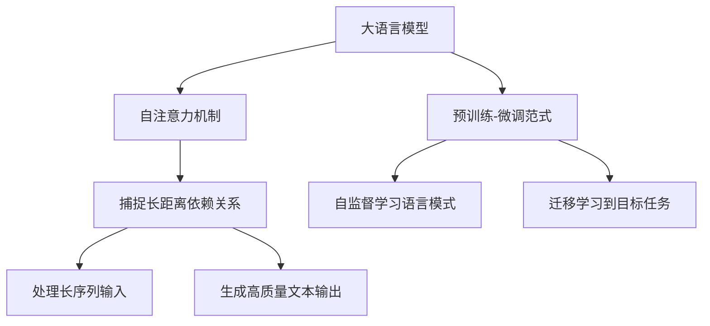
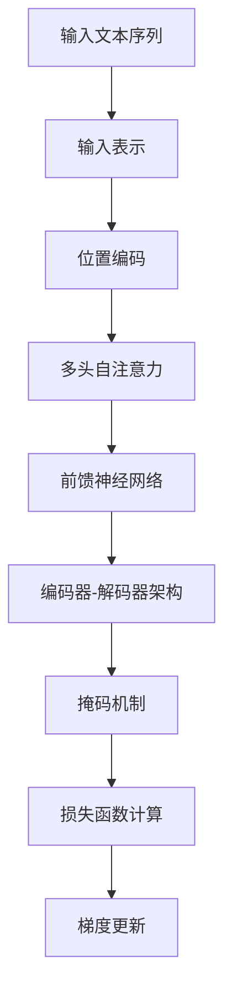

# 大语言模型应用指南：减轻工作记忆的负担

## 1. 背景介绍

### 1.1 问题的由来

在当今信息时代,我们每天都要处理大量的数据和信息。无论是办公室工作、学习研究还是日常生活,我们的大脑都承受着巨大的工作记忆负担。工作记忆是人类认知系统中一个关键组成部分,负责暂时存储和操作正在使用的信息。然而,工作记忆的容量是有限的,当信息量超过一定阈值时,我们就会感到认知过载,难以高效处理信息。

传统的信息处理方式已经不再适应当前的数据爆炸时代。我们需要新的工具和方法来减轻工作记忆的负担,提高信息处理效率。大语言模型(Large Language Model,LLM)作为一种新兴的人工智能技术,正在为我们提供全新的解决方案。

### 1.2 研究现状

近年来,大语言模型取得了长足的进步,在自然语言处理、问答系统、文本生成等领域表现出色。著名的大语言模型如GPT-3、BERT、XLNet等,通过预训练海量的文本数据,能够捕捉到语言的深层次模式和规律,从而具备出色的语言理解和生成能力。

大语言模型在减轻工作记忆负担方面的应用正受到越来越多的关注。一些研究表明,将大语言模型集成到办公软件、学习系统等场景中,可以显著提高用户的工作效率和学习效果。例如,在文本编辑过程中,大语言模型可以根据上下文自动补全文本,减少用户的输入工作量;在问答场景中,大语言模型可以快速回答用户的各种问题,节省用户查阅资料的时间。

### 1.3 研究意义

应用大语言模型减轻工作记忆负担,不仅能够提高个人和组织的工作效率,还可以带来以下重要意义:

1. **认知增强**:通过将大语言模型集成到日常工作和学习中,我们可以获得强大的认知增强,扩展人类的认知能力。
2. **提高生产力**:减轻工作记忆负担,可以释放更多的认知资源用于创新思考和决策,从而提高个人和组织的生产力。
3. **促进信息获取**:大语言模型可以作为智能助手,帮助用户快速获取所需的信息和知识,缩短信息获取的路径。
4. **降低认知负荷**:降低日常工作和学习中的认知负荷,有助于减轻压力,提高幸福感和工作满意度。

### 1.4 本文结构

本文将全面介绍如何应用大语言模型来减轻工作记忆的负担。文章首先阐述大语言模型的核心概念和原理,然后详细解释其算法流程和数学模型,并通过实际案例进行说明。接下来,文章将介绍大语言模型在不同场景中的应用实践,包括代码实例和详细解释。最后,文章将总结大语言模型的发展趋势和面临的挑战,并提供相关的工具和资源推荐。

## 2. 核心概念与联系

大语言模型(LLM)是一种基于深度学习的自然语言处理技术,旨在从海量文本数据中学习语言的内在规律和模式。它通过预训练获得了强大的语言理解和生成能力,可以应用于多种自然语言处理任务,如机器翻译、文本摘要、问答系统等。

大语言模型的核心思想是利用自注意力(Self-Attention)机制,捕捉输入序列中任意两个位置之间的关系,从而更好地建模长距离依赖关系。这种机制使得模型能够有效地处理长序列输入,并生成高质量的文本输出。

大语言模型与其他自然语言处理技术的主要区别在于,它采用了全新的预训练-微调(Pre-training and Fine-tuning)范式。在预训练阶段,模型会在大规模无监督文本数据上进行自监督学习,捕捉语言的一般模式和规律。在微调阶段,模型会在特定任务的标注数据上进行进一步训练,将预训练获得的语言知识迁移到目标任务上。这种范式大大提高了模型的性能和泛化能力。

大语言模型在减轻工作记忆负担方面的应用主要体现在以下几个方面:

1. **自动文本补全**:根据上下文自动补全文本,减少用户的输入工作量。
2. **智能问答系统**:快速回答用户的各种问题,节省查阅资料的时间。
3. **自动文本摘要**:自动生成文档或会议记录的摘要,减轻阅读和理解的负担。
4. **智能写作助手**:根据用户的意图生成高质量的文本内容,提高写作效率。
5. **信息检索和推荐**:根据用户的需求智能检索和推荐相关信息,提高信息获取效率。

通过将大语言模型集成到日常工作和学习中,我们可以获得强大的认知增强,扩展人类的认知能力,从而减轻工作记忆的负担,提高生产力和效率。

## 3. 核心算法原理与具体操作步骤

### 3.1 算法原理概述

大语言模型的核心算法是基于自注意力(Self-Attention)机制和Transformer架构的。自注意力机制能够捕捉输入序列中任意两个位置之间的关系,从而更好地建模长距离依赖关系。Transformer架构则采用了完全基于注意力机制的编码器-解码器结构,摒弃了传统的循环神经网络和卷积神经网络,大大提高了并行计算能力和训练效率。

在预训练阶段,大语言模型通常采用掩码语言模型(Masked Language Model)和下一句预测(Next Sentence Prediction)两种自监督学习任务。前者要求模型根据上下文预测被掩码的单词,后者则要求模型判断两个句子是否相关。通过这种自监督学习方式,模型可以从大量无标注的文本数据中捕捉语言的一般模式和规律。

在微调阶段,大语言模型会在特定任务的标注数据上进行进一步训练,将预训练获得的语言知识迁移到目标任务上。这种预训练-微调范式大大提高了模型的性能和泛化能力。

### 3.2 算法步骤详解

大语言模型的算法步骤可以概括为以下几个主要部分:

1. **输入表示**:将输入文本序列转换为模型可以处理的向量表示,通常采用词嵌入(Word Embedding)或子词嵌入(Subword Embedding)的方式。

2. **位置编码**:由于自注意力机制没有捕捉序列顺序的能力,因此需要添加位置编码(Positional Encoding)来为每个位置赋予不同的向量表示,从而保留序列的位置信息。

3. **多头自注意力**:输入序列通过多头自注意力(Multi-Head Self-Attention)机制,计算每个位置与其他所有位置的注意力权重,捕捉长距离依赖关系。

4. **前馈神经网络**:自注意力输出通过前馈神经网络(Feed-Forward Neural Network)进行非线性变换,提取更高层次的特征表示。

5. **编码器-解码器**:对于序列到序列(Sequence-to-Sequence)任务,如机器翻译,采用编码器-解码器架构。编码器对输入序列进行编码,解码器根据编码器的输出生成目标序列。

6. **掩码机制**:在预训练和生成过程中,采用掩码机制(Masking Mechanism)来防止模型利用未来的信息,确保模型只依赖于当前和过去的信息进行预测。

7. **梯度更新**:根据预训练或微调任务的损失函数,使用优化算法(如Adam)对模型参数进行梯度更新,不断提高模型的性能。

### 3.3 算法优缺点

大语言模型算法的主要优点包括:

1. **捕捉长距离依赖关系**:自注意力机制能够有效捕捉输入序列中任意两个位置之间的关系,从而更好地建模长距离依赖关系。

2. **并行计算能力强**:Transformer架构完全基于注意力机制,摒弃了传统的循环神经网络和卷积神经网络,大大提高了并行计算能力和训练效率。

3. **泛化能力强**:预训练-微调范式使得模型可以从大量无标注数据中学习语言的一般模式和规律,然后将这些知识迁移到目标任务上,提高了模型的泛化能力。

4. **多任务能力**:大语言模型具有强大的语言理解和生成能力,可以应用于多种自然语言处理任务,如机器翻译、文本摘要、问答系统等。

然而,大语言模型算法也存在一些缺点和挑战:

1. **计算资源需求高**:预训练大型语言模型需要消耗大量的计算资源,对硬件设备和能源消耗要求较高。

2. **数据饥渴**:预训练阶段需要海量的无标注文本数据,数据的质量和多样性直接影响模型的性能。

3. **解释性差**:大语言模型是一种黑盒模型,其内部工作机制难以解释,缺乏可解释性。

4. **偏见和不当内容**:由于预训练数据可能存在偏见和不当内容,模型输出也可能继承这些问题。

5. **鲁棒性不足**:大语言模型对于adversarial example等对抗性攻击比较脆弱,鲁棒性有待提高。

### 3.4 算法应用领域

大语言模型算法由于其强大的语言理解和生成能力,可以应用于多种自然语言处理任务,主要包括:

1. **机器翻译**:将一种语言的文本翻译成另一种语言。

2. **文本摘要**:自动生成文档或会议记录的摘要。

3. **问答系统**:根据上下文回答用户提出的各种问题。

4. **文本生成**:根据给定的提示或主题生成连贯的文本内容。

5. **情感分析**:识别文本中的情感倾向,如正面、负面或中性。

6. **命名实体识别**:识别文本中的人名、地名、组织机构名等实体。

7. **关系抽取**:从文本中抽取实体之间的语义关系。

8. **文本分类**:将文本归类到预定义的类别中。

9. **自动问答**:根据给定的文本自动生成问题和答案。

10. **文本增强**:通过生成相关的文本来增强原始数据集。

除了上述任务外,大语言模型还可以应用于信息检索、推荐系统、智能写作助手、自动编码等多个领域,展现出广阔的应用前景。

## 4. 数学模型和公式及详细讲解与举例说明

### 4.1 数学模型构建

大语言模型的数学模型主要基于自注意力(Self-Attention)机制和Transformer架构。自注意力机制的核心思想是计算输入序列中每个位置与其他所有位置之间的注意力权重,从而捕捉长距离依赖关系。

给定一个长度为 $n$ 的输入序列 $X = (x_1, x_2, \dots, x_n)$,其中 $x_i \in \mathbb{R}^{d_x}$ 表示第 $i$ 个位置的输入向量。自注意力机制的计算过程如下:

1