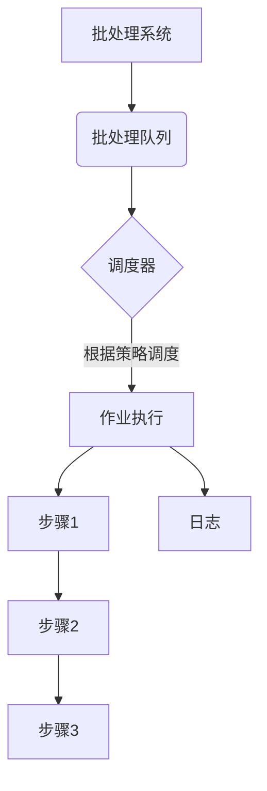

# 批处理 原理与代码实例讲解

## 1. 背景介绍

### 1.1 问题的由来

在计算机系统中,经常需要执行一系列相关的任务或命令。手动逐一执行这些任务不仅效率低下,而且容易出错。因此,需要一种自动化的机制来批量执行这些任务,这就是批处理(Batch Processing)的由来。

批处理最初出现于大型主机时代,用于处理大量数据和任务。随着个人计算机和操作系统的发展,批处理也被广泛应用于日常的系统管理和自动化任务中。

### 1.2 研究现状  

目前,大多数操作系统都提供了批处理功能,如Windows的批处理文件(.bat)、Linux/Unix的Shell脚本等。此外,也有一些专门的批处理工具和框架,如Apache Batch、Spring Batch等,用于处理更加复杂的批处理场景。

批处理技术在各个领域都有广泛的应用,如数据处理、系统自动化、软件构建和部署等。随着云计算和大数据时代的到来,批处理在处理海量数据方面也发挥着重要作用。

### 1.3 研究意义

掌握批处理技术对于提高工作效率和自动化程度至关重要。通过编写批处理脚本,可以自动执行重复性的任务,节省大量时间和精力。此外,批处理还可以确保任务的一致性和可靠性,减少人为操作错误。

在软件开发过程中,批处理也扮演着重要角色。它可以用于自动化构建、测试和部署等过程,提高开发效率和质量。此外,批处理在系统管理和自动化运维方面也有广泛应用。

### 1.4 本文结构

本文将全面介绍批处理的原理和实践。首先,我们将探讨批处理的核心概念和算法原理。然后,详细讲解批处理的数学模型和公式。接下来,我们将通过实际代码示例,演示如何在实践中应用批处理技术。最后,我们将分析批处理的实际应用场景,介绍相关工具和资源,并探讨未来发展趋势和挑战。

## 2. 核心概念与联系

批处理(Batch Processing)是指将多个相关任务或命令组合在一起,作为一个批次进行自动化处理。它的核心概念包括:

1. **作业(Job)**: 一个作业是一组需要执行的命令或程序的集合。作业可以由多个步骤(Step)组成。

2. **步骤(Step)**: 步骤是作业中的基本执行单元,通常是一个可执行程序或脚本。

3. **批处理队列(Batch Queue)**: 批处理队列用于存储和管理待执行的作业。作业按照特定的调度策略从队列中取出并执行。

4. **调度器(Scheduler)**: 调度器负责管理批处理队列,决定作业的执行顺序和时间。它根据预定义的策略(如先入先出、优先级等)来调度作业。

5. **日志(Log)**: 批处理系统通常会记录作业执行的详细日志,用于监控、故障排查和审计。

6. **依赖关系(Dependencies)**: 某些作业可能依赖于其他作业的输出或资源。批处理系统需要处理这些依赖关系,以确保作业按正确的顺序执行。

这些核心概念相互关联,构成了批处理系统的基础框架。作业被提交到批处理队列,由调度器根据特定策略进行调度和执行。每个作业由一个或多个步骤组成,步骤之间可能存在依赖关系。整个过程会生成详细的日志,用于监控和故障排查。

## 3. 核心算法原理 & 具体操作步骤

### 3.1 算法原理概述

批处理算法的核心原理是将一系列相关任务组织成作业,并根据特定的调度策略自动执行这些作业。算法的主要步骤包括:

1. **作业提交**: 用户或系统将需要执行的任务组织成作业,并将作业提交到批处理队列中。

2. **作业调度**: 调度器根据预定义的调度策略(如先入先出、优先级等)从队列中选择作业进行执行。

3. **作业执行**: 选中的作业按照其包含的步骤顺序依次执行。每个步骤通常是一个可执行程序或脚本。

4. **依赖管理**: 如果存在步骤之间的依赖关系,算法需要确保依赖的步骤先执行,以满足依赖条件。

5. **日志记录**: 在作业执行过程中,算法会记录详细的日志信息,包括每个步骤的执行状态、输出结果等。

6. **错误处理**: 如果某个步骤执行失败,算法需要采取适当的错误处理措施,如重试、跳过或终止作业。

7. **结果输出**: 作业执行完成后,算法将输出结果返回给用户或系统。

该算法的核心在于将复杂的任务分解成多个步骤,并通过调度和依赖管理来自动化执行这些步骤。这种方式可以提高效率,减少人工操作错误,并确保任务的一致性和可靠性。

### 3.2 算法步骤详解

下面我们将详细讲解批处理算法的具体步骤:

1. **作业提交**

   用户或系统将需要执行的任务组织成作业,并将作业提交到批处理队列中。作业通常包含以下信息:

   - 作业名称
   - 作业描述
   - 作业优先级
   - 作业步骤列表
   - 步骤之间的依赖关系
   - 其他元数据(如作业所有者、提交时间等)

2. **作业调度**

   调度器根据预定义的调度策略从队列中选择作业进行执行。常见的调度策略包括:

   - **先入先出(FIFO)**:按照作业进入队列的顺序执行。
   - **优先级调度**:根据作业的优先级执行,优先级高的作业先执行。
   - **最短作业优先(SJF)**:优先执行估计运行时间较短的作业。
   - **最长作业优先(LJF)**:优先执行估计运行时间较长的作业。

   调度器还需要考虑作业的依赖关系,确保依赖的作业先执行。

3. **作业执行**

   选中的作业按照其包含的步骤顺序依次执行。每个步骤通常是一个可执行程序或脚本,可以是系统命令、shell脚本、Python脚本等。

   执行步骤时,算法需要处理以下情况:

   - **环境设置**:根据步骤的要求设置执行环境,如设置环境变量、加载库文件等。
   - **输入/输出重定向**:将步骤的输入和输出重定向到指定的文件或设备。
   - **并行执行**:如果步骤之间没有依赖关系,可以并行执行以提高效率。
   - **超时控制**:为每个步骤设置执行超时时间,防止步骤卡住导致整个作业无法完成。

4. **依赖管理**

   如果存在步骤之间的依赖关系,算法需要确保依赖的步骤先执行,以满足依赖条件。依赖关系可以是:

   - **文件依赖**:某个步骤需要依赖于另一个步骤的输出文件。
   - **资源依赖**:某个步骤需要依赖于特定的资源(如数据库连接、计算资源等)。
   - **逻辑依赖**:某个步骤的执行依赖于另一个步骤的逻辑结果(如成功/失败状态)。

   算法需要构建依赖关系图,并根据这个图来确定步骤的执行顺序。

5. **日志记录**

   在作业执行过程中,算法会记录详细的日志信息,包括:

   - 作业元数据(作业名称、提交时间、优先级等)
   - 每个步骤的执行状态(开始时间、结束时间、退出代码等)
   - 步骤的标准输出和错误输出
   - 错误和警告信息

   日志信息对于监控、故障排查和审计非常重要。

6. **错误处理**

   如果某个步骤执行失败,算法需要采取适当的错误处理措施,如:

   - **重试**:对失败的步骤进行重试,重试次数可配置。
   - **跳过**:跳过失败的步骤,继续执行后续步骤。
   - **终止**:直接终止整个作业的执行。

   错误处理策略可以根据作业的重要性和失败步骤的影响程度进行配置。

7. **结果输出**

   作业执行完成后,算法将输出结果返回给用户或系统。输出结果可以包括:

   - 作业执行状态(成功/失败)
   - 每个步骤的执行结果
   - 生成的输出文件
   - 执行日志

   用户或系统可以根据这些结果进行后续操作,如进一步处理输出数据、分析日志等。

通过上述步骤,批处理算法实现了自动化执行一系列相关任务的目标,提高了效率和可靠性。

### 3.3 算法优缺点

批处理算法具有以下优点:

1. **自动化**:可以自动执行一系列重复性的任务,减少人工操作的工作量和错误率。
2. **高效**:通过并行执行独立的步骤,可以提高整体执行效率。
3. **可靠性**:通过依赖管理和错误处理机制,确保任务按照正确的顺序执行,提高可靠性。
4. **灵活性**:可以根据需求定制调度策略、错误处理策略等,满足不同场景的需求。
5. **可审计性**:详细的日志记录有助于监控、故障排查和审计。

但批处理算法也存在一些缺点:

1. **延迟**:批处理通常是周期性执行,对于需要实时处理的任务不太适合。
2. **资源占用**:大规模的批处理作业可能会占用大量的系统资源,影响其他应用程序的性能。
3. **依赖管理复杂性**:当存在大量步骤和复杂的依赖关系时,依赖管理可能会变得非常复杂。
4. **可扩展性**:随着作业规模和复杂度的增加,批处理系统的可扩展性可能会受到限制。
5. **故障恢复困难**:如果发生严重故障,恢复批处理作业可能会非常困难,尤其是对于长时间运行的作业。

因此,在选择使用批处理算法时,需要权衡其优缺点,并根据具体场景进行评估。

### 3.4 算法应用领域

批处理算法在许多领域都有广泛的应用,包括但不限于:

1. **数据处理**:批处理常用于处理大规模的数据集,如日志分析、数据仓库加载等。
2. **系统自动化**:通过批处理脚本,可以自动执行系统维护、备份、升级等任务。
3. **软件构建和部署**:在软件开发过程中,批处理可用于自动化构建、测试和部署流程。
4. **科学计算和模拟**:批处理常用于执行大规模的科学计算和模拟任务。
5. **业务流程自动化**:在企业中,批处理可用于自动化各种业务流程,如账单生成、报表生成等。
6. **大数据处理**:在大数据领域,批处理被广泛用于处理海量数据,如Hadoop MapReduce、Apache Spark等。
7. **云计算**:在云计算环境中,批处理可用于自动化资源调配、任务调度等。
8. **机器学习**:批处理常用于训练机器学习模型,尤其是对于大规模数据集的训练。

总的来说,批处理算法适用于需要自动化执行一系列相关任务的场景,可以提高效率、减少错误,并确保任务的一致性和可靠性。

## 4. 数学模型和公式 & 详细讲解 & 举例说明

在批处理