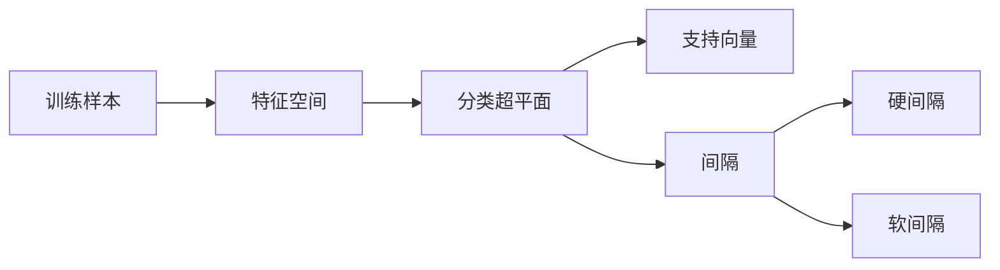

# 支持向量机 原理与代码实例讲解

作者：禅与计算机程序设计艺术 / Zen and the Art of Computer Programming 

关键词：支持向量机，SVM，机器学习，分类，核函数，软间隔，SMO算法

## 1. 背景介绍
### 1.1 问题的由来
在机器学习领域，分类问题是一个非常基础且重要的问题。给定一组带标签的训练样本，我们希望训练出一个分类器，能够对新的未知样本进行正确的分类。支持向量机(Support Vector Machine, SVM)就是一种经典的监督学习算法，可以高效地解决二分类问题，并且在实践中取得了很好的效果。

### 1.2 研究现状
自从1995年Cortes和Vapnik提出支持向量机算法以来，SVM就受到了广泛的关注和研究。SVM不仅在理论上具有很好的基础，而且在实际应用中也取得了非常好的效果，被认为是目前最为成功的统计学习方法之一。近年来，随着大数据和深度学习的兴起，SVM虽然关注度有所下降，但仍然是一个重要且实用的机器学习算法。

### 1.3 研究意义
深入理解SVM的原理和实现，对于掌握机器学习的基本方法和思想有很大帮助。SVM虽然思想简单，但涉及了机器学习、优化理论、函数分析等多个领域的知识，是学习机器学习的很好案例。此外，SVM强大的理论基础和优秀的实践效果，使其在很多领域得到广泛应用，如文本分类、图像识别、生物信息学等。掌握SVM，对于解决实际问题大有裨益。

### 1.4 本文结构
本文将从以下几个方面对SVM进行系统讲解：
- 首先介绍SVM的基本概念和直观理解
- 然后推导SVM的数学模型和求解算法
- 接着通过代码实例讲解SVM的具体实现
- 最后总结SVM的特点、应用及展望

## 2. 核心概念与联系

支持向量机的核心思想是在特征空间中寻找一个最优分类超平面，使得两类样本能够被超平面很好地分开。这里涉及几个关键概念：

- 支持向量：离分类超平面最近的几个训练样本点
- 间隔：支持向量到超平面的距离
- 硬间隔：要求所有样本都必须划分正确，即所有样本都要在各自类别的一侧
- 软间隔：允许少量样本分类错误，以提高分类器的泛化能力

这些概念之间的联系可以用下图表示：

可以看到，SVM的目标就是在特征空间中找到一个最优超平面，使得两类支持向量到超平面的间隔最大化。如果能找到这样一个超平面，就意味着我们得到了一个泛化能力很强的分类器。

## 3. 核心算法原理 & 具体操作步骤
### 3.1 算法原理概述
SVM的基本型可以表示为以下约束优化问题：
$$
\begin{aligned}
\min_{w,b} & \frac{1}{2}||w||^2 \\
s.t. & y_i(w^Tx_i+b) \geq 1, i=1,2,...,N
\end{aligned}
$$
其中，$w$和$b$是待求的分类超平面参数，$x_i$和$y_i$是训练样本及其标签。这个问题的目标是最大化超平面的间隔，约束条件表示所有样本必须被超平面正确分类。

对于线性不可分的情况，可以引入软间隔，允许少量样本分类错误：
$$
\begin{aligned}
\min_{w,b,\xi} & \frac{1}{2}||w||^2 + C\sum_{i=1}^N \xi_i\\
s.t. & y_i(w^Tx_i+b) \geq 1-\xi_i, \\
     & \xi_i \geq 0, i=1,2,...,N
\end{aligned}
$$
其中$\xi_i$是松弛变量，允许某些样本不满足约束。$C$是一个正则化参数，控制误分类的惩罚程度。

为了求解SVM问题，通常先将它转化为对偶问题，然后用SMO等算法进行求解。在对偶问题中，最终的分类决策函数可以写成：
$$
f(x) = \text{sign}(\sum_{i=1}^N \alpha_i y_i K(x,x_i) + b)
$$
其中$\alpha$是拉格朗日乘子，$K(x,x_i)$是核函数。分类决策就是看$f(x)$的符号。

### 3.2 算法步骤详解
SVM的具体训练步骤如下：
1. 选择合适的核函数$K(x,z)$，将原始特征映射到高维空间。
2. 构建SVM优化问题的对偶形式，转化为求解$\alpha$的问题。
3. 用SMO等算法求解上述对偶问题，得到最优$\alpha$。
4. 根据KKT条件，选取满足条件的支持向量，计算出$b$。
5. 将$\alpha$和$b$代入分类决策函数，得到最终的分类器。

预测新样本的步骤如下：
1. 将新样本$x$映射到高维特征空间。
2. 将$x$代入决策函数$f(x)$，计算函数值。
3. 取$f(x)$的符号作为$x$的预测标签。

### 3.3 算法优缺点
SVM的主要优点有：
- 理论基础严谨，可以很好地避免过拟合
- 不直接依赖数据分布，只关心支持向量
- 可以通过核技巧处理非线性问题
- 求解过程是一个凸优化问题，全局最优

SVM的主要缺点有：
- 训练和预测的计算开销大，难以处理超大规模数据
- 对参数和核函数敏感，需要小心调参
- 原始形式不适合多分类问题，需要进行推广

### 3.4 算法应用领域
SVM在很多领域都有成功应用，如：
- 文本分类，如垃圾邮件识别
- 图像识别，如人脸检测
- 生物信息学，如蛋白质结构预测
- 网页分类，如网页语言识别

## 4. 数学模型和公式 & 详细讲解 & 举例说明
### 4.1 数学模型构建
SVM的基本思想可以用下图直观地表示：

如图，SVM就是要在特征空间中找到一个最优分类超平面$w^Tx+b=0$，使得两类样本能够被超平面最大间隔地分开。这里的间隔定义为支持向量到超平面的距离。假设支持向量为$(x_i,y_i)$，则它到超平面的距离为：

$$
\gamma_i = y_i(\frac{w^T}{||w||}x_i + \frac{b}{||w||})
$$

所以SVM的目标就是最大化所有支持向量到超平面的距离之和，即最大化$\sum_i \gamma_i$。同时要求所有样本满足：

$$
y_i(w^Tx_i+b) \geq \gamma_i, i=1,2,...,N
$$

为了方便求解，我们可以取$\gamma_i=1$，并且最大化$\frac{2}{||w||}$，这样就得到了SVM的最基本的数学模型。

### 4.2 公式推导过程
为了求解SVM模型，我们首先将它转化为对偶问题。引入拉格朗日乘子$\alpha_i \geq 0$，定义拉格朗日函数：

$$
L(w,b,\alpha) = \frac{1}{2}||w||^2 - \sum_{i=1}^N \alpha_i [y_i(w^Tx_i+b)-1]
$$

根据拉格朗日对偶性，原问题可以转化为对偶问题：

$$
\begin{aligned}
\max_\alpha & \sum_{i=1}^N \alpha_i - \frac{1}{2}\sum_{i,j=1}^N \alpha_i \alpha_j y_i y_j x_i^T x_j \\
s.t. & \sum_{i=1}^N \alpha_i y_i = 0 \\
     & \alpha_i \geq 0, i=1,2,...,N
\end{aligned}
$$

这样，原问题就转化为关于$\alpha$的二次规划问题，可以用SMO等算法进行高效求解。求得最优$\alpha$后，再根据KKT条件得到原问题的最优解$w$和$b$：

$$
\begin{aligned}
w^* &= \sum_{i=1}^N \alpha_i^* y_i x_i \\
b^* &= y_j - \sum_{i=1}^N \alpha_i^* y_i x_i^T x_j
\end{aligned}
$$

这里$x_j$是任意一个满足$0 < \alpha_j^* < C$的支持向量。

### 4.3 案例分析与讲解
下面我们以一个简单的二维数据为例，直观地看看SVM是如何工作的。假设我们有如下红蓝两类样本点：

可以看到，红蓝两类点是线性可分的，所以我们可以用线性SVM进行训练。训练得到的最优分类直线如下图所示：

其中较大的点就是支持向量，它们到分类直线的距离等于1。这条直线很好地将两类点分开，并且间隔最大。

如果数据是线性不可分的，我们就需要用到核技巧，将数据映射到高维空间，再在高维空间进行划分。例如，对于下图中的数据：

用线性SVM是无法将红蓝点分开的。但是如果引入二次多项式核函数$K(x,z)=(x^Tz+1)^2$，就相当于将原始二维特征$(x_1,x_2)$映射为五维特征$(x_1^2, \sqrt{2}x_1x_2, x_2^2, \sqrt{2}x_1, \sqrt{2}x_2)$，在这个高维空间里，数据就变得线性可分了。最终得到的分类结果如下：

可以看到，引入核函数后，非线性SVM也可以得到很好的分类效果。

### 4.4 常见问题解答
问：SVM对缺失数据和异常值敏感吗？

答：SVM对缺失数据和异常值是有一定的鲁棒性的。对于缺失数据，可以事先用均值等方法进行填充，或者将缺失部分看作一种特殊值。异常值一般不会成为支持向量，所以对SVM的影响有限。但是含有大量缺失或异常的数据，还是建议先进行清洗预处理。

问：SVM的核函数应该如何选择？

答：核函数的选择要根据数据的特点和任务的需求来定。如果数据是低维的，且基本线性可分，则用线性核即可；如果数据在原始空间线性不可分，可以尝试高斯核等非线性核函数；如果特征维度很高，可以考虑用多项式核降低计算复杂度。此外，不同核函数的参数也需要调节。总之需要多尝试，选择效果最好的核函数。

问：SVM对类别不平衡问题有什么好的解决办法吗？

答：类别不平衡会导致SVM倾向于把样本预测为多数类。解决办法主要有：
1. 对少数类样本进行过采样，或对多数类进行欠采样，使得训练集类别平衡。
2. 在SVM目标函数中，对不同